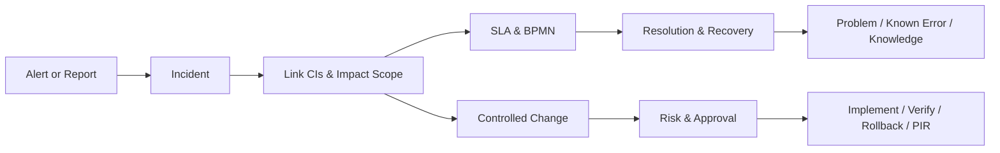
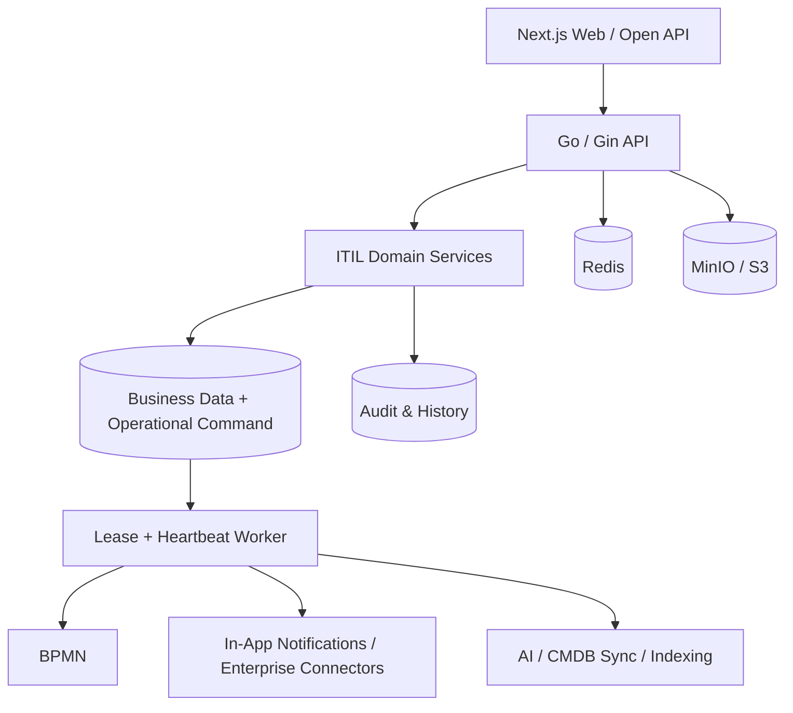
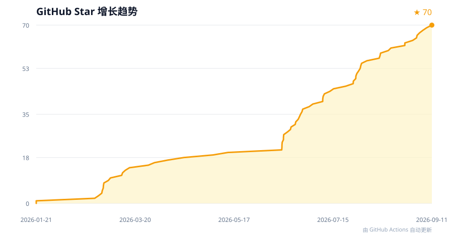

<div align="center">

# AI-Native ITSM

An open-source IT service management system for enterprises, covering ITIL core processes with BPMN workflow orchestration, CMDB, SLA, knowledge base, and multi-tenancy.

[](https://golang.org)
[](https://nextjs.org)
[](https://typescriptlang.org)
[](LICENSE)
[](https://github.com/heidsoft/itsm/actions/workflows/backend-ci.yml)
[](https://github.com/heidsoft/itsm/actions/workflows/frontend-ci.yml)
[](https://github.com/heidsoft/itsm/stargazers)

**[简体中文](./README.md)** · **English**

</div>

## Table of Contents

- [Overview](#overview)
- [Use Cases](#use-cases)
- [Capabilities & Maturity](#capabilities--maturity)
- [Quick Start](#quick-start)
  - [Prerequisites](#prerequisites)
  - [Docker Development](#docker-development)
  - [Verify Startup](#verify-startup)
  - [Local Hot-Reload Development](#local-hot-reload-development)
  - [Optional AI & Monitoring Components](#optional-ai--monitoring-components)
- [Usage Examples](#usage-examples)
  - [API Examples](#api-examples)
  - [Common Development Commands](#common-development-commands)
  - [Common Scenarios](#common-scenarios)
- [Core Business Flows](#core-business-flows)
- [Reliable Execution Architecture](#reliable-execution-architecture)
- [Pluggable Integrations](#pluggable-integrations)
- [Screenshots](#screenshots)
- [Tech Stack & Repository Structure](#tech-stack--repository-structure)
- [Development & Testing](#development--testing)
- [Production Deployment](#production-deployment)
- [Documentation](#documentation)
- [Contributing](#contributing)
- [Star History](#star-history)
- [License](#license)


## Overview

This project aims to provide an enterprise ITSM system that actually works. It connects tickets, incidents, problems, changes, SLA, CMDB, and knowledge base into complete business processes, with audit trails, permission control, and multi-tenant isolation.

Key design choices:

- **BPMN for workflow orchestration**: Uses BPMN 2.0 standard for approvals and workflows, no custom engine
- **CMDB is more than an asset table**: Configuration items and relationships feed into incident, change, and other processes for impact analysis
- **AI as assistant, not replacement**: Triage, summarization, and knowledge retrieval can use AI, but must degrade gracefully, have audit records, and never bypass human approval
- **Reliable async operations**: Workflow triggers, notifications, and other critical operations use transaction + outbox pattern, not goroutine fire-and-forget

> **Current version v1.6.x**: In production hardening phase. Core ITIL processes (tickets, incidents, problems, changes, SLA, CMDB) are available, but module maturity varies. Some features are still in Preview stage. Check the [open-source capability statement](./docs/product/open-source-release-capability.md) before production use.

## Use Cases

- IT service desk: unified intake, dispatch, and tracking of employee requests
- Operations governance: end-to-end management of incidents, CIs, SLA, problems, and changes
- Process automation: configure approvals and cross-system workflows via BPMN
- Multi-organization services: multi-tenant management for private, SaaS, or MSP deployments
- Custom development: extend with Go + Next.js and open APIs

## Capabilities & Maturity

| Capability | Status | Description |
|:---|:---:|:---|
| Tickets & Incidents | Available | Status transitions, dispatch, SLA, BPMN binding, tenant isolation |
| Ticket Types & Dynamic Forms | Available | Custom fields, form presets, Workflow/SLA bindings |
| Change Management | Available | Risk assessment, approval chains (countersign/or-sign/CAB), rollback plans, PIR |
| Problems & Known Errors | Preview | Root cause analysis, workarounds, linked incidents, knowledge distillation |
| Service Catalog & Requests | Preview | Catalog management, request approvals, service tasks |
| CMDB | Available | CI types, configuration items, relationships, topology, impact analysis |
| CMDB Cloud Discovery | Preview | Alibaba Cloud adapter, auto-discovery and sync |
| BPMN & Approvals | Preview | Process definitions, instances, tasks, variables, execution history |
| SLA | Available | Policies, deadlines, warnings, violation statistics |
| Knowledge & RAG | Preview | Article management, keyword/vector search, Q&A fallback |
| AI Assistance | Preview | LLM Gateway, triage, summarization, RAG |
| Notifications & Connectors | Preview | In-app notifications, delivery audit, connector framework |
| RBAC / Multi-Tenancy | Available | Role permissions, endpoint ACL, tenant isolation, audit logs |

> **Maturity legend**: **Available** = core features complete, ready for production validation; **Preview** = feature is implemented but still being polished — evaluate limitations before production use. See module docs for detailed constraints and acceptance criteria.

## Quick Start

> **Language note**: through v1.6.x the product UI is **Chinese-first** (targeting China private-deployment scenarios). The English README covers onboarding; full UI localization (en-US etc.) is planned for v1.7 — see the [ROADMAP](ROADMAP.md).

### Prerequisites

- Docker Desktop or compatible Docker Engine / Compose
- Git
- Recommended: at least 4 CPU cores, 8 GB RAM

### Docker Development

The repository provides two Compose files. Do **not** run `docker compose up` without `-f` — there is no default `docker-compose.yml` at the repo root:

| File | Purpose |
|:---|:---|
| `docker-compose.dev.yml` | Local development. Core services start by default; `--profile ai` adds Ollama, `--profile monitoring` adds Prometheus + Grafana |
| `docker-compose.prod.yml` | Production deployment. Requires `.env.prod`, includes nginx and background worker |

```bash
git clone https://github.com/heidsoft/itsm.git
cd itsm

cp .env.dev.example .env
make dev-start-docker
```

After startup, visit:

| Service | URL |
|:---|:---|
| Web | <http://localhost:3000> |
| Backend API | <http://localhost:8090> |
| Swagger | <http://localhost:8090/swagger/index.html> |
| MinIO Console | <http://localhost:9001> |

Development default credentials:

```text
Username: admin
Password: admin123
```

This account is for local development only. In production, the admin password is set by `ADMIN_PASSWORD` in your `.env.prod` (applied by the one-shot `itsm-init` container on first start). Never use documentation example passwords. Any deployment accessible by others must change the admin password, `JWT_SECRET`, database, Redis, and object storage credentials.

### (Optional) One-Command Demo Data

A fresh system ships with configuration templates only — no business records. Run the following to seed a demo dataset (8 incidents, 2 problems, 3 changes, 5 knowledge articles) so you can explore each module with realistic content:

```bash
make dev-seed-demo   # idempotent, safe to re-run
```

Demo records use fixed numbers (`INC-DEMO-xxxx` / `PRB-DEMO-xxxx` / `CHG-DEMO-xxxx`) covering the incident lifecycle (new → escalated → closed). Production deployments **never** seed these fictional records.

### Verify Startup

```bash
make dev-status
make dev-health

curl http://localhost:8090/api/v1/health
curl http://localhost:3000/api/health
```

View logs and stop the environment:

```bash
make dev-logs
make dev-stop-docker
```

Clean up volumes (this deletes local database and object storage data):

```bash
make dev-clean
```

### Local Hot-Reload Development

Docker provides PostgreSQL, Redis, and MinIO while running Go and Next.js natively:

```bash
make dev-start-local
make dev-status
```

See [Local Development Commands](./docs/dev-commands-reference.md) for native mode, PostgreSQL 17/pgvector, and proxy troubleshooting.

### Optional AI & Monitoring Components

The base development stack does not force-start Ollama or monitoring:

```bash
# Ollama
docker compose --env-file .env -f docker-compose.dev.yml \
  --profile dev --profile ai up -d

# Prometheus + Grafana
docker compose --env-file .env -f docker-compose.dev.yml \
  --profile dev --profile monitoring up -d
```

When no AI model is available, core ITIL workflows must keep running; AI capabilities must degrade according to configuration.

## Usage Examples

### API Examples

All APIs return a unified format `{ code: number, message: string, data: any }`.

```bash
# 1. Login and save HttpOnly session cookie (example account for local dev only)
curl -X POST http://localhost:8090/api/v1/auth/login \
  -H "Content-Type: application/json" \
  -c /tmp/itsm-cookies.txt \
  -d '{"username":"admin","password":"admin123"}'

# Login response does not expose access token to JavaScript.
# Write operations also require CSRF token; examples below need jq.
CSRF_TOKEN=$(curl -s -b /tmp/itsm-cookies.txt -c /tmp/itsm-cookies.txt \
  http://localhost:8090/api/v1/csrf-token | jq -r '.data.csrf_token')

# 2. Query ticket types available for current tenant
curl -X GET "http://localhost:8090/api/v1/ticket-types?status=active&page=1&pageSize=20" \
  -b /tmp/itsm-cookies.txt

# 3. Create a ticket using the returned type ID; formFields must match that type's field definition
TICKET_TYPE_ID=1

curl -X POST http://localhost:8090/api/v1/tickets \
  -H "Content-Type: application/json" \
  -H "X-CSRF-Token: $CSRF_TOKEN" \
  -b /tmp/itsm-cookies.txt \
  -d '{
    "title": "Printer not working",
    "description": "Printer in 3F meeting room is broken",
    "priority": "medium",
    "ticketTypeId": '"$TICKET_TYPE_ID"',
    "category": "hardware",
    "formFields": {}
  }'

# 4. Query ticket list
curl -X GET "http://localhost:8090/api/v1/tickets?page=1&pageSize=10" \
  -b /tmp/itsm-cookies.txt

# 5. Create a change request
curl -X POST http://localhost:8090/api/v1/changes \
  -H "Content-Type: application/json" \
  -H "X-CSRF-Token: $CSRF_TOKEN" \
  -b /tmp/itsm-cookies.txt \
  -d '{
    "title": "Database upgrade plan",
    "description": "PostgreSQL 14 to 16 upgrade",
    "type": "standard",
    "riskLevel": "medium",
    "implementationPlan": "Blue-green deployment"
  }'

# 6. Query SLA policies
curl -X GET http://localhost:8090/api/v1/sla/policies \
  -b /tmp/itsm-cookies.txt
```

### Common Development Commands

```bash
# Backend development
cd itsm-backend
go run main.go                           # Start backend server
go test ./...                            # Run tests
go build -o itsm-backend main.go         # Build binary

# Frontend development
cd itsm-frontend
npm install                              # Install dependencies
npm run dev                              # Start dev server
npm run build                            # Production build

# Database migration
cd itsm-backend
go run -tags migrate main.go             # Run migration

# View API docs
open http://localhost:8090/swagger/index.html
```

### Common Scenarios

| Scenario | Operation |
|:---|:---|
| Create tenant | `POST /api/v1/tenants` — then create users under that tenant |
| Configure SLA | `POST /api/v1/sla/policies` — create SLA policy, bind to ticket category |
| Design workflow | Use the Workflow module in the frontend to design BPMN processes, bind to business objects |
| Manage CMDB | `POST /api/v1/cmdb/ci` — create configuration items, establish CI relationships |
| Knowledge search | `GET /api/v1/knowledge/search?q=keyword` — search knowledge articles |
| Ingest external alerts | After configuring `ALERT_SOURCE_CONFIG`, `POST /api/v1/alerts/sources/:source/ingest` to receive alert webhooks |

Full API documentation: [API Reference](./docs/api-reference.md).

## Core Business Flows



Four primary acceptance journeys:

1. **Incident Management**: Report → Incident → CI association → SLA → Workflow → Recovery → Audit
2. **Problem Management**: Recurring incidents → Problem → Known Error → Knowledge publication → RAG
3. **Change Management**: Change → Impact analysis → Risk → Approval → Implement/Rollback → PIR
4. **Service Request**: Catalog → Request → Approval → Fulfillment → CI creation or modification

## Reliable Execution Architecture

Production uses three process roles from the same backend image:

- `itsm-init`: runs database migrations and initialization
- `ITSM_PROCESS_MODE=api`: serves HTTP/WebSocket
- `ITSM_PROCESS_MODE=worker`: executes async tasks (workflows, SLA checks, notifications, indexing, etc.)



Critical async operations (workflow initiation, notification delivery, SLA violations, etc.) use transaction + outbox pattern for reliability, with retry, dead-letter, and delivery audit support.

## Pluggable Integrations

The system connects to external systems through a connector framework with configuration-driven registration:

| Extension Point | Current Implementation | Configuration |
|:---|:---|:---|
| Alert sources | Generic Webhook (supports Prometheus Alertmanager, PagerDuty, etc.) | `ALERT_SOURCE_CONFIG` pointing to YAML |
| Vector store | Milvus, Qdrant, PGVector, and in-memory keyword fallback | `VECTOR_STORE_CONFIG` pointing to YAML or inline config |

> When no vector store is configured, the system defaults to in-memory keyword search. Data is lost on restart — not suitable for standalone production use.

### Alert Source Integration

Configure YAML to declare alert sources, field mappings, and webhook signature parameters. The repository provides a Prometheus Alertmanager example:

```bash
cd itsm-backend
export ALERT_SOURCE_CONFIG=etc/alert-sources/prometheus-alertmanager.yaml
```

Ingestion endpoint: `POST /api/v1/alerts/sources/:source/ingest` (requires authentication and `alert:write` permission).

### Vector Store Configuration

```bash
cd itsm-backend
cp etc/vector-store/config.yaml.example etc/vector-store/config.yaml
export VECTOR_STORE_CONFIG=etc/vector-store/config.yaml
```

Configuration supports `${ENV_VAR}` expansion. When `fallback: true` is enabled, the system automatically falls back to keyword search when the primary store is unavailable.

## Screenshots

| Incidents & Problems | Changes & CMDB |
|:---:|:---:|
|  |  |
|  |  |

| Service Catalog & Knowledge | Workflow & Permissions |
|:---:|:---:|
|  |  |
|  |  |

## Tech Stack & Repository Structure

| Layer | Technology |
|:---|:---|
| Backend | Go 1.25.13, Gin, Ent, PostgreSQL, Redis |
| Frontend | Next.js 15.5, React 19, TypeScript 6, Ant Design 6, Tailwind CSS |
| Workflow | BPMN 2.0, process definitions/instances/tasks/variables/history |
| AI/RAG | LLM Gateway, pgvector, OpenAI/compatible APIs, Ollama optional |
| Delivery | Docker Compose, GHCR, GitHub Actions, Prometheus/Grafana optional |

```text
itsm/
├── itsm-backend/     # Go API, domain services, Ent schemas, Worker
├── itsm-frontend/    # Next.js admin, service desk, and user portal
├── itsm-ai-service/  # AI/RAG assistant service
├── itsm-agent/       # Agent extensions
├── itsm-skill/       # Skill extensions
├── itsm-cli/         # CLI entry point
├── docs/             # Product, architecture, development, deployment, testing docs
├── scripts/          # Development, production, release, and diagnostic scripts
└── monitoring/       # Prometheus/Grafana configuration
```

The backend is the source of truth for business rules, permissions, tenant isolation, workflow execution, and audit. The frontend does not replicate lifecycle rules.

## Development & Testing

```bash
# Backend
cd itsm-backend
GOTOOLCHAIN=auto go test ./...
GOTOOLCHAIN=auto go vet ./...

# Frontend
cd ../itsm-frontend
npm install
npm run type-check
npm test

# Root-level engineering contracts
cd ..
make check-contracts

# Business flow regression (requires dev environment; covers incident/problem
# lifecycle, change rejection path, state machine negative cases, forged token
# negative cases, and notification/dashboard integration — 27 assertions)
python3 output/dev_business_flow_test.py
```

See [Local Development Commands](./docs/dev-commands-reference.md) and [Testing Guide](./docs/testing/README.md) for detailed layering, test strategy, and E2E usage.

## Production Deployment

Three deployment modes are supported:

- **private**: single-enterprise private deployment
- **saas**: multi-tenant SaaS, platform-operated
- **saas_msp**: SaaS + MSP, platform and service provider collaboration

```bash
make prod-init        # Generate production config
# Edit .env.prod: change passwords, JWT secret, domain, etc.
make prod-deploy      # Deploy
make prod-health      # Check status
```

Pre-launch checklist:

- [ ] Change all default passwords and secrets (`ADMIN_PASSWORD`, `JWT_SECRET`, database, Redis)
- [ ] Configure TLS certificates (terminated at gateway/load balancer)
- [ ] Run database migration and backup recovery drill
- [ ] Verify tenant isolation and RBAC permissions
- [ ] Test capacity, failure recovery, and dead-letter replay
- [ ] Validate enabled modules (CMDB, AI, connectors, etc.)

> Never use development defaults in production. See [Production Readiness Program](./docs/delivery/production-readiness-program.md) and [Operations Runbook](./docs/delivery/production-initialization.md) for detailed steps.

## Documentation

| Document | Purpose |
|:---|:---|
| [Documentation Center](./docs/README.md) | Find resources by role and topic |
| [Open-Source Capability Statement](./docs/product/open-source-release-capability.md) | Roles, business closure, maturity, limitations, and acceptance entry |
| [Commercial Capability Contract](./docs/product/itsm-commercial-capability-contract.md) | Capability maturity, commercial MVP, and non-goals |
| [Commercial-Ready Architecture](./docs/architecture/commercial-ready-architecture.md) | Production-grade overall architecture |
| [CMDB Commercial MVP](./docs/product/cmdb-commercial-mvp.md) | CMDB Available/Preview boundaries and acceptance criteria |
| [Outbox Architecture](./docs/architecture/operational-command-outbox.md) | Reliable async execution specification |
| [API Reference](./docs/api-reference.md) | HTTP API documentation |
| [Local Development Commands](./docs/dev-commands-reference.md) | Development commands, debugging, and troubleshooting |
| [Testing Guide](./docs/testing/README.md) | Unit, integration, contract, and E2E testing |
| [Roadmap](./ROADMAP.md) | Single source of truth for current iteration direction |
| [Upgrade Guide](./UPGRADE.md) | v1.6.x → latest: breaking changes, environment variables, migration, and rollback |

## Contributing

Issues, documentation, and code contributions are welcome. Please read [CONTRIBUTING.md](./CONTRIBUTING.md) before getting started.

### Quick Contribution Flow

```bash
# 1. Fork and clone the repository
git clone https://github.com/heidsoft/itsm.git
cd itsm

# 2. Create a feature branch
git checkout -b feature/your-feature

# 3. Set up development environment
make dev-start-docker

# 4. Develop and test
# Backend: cd itsm-backend && go test ./...
# Frontend: cd itsm-frontend && npm test

# 5. Commit (use Conventional Commits)
# Stage files explicitly — do not use git add . / git add -A
git add itsm-backend/handlers/incident/service.go
git commit -m "feat: describe your change"

# 6. Push and create PR
git push origin feature/your-feature
```

### Ways to Contribute

| Method | Description |
|:---|:---|
| Report bugs | Use [GitHub Issues](https://github.com/heidsoft/itsm/issues/new) |
| Propose features | Discuss in [Discussions](https://github.com/heidsoft/itsm/discussions) |
| Improve docs | Submit documentation improvement PRs |
| Submit code | Contribute via Pull Request |
| Code review | Participate in PR reviews |

### Contribution Requirements

Code style (ESLint + gofmt), commit message conventions, test requirements, and PR process are detailed in [CONTRIBUTING.md](./CONTRIBUTING.md). PRs must pass all CI checks before merging.

Before submitting, stage files explicitly and confirm the staging area contains no passwords, keys, or tokens (`git add .` / `git add -A` may accidentally include local credential files).

- [View contributors](https://github.com/heidsoft/itsm/graphs/contributors)

## Star History

[](https://github.com/heidsoft/itsm/stargazers)

## License

Licensed under the [Apache License 2.0](./LICENSE). Free for commercial use, modification, and distribution; subject to the license and [NOTICE](./NOTICE) requirements.

<div align="center">

[GitHub](https://github.com/heidsoft/itsm) · [Issues](https://github.com/heidsoft/itsm/issues) · [Discussions](https://github.com/heidsoft/itsm/discussions)

If this project helps you, feel free to star it, try it out, and share your real-world feedback.

</div>
