<div align="center">

# 🤖 AI-Native ITSM

## 企业级IT服务管理平台 | AI First, Not AI After

[](https://golang.org)
[](https://nextjs.org)
[](https://typescriptlang.org)
[](LICENSE)
[](https://github.com/heidsoft/itsm/actions/workflows/backend-ci.yml)
[](https://github.com/heidsoft/itsm/actions/workflows/frontend-ci.yml)
[](https://openai.com)
[](https://github.com/heidsoft/itsm/stargazers)
[](https://github.com/heidsoft/itsm/network)
[](https://github.com/heidsoft/itsm/issues)
[](https://github.com/heidsoft/itsm/graphs/contributors)

**🚀 LLM-first 智能分诊 | Guidance-Harness-Skill 工程体系 | 开源免费**

**[🌐 官网](https://cloudmesh.top/)** · **[📖 架构解析](./docs/articles/07-AI-Native-ITSM的架构进化论：Guidance-Harness-Skill三层体系设计.md)**

</div>

---

## ⭐ AI-Native 是什么

> **AI-Native ≠ AI附加**
>
> 传统ITSM + AI = "在马车后面加个发动机"
> AI-Native = "从一开始就是为自动驾驶设计的"

### 一句话定义

**AI-Native** 是指系统从设计之初就把 AI 能力作为核心引擎，而非后期附加的功能模块。

### 核心区别

```
┌─────────────────────────────────────────────────────────────────┐
│                    传统 ITSM + AI                               │
│                                                                 │
│   ┌──────────────┐      ┌──────────────┐      ┌──────────────┐ │
│   │   传统ITSM   │ ───► │   AI模块    │ ───► │   人工兜底   │ │
│   │  (核心系统)   │      │  (附加层)    │      │  (LLM失败时) │ │
│   └──────────────┘      └──────────────┘      └──────────────┘ │
│                                                                 │
│   特点：AI 是配角，系统挂了 AI 还能跑                            │
└─────────────────────────────────────────────────────────────────┘

┌─────────────────────────────────────────────────────────────────┐
│                    AI-Native ITSM                               │
│                                                                 │
│   ┌──────────────┐      ┌──────────────┐      ┌──────────────┐ │
│   │   AI 引擎    │ ◄──► │   ITSM流程   │ ◄──► │  关键词兜底  │ │
│   │  (核心系统)   │      │  (AI驱动)    │      │  (低置信时)  │ │
│   └──────────────┘      └──────────────┘      └──────────────┘ │
│                                                                 │
│   特点：AI 是主角，系统依赖 AI 才能跑得好                        │
└─────────────────────────────────────────────────────────────────┘
```

### 四个判断标准

| 判断维度 | AI附加 | AI-Native |
|:---|:---|:---|
| **架构位置** | 边缘层/附加层 | 核心引擎层 |
| **数据流向** | 系统 → AI → 人工 | AI → 系统 → 反馈闭环 |
| **质量保障** | AI不可测、不可控 | Harness评估、Guidance约束 |
| **扩展方式** | 硬编码新增AI | Skill插拔、流水线编排 |

### 代码对比

**传统 AI附加** - 关键词优先，LLM备选：

```go
// 先用关键词，命中不了才调LLM
result := keywordMatch(text)
if result == nil {
    result = llmClassify(text)  // LLM是备胎
}
```

**AI-Native** - LLM优先，关键词兜底：

```go
// 先用LLM，置信度低才降级到关键词
result, err := llmClassify(text)
if err != nil || result.Confidence < 0.5 {
    keywordResult := keywordMatch(text)
    if keywordResult.Confidence > result.Confidence {
        return keywordResult  // 关键词更准就用关键词
    }
}
return result
```

### 实际效果差异

| 场景 | AI附加 | AI-Native |
|:---|:---|:---|
| 新类型工单 | LLM没训练过，分错 | LLM理解语义，分类正确 |
| 边界case | 关键词匹配失败，无答案 | 置信度低时自动降级 |
| AI挂了 | 系统降级到纯人工 | 系统降级到关键词，仍有AI能力 |
| 新增AI能力 | 改核心代码 | 新增Skill插拔即可 |

---

## 🚀 快速开始

### 交付模式

同一套代码基线支持三种部署模式，通过 `DEPLOYMENT_MODE` 切换：

- `private`: 私有化部署，默认创建一个根租户和管理员
- `saas`: SaaS 托管模式，平台托管多个企业客户租户
- `saas_msp`: SaaS + MSP 模式，平台方可并行服务多个客户公司

容器编排内置了一次性 `itsm-init` 初始化任务，负责数据库迁移和幂等 seed。常驻后端服务默认不再隐式做初始化。

### 一键启动（推荐）

```bash
# 克隆项目
git clone https://github.com/heidsoft/itsm.git
cd itsm

# 复制环境文件并选择部署模式
cp .env.example .env
# 编辑 .env，至少确认 DEPLOYMENT_MODE / JWT_SECRET / DB_PASSWORD

# 方式1: 部署脚本（推荐）
./scripts/deploy-dev.sh up

# 方式2: Docker Compose
docker compose up -d --build

# 或使用 Makefile
make dev-up

# 查看服务状态
docker compose ps

# 访问应用
# 前端:    http://localhost:3000
# 后端:    http://localhost:8090
# API文档: http://localhost:8090/swagger
```

> **首次登录（开发/首次安装）**: 用户名 `admin`，密码 `admin123`。生产部署前必须通过环境变量或初始化流程修改管理员密码、`JWT_SECRET`、数据库密码和 Redis 密码。
>
> **前端访问链路**: 浏览器统一访问同源 `/api`，前端服务端代理再转发到 `ITSM_BACKEND_URL`。不要把容器内地址直接配置到浏览器侧 `NEXT_PUBLIC_API_URL`。

> **中国网络**: 如遇 Docker 构建超时，请配置镜像加速: `~/.docker/config.json`

### 快速验证

```bash
# 检查服务健康状态
curl http://localhost:8090/api/v1/health

# 检查 v1.0 GA 就绪度（默认功能模板、连接器、AI 审计契约）
curl http://localhost:8090/api/v1/readiness/ga

# 查看日志
docker compose logs -f

# 停止服务
docker compose down

# 完全清理（包括数据卷）
docker compose down -v
```

### 统一开发环境（推荐）

```bash
# 方式1: 使用启动脚本（推荐）
./scripts/start-dev.sh

# 方式2: 使用 Makefile
make dev-start

# 停止服务
./scripts/stop-dev.sh
# 或
make dev-stop

# 查看日志
make dev-logs

# 查看服务状态
make dev-status
```

**要求**: Docker Desktop 已启动

**访问地址**:
- 前端: http://localhost:3000
- 后端API: http://localhost:8090
- Swagger文档: http://localhost:8090/swagger/index.html
- PostgreSQL: localhost:5432
- Redis: localhost:6379

**首次登录**: 用户名 `admin`，密码 `admin123`

### 初始化说明

```bash
# 手动执行一次性初始化（迁移 + seed）
docker compose run --rm itsm-init

# 生产环境必须显式传入环境文件
docker compose -f docker-compose.prod.yml --env-file .env.prod up -d
```

默认初始化模板：

- `private`: 创建默认根租户和管理员，适合集团/事业部/子公司模式
- `saas`: 创建平台系统租户，不预置客户业务数据
- `saas_msp`: 创建 MSP 提供方租户、示例客户租户和基础分配关系

### v1.0 GA 初始化检查

默认 seed 会加载 `itsm-backend/config/seed/default.json`，用于 10 分钟内确认产品基础能力已可配置：

1. 使用 `admin / admin123` 登录。
2. 检查菜单、角色、权限和默认租户是否已初始化。
3. 检查服务目录模板：账号申请、软件安装、网络接入、云资源、数据库、安全扫描等。
4. 检查 SLA、审批流、流程绑定、CI 类型和标准变更模板是否可配置。
5. 进入连接器市场，使用 `/api/v1/connectors/lifecycle` 验证内置飞书、钉钉、企微、Webhook、Console 连接器生命周期。
6. 使用 `/api/v1/ai/audit` 验证 AI 建议可追踪，不自动执行高风险动作。

默认初始化不预置虚构事件、问题、变更或真实资产业务数据；企业可通过 `ITSM_SEED_CONFIG` 或 `config/seed/default.json` 定制自己的初始化模板。

更多验收项见 [v1.0 GA 收口验收指南](./docs/V1_GA_READINESS.md)。

---

## 📸 产品截图

### 核心管理界面

| 仪表盘 | 工单管理 |
|:---:|:---:|
| 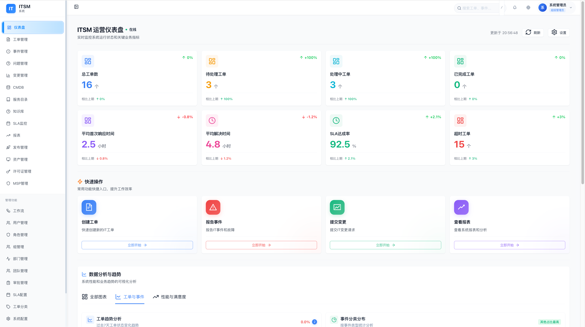 | 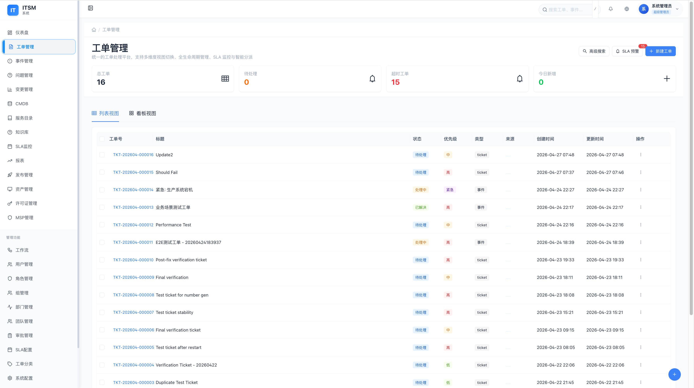 |

| 事件管理 | 问题管理 |
|:---:|:---:|
| 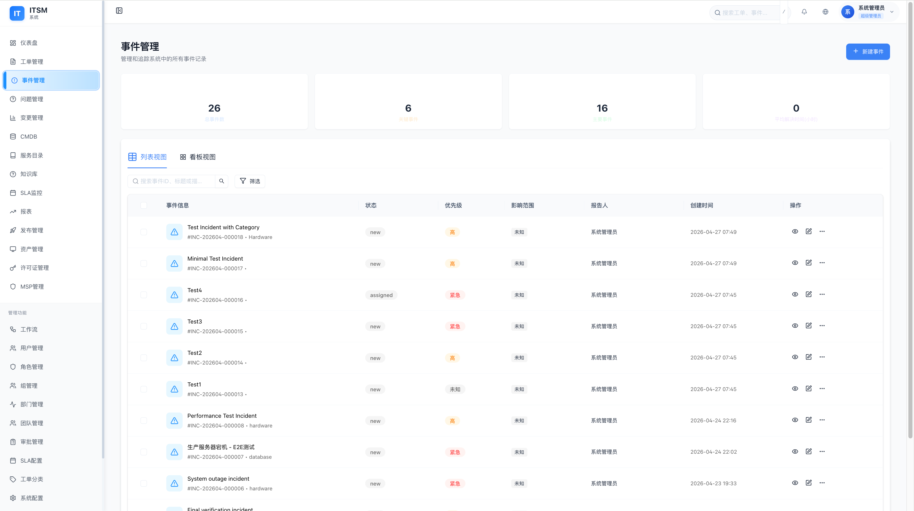 | 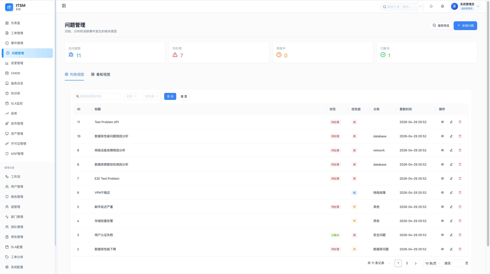 |

| 变更管理 | CMDB 配置管理 |
|:---:|:---:|
| 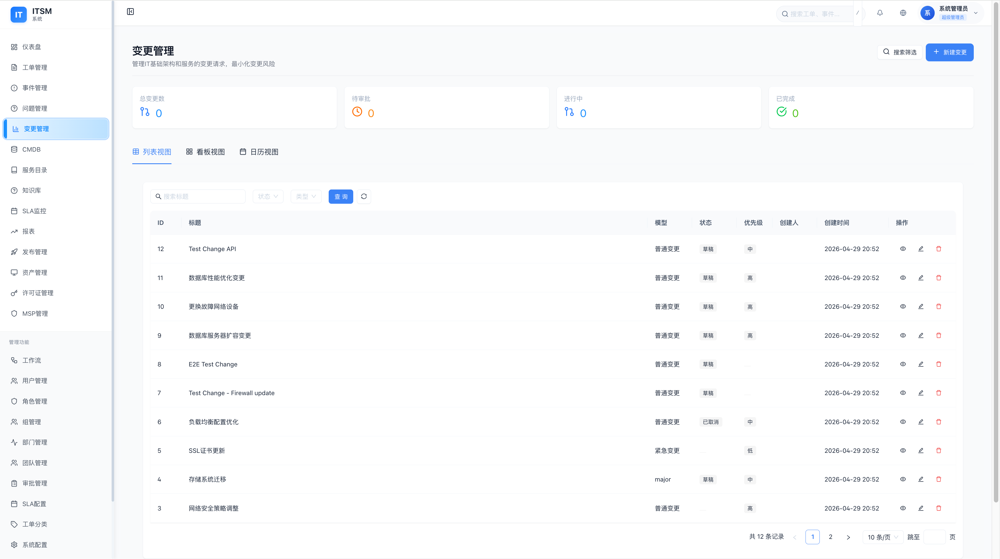 | 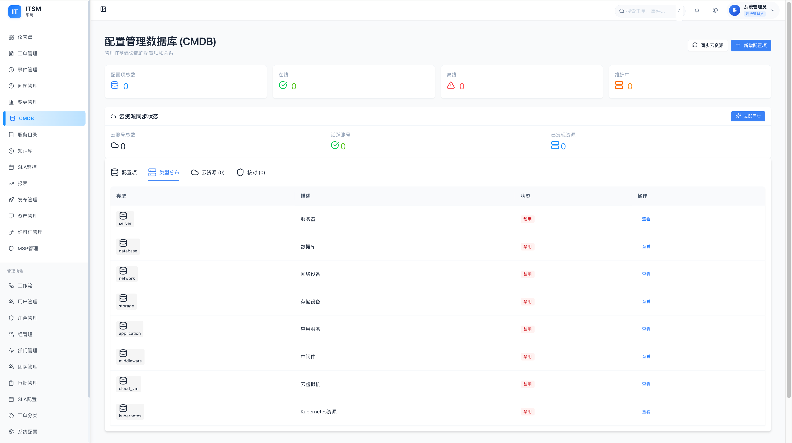 |

| 服务目录 | 知识库 |
|:---:|:---:|
| 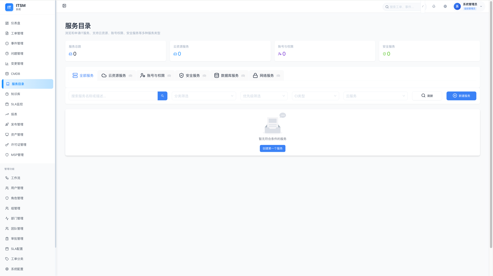 | 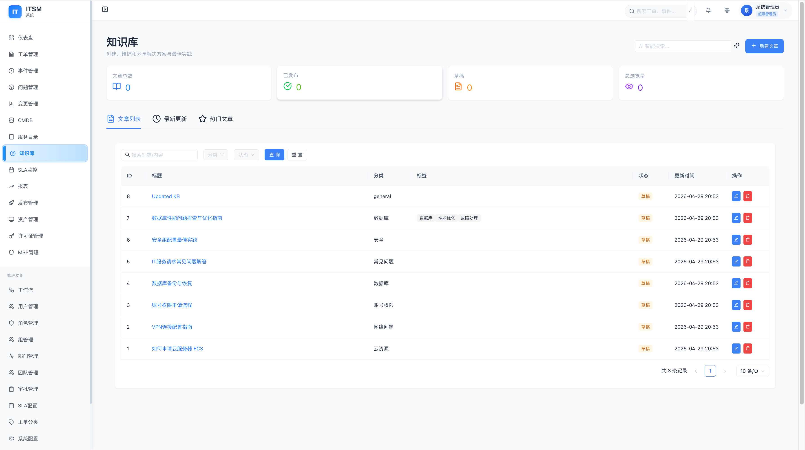 |

| 工作流引擎 | 角色管理 |
|:---:|:---:|
| 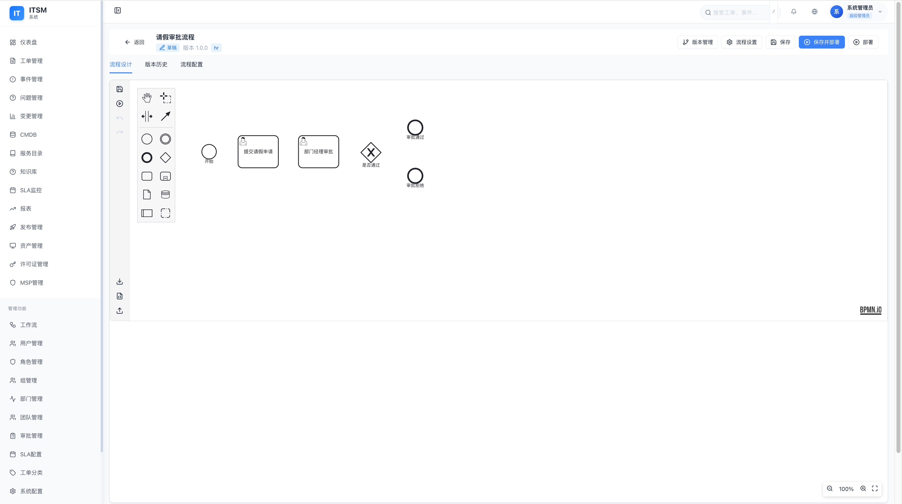 | 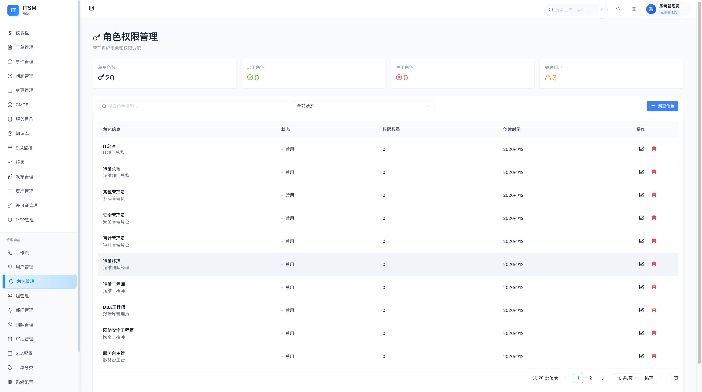 |

### 登录界面

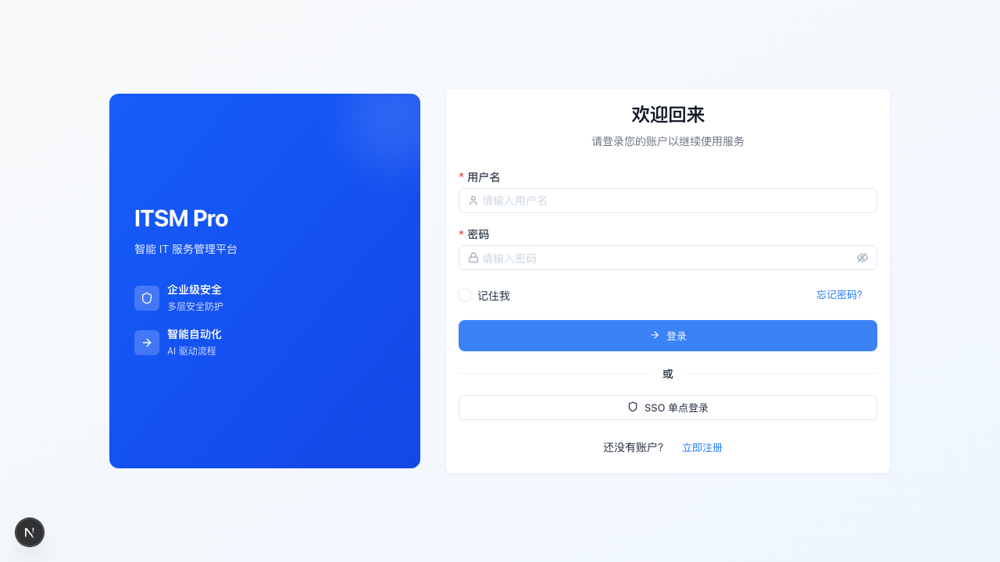

---

## ✨ AI-Native 核心能力

### 🤖 Guidance-Harness-Skill 架构

```
┌─────────────────────────────────────────────────────────────────────┐
│                     Skill Orchestrator                               │
│    流水线编排 │ 输入输出转换 │ 错误处理 │ 降级策略                     │
└─────────────────────────────────────────────────────────────────────┘
              │                   │               │
              ▼                   ▼               ▼
    ┌─────────────────┐ ┌─────────────────┐ ┌─────────────────┐
    │ TriageSkill    │ │ SummarizeSkill  │ │ KBSkill        │
    │ (Guidance程序) │ │ (Guidance程序)  │ │ (Guidance程序) │
    └─────────────────┘ └─────────────────┘ └─────────────────┘
              │                   │               │
              └───────────────────┴───────────────┘
                                  │
                                  ▼
┌─────────────────────────────────────────────────────────────────────┐
│                      Harness Controller                              │
│    Prompt管理 │ 参数配置 │ 执行控制 │ 结果解析                        │
└─────────────────────────────────────────────────────────────────────┘
                                  │
                                  ▼
┌─────────────────────────────────────────────────────────────────────┐
│                 Evaluator (质量评估闭环)                             │
│    准确性评估 │ 性能监控 │ 回归测试 │ Bad Case 积累                  │
└─────────────────────────────────────────────────────────────────────┘
```

### 🎯 AI 智能功能

| 功能 | 说明 | 效果 |
|:---|:---|:---|
| 🎯 **LLM-first 智能分类** | 优先用 LLM 判断，关键词兜底 | 分类准确率 95%+ |
| 📝 **自动摘要** | LLM 生成工单/事件摘要 | 节省 70% 阅读时间 |
| 🔍 **RAG 知识库** | 向量检索 + 大模型问答 | 知识查找秒级响应 |
| 💡 **智能推荐** | 推荐解决方案、相似工单 | 提升解决效率 50%+ |
| 👷 **智能分配** | 基于技能/负载的自动派单 | 派单准确率 90%+ |

### 🔧 Skill 扩展体系

| Skill | 功能 | 状态 |
|:---|:---|:---|
| TriageSkill | 工单智能分类 | ✅ 已实现 |
| SummarizeSkill | 工单/事件摘要 | ✅ 已实现 |
| KBSkill | RAG 知识库问答 | ✅ 已实现 |
| SecurityTriageSkill | 安全事件专项分类 | 🔜 待开发 |
| ImpactAnalysisSkill | 变更影响范围分析 | 🔜 待开发 |
| SLAForecastSkill | SLA 达成率预测 | 🔜 待开发 |

---

## 🔀 传统 ITSM 功能

### 🎫 服务管理

| 工单管理 | 事件管理 | 问题管理 | 变更管理 |
|:---:|:---:|:---:|:---:|
| 智能分配<br>SLA 保障<br>自动化流转 | 实时监控<br>智能告警<br>升级策略 | 根因分析<br>RFC 关联<br>知识沉淀 | 风险评估<br>多级审批<br>回滚方案 |

| 发布管理 | 服务请求 | 服务目录 | 知识库 |
|:---:|:---:|:---:|:---:|
| 发布计划<br>阶段控制<br>回滚支持 | 自助门户<br>审批流程<br>进度追踪 | 服务Offering<br>SLA 定义<br>自助申请 | RAG 检索<br>智能问答<br>知识推荐 |

### 🔀 BPMN 工作流引擎

```
┌──────────────────────────────────────────────────────────────────┐
│  🏗️ 可视化设计器    │  📊 流程监控    │  🔒 权限控制   │  📝 审计日志  │
├──────────────────────────────────────────────────────────────────┤
│  拖拽式流程设计    │  实时追踪      │  精细权限      │  全程记录     │
│  BPMN 2.0 标准    │  性能分析      │  角色绑定      │  合规追溯     │
│  版本管理         │  SLA 集成      │  数据隔离      │  报表导出     │
└──────────────────────────────────────────────────────────────────┘
```

### 🌍 MSP 多租户

```
┌─────────────────────────────────────────────────────────┐
│                    🏢 MSP 服务商                         │
├─────────────┬─────────────┬─────────────┬──────────────┤
│  🏢 租户 A  │  🏢 租户 B  │  🏢 租户 C  │  ...         │
├─────────────┴─────────────┴─────────────┴──────────────┤
│  📊 资源配额    │  💰 计费管理    │  🔍 监控告警     │
└─────────────────────────────────────────────────────────┘
```

### 📊 SLA 监控体系

- 多级别 SLA 策略配置
- 实时合规率监控面板
- 违约预警与自动升级
- 完整的 SLA 报表分析

---

## 🏗 技术架构

### 技术栈

<div align="center">

**后端** | Go 1.25+ | Gin | Ent ORM | PostgreSQL | Redis | BPMN Engine

**前端** | Next.js 15 | React 19 | TypeScript | Ant Design 6 | Tailwind CSS | Zustand

**AI** | OpenAI | Claude | Ollama (私有化) | Guidance

</div>

### 系统架构图

```
┌─────────────────────────────────────────────────────────────────┐
│                         🖥️ 客户端层                              │
│     Web (Next.js)      │      移动端 PWA      │    API        │
└─────────────────────────────────────────────────────────────────┘
                              │
                              ▼
┌─────────────────────────────────────────────────────────────────┐
│                      🌐 接入层 (Nginx)                          │
│              负载均衡 / SSL 终止 / 静态资源缓存                   │
└─────────────────────────────────────────────────────────────────┘
                              │
              ┌───────────────┴───────────────┐
              ▼                               ▼
┌─────────────────────────┐       ┌─────────────────────────┐
│    🌐 Next.js 前端      │       │     ⚙️ Go 后端 API      │
│       端口: 3000        │       │       端口: 8090         │
└─────────────────────────┘       └─────────────────────────┘
              │                               │
              │                               ├──────────────┐
              │                               ▼              ▼
              │                    ┌─────────────┐  ┌─────────┐
              │                    │ PostgreSQL  │  │  Redis  │
              │                    │   端口:5432  │  │  6379   │
              │                    └─────────────┘  └─────────┘
              │                               │
              │                               ▼
              │                    ┌─────────────────────────┐
              │                    │     🤖 AI 服务层        │
              │                    │  Guidance-Harness-Skill │
              │                    │     LLM Gateway         │
              │                    └─────────────────────────┘
              ▼
┌─────────────────────────────────────────────────────────────────┐
│                        💾 存储层                                 │
│    文件存储 (MinIO/S3)   │   向量存储 (Chroma)   │   对象存储   │
└─────────────────────────────────────────────────────────────────┘
```

### 数据模型 (100+ 实体)

```
核心模块          扩展模块           BPMN 工作流         MSP 多租户
─────────        ───────           ───────────         ─────────
├─ 工单           ├─ 服务目录        ├─ 流程定义          ├─ 租户
├─ 事件           ├─ 知识库          ├─ 流程实例          ├─ 部门
├─ 问题           ├─ SLA             ├─ 流程任务          ├─ 团队
├─ 变更           ├─ 审批链          ├─ 流程变量          ├─ 项目
├─ 发布           ├─ 通知             ├─ 审计日志          └─ 资源分配
├─ 资产           └─ 报表            └─ 权限控制
└─ 许可证
```

---

## 文档导航

| [开发指南](./docs/DEVELOPMENT.md) | [部署指南](./docs/DEPLOYMENT.md) | [配置参考](./docs/CONFIGURATION.md) |
|:---:|:---:|:---:|
| 开发环境搭建 | Docker/K8s 部署 | 环境变量详解 |

| [数据库](./docs/DATABASE.md) | [运维手册](./docs/OPERATIONS.md) | [AI架构解析](./docs/articles/07-AI-Native-ITSM的架构进化论：Guidance-Harness-Skill三层体系设计.md) |
|:---:|:---:|:---:|
| 迁移与备份 | 日志与监控 | Guidance-Harness-Skill 三层体系 |

| [测试框架](./tests/README.md) | [部署脚本](./scripts/deploy-dev.sh) | [贡献指南](./CONTRIBUTING.md) |
|:---:|:---:|:---:|
| API/UI/数据库测试 | 一键启动 | PR 流程 |

---

## 常用命令

```bash
# 部署脚本
./scripts/deploy-dev.sh up        # 启动开发环境
./scripts/deploy-dev.sh down      # 停止开发环境
./scripts/deploy-dev.sh logs      # 查看日志
./scripts/deploy-dev.sh doctor    # 诊断问题
./scripts/deploy-prod.sh deploy   # 部署生产环境

# 统一开发环境（推荐）
./scripts/start-dev.sh            # 启动所有开发服务
./scripts/stop-dev.sh             # 停止所有开发服务

# Docker 开发环境 (Makefile)
make dev-start     # 启动开发环境（等同于 start-dev.sh）
make dev-stop      # 停止开发环境（等同于 stop-dev.sh）
make dev-logs      # 查看日志
make dev-status    # 查看服务状态
make dev-shell     # 进入后端容器

# 构建
make build          # 构建前后端镜像
make build-backend  # 构建后端镜像
make build-frontend # 构建前端镜像

# 本地运行
make run            # 启动后端服务（本地）
make frontend-run   # 启动前端服务（本地）

# 测试
make test           # 运行所有测试
make test-backend   # 运行后端测试
make test-frontend  # 运行前端测试
```

---

## 🤝 参与贡献

欢迎提交 Pull Request！请阅读 [CONTRIBUTING.md](./CONTRIBUTING.md) 了解详情。

```bash
# 1. Fork 项目
# 2. 创建分支
git checkout -b feature/amazing-feature

# 3. 提交更改
git commit -m "feat: add amazing-feature"

# 4. 推送分支
git push origin feature/amazing-feature
```

### 代码规范

- ✅ Go: 使用 `gofumpt` 格式化
- ✅ TypeScript: ESLint + Prettier
- ✅ 提交信息: [Conventional Commits](https://www.conventionalcommits.org/)
- ✅ 测试: 新增功能需配套测试

---

## 📄 许可证

Apache License 2.0 - 开源免费，允许自由使用于商业产品。

- ✅ 个人学习与使用
- ✅ 商业产品集成
- ✅ 闭源项目使用
- ✅ 二次开发与分发

> 详见 [LICENSE](./LICENSE) 和 [NOTICE](./NOTICE) 文件。

---

## 📞 联系我们

<div align="center">

🐙 **GitHub**: [heidsoft/itsm](https://github.com/heidsoft/itsm)

💬 **讨论**: [Discussions](https://github.com/heidsoft/itsm/discussions)

🐛 **问题**: [Issues](https://github.com/heidsoft/itsm/issues)

📧 **Email**: <heidsoft@qq.com>

</div>

---

<div align="center">

**⭐ 如果这个项目对您有帮助，请 Star 支持！**

**🤖 AI-Native ITSM: AI First, Not AI After**

**[贡献者](./CONTRIBUTORS.md)** | 感谢您的参与！

Made with ❤️ by ITSM Team

</div>
