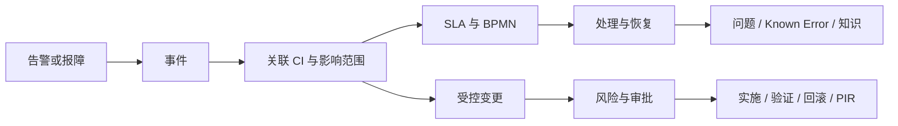
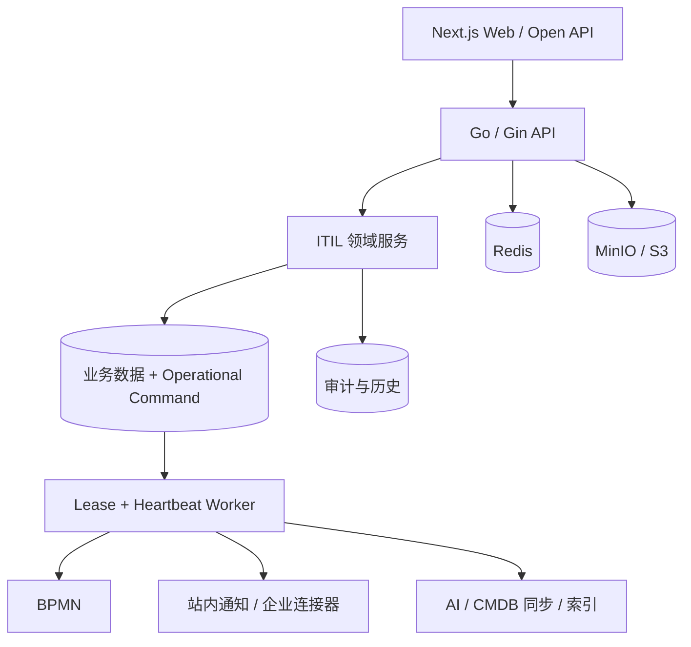

<div align="center">

# AI-Native ITSM

一个面向国内企业的开源 IT 服务管理系统，覆盖 ITIL 核心流程，支持 BPMN 工作流编排、CMDB、SLA、知识库和多租户。

[](https://go.dev/)
[](https://nextjs.org/)
[](https://www.typescriptlang.org/)
[](./LICENSE)
[](https://github.com/heidsoft/itsm/actions/workflows/backend-ci.yml)
[](https://github.com/heidsoft/itsm/actions/workflows/frontend-ci.yml)
[](https://github.com/heidsoft/itsm/stargazers)

[简体中文](./README.md) · [English](./README.en.md) · [日本語](./README.ja.md)

</div>

## 目录

- [项目定位](#项目定位)
- [适用场景](#适用场景)
- [能力与成熟度](#能力与成熟度)
- [快速开始](#快速开始)
  - [环境要求](#环境要求)
  - [使用 Docker 启动开发环境](#使用-docker-启动开发环境)
  - [验证启动结果](#验证启动结果)
  - [本机热更新开发](#本机热更新开发)
  - [可选 AI 与监控组件](#可选-ai-与监控组件)
- [使用示例](#使用示例)
  - [API 调用示例](#api-调用示例)
  - [常用开发命令](#常用开发命令)
  - [常见场景](#常见场景)
- [核心业务流程](#核心业务流程)
- [可靠执行架构](#可靠执行架构)
- [插件化集成](#插件化集成)
- [界面预览](#界面预览)
- [技术栈与仓库结构](#技术栈与仓库结构)
- [开发与测试](#开发与测试)
- [生产部署](#生产部署)
- [文档导航](#文档导航)
- [参与贡献](#参与贡献)
- [Star 趋势](#star-趋势)
- [License](#license)


## 项目定位

这个项目的目标是提供一个能真正跑起来的企业级 ITSM 系统。不是堆功能菜单，而是让工单、事件、问题、变更、SLA、CMDB 和知识库能够串成完整的业务流程，并且支持审计追踪、权限控制和多租户隔离。

几个核心设计选择：

- **BPMN 做流程编排**：审批、工作流用 BPMN 2.0 标准，不自己造轮子
- **CMDB 不只是资产表**：配置项和关系会进入事件、变更等流程，用于影响分析
- **AI 是辅助不是替代**：分诊、摘要、知识检索可以用 AI，但必须能降级、有审计记录，不会绕过人工审批
- **异步操作要可靠**：工作流启动、通知发送等关键操作用事务 + outbox 模式，不依赖 goroutine  fire-and-forget

> **当前版本 v1.6.x**：处于生产加固阶段。核心 ITIL 流程（工单、事件、问题、变更、SLA、CMDB）已经可用，但不同模块成熟度不同。有些功能还在 Pilot 阶段，生产使用前建议先看[开源产品能力说明](./docs/product/open-source-release-capability.md)。

## 适用场景

- IT 服务台：统一受理、分派和跟踪员工请求
- 运维治理：事件、CI、SLA、问题、变更闭环管理
- 流程自动化：通过 BPMN 配置审批和跨系统流程
- 多组织服务：私有化、SaaS 或 MSP 模式下的多租户管理
- 二次开发：基于 Go + Next.js 和开放 API 定制

## 能力与成熟度

| 能力域 | 状态 | 说明 |
|:---|:---:|:---|
| 工单与事件 | GA 候选 | 状态流转、分派、SLA、BPMN 绑定、租户隔离已完整 |
| 工单类型与动态表单 | GA 候选 | 自定义字段、表单 Preset、Workflow/SLA 绑定 |
| 变更管理 | GA 候选 | 风险评估、审批链（会签/或签/CAB）、回滚方案、PIR |
| 问题与 Known Error | Pilot | 根因分析、临时方案、关联事件、知识沉淀 |
| 服务目录与请求 | Pilot | 目录管理、请求审批、服务任务 |
| CMDB | GA 候选 | CI 类型、配置项、关系、拓扑、影响分析 |
| CMDB 云发现 | Pilot | 阿里云适配，自动发现和同步 |
| BPMN 与审批 | Pilot | 流程定义、实例、任务、变量、执行历史 |
| SLA | GA 候选 | 策略、截止时间、预警、违规统计 |
| 知识与 RAG | Pilot | 文章管理、关键词/向量检索、问答降级 |
| AI 辅助 | Pilot | LLM Gateway、分诊、摘要、RAG |
| 通知与连接器 | Pilot | 站内通知、投递审计、连接器框架 |
| RBAC/多租户 | GA 候选 | 角色权限、Endpoint ACL、租户隔离、审计日志 |

> **成熟度说明**：GA 候选 = 核心功能完整，可进入生产验收；Pilot = 有真实实现，但闭环或运维还需补齐。详细限制和验收要点见各模块文档。

## 快速开始

> **语言说明**：v1.6.x 产品界面为**中文优先**（面向中国私有化部署场景），英文/日文 README 提供入门指引；完整界面多语言（en-US 等）规划在 v1.7，详见 [ROADMAP](ROADMAP.md)。

### 环境要求

- Docker Desktop 或兼容的 Docker Engine/Compose
- Git
- 建议至少 4 核 CPU、8 GB 内存

### 使用 Docker 启动开发环境

本仓库提供两份 Compose 文件。请**不要**直接执行不带 `-f` 的 `docker compose up`——
仓库根目录没有默认的 `docker-compose.yml`：

| 文件 | 用途 |
|:---|:---|
| `docker-compose.dev.yml` | 本地开发。核心服务默认启动；`--profile ai` 加 Ollama，`--profile monitoring` 加 Prometheus + Grafana |
| `docker-compose.prod.yml` | 生产部署。需要 `.env.prod`，包含 nginx 与后台 worker |

```bash
git clone https://github.com/heidsoft/itsm.git
cd itsm

cp .env.dev.example .env
make dev-start-docker
```

启动后访问：

| 服务 | 地址 |
|:---|:---|
| Web | <http://localhost:3000> |
| 后端 API | <http://localhost:8090> |
| Swagger | <http://localhost:8090/swagger/index.html> |
| MinIO Console | <http://localhost:9001> |

开发环境默认登录：

```text
用户名：admin
密码：admin123
```

该账号只用于本地开发。生产环境的管理员密码由 `.env.prod` 中的 `ADMIN_PASSWORD` 决定（初始化容器 `itsm-init` 首次启动时写入），请以你自己的 `.env.prod` 为准，不要使用任何文档示例密码。任何可被其他人访问的部署都必须先修改管理员密码、`JWT_SECRET`、数据库、Redis 和对象存储凭据。

### （可选）一键填充演示数据

空系统只有功能模板，没有业务记录。执行以下命令可播种一套演示数据
（8 条事件、2 个问题、3 个变更、5 篇知识库文章），方便快速了解各模块的实际使用效果：

```bash
make dev-seed-demo   # 幂等，可重复执行
```

演示数据使用 `INC-DEMO-xxxx` / `PRB-DEMO-xxxx` / `CHG-DEMO-xxxx` 固定编号，
覆盖事件生命周期各状态（new → escalated → closed）。生产部署**不会**预置这些虚构记录。

### 验证启动结果

```bash
make dev-status
make dev-health

curl http://localhost:8090/api/v1/health
curl http://localhost:3000/api/health
```

查看日志和停止环境：

```bash
make dev-logs
make dev-stop-docker
```

清理数据卷会删除本地数据库和对象存储数据：

```bash
make dev-clean
```

### 本机热更新开发

Docker 提供 PostgreSQL、Redis 和 MinIO，本机运行 Go 与 Next.js：

```bash
make dev-start-local
make dev-status
```

本机模式、PostgreSQL 17/pgvector 和代理排查见[本地开发命令](./docs/dev-commands-reference.md)。

### 可选 AI 与监控组件

基础开发栈不会强制启动 Ollama 和监控组件：

```bash
# Ollama
docker compose --env-file .env -f docker-compose.dev.yml \
  --profile dev --profile ai up -d

# Prometheus + Grafana
docker compose --env-file .env -f docker-compose.dev.yml \
  --profile dev --profile monitoring up -d
```

没有可用模型时，ITIL 主流程应保持运行；AI 能力必须按配置降级。

## 使用示例

### API 调用示例

所有 API 返回统一格式 `{ code: number, message: string, data: any }`。

```bash
# 1. 登录并保存 HttpOnly 会话 Cookie（示例账号仅限本地开发）
curl -X POST http://localhost:8090/api/v1/login \
  -H "Content-Type: application/json" \
  -c /tmp/itsm-cookies.txt \
  -d '{"username":"admin","password":"admin123"}'

# 登录响应不向 JavaScript 暴露 access token。
# 写操作还需要双提交 CSRF token；以下示例需要 jq。
CSRF_TOKEN=$(curl -s -b /tmp/itsm-cookies.txt -c /tmp/itsm-cookies.txt \
  http://localhost:8090/api/v1/csrf-token | jq -r '.data.csrf_token')

# 2. 查询当前租户可用的工单类型
curl -X GET "http://localhost:8090/api/v1/ticket-types?status=active&page=1&pageSize=20" \
  -b /tmp/itsm-cookies.txt

# 3. 使用返回的类型 ID 创建工单；formFields 必须符合该类型字段定义
TICKET_TYPE_ID=1

curl -X POST http://localhost:8090/api/v1/tickets \
  -H "Content-Type: application/json" \
  -H "X-CSRF-Token: $CSRF_TOKEN" \
  -b /tmp/itsm-cookies.txt \
  -d '{
    "title": "打印机无法使用",
    "description": "3楼会议室打印机故障",
    "priority": "medium",
    "ticketTypeId": '"$TICKET_TYPE_ID"',
    "category": "hardware",
    "formFields": {}
  }'

# 4. 查询工单列表
curl -X GET "http://localhost:8090/api/v1/tickets?page=1&pageSize=10" \
  -b /tmp/itsm-cookies.txt

# 5. 创建变更请求
curl -X POST http://localhost:8090/api/v1/changes \
  -H "Content-Type: application/json" \
  -H "X-CSRF-Token: $CSRF_TOKEN" \
  -b /tmp/itsm-cookies.txt \
  -d '{
    "title": "数据库升级计划",
    "description": "PostgreSQL 14 升级到 16",
    "type": "standard",
    "riskLevel": "medium",
    "implementationPlan": "采用蓝绿部署"
  }'

# 6. 查询 SLA 状态
curl -X GET http://localhost:8090/api/v1/sla/policies \
  -b /tmp/itsm-cookies.txt
```

### 常用开发命令

```bash
# 后端开发
cd itsm-backend
go run main.go                           # 启动后端服务
go test ./...                            # 运行测试
go build -o itsm-backend main.go         # 构建二进制

# 前端开发
cd itsm-frontend
npm install                              # 安装依赖
npm run dev                              # 启动开发服务器
npm run build                            # 生产构建

# 数据库迁移
cd itsm-backend
go run -tags migrate main.go             # 执行迁移

# 查看 API 文档
open http://localhost:8090/swagger/index.html
```

### 常见场景

| 场景 | 操作 |
|:---|:---|
| 创建租户 | `POST /api/v1/tenants` 创建租户后，可在该租户下创建用户 |
| 配置 SLA | 通过 `POST /api/v1/sla/policies` 创建 SLA 策略，绑定到工单类别 |
| 设计工作流 | 在前端「工作流」模块设计 BPMN 流程，绑定到业务对象 |
| 管理 CMDB | 通过 `POST /api/v1/cmdb/ci` 创建配置项，建立 CI 关系 |
| 知识库检索 | `GET /api/v1/knowledge/search?q=关键词` 搜索知识文章 |
| 接入外部告警 | 配置 `ALERT_SOURCE_CONFIG` 后，通过 `POST /api/v1/alerts/sources/:source/ingest` 接收告警 Webhook |

完整 API 文档见 [API 参考](./docs/api/API_REFERENCE.md)。

## 核心业务流程


```mermaid
flowchart LR
    A[告警或报障] --> B[事件]
    B --> C[关联 CI 与影响范围]
    C --> D[SLA 与 BPMN]
    D --> E[处理与恢复]
    E --> F[问题 / Known Error / 知识]
    C --> G[受控变更]
    G --> H[风险与审批]
    H --> I[实施 / 验证 / 回滚 / PIR]
```

四条主要验收旅程：

1. **事件管理**：报障 → 事件 → CI 关联 → SLA → 流程 → 恢复 → 审计
2. **问题管理**：重复事件 → 问题 → Known Error → 知识发布 → RAG
3. **变更管理**：变更 → 影响分析 → 风险 → 审批 → 实施/回滚 → PIR
4. **服务请求**：目录 → 请求 → 审批 → 交付 → CI 创建或变更

## 可靠执行架构

生产环境使用同一后端镜像的三个进程角色：

- `itsm-init`：执行数据库迁移和初始化
- `ITSM_PROCESS_MODE=api`：提供 HTTP/WebSocket 服务
- `ITSM_PROCESS_MODE=worker`：执行异步任务（工作流、SLA 检查、通知、索引等）


```mermaid
flowchart TB
    UI[Next.js Web / Open API] --> API[Go / Gin API]
    API --> DOMAIN[ITIL 领域服务]
    DOMAIN --> TX[(业务数据 + Operational Command)]
    TX --> WORKER[Lease + Heartbeat Worker]
    WORKER --> BPMN[BPMN]
    WORKER --> NOTICE[站内通知 / 企业连接器]
    WORKER --> FUTURE[AI / CMDB 同步 / 索引]
    DOMAIN --> AUDIT[(审计与历史)]
    API --> REDIS[(Redis)]
    API --> OBJECT[(MinIO / S3)]
```

关键异步操作（工作流启动、通知发送、SLA 违规等）通过事务 + outbox 模式保证可靠性，支持重试、死信和投递审计。

## 插件化集成

系统通过连接器框架对接外部系统，支持配置驱动注册：

| 扩展点 | 当前实现 | 配置方式 |
|:---|:---|:---|
| 告警源 | 通用 Webhook（支持 Prometheus Alertmanager、PagerDuty 等） | `ALERT_SOURCE_CONFIG` 指向 YAML |
| 向量存储 | Milvus、Qdrant、PGVector，以及内存关键词后备 | `VECTOR_STORE_CONFIG` 指向 YAML 或内联配置 |

> 未配置向量存储时，默认使用内存关键词检索，重启后数据丢失，不适合生产环境独立使用。

### 告警源接入

配置 YAML 声明告警源、字段映射和 Webhook 签名参数。仓库提供 Prometheus Alertmanager 示例：

```bash
cd itsm-backend
export ALERT_SOURCE_CONFIG=etc/alert-sources/prometheus-alertmanager.yaml
```

接入端点：`POST /api/v1/alerts/sources/:source/ingest`（需要认证和 `alert:write` 权限）。

### 向量存储配置

```bash
cd itsm-backend
cp etc/vector-store/config.yaml.example etc/vector-store/config.yaml
export VECTOR_STORE_CONFIG=etc/vector-store/config.yaml
```

配置支持 `${ENV_VAR}` 展开。启用 `fallback: true` 后，主存储不可用时会自动回退到关键词检索。

## 界面预览

| 事件与问题 | 变更与 CMDB |
|:---:|:---:|
|  |  |
|  |  |

| 服务目录与知识 | 工作流与权限 |
|:---:|:---:|
|  |  |
|  |  |

## 技术栈与仓库结构

| 层 | 技术 |
|:---|:---|
| 后端 | Go 1.25.13、Gin、Ent、PostgreSQL、Redis |
| 前端 | Next.js 15.5、React 19、TypeScript 6、Ant Design 6、Tailwind CSS |
| 工作流 | BPMN 2.0、流程定义/实例/任务/变量/历史 |
| AI/RAG | LLM Gateway、pgvector、OpenAI/兼容接口、Ollama 可选 |
| 交付 | Docker Compose、GHCR、GitHub Actions、Prometheus/Grafana 可选 |

```text
itsm/
├── itsm-backend/     # Go API、领域服务、Ent Schema、Worker
├── itsm-frontend/    # Next.js 管理端、服务台与用户门户
├── itsm-ai-service/  # AI/RAG 辅助服务
├── itsm-agent/       # Agent 扩展
├── itsm-skill/       # Skill 扩展
├── itsm-cli/         # CLI 入口
├── docs/             # 产品、架构、开发、部署、测试文档
├── scripts/          # 开发、生产、发布与诊断脚本
└── monitoring/       # Prometheus/Grafana 配置
```

后端是业务规则、权限、租户隔离、工作流执行和审计的事实来源；前端不复制生命周期规则。

## 开发与测试

```bash
# 后端
cd itsm-backend
GOTOOLCHAIN=auto go test ./...
GOTOOLCHAIN=auto go vet ./...

# 前端
cd ../itsm-frontend
npm install
npm run type-check
npm test

# 根目录工程契约
cd ..
make check-contracts

# 业务流程回归（需先启动开发环境；覆盖事件/问题全生命周期、变更拒绝路径、
# 状态机负例、伪造 token 负例与通知/仪表盘联动，共 27 项断言）
python3 output/dev_business_flow_test.py
```

详细分层、测试策略和 E2E 用法见[本地开发命令](./docs/dev-commands-reference.md)和[测试指南](./docs/testing/README.md)。

## 生产部署

支持三种部署模式：

- **private**：私有化部署，单企业使用
- **saas**：多租户 SaaS，平台托管
- **saas_msp**：SaaS + MSP，平台与服务商协同

```bash
make prod-init        # 生成生产配置
# 编辑 .env.prod，修改密码、JWT、域名等
make prod-deploy      # 部署
make prod-health      # 检查状态
```

上线前检查清单：

- [ ] 修改所有默认密码和密钥（`ADMIN_PASSWORD`、`JWT_SECRET`、数据库、Redis）
- [ ] 配置 TLS 证书（在网关/负载均衡器终止）
- [ ] 执行数据库迁移和备份恢复演练
- [ ] 验证租户隔离和 RBAC 权限
- [ ] 测试容量、故障恢复和死信重放
- [ ] 验收 CMDB、AI、连接器等已启用模块

> 不要把开发默认配置用于生产。详细步骤见[生产就绪计划](./docs/delivery/production-readiness-program.md)和[运维手册](./docs/runbooks/production-initialization.md)。

## 文档导航

| 文档 | 用途 |
|:---|:---|
| [文档中心](./docs/README.md) | 按角色和主题查找资料 |
| [开源产品能力说明](./docs/product/open-source-release-capability.md) | 角色、业务闭环、成熟度、限制与验收入口 |
| [商业能力契约](./docs/product/itsm-commercial-capability-contract.md) | 能力成熟度、商业 MVP 和非目标 |
| [商业化架构](./docs/architecture/commercial-ready-architecture.md) | 生产级总体架构 |
| [CMDB 商业 MVP](./docs/product/cmdb-commercial-mvp.md) | CMDB GA/Pilot 边界和验收门槛 |
| [Outbox 架构](./docs/architecture/operational-command-outbox.md) | 可靠异步执行规范 |
| [API 参考](./docs/api/API_REFERENCE.md) | HTTP 接口文档 |
| [本地开发命令](./docs/dev-commands-reference.md) | 开发命令、调试与故障排查 |
| [测试指南](./docs/testing/README.md) | 单元、集成、契约和 E2E 测试 |
| [Roadmap](./ROADMAP.md) | 当前迭代方向唯一事实源 |
| [升级指南](./UPGRADE.md) | v1.6.x → 最新：破坏性变更、环境变量、迁移与回滚 |

## 参与贡献

欢迎提交 Issue、文档和代码。开始前请阅读 [CONTRIBUTING.md](./CONTRIBUTING.md)。

### 快速贡献流程

```bash
# 1. Fork 并克隆仓库
git clone https://github.com/heidsoft/itsm.git
cd itsm

# 2. 创建功能分支
git checkout -b feature/your-feature

# 3. 安装开发环境
make dev-start-docker

# 4. 开发并测试
# 后端：cd itsm-backend && go test ./...
# 前端：cd itsm-frontend && npm test

# 5. 提交（使用 Conventional Commits）
# 显式挑选文件，不要用 git add . / git add -A 一键暂存
git add itsm-backend/handlers/incident/service.go
git commit -m "feat: describe your change"

# 6. 推送并创建 PR
git push origin feature/your-feature
```

### 贡献方式

| 方式 | 说明 |
|:---|:---|
| 🐛 报告 Bug | 使用 [GitHub Issues](https://github.com/heidsoft/itsm/issues/new) |
| 💡 提出功能 | 在 [Discussions](https://github.com/heidsoft/itsm/discussions) 中讨论 |
| 📖 完善文档 | 提交文档改进 PR |
| 🔧 提交代码 | 通过 Pull Request 贡献代码 |
| 👀 代码审查 | 参与 PR 审查 |

### 贡献要求

代码风格（ESLint + gofmt）、提交信息规范、测试要求与 PR 流程见 [CONTRIBUTING.md](./CONTRIBUTING.md)；PR 需通过全部 CI 检查才会合并。

提交前请显式挑选文件，并确认暂存区不含密码、密钥或 token 等凭据（`git add .` / `git add -A` 容易把本地凭据文件一并暂存）。

- [查看贡献者](https://github.com/heidsoft/itsm/graphs/contributors)

## Star 趋势

[](https://github.com/heidsoft/itsm/stargazers)

## License

本项目采用 [Apache License 2.0](./LICENSE)。允许商业使用、修改和分发；使用时请遵守许可证和 [NOTICE](./NOTICE) 要求。

<div align="center">

[GitHub](https://github.com/heidsoft/itsm) · [Issues](https://github.com/heidsoft/itsm/issues) · [Discussions](https://github.com/heidsoft/itsm/discussions)

如果这个项目对你有帮助，欢迎 Star、试用并反馈真实场景。

</div>
