<div align="center">

# AI-Native ITSM

面向国内企业的开源 IT 服务管理平台

ITIL 流程 · BPMN 编排 · CMDB · SLA · 知识库/RAG · 多租户 · 企业连接器

[](https://go.dev/)
[](https://nextjs.org/)
[](https://www.typescriptlang.org/)
[](./LICENSE)
[](https://github.com/heidsoft/itsm/actions/workflows/backend-ci.yml)
[](https://github.com/heidsoft/itsm/actions/workflows/frontend-ci.yml)
[](https://github.com/heidsoft/itsm/stargazers)

[简体中文](./README.md) · [English](./README.en.md) · [日本語](./README.ja.md)

</div>

## 目录

- [项目定位](#项目定位)
- [适用场景](#适用场景)
- [能力与成熟度](#能力与成熟度)
- [快速开始](#快速开始)
  - [环境要求](#环境要求)
  - [使用 Docker 启动开发环境](#使用-docker-启动开发环境)
  - [验证启动结果](#验证启动结果)
  - [本机热更新开发](#本机热更新开发)
  - [可选 AI 与监控组件](#可选-ai-与监控组件)
- [使用示例](#使用示例)
  - [API 调用示例](#api-调用示例)
  - [常用开发命令](#常用开发命令)
  - [常见场景](#常见场景)
- [关键业务闭环](#关键业务闭环)
- [可靠执行架构](#可靠执行架构)
- [插件化集成架构](#插件化集成架构)
- [产品界面](#产品界面)
- [技术栈与仓库结构](#技术栈与仓库结构)
- [开发与测试](#开发与测试)
- [生产部署](#生产部署)
- [文档导航](#文档导航)
- [参与贡献](#参与贡献)
- [Star 趋势](#star-趋势)
- [License](#license)

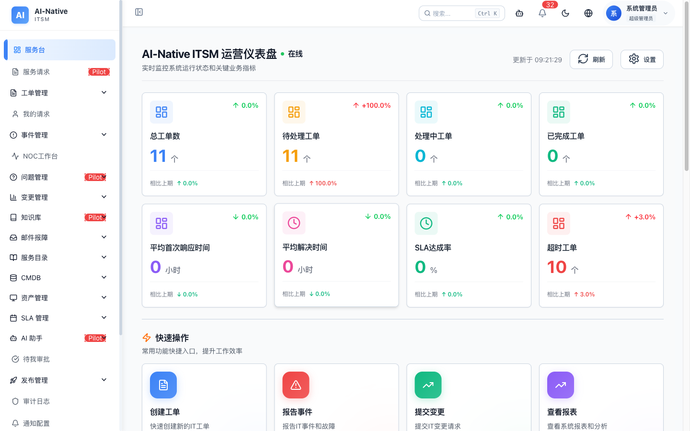

## 项目定位

ITSM 用一套可审计、可扩展的后端规则连接服务台、事件、问题、变更、服务请求、SLA、CMDB、知识和企业协作系统。项目目标不是堆出更多菜单，而是让真实企业流程能够连续运行：失败可恢复、权限可验证、操作可追踪、结果可验收。

项目坚持四个原则：

- **流程是主线**：BPMN 是统一编排层，业务状态机仍由各领域服务负责。
- **CMDB 是上下文**：配置项、关系和影响范围进入事件、问题、变更与服务请求，而不是停留在资产列表。
- **AI 是决策支持**：分诊、摘要、检索和建议可降级、可审计，不绕过权限和人工责任。
- **异步动作必须可靠**：工作流启动和关键通知通过事务 command/outbox、租约、fencing、重试和死信执行，不依赖请求内 goroutine。

> 当前处于生产加固阶段。核心 ITIL 能力已经具备可运行基础，但不同领域成熟度不同。代码或页面存在不等于已达到生产承诺；开源用户请先看[开源产品能力说明](./docs/product/open-source-release-capability.md)，生产选型再结合[商业能力契约](./docs/product/itsm-commercial-capability-contract.md)和对应验收结果。

开发前请先阅读[文档状态与事实源](./docs/documentation-governance.md)。`output/`、`docs/review/`、`docs/test-plan/` 和 `docs/archive/` 中的报告是历史快照，不能覆盖当前源码、运行时和最新发布证据。

运行时能力以认证接口 `GET /api/v1/capabilities` 为唯一事实来源。菜单和工作台必须同时满足构建可用、部署就绪、租户就绪及用户操作权限；仓库内的成熟度表用于发布说明，不替代运行时判断。

## 适用场景

- 企业 IT 服务台统一受理、分派和跟踪员工请求。
- 运维团队将事件、CI、SLA、问题和变更串成治理闭环。
- 数字化平台团队通过 BPMN 配置审批和跨系统流程。
- 私有化、SaaS 或 SaaS + MSP 模式下的多组织服务管理。
- 基于 Go、Next.js 和开放接口进行二次开发。

## 能力与成熟度

成熟度定义：

- **GA 候选**：核心模型、规则和主要接口已存在，可以进入企业生产验收。
- **Pilot**：存在真实实现，但跨模块闭环、运维或测试仍需补齐。
- **Disabled/规划中**：骨架或入口不构成可交付能力，不应作为生产承诺。

| 能力域 | 当前状态 | 已有基础 | 进入生产前重点 |
|:---|:---:|:---|:---|
| 工单与事件 | GA 候选 | 状态流转、分派、CI、SLA、BPMN、租户隔离 | 固化事件恢复旅程和容量验收；事件更新含 `force` 参数可绕过版本检查，生产部署前需明确控制策略 |
| 工单类型与动态表单 | GA 候选 | 类型快照、动态字段、Preset 安装、Workflow/SLA/Assignment 绑定、独立权限与审计 | 大规模字段配置、升级兼容和管理员 E2E 验收 |
| 变更管理 | **Pilot** | 风险、受影响 CI、审批、回滚方案、PIR 基础 | BPMN 推进与业务状态落库尚非原子，审批记录更新失败仅 warn；影响分析门禁、窗口冲突与回滚演练需补齐后重新评估 GA 候选 |
| 问题与 Known Error | Pilot | 根因、临时方案、关联事件、知识沉淀基础 | 强化 CI 引用和知识发布闭环 |
| 服务目录与请求 | Pilot | 目录、请求、审批、服务任务基础 | 目录版本、交付补偿和 CI 变更闭环 |
| CMDB 核心 | GA 候选 | CI 类型、配置项、关系、历史、拓扑、影响分析 | 数据质量、规模和恢复验收；CI 历史记录在 CI 保存后单独写入，原子性需生产验证 |
| CMDB 云发现 | Pilot | 阿里云适配与连通基础 | Job/Worker/Diff/对账、密钥服务和退役治理 |
| BPMN 与审批 | Pilot | 定义、绑定、实例、任务、变量、历史 | 继续迁移剩余非可靠触发路径 |
| SLA | GA 候选 | 策略、截止时间、预警、违规、指标 | 工作日历、暂停恢复和跨领域统一；合规检查使用进程时钟，分布式环境建议配置权威时间源 |
| 知识与 RAG | Pilot | 文章、关键词/向量检索、问答降级；默认关键词后端仅为进程内后备 | 持久化向量存储、发布版本、可见性和索引一致性 |
| AI | Pilot | LLM Gateway、分诊、摘要、RAG、审计框架 | 统一 evaluator、反馈和高风险动作治理 |
| 通知与连接器 | Pilot | 可靠通知 outbox、投递审计、连接器框架 | 真实渠道健康检查、回调验签和重放运维 |
| RBAC/多租户 | GA 候选 | 角色权限、Endpoint ACL、租户过滤、审计 | 按领域持续补权限矩阵和跨租户回归；`super_admin/sysadmin` 跨租户绕过需明确范围；用户有效性查询暂未校验租户归属 |

CMDB 的正式与试点边界见 [CMDB 商业 MVP](./docs/product/cmdb-commercial-mvp.md)。

## 快速开始

### 环境要求

- Docker Desktop 或兼容的 Docker Engine/Compose
- Git
- 建议至少 4 核 CPU、8 GB 内存

### 使用 Docker 启动开发环境

本仓库提供两份 Compose 文件。请**不要**直接执行不带 `-f` 的 `docker compose up`——
仓库根目录没有默认的 `docker-compose.yml`：

| 文件 | 用途 |
|:---|:---|
| `docker-compose.dev.yml` | 本地开发。核心服务默认启动；`--profile ai` 加 Ollama，`--profile monitoring` 加 Prometheus + Grafana |
| `docker-compose.prod.yml` | 生产部署。需要 `.env.prod`，包含 nginx 与后台 worker |

```bash
git clone https://github.com/heidsoft/itsm.git
cd itsm

cp .env.dev.example .env
make dev-start-docker
```

启动后访问：

| 服务 | 地址 |
|:---|:---|
| Web | <http://localhost:3000> |
| 后端 API | <http://localhost:8090> |
| Swagger | <http://localhost:8090/swagger/index.html> |
| MinIO Console | <http://localhost:9001> |

开发环境默认登录：

```text
用户名：admin
密码：admin123
```

该账号只用于本地开发。任何可被其他人访问的部署都必须先修改管理员密码、`JWT_SECRET`、数据库、Redis 和对象存储凭据。

### 验证启动结果

```bash
make dev-status
make dev-health

curl http://localhost:8090/api/v1/health
curl http://localhost:3000/api/health
```

查看日志和停止环境：

```bash
make dev-logs
make dev-stop-docker
```

清理数据卷会删除本地数据库和对象存储数据：

```bash
make dev-clean
```

### 本机热更新开发

Docker 提供 PostgreSQL、Redis 和 MinIO，本机运行 Go 与 Next.js：

```bash
make dev-start-local
make dev-status
```

本机模式、PostgreSQL 17/pgvector 和代理排查见[本地开发命令](./docs/dev-commands-reference.md)。

### 可选 AI 与监控组件

基础开发栈不会强制启动 Ollama 和监控组件：

```bash
# Ollama
docker compose --env-file .env -f docker-compose.dev.yml \
  --profile dev --profile ai up -d

# Prometheus + Grafana
docker compose --env-file .env -f docker-compose.dev.yml \
  --profile dev --profile monitoring up -d
```

没有可用模型时，ITIL 主流程应保持运行；AI 能力必须按配置降级。

## 使用示例

### API 调用示例

所有 API 返回统一格式 `{ code: number, message: string, data: any }`。

```bash
# 1. 登录并保存 HttpOnly 会话 Cookie（示例账号仅限本地开发）
curl -X POST http://localhost:8090/api/v1/login \
  -H "Content-Type: application/json" \
  -c /tmp/itsm-cookies.txt \
  -d '{"username":"admin","password":"admin123"}'

# 登录响应不向 JavaScript 暴露 access token。
# 写操作还需要双提交 CSRF token；以下示例需要 jq。
CSRF_TOKEN=$(curl -s -b /tmp/itsm-cookies.txt -c /tmp/itsm-cookies.txt \
  http://localhost:8090/api/v1/csrf-token | jq -r '.data.csrf_token')

# 2. 查询当前租户可用的工单类型
curl -X GET "http://localhost:8090/api/v1/ticket-types?status=active&page=1&pageSize=20" \
  -b /tmp/itsm-cookies.txt

# 3. 使用返回的类型 ID 创建工单；formFields 必须符合该类型字段定义
TICKET_TYPE_ID=1

curl -X POST http://localhost:8090/api/v1/tickets \
  -H "Content-Type: application/json" \
  -H "X-CSRF-Token: $CSRF_TOKEN" \
  -b /tmp/itsm-cookies.txt \
  -d '{
    "title": "打印机无法使用",
    "description": "3楼会议室打印机故障",
    "priority": "medium",
    "ticketTypeId": '"$TICKET_TYPE_ID"',
    "category": "hardware",
    "formFields": {}
  }'

# 4. 查询工单列表
curl -X GET "http://localhost:8090/api/v1/tickets?page=1&pageSize=10" \
  -b /tmp/itsm-cookies.txt

# 5. 创建变更请求
curl -X POST http://localhost:8090/api/v1/changes \
  -H "Content-Type: application/json" \
  -H "X-CSRF-Token: $CSRF_TOKEN" \
  -b /tmp/itsm-cookies.txt \
  -d '{
    "title": "数据库升级计划",
    "description": "PostgreSQL 14 升级到 16",
    "type": "standard",
    "riskLevel": "medium",
    "implementationPlan": "采用蓝绿部署"
  }'

# 6. 查询 SLA 状态
curl -X GET http://localhost:8090/api/v1/sla/policies \
  -b /tmp/itsm-cookies.txt
```

### 常用开发命令

```bash
# 后端开发
cd itsm-backend
go run main.go                           # 启动后端服务
go test ./...                            # 运行测试
go build -o itsm-backend main.go         # 构建二进制

# 前端开发
cd itsm-frontend
npm install                              # 安装依赖
npm run dev                              # 启动开发服务器
npm run build                            # 生产构建

# 数据库迁移
cd itsm-backend
go run -tags migrate main.go             # 执行迁移

# 查看 API 文档
open http://localhost:8090/swagger/index.html
```

### 常见场景

| 场景 | 操作 |
|:---|:---|
| 创建租户 | `POST /api/v1/tenants` 创建租户后，可在该租户下创建用户 |
| 配置 SLA | 通过 `POST /api/v1/sla/policies` 创建 SLA 策略，绑定到工单类别 |
| 设计工作流 | 在前端「工作流」模块设计 BPMN 流程，绑定到业务对象 |
| 管理 CMDB | 通过 `POST /api/v1/cmdb/ci` 创建配置项，建立 CI 关系 |
| 知识库检索 | `GET /api/v1/knowledge/search?q=关键词` 搜索知识文章 |
| 接入外部告警 | 配置 `ALERT_SOURCE_CONFIG` 后，通过 `POST /api/v1/alerts/sources/:source/ingest` 接收告警 Webhook |

完整 API 文档见 [API 参考](./docs/api/API_REFERENCE.md)。

## 关键业务闭环

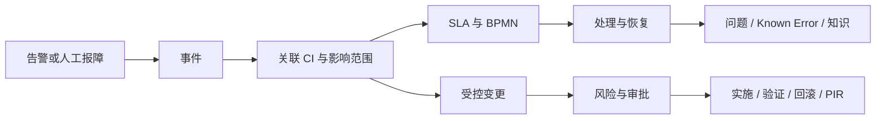
```mermaid
flowchart LR
    A[告警或人工报障] --> B[事件]
    B --> C[关联 CI 与影响范围]
    C --> D[SLA 与 BPMN]
    D --> E[处理与恢复]
    E --> F[问题 / Known Error / 知识]
    C --> G[受控变更]
    G --> H[风险与审批]
    H --> I[实施 / 验证 / 回滚 / PIR]
```

商业 MVP 聚焦四条可验收旅程：

1. 事件 → CI → SLA → 流程 → 恢复 → 审计。
2. 重复事件 → 问题 → Known Error → 知识发布 → RAG。
3. 变更 → 影响分析 → 风险 → 审批 → 实施/回滚 → PIR。
4. 服务目录 → 请求 → 审批 → 交付 → CI 创建或变更。

## 可靠执行架构

生产部署使用同一后端镜像的三个进程角色：`itsm-init` 只执行迁移和初始化，`ITSM_PROCESS_MODE=api` 只提供 HTTP/WebSocket，`ITSM_PROCESS_MODE=worker` 执行 command、SLA、升级和索引任务。`all` 仅用于开发环境，生产启动会拒绝该模式。

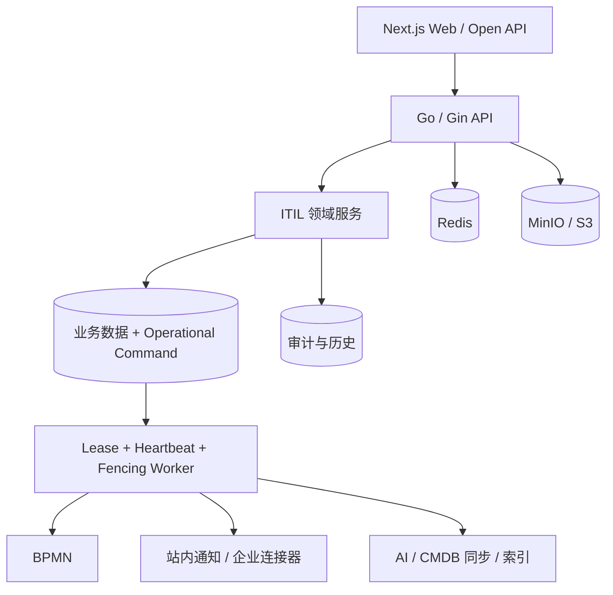
```mermaid
flowchart TB
    UI[Next.js Web / Open API] --> API[Go / Gin API]
    API --> DOMAIN[ITIL 领域服务]
    DOMAIN --> TX[(业务数据 + Operational Command)]
    TX --> WORKER[Lease + Heartbeat + Fencing Worker]
    WORKER --> BPMN[BPMN]
    WORKER --> NOTICE[站内通知 / 企业连接器]
    WORKER --> FUTURE[AI / CMDB 同步 / 索引]
    DOMAIN --> AUDIT[(审计与历史)]
    API --> REDIS[(Redis)]
    API --> OBJECT[(MinIO / S3)]
```

当前可靠执行基座已接管：

- 事件、变更的关键 BPMN 启动命令。
- 工单创建、SLA 违规和变更审批通知生产者。
- 站内通知及企业消息投递的幂等、重试、死信和投递审计基础。

设计与运维约束见 [Operational Command / Outbox](./docs/architecture/operational-command-outbox.md)。

## 插件化集成架构

后端通过连接器契约隔离外部系统差异。当前新增的告警源与向量存储扩展点使用配置驱动注册，业务服务只依赖标准接口，便于在不复制领域规则的前提下替换外部实现。

| 扩展点 | 代码位置 | 当前实现 | 配置与运行方式 |
|:---|:---|:---|:---|
| AlertSource | `itsm-backend/connector/alert/` | 通用 Webhook 告警源；通过字段映射将 Prometheus Alertmanager、PagerDuty 等外部告警 JSON 标准化 | `ALERT_SOURCE_CONFIG` 指向 YAML 配置；启用后由 `POST /api/v1/alerts/sources/:source/ingest` 接收请求 |
| VectorStore | `itsm-backend/connector/vector/` | Milvus、Qdrant、PGVector，以及内存关键词检索后备 | `VECTOR_STORE_CONFIG` 可传 YAML 文件路径或内联 YAML；`fallback: true` 时主存储不可用或检索失败可使用关键词后备 |

### 告警源接入

`AlertSource` 定义告警源元数据、载荷校验和标准化契约。YAML 可声明 source、启用状态、字段映射、payload 大小限制和 Webhook 签名参数；当前 Webhook 实现使用 HMAC-SHA256 验证签名，并从认证上下文获取租户，不接受请求自报租户。

仓库提供 Prometheus Alertmanager 配置示例：

```bash
cd itsm-backend
export ALERT_SOURCE_CONFIG=etc/alert-sources/prometheus-alertmanager.yaml
```

接入端点需要认证及 `alert:write` 权限。`:source` 必须与已启用 YAML 配置中的 `source` 一致；接口当前完成载荷校验、验签与标准化，不在 README 中承诺未接线的自动建单或外部回写能力。

### 向量存储与 RAG 迁移

`VectorStore` 将检索、写入、删除、健康检查与连接关闭统一为插件接口。可参考 `itsm-backend/etc/vector-store/config.yaml.example` 配置后端：

```bash
cd itsm-backend
cp etc/vector-store/config.yaml.example etc/vector-store/config.yaml
export VECTOR_STORE_CONFIG=etc/vector-store/config.yaml
```

配置也可以直接使用内联 YAML，并支持 `${ENV_VAR}` 展开。未配置时使用关键词存储；配置 Milvus、Qdrant 或 PGVector 且启用 `fallback` 后，查询失败会回退到关键词检索，写入同时维护主存储和关键词后备。

> 未配置时默认创建内存关键词后端，数据仅存于进程内存，重启丢失，不适合生产环境作为独立存储使用。

知识文章索引采用迁移期双写：`RAGService` 只生成一次 embedding，同时写入连接器 `VectorStore` 与旧版 `vectors` 表；删除文章时也清理两侧数据。这一策略用于迁移期间保持新旧检索路径同步，不代表两套存储已经可以脱离一致性监控独立运行。

## 产品界面

| 事件与问题 | 变更与 CMDB |
|:---:|:---:|
| 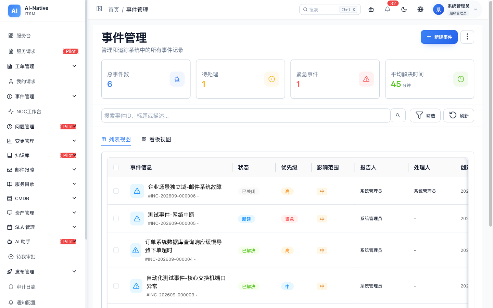 | 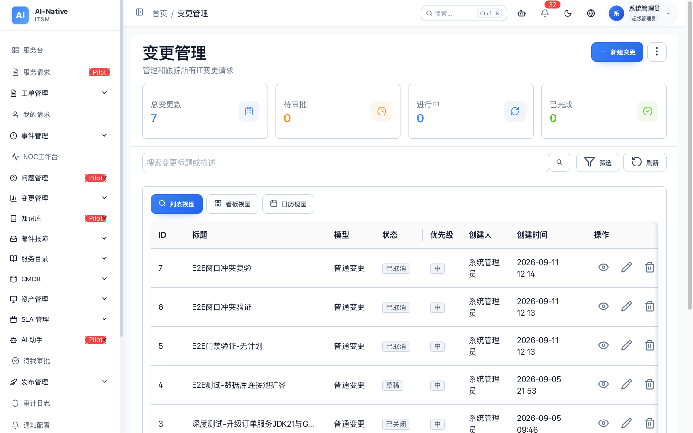 |
| 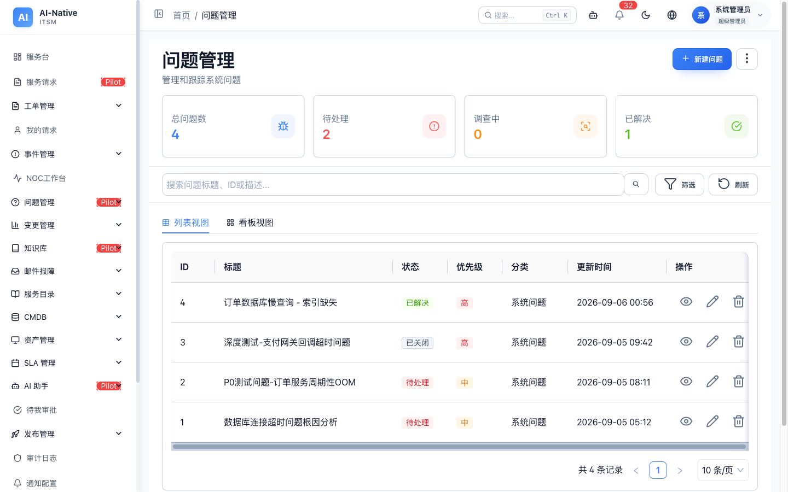 | 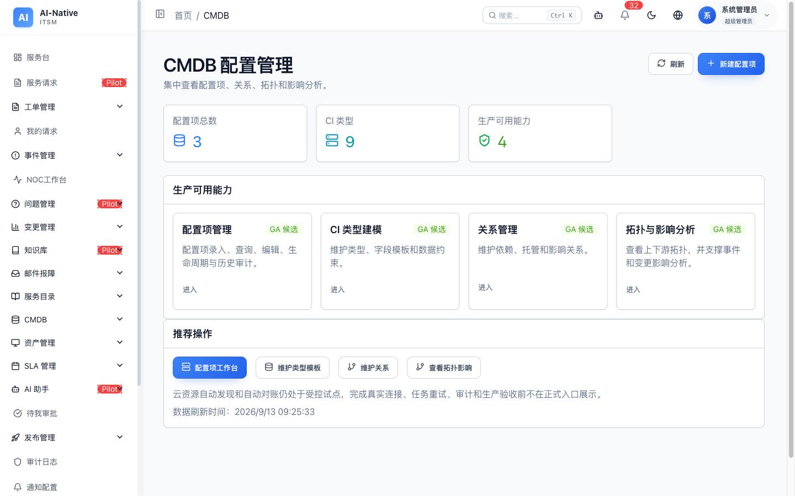 |

| 服务目录与知识 | 工作流与权限 |
|:---:|:---:|
| 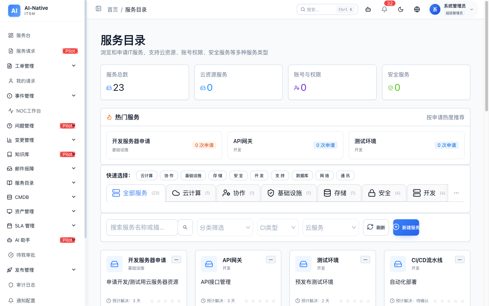 | 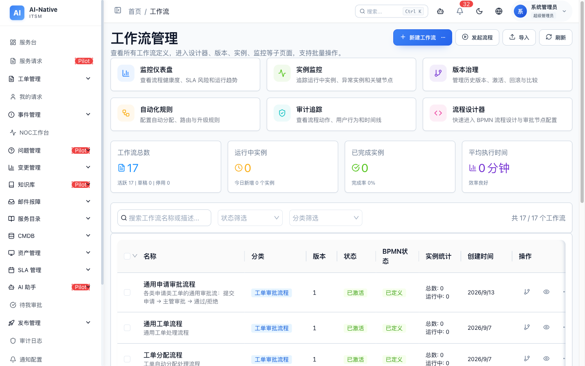 |
| 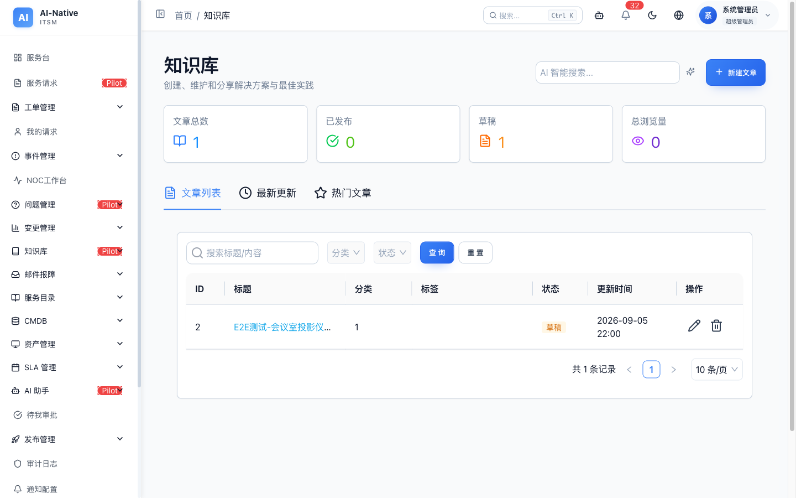 | 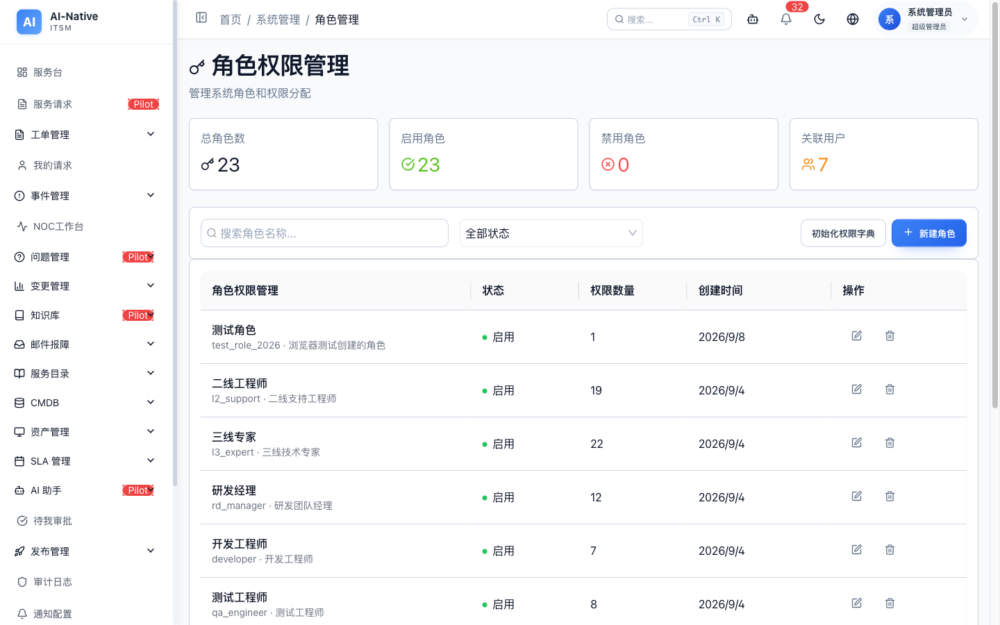 |

## 技术栈与仓库结构

| 层 | 技术 |
|:---|:---|
| 后端 | Go 1.25.13、Gin、Ent、PostgreSQL、Redis |
| 前端 | Next.js 15.5、React 19、TypeScript 6、Ant Design 6、Tailwind CSS |
| 工作流 | BPMN 2.0、流程定义/实例/任务/变量/历史 |
| AI/RAG | LLM Gateway、pgvector、OpenAI/兼容接口、Ollama 可选 |
| 交付 | Docker Compose、GHCR、GitHub Actions、Prometheus/Grafana 可选 |

```text
itsm/
├── itsm-backend/     # Go API、领域服务、Ent Schema、Worker
├── itsm-frontend/    # Next.js 管理端、服务台与用户门户
├── itsm-ai-service/  # AI/RAG 辅助服务
├── itsm-agent/       # Agent 扩展
├── itsm-skill/       # Skill 扩展
├── itsm-cli/         # CLI 入口
├── docs/             # 产品、架构、开发、部署、测试文档
├── scripts/          # 开发、生产、发布与诊断脚本
└── monitoring/       # Prometheus/Grafana 配置
```

后端是业务规则、权限、租户隔离、工作流执行和审计的事实来源；前端不复制生命周期规则。

## 开发与测试

```bash
# 后端
cd itsm-backend
GOTOOLCHAIN=auto go test ./...
GOTOOLCHAIN=auto go vet ./...

# 前端
cd ../itsm-frontend
npm install
npm run type-check
npm test

# 根目录工程契约
cd ..
make check-contracts
```

详细分层、测试策略和 E2E 用法见[本地开发命令](./docs/dev-commands-reference.md)和[测试指南](./docs/testing/README.md)。

## 生产部署

项目支持三种部署模式：

- `private`：私有化部署。
- `saas`：平台托管多个企业租户。
- `saas_msp`：平台与 MSP 协同服务多个客户组织。

生成生产配置后，先修改和核对所有凭据与域名，再部署：

```bash
make prod-init

# 编辑 .env.prod，配置真实密码、JWT、域名、TLS 和外部依赖
make prod-deploy
make prod-health
```

手工使用 Compose 时必须显式传入同一份环境文件：

```bash
docker compose --env-file .env.prod -f docker-compose.prod.yml up -d
```

上线前至少完成：

- TLS、强密码、SSO/组织同步方案和最小权限配置。
- 显式数据库迁移、备份恢复和版本回滚演练。
- 租户隔离、RBAC、审计、Webhook/回调验签验证。
- 容量、故障恢复、队列积压和死信重放测试。
- 对启用的 CMDB、AI、RAG、连接器逐项完成 readiness 验收。

不要把开发默认配置用于生产。完整操作见[部署优化报告](./docs/DEPLOYMENT_OPTIMIZATION.md)、[生产就绪计划](./docs/delivery/production-readiness-program.md)和[运维运行手册](./docs/runbooks/production-initialization.md)。

## 文档导航

| 文档 | 用途 |
|:---|:---|
| [文档中心](./docs/README.md) | 按角色和主题查找资料 |
| [开源产品能力说明](./docs/product/open-source-release-capability.md) | 角色、业务闭环、成熟度、限制与验收入口 |
| [商业能力契约](./docs/product/itsm-commercial-capability-contract.md) | 能力成熟度、商业 MVP 和非目标 |
| [商业化架构](./docs/architecture/commercial-ready-architecture.md) | 生产级总体架构 |
| [CMDB 商业 MVP](./docs/product/cmdb-commercial-mvp.md) | CMDB GA/Pilot 边界和验收门槛 |
| [Outbox 架构](./docs/architecture/operational-command-outbox.md) | 可靠异步执行规范 |
| [API 参考](./docs/api/API_REFERENCE.md) | HTTP 接口文档 |
| [本地开发命令](./docs/dev-commands-reference.md) | 开发命令、调试与故障排查 |
| [测试指南](./docs/testing/README.md) | 单元、集成、契约和 E2E 测试 |
| [Roadmap](./ROADMAP.md) | 当前迭代方向唯一事实源 |
| [升级指南](./UPGRADE.md) | v1.6.x → 最新：破坏性变更、环境变量、迁移与回滚 |

## 参与贡献

欢迎提交 Issue、文档和代码。开始前请阅读 [CONTRIBUTING.md](./CONTRIBUTING.md)。

### 快速贡献流程

```bash
# 1. Fork 并克隆仓库
git clone https://github.com/heidsoft/itsm.git
cd itsm

# 2. 创建功能分支
git checkout -b feature/your-feature

# 3. 安装开发环境
make dev-start-docker

# 4. 开发并测试
# 后端：cd itsm-backend && go test ./...
# 前端：cd itsm-frontend && npm test

# 5. 提交（使用 Conventional Commits）
git add .
git commit -m "feat: describe your change"

# 6. 推送并创建 PR
git push origin feature/your-feature
```

### 贡献方式

| 方式 | 说明 |
|:---|:---|
| 🐛 报告 Bug | 使用 [GitHub Issues](https://github.com/heidsoft/itsm/issues/new) |
| 💡 提出功能 | 在 [Discussions](https://github.com/heidsoft/itsm/discussions) 中讨论 |
| 📖 完善文档 | 提交文档改进 PR |
| 🔧 提交代码 | 通过 Pull Request 贡献代码 |
| 👀 代码审查 | 参与 PR 审查 |

### 贡献要求

- 遵循项目代码风格（ESLint + gofmt）
- 新功能需附带测试用例
- 提交信息使用 [Conventional Commits](https://www.conventionalcommits.org/) 格式
- PR 必须通过所有 CI 检查

详细规范见 [CONTRIBUTING.md](./CONTRIBUTING.md)。

- [查看贡献者](https://github.com/heidsoft/itsm/graphs/contributors)

## Star 趋势

[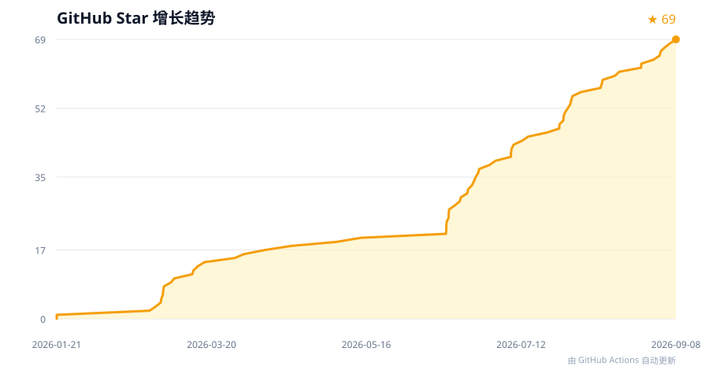](https://github.com/heidsoft/itsm/stargazers)

## License

本项目采用 [Apache License 2.0](./LICENSE)。允许商业使用、修改和分发；使用时请遵守许可证和 [NOTICE](./NOTICE) 要求。

<div align="center">

[GitHub](https://github.com/heidsoft/itsm) · [Issues](https://github.com/heidsoft/itsm/issues) · [Discussions](https://github.com/heidsoft/itsm/discussions)

如果这个项目对你有帮助，欢迎 Star、试用并反馈真实场景。

</div>
