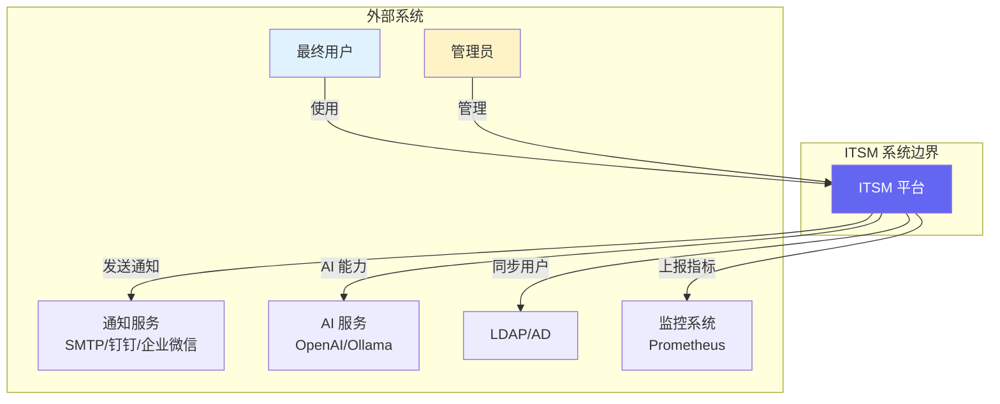
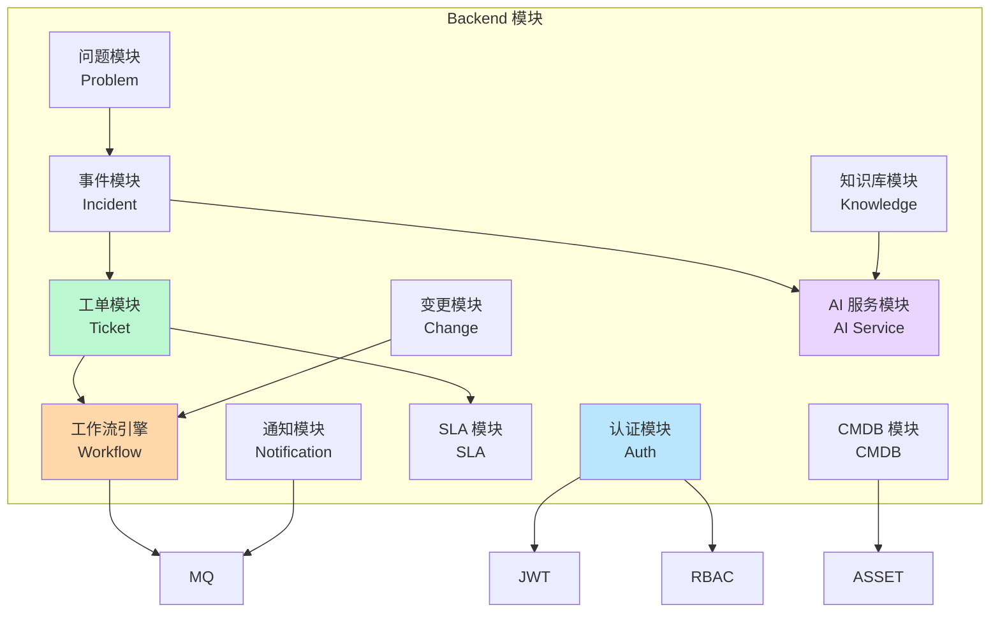
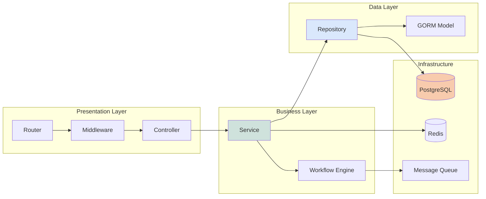

# 系统架构设计文档

**最后更新**: 2026-03-04
**版本**: v1.0
**架构师**: ITSM Team

---

## 📋 目录

- [架构原则](#架构原则)
- [C4 模型](#c4-模型)
- [技术选型](#技术选型)
- [前端架构](#前端架构)
- [后端架构](#后端架构)
- [数据库设计](#数据库设计)
- [模块划分](#模块划分)
- [扩展点](#扩展点)
- [安全架构](#安全架构)

---

## 架构原则

1. **高内聚低耦合**: 模块内部功能紧密相关，模块间依赖最小化
2. **可扩展性**: 水平扩展能力，无状态设计
3. **可靠性**: 容错机制，优雅降级
4. **高性能**: 缓存策略，数据库优化
5. **安全性**: 零信任网络，RBAC 权限控制
6. **可观测性**: 全面监控，结构化日志
7. **DevOps 友好**: 容器化，CI/CD 自动化

---

## C4 模型

### Level 1: System Context（系统上下文）



**系统边界说明**:

- **用户**: IT 服务最终用户、运维人员、管理员
- **ITSM 平台**: 核心业务系统
- **通知服务**: 邮件、钉钉、企业微信、短信
- **AI 服务**: OpenAI、Ollama（本地 LLM）
- **LDAP/AD**: 企业统一认证
- **Prometheus**: 监控数据收集

---

### Level 2: Container（容器/组件）

```mermaid
graph TB
    subgraph "ITSM 容器"
        FE[Next.js Frontend<br/>React + TypeScript<br/>端口: 3000]
        BE[Go Backend<br/>Gin Framework<br/>端口: 8080]
        PG[(PostgreSQL<br/>主数据库)]
        REDIS[(Redis<br/>缓存/会话)]
        MQ[消息队列<br/>RabbitMQ/NATS]
    end

    subgraph "外部系统"
        CDN[CDN]
        LB[Load Balancer]
    end

    CDN --> FE
    LB --> BE
    FE --> BE
    BE --> PG
    BE --> REDIS
    BE <-> MQ

    style FE fill:#60a5fa,color:#fff
    style BE fill:#34d399,color:#000
    style PG fill:#f472b6,color:#fff
    style REDIS fill:#a78bfa,color:#fff
    style MQ fill:#fbbf24,color:#000
```

**组件说明**:

| 组件 | 技术栈 | 端口 | 职责 |
|------|--------|------|------|
| **Frontend** | Next.js 15 + React 19 | 3000 | 用户界面，API 代理 |
| **Backend** | Go 1.25 + Gin | 8080 | 业务逻辑，REST API |
| **PostgreSQL** | PostgreSQL 15 | 5432 | 主数据库 |
| **Redis** | Redis 7 | 6379 | 缓存、会话、队列 |
| **消息队列** | RabbitMQ/NATS | - | 异步任务、事件通知 |

---

### Level 3: Component（组件/模块）



**模块职责**:

| 模块 | 包路径 | 核心职责 |
|------|--------|----------|
| Auth | `controller/auth.go` | 登录、注册、JWT 管理 |
| Ticket | `service/ticket_service.go` | 工单 CRUD、分配、升级 |
| Incident | `service/incident_service.go` | 事件响应、升级 |
| Problem | `service/problem_service.go` | 根因分析、已知错误 |
| Change | `service/change_service.go` | 变更请求、审批流 |
| Knowledge | `service/knowledge_service.go` | 知识文章、RAG |
| Workflow | `workflow/engine.go` | BPMN 流程引擎 |
| SLA | `service/sla_service.go` | SLA 计时、告警 |
| Notification | `service/notify_service.go` | 邮件、钉钉、企微 |
| CMDB | `cmdb/asset.go` | 配置项管理 |
| AI | `ai/service.go` | 智能分类、摘要 |

---

## 技术选型

### 后端技术栈

| 类别 | 技术 | 版本 | 选型理由 |
|------|------|------|----------|
| 语言 | Go | 1.25+ | 高性能、并发、部署简单 |
| 框架 | Gin | v1.9+ | 轻量、快速、路由简洁 |
| ORM | GORM | v1.25+ | 功能全面、迁移支持 |
| 验证 | validator | v10+ |  struct 标签验证 |
| 缓存 | Redis | 7+ | 高性能、丰富数据结构 |
| 队列 | NATS/RabbitMQ | - | 异步任务、事件驱动 |
| 日志 | slog | stdlib | 结构化日志、级别控制 |
| 配置 | Viper | v1.18+ | 多格式配置、热重载 |
| 监控 | prometheus/client | - | 指标暴露、Prometheus 集成 |
| 文档 | Swagger | v3 | API 自动生成文档 |
| 测试 | testing + testify | - | 标准测试框架 |
| CI/CD | GitHub Actions | - | 自动化构建、测试 |

### 前端技术栈

| 类别 | 技术 | 版本 | 选型理由 |
|------|------|------|----------|
| 框架 | Next.js | 15.5 | SSR/SSG、App Router、API Routes |
| UI 库 | Ant Design | 6.x | 企业级组件、丰富 |
| 样式 | Tailwind CSS | 4.x | 原子化、快速开发 |
| 状态管理 | Zustand | 5.x | 轻量、简洁 API |
| 数据获取 | TanStack Query | 5.x | 缓存、同步、轮询 |
| 表单 | React Hook Form | 7.x | 高性能、易用 |
| HTTP | Axios | latest | 拦截器、取消请求 |
| 图表 | Recharts / ECharts | - | 可视化报表 |
| 工作流 | BPMN.js | latest | 流程设计器 |
| 测试 | Jest + Testing Library | - | 单元/集成测试 |
| Lint | ESLint + Prettier | - | 代码质量 |

---

## 前端架构

### 目录结构

```
itsm-frontend/
├── src/
│   ├── app/                    # App Router 页面
│   │   ├── (auth)/             # 认证相关 (layout + page)
│   │   │   ├── login/
│   │   │   └── layout.tsx
│   │   ├── (dashboard)/        # 主应用布局
│   │   │   ├── layout.tsx
│   │   │   ├── page.tsx        # Dashboard 首页
│   │   │   ├── tickets/
│   │   │   ├── incidents/
│   │   │   ├── problems/
│   │   │   └── ...
│   │   └── api/                # API Routes (可选)
│   ├── components/             # 可复用组件
│   │   ├── common/             # 通用组件 (Button, Modal...)
│   │   ├── layout/             # 布局 (Header, Sidebar...)
│   │   ├── tickets/            # 工单相关组件
│   │   ├── bpmn/               # BPMN 工作流
│   │   └── charts/             # 图表组件
│   ├── lib/                    # 工具库
│   │   ├── api.ts              # API 客户端封装
│   │   ├── auth.ts             # 认证工具
│   │   ├── utils.ts            # 通用工具函数
│   │   └── constants.ts        # 常量定义
│   ├── hooks/                  # 自定义 Hooks
│   │   ├── useAuth.ts
│   │   ├── useTickets.ts
│   │   └── useWorkflow.ts
│   ├── stores/                 # Zustand 状态管理
│   │   ├── authStore.ts
│   │   ├── ticketStore.ts
│   │   └── uiStore.ts
│   ├── types/                  # TypeScript 类型
│   │   ├── ticket.ts
│   │   ├── user.ts
│   │   └── api.ts
│   └── middleware.ts           # 中间件
├── public/                     # 静态资源
├── tests/                      # 测试文件
├── .env.local                  # 环境变量
└── next.config.js              # Next.js 配置
```

### 状态管理

```typescript
// stores/authStore.ts - Zustand 示例
interface AuthState {
  user: User | null
  token: string | null
  isAuthenticated: boolean
  login: (credentials: LoginDTO) => Promise<void>
  logout: () => void
}

export const useAuthStore = create<AuthState>((set) => ({
  user: null,
  token: null,
  isAuthenticated: false,
  login: async (creds) => {
    const res = await api.login(creds)
    set({ user: res.user, token: res.token, isAuthenticated: true })
  },
  logout: () => set({ user: null, token: null, isAuthenticated: false }),
}))
```

### API 层

```typescript
// lib/api.ts - 统一 API 客户端
import axios from 'axios'

const api = axios.create({
  baseURL: process.env.NEXT_PUBLIC_API_URL,
  timeout: 30000,
})

// 请求拦截器（添加 Token）
api.interceptors.request.use((config) => {
  const token = useAuthStore.getState().token
  if (token) {
    config.headers.Authorization = `Bearer ${token}`
  }
  return config
})

// 响应拦截器（错误处理）
api.interceptors.response.use(
  (res) => res.data,
  (error) => {
    if (error.response?.status === 401) {
      // 跳转登录
    }
    return Promise.reject(error)
  }
)

export const ticketApi = {
  list: (params) => api.get('/api/v1/tickets', { params }),
  get: (id) => api.get(`/api/v1/tickets/${id}`),
  create: (data) => api.post('/api/v1/tickets', data),
  update: (id, data) => api.put(`/api/v1/tickets/${id}`, data),
  delete: (id) => api.delete(`/api/v1/tickets/${id}`),
}
```

---

## 后端架构

### 目录结构

```
itsm-backend/
├── cmd/
│   ├── main.go                 # 应用入口
│   ├── migrate/                # 数据库迁移命令
│   └── seed/                   # 初始数据
├── config/
│   ├── config.go               # 配置结构
│   ├── cors.go                 # CORS 配置
│   └── database.go             # 数据库连接
├── controller/                 # 控制器层 (HTTP handlers)
│   ├── auth_controller.go
│   ├── ticket_controller.go
│   └── ...
├── service/                    # 业务逻辑层
│   ├── ticket_service.go
│   ├── ticket_sla_service.go
│   ├── workflow_service.go
│   └── ...
├── repository/                 # 数据访问层
│   ├── ticket_repository.go
│   ├── user_repository.go
│   └── ...
├── model/                      # 数据模型 (GORM)
│   ├── ticket.go
│   ├── user.go
│   └── ...
├── dto/                        # 数据传输对象
│   ├── request/
│   │   ├── login_dto.go
│   │   ├── create_ticket_dto.go
│   │   └── ...
│   └── response/
│       ├── user_response.go
│       └── ...
├── middleware/                 # HTTP 中间件
│   ├── auth.go
│   ├── logging.go
│   ├── recovery.go
│   └── ...
├── workflow/                   # BPMN 工作流引擎
│   ├── engine.go
│   ├── bpmn/
│   └── ...
├── ai/                         # AI 服务
│   ├── service.go
│   └── rag/
├── internal/
│   ├── cache/                  # Redis 缓存
│   ├── queue/                  # 消息队列
│   └── validator/              # 自定义验证器
├── pkg/
│   ├── utils/                  # 工具函数
│   ├── logger/                 # 日志封装
│   └── errors/                 # 错误定义
├── docs/                       # API 文档 (Swagger)
├── tests/                      # 测试
├── migrations/                 # SQL 迁移文件
├── .env.example
├── go.mod
└── Dockerfile.backend
```

### 分层架构 (DDD 变体)



**调用流程**:

```
HTTP Request
  → Middleware (Auth, Logging, Recovery)
  → Controller (Validate DTO)
  → Service (Business Logic)
  → Repository (DB Query)
  → GORM → PostgreSQL
  ← Response (Wrap DTO)
```

---

## 数据库设计

### ER 图（核心实体）

```mermaid
erDiagram
    USERS ||--o{ TICKETS : "创建"
    USERS ||--o{ TICKETS : "分配"
    USERS ||--o{ INCIDENTS : "处理"
    USERS ||--o{ CHANGES : "审批"
    TENANTS ||--o{ USERS : "属于"
    TENANTS ||--o{ TICKETS : "拥有"
    TICKETS ||--o{ TICKET_COMMENTS : "有"
    TICKETS ||--|| SLA_POLICIES : "应用"
    INCIDENTS ||--o{ PROBLEMS : "关联"
    PROBLEMS ||--o{ KNOWN_ERRORS : "产生"
    CHANGES ||--o{ CHANGES_TASKS : "包含"
    ASSETS ||--o{ TICKETS : "关联"
    WORKFLOWS ||--o{ TICKETS : "执行"

    USERS {
        bigint id PK
        string email UK
        string password_hash
        string name
        string role
        bigint tenant_id FK
        datetime created_at
    }

    TENANTS {
        bigint id PK
        string name
        string plan
        datetime created_at
    }

    TICKETS {
        bigint id PK
        string ticket_number UK
        string title
        text description
        string status
        string priority
        bigint submitter_id FK
        bigint assignee_id FK
        bigint tenant_id FK
        bigint sla_policy_id FK
        datetime created_at
        datetime updated_at
        datetime resolved_at
    }

    TICKET_COMMENTS {
        bigint id PK
        text content
        bigint ticket_id FK
        bigint user_id FK
        datetime created_at
    }

    SLA_POLICIES {
        bigint id PK
        string name
        integer response_time
        integer resolution_time
        string priority
        bigint tenant_id FK
    }

    INCIDENTS {
        bigint id PK
        string title
        string impact
        string urgency
        string status
        bigint ticket_id FK UK
        datetime created_at
    }

    PROBLEMS {
        bigint id PK
        string root_cause
        text description
        string status
        bigint incident_id FK
    }

    CHANGES {
        bigint id PK
        string change_number UK
        string title
        string risk_level
        string status
        string approver_id FK
        datetime scheduled_start
        datetime scheduled_end
    }

    ASSETS {
        bigint id PK
        string asset_number UK
        string name
        string type
        string ip_address
        bigint tenant_id FK
    }

    WORKFLOWS {
        bigint id PK
        string name
        jsonb definition BPMN
        string module
    }
```

### 关键表设计

**tickets** 表:

```sql
CREATE TABLE tickets (
    id BIGSERIAL PRIMARY KEY,
    ticket_number VARCHAR(50) UNIQUE NOT NULL DEFAULT 'TKT-' || to_char(now(), 'YYYYMMDD') || '-' || lpad(nextval('ticket_seq')::text, 6, '0'),
    title VARCHAR(200) NOT NULL,
    description TEXT,
    status VARCHAR(20) NOT NULL DEFAULT 'open' CHECK (status IN ('open', 'in_progress', 'pending', 'resolved', 'closed', 'rejected')),
    priority VARCHAR(20) NOT NULL DEFAULT 'medium' CHECK (priority IN ('low', 'medium', 'high', 'critical')),
    category VARCHAR(100),
    submitter_id BIGINT REFERENCES users(id) ON DELETE SET NULL,
    assignee_id BIGINT REFERENCES users(id) ON DELETE SET NULL,
    tenant_id BIGINT NOT NULL REFERENCES tenants(id) ON DELETE CASCADE,
    sla_policy_id BIGINT REFERENCES sla_policies(id),
    due_date TIMESTAMP,
    resolved_at TIMESTAMP,
    closed_at TIMESTAMP,
    created_at TIMESTAMP NOT NULL DEFAULT NOW(),
    updated_at TIMESTAMP NOT NULL DEFAULT NOW(),

    INDEX idx_tickets_tenant_status (tenant_id, status),
    INDEX idx_tickets_assignee (assignee_id),
    INDEX idx_tickets_created (created_at DESC),
    INDEX idx_tickets_status (status)
);
```

**users** 表:

```sql
CREATE TABLE users (
    id BIGSERIAL PRIMARY KEY,
    email VARCHAR(255) UNIQUE NOT NULL,
    password_hash VARCHAR(255) NOT NULL,
    name VARCHAR(100) NOT NULL,
    role VARCHAR(50) NOT NULL DEFAULT 'user' CHECK (role IN ('admin', 'manager', 'agent', 'user')),
    avatar_url TEXT,
    department_id BIGINT REFERENCES departments(id),
    tenant_id BIGINT NOT NULL REFERENCES tenants(id) ON DELETE CASCADE,
    is_active BOOLEAN DEFAULT true,
    last_login_at TIMESTAMP,
    created_at TIMESTAMP NOT NULL DEFAULT NOW(),
    updated_at TIMESTAMP NOT NULL DEFAULT NOW()
);
```

---

## 模块划分

### 业务模块

| 模块 | 功能 | API 前缀 | 状态 |
|------|------|----------|------|
| **Auth** | 认证、授权、JWT 刷新 | `/api/v1/auth` | ✅ 完成 |
| **Users** | 用户管理、部门、团队 | `/api/v1/users` | ✅ 完成 |
| **Tickets** | 工单 CRUD、分配、转交 | `/api/v1/tickets` | ✅ 完成 |
| **Incidents** | 事件管理、升级 | `/api/v1/incidents` | ✅ 完成 |
| **Problems** | 问题管理、根因分析 | `/api/v1/problems` | ✅ 完成 |
| **Changes** | 变更管理、审批流 | `/api/v1/changes` | ✅ 完成 |
| **Knowledge** | 知识库、RAG | `/api/v1/knowledge` | ✅ 完成 |
| **CMDB** | 配置项、资产关系 | `/api/v1/cmdb` | ✅ 完成 |
| **SLA** | SLA 策略、计时、告警 | `/api/v1/sla` | ✅ 完成 |
| **Workflow** | BPMN 流程引擎 | `/api/v1/workflows` | ✅ 完成 |
| **Notification** | 通知、消息队列 | `/api/v1/notifications` | ✅ 完成 |
| **Reports** | 报表、仪表盘 | `/api/v1/reports` | 🔄 进行中 |
| **Settings** | 系统设置、自定义字段 | `/api/v1/settings` | ✅ 完成 |

---

## 扩展点

### 1. 插件系统

```go
// 插件接口定义
type Plugin interface {
    Name() string
    Version() string
    Initialize(config map[string]interface{}) error
    Execute(ctx context.Context, input interface{}) (interface{}, error)
    Shutdown() error
}

// 插件加载器
type PluginManager struct {
    plugins map[string]Plugin
}

func (pm *PluginManager) Load(path string) error {
    // 动态加载 .so 文件或脚本
}
```

### 2. Webhook 扩展

```go
// Webhook 事件
type WebhookEvent struct {
    Event     string                 `json:"event"`
    TenantID  uint                   `json:"tenant_id"`
    Payload   map[string]interface{} `json:"payload"`
    Timestamp time.Time              `json:"timestamp"`
}

// 发送 Webhook
func (h *WebhookService) Fire(event WebhookEvent) error {
    targets := h.getTargets(event.Event)
    for _, target := range targets {
        h.sendAsync(target.URL, event)
    }
    return nil
}
```

### 3. 自定义字段

```sql
-- 支持租户自定义字段
CREATE TABLE custom_fields (
    id BIGSERIAL PRIMARY KEY,
    tenant_id BIGINT NOT NULL,
    entity_type VARCHAR(50) NOT NULL,  -- 'ticket', 'incident', etc.
    field_name VARCHAR(100) NOT NULL,
    field_type VARCHAR(50),  -- 'text', 'number', 'select', 'date'
    is_required BOOLEAN DEFAULT false,
    options JSONB,  -- 枚举值
    UNIQUE(tenant_id, entity_type, field_name)
);

-- 字段值表
CREATE TABLE custom_field_values (
    id BIGSERIAL PRIMARY KEY,
    field_id BIGINT REFERENCES custom_fields(id),
    entity_id BIGINT NOT NULL,  -- ticket_id, etc.
    value TEXT,
    UNIQUE(field_id, entity_id)
);
```

### 4. 多租户隔离

```go
// 中间件：自动注入 tenant_id
func TenantMiddleware() gin.HandlerFunc {
    return func(c *gin.Context) {
        userID := c.GetInt("user_id")
        tenantID := getUserTenant(userID)
        c.Set("tenant_id", tenantID)
        c.Next()
    }
}

// Repository 中强制使用 tenant_id
func (r *TicketRepo) FindByID(id uint, tenantID uint) (*Ticket, error) {
    var t Ticket
    err := r.db.Where("id = ? AND tenant_id = ?", id, tenantID).First(&t).Error
    return &t, err
}
```

---

## 安全架构

### 认证机制

```go
// JWT 结构
type Claims struct {
    UserID   uint   `json:"user_id"`
    TenantID uint   `json:"tenant_id"`
    Role     string `json:"role"`
    Exp      int64  `json:"exp"`
}

// 中间件验证
func AuthMiddleware() gin.HandlerFunc {
    return func(c *gin.Context) {
        token := extractToken(c)
        claims := parseJWT(token)
        c.Set("user_id", claims.UserID)
        c.Set("tenant_id", claims.TenantID)
        c.Set("role", claims.Role)
        c.Next()
    }
}
```

### RBAC 权限控制

```go
// 权限定义
var Permissions = map[string][]string{
    "admin":    {"*"},                          // 所有权限
    "manager": {"ticket:read", "ticket:write", "incident:read"},
    "agent":   {"ticket:read", "ticket:write", "ticket:assign"},
    "user":    {"ticket:create", "ticket:read:own"},
}

// 权限检查中间件
func RequirePermission(perm string) gin.HandlerFunc {
    return func(c *gin.Context) {
        role := c.GetString("role")
        if !hasPermission(role, perm) {
            c.JSON(403, gin.H{"error": "权限不足"})
            c.Abort()
            return
        }
        c.Next()
    }
}
```

### 数据加密

- **传输层**: HTTPS (TLS 1.3)
- **存储**: 敏感字段（密码、API Key）使用 bcrypt 或 AES-GCM
- **数据库**: 字段级加密（可选）

---

**文档维护**: ITSM 架构组
**最后更新**: 2026-03-04
