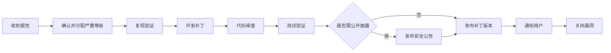
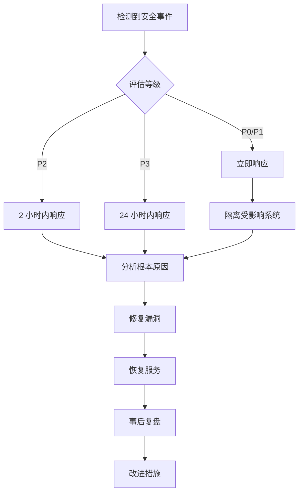

# 安全指南

**最后更新**: 2026-03-04
**版本**: v1.0
**适用范围**: 所有环境（开发、测试、生产）

---

## 📋 目录

- [安全原则](#安全原则)
- [认证机制](#认证机制)
- [授权策略](#授权策略)
- [数据加密](#数据加密)
- [依赖安全](#依赖安全)
- [网络安全](#网络安全)
- [漏洞披露流程](#漏洞披露流程)
- [安全审计](#安全审计)
- [合规性](#合规性)

---

## 安全原则

1. **最小权限原则**: 用户和系统仅获取完成工作所需的最小权限
2. **纵深防御**: 多层安全控制，单点失效不应导致系统完全暴露
3. **零信任**: 永不自动信任，始终验证
4. **安全左移**: 在开发早期阶段集成安全（DevSecOps）
5. **隐私保护**: 默认保护用户隐私，最小化数据收集

---

## 认证机制

### 1. JWT 认证

系统使用 **JWT (JSON Web Token)** 进行无状态认证。

**Token 结构**:

```go
type Claims struct {
    UserID    uint      `json:"user_id"`    // 用户 ID
    TenantID  uint      `json:"tenant_id"`  // 租户 ID
    Role      string    `json:"role"`       // 角色
    Email     string    `json:"email"`      // 邮箱
    Exp       int64     `json:"exp"`        // 过期时间戳
    Iss       string    `json:"iss"`        // 签发者
    Aud       string    `json:"aud"`        // 接收方
}
```

**配置** (`.env.prod`):

```env
JWT_SECRET=your-256-bit-secret-minimum-length-32-chars-change-this
JWT_EXPIRE=86400              # 24 小时（秒）
JWT_REFRESH_EXPIRE=604800    # 7 天
```

**生成密钥**:

```bash
openssl rand -base64 32
# 或
go run crypto/rand/main.go  # 自定义脚本
```

### 2. 密码策略

```go
// 密码复杂度要求
type Policy struct {
    MinLength       int  // 最小长度（默认 12）
    RequireUpper    bool // 需要大写字母
    RequireLower    bool // 需要小写字母
    RequireNumber   bool // 需要数字
    RequireSpecial  bool // 需要特殊字符 (@$!%*?&)
    PreventReuse    int  // 防止重复使用最近 N 次密码
    ExpireDays      int  // 密码有效期（天）
}
```

**密码哈希**: 使用 `bcrypt`（成本因子 12+）

```go
import "golang.org/x/crypto/bcrypt"

func HashPassword(password string) (string, error) {
    bytes, err := bcrypt.GenerateFromPassword([]byte(password), bcrypt.DefaultCost+2)
    return string(bytes), err
}

func CheckPassword(password, hash string) bool {
    err := bcrypt.CompareHashAndPassword([]byte(hash), []byte(password))
    return err == nil
}
```

---

## 授权策略

### 1. RBAC 权限模型

**角色定义**:

| 角色 | 权限范围 | 默认权限 |
|------|---------|----------|
| `admin` | 租户管理员 | `*` (所有权限) |
| `manager` | 部门经理 | ticket:read/write, incident:read, report:read |
| `agent` | 客服/运维 | ticket:read/write/assign, incident:read/write |
| `user` | 普通员工 | ticket:create, ticket:read:own |
| `readonly` | 只读用户 | ticket:read:own, knowledge:read |

**权限颗粒度**:

```
<resource>:<action>
示例:
- ticket:create     # 创建工单
- ticket:read       # 读取所有工单
- ticket:read:own   # 仅读取自己的工单
- ticket:update     # 更新所有工单
- ticket:delete     # 删除工单
- incident:approve  # 审批事件
- user:manage       # 管理用户
```

---

### 2. 权限检查实现

```go
// 权限验证中间件
func RequirePermission(perm string) gin.HandlerFunc {
    return func(c *gin.Context) {
        role := c.GetString("role")
        tenantID := c.GetUint("tenant_id")

        // 查询用户权限（缓存到 Redis）
        cacheKey := fmt.Sprintf("perm:%d:%s", tenantID, role)
        permsJSON, err := redis.Get(cacheKey).Bytes()
        if err != nil {
            perms := loadPermissionsFromDB(tenantID, role)
            redis.SetEx(cacheKey, 3600, json.Marshal(perms))
        }

        if !hasPermission(perms, perm) {
            c.JSON(403, gin.H{
                "code":    2101,
                "message": "permission_denied",
                "data":    nil,
            })
            c.Abort()
            return
        }
        c.Next()
    }
}

// 路由使用示例
router.GET("/api/v1/tickets", authMiddleware, RequirePermission("ticket:read"), ticketController.List)
router.POST("/api/v1/tickets", authMiddleware, RequirePermission("ticket:create"), ticketController.Create)
```

---

### 3. 数据隔离（多租户）

**强制租户隔离**:

```go
// 中间件自动注入 tenant_id
func TenantMiddleware() gin.HandlerFunc {
    return func(c *gin.Context) {
        userID := c.GetInt("user_id")
        tenantID := getUserTenantID(userID)
        c.Set("tenant_id", tenantID)
        c.Next()
    }
}

// Repository 层自动添加 tenant_id 条件
func (r *TicketRepo) FindByID(id uint, tenantID uint) (*Ticket, error) {
    var t Ticket
    err := r.db.Where("id = ? AND tenant_id = ?", id, tenantID).First(&t).Error
    return &t, err
}

// 使用 GORM 全局 Scope
func (Ticket) ScopeTenant(tenantID uint) func(*gorm.DB) *gorm.DB {
    return func(db *gorm.DB) *gorm.DB {
        return db.Where("tenant_id = ?", tenantID)
    }
}

// 自动应用
db.Scopes(Ticket.ScopeTenant(tenantID)).Find(&tickets)
```

---

## 数据加密

### 1. 传输层加密 (TLS)

**生产环境强制 HTTPS**:

```nginx
# Nginx 配置
server {
    listen 443 ssl http2;
    server_name itsm.yourdomain.com;

    ssl_certificate /etc/letsencrypt/live/itsm.yourdomain.com/fullchain.pem;
    ssl_certificate_key /etc/letsencrypt/live/itsm.yourdomain.com/privkey.pem;

    ssl_protocols TLSv1.2 TLSv1.3;
    ssl_ciphers ECDHE-RSA-AES256-GCM-SHA512:DHE-RSA-AES256-GCM-SHA512;
    ssl_prefer_server_ciphers off;

    # HSTS
    add_header Strict-Transport-Security "max-age=31536000; includeSubDomains" always;

    # 其他配置...
}
```

**HTTP → HTTPS 强制跳转**:

```nginx
server {
    listen 80;
    server_name itsm.yourdomain.com;
    return 301 https://$server_name$request_uri;
}
```

---

### 2. 静态数据加密

#### 敏感字段加密

```go
import "crypto/aes"

type EncryptedString struct {
    Data     []byte // 加密数据
    IV       []byte // 初始化向量
    Alg      string // 算法: aes-gcm
    Version  int    // 版本号，支持算法迁移
}

// 加密
func Encrypt(plaintext string, key []byte) (*EncryptedString, error) {
    block, _ := aes.NewCipher(key)
    gcm, _ := cipher.NewGCM(block)
    nonce := make([]byte, gcm.NonceSize())
    rand.Read(nonce)

    ciphertext := gcm.Seal(nil, nonce, []byte(plaintext), nil)
    return &EncryptedString{
        Data:    ciphertext,
        IV:      nonce,
        Alg:     "aes-gcm",
        Version: 1,
    }, nil
}

// 解密
func (es *EncryptedString) Decrypt(key []byte) (string, error) {
    block, _ := aes.NewCipher(key)
    gcm, _ := cipher.NewGCM(block)
    plaintext, _ := gcm.Open(nil, es.IV, es.Data, nil)
    return string(plaintext), nil
}
```

**适用字段**:
- API Keys（第三方集成）
- OAuth tokens
- 用户敏感信息（可选，如身份证号）

#### 数据库透明加密（TDE）

PostgreSQL 使用 `pgcrypto`:

```sql
-- 安装扩展
CREATE EXTENSION IF NOT EXISTS pgcrypto;

-- 加密存储
INSERT INTO api_keys (key_name, key_value_encrypted)
VALUES ('stripe', pgp_sym_encrypt('sk_live_xxx', 'encryption_key'));

-- 解密查询
SELECT key_name, pgp_sym_decrypt(key_value_encrypted, 'encryption_key')
FROM api_keys;
```

---

### 3. 密钥管理

**使用 HashiCorp Vault 或 AWS Secrets Manager**:

```go
import "github.com/hashicorp/vault/api"

client, _ := api.NewClient(&api.Config{Address: "https://vault:8200"})
client.SetToken(os.Getenv("VAULT_TOKEN"))

// 读取密钥
secret, _ := client.KVv2("secret").Get(context.Background(), "itsm/jwt")
jwtSecret := secret.Data["jwt_secret"].(string)
```

**本地开发**: 使用 `.env`（不要提交到 Git）

```env
# .env.local
JWT_SECRET=dev-secret-only-for-local
DB_PASSWORD=dev123
REDIS_PASSWORD=dev123
```

---

## 依赖安全

### 1. 依赖扫描

```bash
# 使用 Trivy 扫描容器镜像
trivy image itsm-backend:latest

# 扫描 Go 依赖
trivy fs --security-checks vuln ./itsm-backend

# 使用 gosec 静态扫描
gosec ./...

# 使用 npm audit（前端）
cd itsm-frontend && npm audit
```

---

### 2. 持续监测（GitHub Dependabot）

`.github/dependabot.yml`:

```yaml
version: 2
updates:
  - package-ecosystem: "gomod"
    directory: "/itsm-backend"
    schedule:
      interval: "weekly"
      day: "monday"
    open-pull-requests-limit: 10
    reviewers:
      - "backend-team"

  - package-ecosystem: "npm"
    directory: "/itsm-frontend"
    schedule:
      interval: "weekly"
    open-pull-requests-limit: 10
    reviewers:
      - "frontend-team"
```

---

### 3. CVE 监控

订阅漏洞通知:
- [CVE](https://cve.mitre.org/)
- [NVD](https://nvd.nist.gov/)
- GitHub Security Advisories

使用自动化工具:
```bash
# 每周运行依赖扫描
0 3 * * 1 cd /path/to/itsm && ./scripts/security-scan.sh >> /var/log/itsm-security.log 2>&1
```

---

## 网络安全

### 1. 防火墙规则

```bash
# iptables (Linux)
sudo iptables -A INPUT -p tcp --dport 22 -j ACCEPT   # SSH
sudo iptables -A INPUT -p tcp --dport 80 -j ACCEPT   # HTTP
sudo iptables -A INPUT -p tcp --dport 443 -j ACCEPT  # HTTPS
sudo iptables -A INPUT -m state --state ESTABLISHED,RELATED -j ACCEPT
sudo iptables -P INPUT DROP

# 保存规则
sudo netfilter-persistent save
```

---

### 2. DDoS 防护

- **Cloudflare** (推荐): 免费 CDN + WAF + DDoS 防护
- **AWS Shield**: 适用于 AWS 部署
- **阿里云 DDoS 高防**: 国内推荐

配置速率限制:

```nginx
# Nginx 限流
limit_req_zone $binary_remote_addr zone=api:10m rate=10r/s;

location /api/ {
    limit_req zone=api burst=20 nodelay;
    proxy_pass http://backend:8090;
}
```

---

### 3. API 安全

**速率限制** (使用 `gin-contrib/limiter`):

```go
import "github.com/ulule/limiter/v3"

func RateLimitMiddleware() gin.HandlerFunc {
    // 每 IP 100 请求/分钟
    store := store.NewMemory()
    r := limiter.New(store, 100, time.Minute)

    return func(c *gin.Context) {
        h := c.ClientIP()
        ctx := c.Request.Context()

        if limitContext, err := r.Peek(ctx, h); err == nil && limitContext.Reached {
            c.JSON(429, gin.H{"error": "rate limit exceeded"})
            c.Abort()
            return
        }

        if _, err := r.Increment(ctx, h); err != nil {
            c.JSON(500, gin.H{"error": "rate limit error"})
            c.Abort()
            return
        }
        c.Next()
    }
}
```

---

### 4. CORS 配置

```go
import "github.com/gin-contrib/cors"

config := cors.DefaultConfig()
config.AllowOrigins = []string{
    "https://itsm.yourdomain.com",
    "https://app.yourdomain.com",
}
config.AllowMethods = []string{"GET", "POST", "PUT", "DELETE", "OPTIONS"}
config.AllowHeaders = []string{"Authorization", "Content-Type"}
config.ExposeHeaders = []string{"Content-Length"}
config.AllowCredentials = true
config.MaxAge = 12 * time.Hour

router.Use(cors.New(config))
```

---

## 漏洞披露流程

### 1. 安全漏洞报告

**请通过邮件提交**: security@heidsoft.com

**加密邮件（可选）**: 使用团队 PGP 公钥（[下载](./SECURITY_PGP_PUBLIC.asc)）

**报告内容**:

- 漏洞标题
- 受影响版本
- 详细描述（复现步骤、PoC 截图）
- 影响评估（CVSS 分数）
- 修复建议（如有）

---

### 2. 响应时间承诺

| 严重程度 | 首次响应 | 修复时间 |
|---------|---------|---------|
| Critical | < 4 小时 | < 72 小时 |
| High     | < 24 小时 | < 7 天 |
| Medium   | < 5 天 | < 30 天 |
| Low      | < 30 天 | 计划版本 |

---

### 3. 漏洞修复流程



---

### 4. 漏洞奖励（可选）

对于严重漏洞，可提供奖励:

| 等级 | 奖励 |
|------|------|
| Critical | $1000 - $5000 |
| High | $500 - $1000 |
| Medium | $100 - $500 |
| Low | 致谢名单 |

---

## 安全审计

### 1. 审计日志

**记录所有关键操作**:

```go
type AuditLog struct {
    ID        uint      `json:"id"`
    UserID    uint      `json:"user_id"`
    TenantID  uint      `json:"tenant_id"`
    Action    string    `json:"action"`    // login, logout, create, update, delete
    Resource  string    `json:"resource"`  // ticket, user, etc.
    ResourceID uint     `json:"resource_id"`
    OldValue JSON      `json:"old_value"` // JSON 之前的值
    NewValue  JSON      `json:"new_value"` // JSON 之后的值
    IP        string    `json:"ip"`
    UserAgent string    `json:"user_agent"`
    CreatedAt time.Time `json:"created_at"`
}
```

**审计中间件**:

```go
func AuditLogger() gin.HandlerFunc {
    return func(c *gin.Context) {
        // 记录请求前数据
        c.Set("audit_start_time", time.Now())
        c.Next()

        // 记录操作
        if userID, exists := c.Get("user_id"); exists {
            log := AuditLog{
                UserID:    userID.(uint),
                TenantID:  c.GetUint("tenant_id"),
                Action:    c.Request.Method,
                Resource:  c.FullPath(),
                IP:        c.ClientIP(),
                UserAgent: c.Request.UserAgent(),
                CreatedAt: time.Now(),
            }
            auditRepo.Create(&log)
        }
    }
}
```

---

### 2. 定期扫描

**安全扫描计划**:

| 扫描项 | 频率 | 工具 |
|-------|------|------|
| 依赖漏洞 | 每日 | Trivy, Dependabot |
| 代码安全 | PR 时 | CodeQL, gosec |
| 容器镜像 | 每次构建 | Trivy, Grype |
| 基础设施 | 每周 | OpenSCAP |
| 渗透测试 | 每月/季度 | 专业团队 |

---

### 3. 合规性检查

**GDPR 合规**:

- [ ] 用户数据加密存储
- [ ] 用户数据可导出（Data Portability）
- [ ] 用户数据可删除（Right to be Forgotten）
- [ ] 隐私政策明确
- [ ] Cookie 同意管理

**等保 2.0（中国）**:

- [ ] 身份鉴别（双因素认证）
- [ ] 访问控制（RBAC）
- [ ] 安全审计（日志留存 6 个月+）
- [ ] 数据完整性（防篡改）
- [ ] 通信保密性（TLS 1.2+）

---

## 安全事件响应

### 事件分类

| 等级 | 描述 | 示例 |
|------|------|------|
| P0 | 严重 | 数据泄露、 ransomware、服务完全不可用 |
| P1 | 高 | 未授权访问、大规模 DDoS |
| P2 | 中 | 单一账户被入侵、XSS/CSRF |
| P3 | 低 | 配置错误、信息泄露 |

---

### 响应流程



---

**文档维护**: ITSM 安全团队
**最后更新**: 2026-03-04
