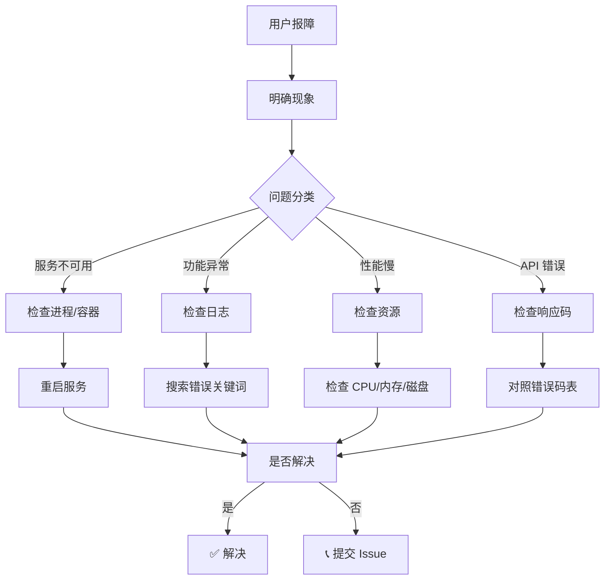

# 故障排除指南

**最后更新**: 2026-03-04
**版本**: v1.0
**适用场景**: 开发、测试、生产环境快速排错

---

## 📋 目录

- [快速诊断流程](#快速诊断流程)
- [常见问题分类](#常见问题分类)
  - [Docker 问题](#docker-问题)
  - [数据库问题](#数据库问题)
  - [认证授权问题](#认证授权问题)
  - [API 调用错误](#api-调用错误)
  - [性能问题](#性能问题)
  - [前端问题](#前端问题)
  - [文件上传问题](#文件上传问题)
  - [AI 服务问题](#ai-服务问题)
- [错误码速查](#错误码速查)
- [日志诊断步骤](#日志诊断步骤)
- [收集支持信息](#收集支持信息)

---

## 快速诊断流程



**第一步：确定问题范围**

- 影响**单个用户**还是**所有用户**？
- 出错的**具体操作**是什么？
- **首次出现**还是**反复出现**？
- 是否与**最近改动**相关？

---

## 常见问题分类

### Docker 问题

#### 问题 1: 容器无法启动

**错误**: `docker compose up` 时容器立即退出

**排查步骤**:

```bash
# 1. 查看容器状态
docker ps -a | grep itsm

# 2. 查看退出日志
docker logs <container_id> --tail 50

# 3. 常见原因
# - 端口冲突: lsof -i :8090
# - 环境变量缺失: docker compose config
# - 镜像损坏: docker images | grep itsm
```

**解决**:

```bash
# 删除并重建
docker compose down -v
docker compose up --build -d

# 查看详细错误
docker compose logs -f backend
```

---

#### 问题 2: 容器间无法通信

**现象**: 后端日志显示 `dial tcp: lookup postgres: no such host`

**原因**: Docker 网络配置问题

**解决**:

```bash
# 确认服务名（docker-compose.yml 中的 service name）
docker compose exec backend cat /etc/hosts
# 应能看到 postgres、redis 等主机名

# 检查网络
docker network ls
docker network inspect itsm_default

# 重启网络
docker compose down
docker network rm itsm_default
docker compose up -d
```

---

#### 问题 3: 数据持久化丢失

**现象**: 重启容器后数据清零

**原因**: 未正确挂载 volume

**解决**:

检查 `docker-compose.prod.yml`:

```yaml
volumes:
  - postgres_data:/var/lib/postgresql/data  # ✅ 正确
  # - ./data:/var/lib/postgresql/data      # ✅ 也可以
  # - /tmp/data:/var/lib/postgresql/data   # ❌ /tmp 可能被清空
```

---

### 数据库问题

#### 问题 1: 连接超时

**错误**: `pq: dial tcp 127.0.0.1:5432: connect: connection refused`

**排查**:

```bash
# 1. 检查 PostgreSQL 是否运行
docker ps | grep postgres

# 2. 检查端口
docker exec itsm-postgres netstat -tlnp | grep 5432

# 3. 测试连接
docker exec itsm-postgres pg_isready -U itsm
# 或
psql -h localhost -U itsm -d itsm_prod
```

**解决**:

```bash
# 启动服务
docker compose start postgres

# 如果容器不存在
docker compose up -d postgres

# 等待就绪（可能需要 10-30 秒）
sleep 10
```

---

#### 问题 2: 权限错误

**错误**: `password authentication failed for user "itsm"`

**原因**: 密码不匹配

**解决**:

```bash
# 1. 检查 .env.prod 中的 DB_PASSWORD
cat .env.prod | grep DB_PASSWORD

# 2. 重置密码（如果丢失）
docker exec -it itsm-postgres psql -U postgres -c "ALTER USER itsm PASSWORD 'newpassword';"

# 3. 更新 .env.prod
# 4. 重启服务
docker compose restart backend
```

---

#### 问题 3: 数据库死锁

**错误**: `deadlock detected`

**排查**:

```sql
-- 查看锁等待
SELECT
    blocked_locks.pid AS blocked_pid,
    blocked_activity.usename AS blocked_user,
    blocking_locks.pid AS blocking_pid,
    blocking_activity.usename AS blocking_user,
    blocked_activity.query AS blocked_statement,
    blocking_activity.query AS current_statement_in_blocking_process
FROM pg_catalog.pg_locks blocked_locks
JOIN pg_catalog.pg_stat_activity blocked_activity ON blocked_locks.pid = blocked_activity.pid
JOIN pg_catalog.pg_locks blocking_locks ON blocking_locks.locktype = blocked_locks.locktype
JOIN pg_catalog.pg_stat_activity blocking_activity ON blocking_locks.pid = blocking_activity.pid
WHERE NOT blocked_locks.granted;
```

**解决**:

```sql
-- 杀死阻塞进程（谨慎使用）
SELECT pg_terminate_backend(<blocking_pid>);

-- 优化事务（减少事务持有锁的时间）
BEGIN;
-- 业务操作
COMMIT;  -- 及时提交
```

---

#### 问题 4: 磁盘空间不足

**错误**: `no space left on device`

**解决**:

```bash
# 1. 清理 Docker
docker system prune -a --volumes

# 2. 查看大文件
du -sh /var/lib/docker/containers/* | sort -rh | head -10

# 3. 清理容器日志
truncate -s 0 /var/lib/docker/containers/*/*-json.log

# 4. 清理数据库日志
docker exec itsm-postgres psql -U itsm -c "VACUUM FULL;"

# 5. 增加磁盘空间（长期方案）
```

---

### 认证授权问题

#### 问题 1: 登录失败

**错误**: `{"code":2001,"message":"invalid_credentials"}`

**排查**:

```bash
# 1. 确认用户是否存在
docker exec itsm-postgres psql -U itsm -d itsm_prod -c "SELECT id,email FROM users WHERE email='user@example.com';"

# 2. 重置密码
docker exec itsm-backend go run cmd/reset_password/main.go --email user@example.com

# 3. 检查 JWT 配置
cat .env.prod | grep JWT_SECRET
# 应设置较长的随机字符串（>32 字符）
```

---

#### 问题 2: Token 过期

**错误**: `{"code":2002,"message":"token_expired"}`

**解决**:

```bash
# 前端应自动刷新 Token
# 手动刷新:
curl -X POST http://localhost:8090/api/v1/auth/refresh \
  -H "Authorization: Bearer <refresh_token>"

# 刷新后重新登录
```

**预防**:
- 前端在收到 401 时自动刷新 Token
- Token 有效期设置合理（建议 24 小时）
- Refresh Token 有效期更长（如 7 天）

---

#### 问题 3: 权限不足

**错误**: `{"code":2101,"message":"permission_denied"}`

**排查**:

```bash
# 1. 查看用户角色
docker exec itsm-backend go run cmd/get_user/main.go --id 1

# 2. 检查角色权限
docker exec itsm-backend go run cmd/check_permission/main.go --role agent --perm ticket:write

# 3. 后端日志查看拒绝原因
docker logs itsm-backend | grep permission_denied
```

**解决**:

```sql
-- 为用户分配更高角色
UPDATE users SET role='manager' WHERE id=1;
-- 或添加角色权限
INSERT INTO role_permissions (role, permission) VALUES ('agent', 'ticket:assign');
```

---

### API 调用错误

#### 问题 1: CORS 错误

**浏览器错误**: `Access to fetch at ... has been blocked by CORS policy`

**排查**:

```bash
# 1. 检查响应头
curl -I http://localhost:8090/api/v1/tickets

# 应包含:
# Access-Control-Allow-Origin: http://localhost:3000
# Access-Control-Allow-Credentials: true
```

**解决**:

确认 `config/cors.go` 配置正确:

```go
cors.Config{
    AllowOrigins:     []string{"http://localhost:3000", "https://itsm.yourdomain.com"},
    AllowMethods:     []string{"GET", "POST", "PUT", "DELETE", "OPTIONS"},
    AllowHeaders:     []string{"Authorization", "Content-Type"},
    ExposeHeaders:    []string{"Content-Length"},
    AllowCredentials: true,
    MaxAge:           12 * time.Hour,
}
```

---

#### 问题 2: 413 Payload Too Large

**错误**: 上传大文件时失败

**解决**:

```go
// 后端设置 BodyLimit
router.MaxMultipartMemory = 10 << 20  // 10 MB
// 或
router.MaxMultipartMemory = 100 << 20 // 100 MB

// Nginx 设置（如有）
client_max_body_size 100M;
```

---

#### 问题 3: 504 Gateway Timeout

**错误**: 请求超时

**排查**:

```bash
# 1. 检查后端响应时间
curl -o /dev/null -s -w "Total: %{time_total}s\n" http://localhost:8090/api/v1/tickets

# 2. 检查数据库慢查询
docker exec itsm-postgres psql -U itsm -d itsm_prod -c "SELECT query, mean_exec_time FROM pg_stat_statements ORDER BY mean_exec_time DESC LIMIT 10;"

# 3. 检查资源使用
docker stats itsm-backend itsm-postgres
```

**解决**:

- 优化慢查询（添加索引）
- 增加超时时间（Nginx、Docker Componse）
- 增加后端处理能力（水平扩展）

---

### 性能问题

#### 问题 1: CPU 使用率高

**排查**:

```bash
# 1. 查看容器 CPU
docker stats

# 2. 进入容器查看进程
docker exec itsm-backend top -b -n 1

# 3. 查看 Go 协程数
docker exec itsm-backend wc -l /proc/$(pidof itsm-backend)/status | grep Threads
```

**解决**:

```go
// 1. 限制 Goroutine 数（如有必要）
// 2. 优化循环和算法
// 3. 添加缓存减少重复计算
// 4. 使用连接池（数据库、Redis）
// 5. 考虑分片/批量操作
```

---

#### 问题 2: 内存泄漏

**排查**:

```bash
# 1. 查看内存变化（持续监控）
watch -n 5 'docker stats itsm-backend --format "table {{.Name}}\t{{.CPUPerc}}\t{{.MemUsage}}"'

# 2. 进入容器查看
docker exec itsm-backend free -h

# 3. 开启 pprof 监控
# 在代码中添加: import _ "net/http/pprof"
# 访问: http://localhost:8090/debug/pprof/heap
# 下载并分析: go tool pprof http://localhost:8090/debug/pprof/heap
```

**解决**:

- 使用 `pprof` 定位内存增长位置
- 检查未关闭的资源（文件、连接）
- 避免全局变量存储大数据
- 使用 `runtime.GC()` 调试（生产环境谨慎）

---

#### 问题 3: 数据库查询慢

**排查**:

```sql
-- 1. 启用 pg_stat_statements
CREATE EXTENSION IF NOT EXISTS pg_stat_statements;

-- 2. 查看慢查询（平均时间 > 100ms）
SELECT
    query,
    calls,
    mean_exec_time,
    rows,
    (mean_exec_time * calls) / 1000 as total_time_ms
FROM pg_stat_statements
WHERE mean_exec_time > 100
ORDER BY mean_exec_time DESC
LIMIT 10;

-- 3. 分析单个查询
EXPLAIN (ANALYZE, BUFFERS)
SELECT * FROM tickets WHERE tenant_id = 1 AND status = 'open';
```

**解决**:

```sql
-- 1. 创建索引
CREATE INDEX idx_tickets_tenant_status ON tickets(tenant_id, status);

-- 2. 清理死行
VACUUM ANALYZE tickets;

-- 3. 调整统计信息
ANALYZE tickets;
```

---

### 前端问题

#### 问题 1: 页面白屏

**排查**:

```bash
# 1. 打开浏览器 DevTools (F12)
# 2. Console 查看错误
# 3. Network 查看资源加载失败

# 常见错误:
# - Uncaught ReferenceError
# - Failed to load resource: net::ERR_CONNECTION_REFUSED
# - Minimized error from devtools
```

**解决**:

```bash
# 1. 清理缓存
npm run clean
rm -rf .next
npm install

# 2. 重新构建
npm run build
npm start

# 3. 检查环境变量
cat .env.local
# NEXT_PUBLIC_API_URL 应正确指向后端
```

---

#### 问题 2: 静态资源 404

**原因**: Next.js 构建产物问题或 Nginx 配置

**解决**:

```nginx
# Nginx 配置 (生产)
location /_next/static/ {
    alias /app/.next/static/;
    expires 1y;
    add_header Cache-Control "public, immutable";
}

location / {
    proxy_pass http://frontend:3000;
    proxy_http_version 1.1;
    proxy_set_header Upgrade $http_upgrade;
    proxy_set_header Connection "upgrade";
    proxy_set_header Host $host;
    proxy_cache_bypass $http_upgrade;
}
```

---

#### 问题 3: Hydration 错误

**错误**: `Hydration failed because the initial UI does not match`

**原因**: 服务端渲染与客户端不匹配

**解决**:

```tsx
// 1. 使用 useEffect 只在客户端执行
useEffect(() => {
    const value = window.localStorage.getItem('theme');
    setTheme(value);
}, []);

// 2. 使用 dynamic 引入不兼容的组件
const Component = dynamic(() => import('../components/HeavyComponent'), {
    ssr: false,  // ❌ 关闭 SSR
});

// 3. 检查时间/随机数差异
// ❌ bad: const [time, setTime] = useState(new Date());
// ✅ good: const [time, setTime] = useState<Date | null>(null);
// useEffect(() => setTime(new Date()), []);
```

---

### 文件上传问题

#### 问题 1: 上传失败

**错误**: `413 Request Entity Too Large` 或 `上传文件超过限制`

**排查**:

```bash
# 1. 检查后端配置
docker exec itsm-backend cat .env | grep MAX_UPLOAD_SIZE

# 2. 检查 Nginx（如有）
docker exec nginx cat /etc/nginx/nginx.conf | grep client_max_body_size
```

**解决**:

```go
// 后端设置
router.MaxMultipartMemory = 100 << 20  // 100 MB

// .env 配置
MAX_UPLOAD_SIZE=104857600  // 100 MB

// Nginx 配置（如果有）
client_max_body_size 100M;
```

---

#### 问题 2: 存储空间不足

**现象**: 上传后文件损坏或为空

**解决**:

```bash
# 1. 检查磁盘空间
df -h /app/uploads

# 2. 清理旧文件
find /app/uploads -type f -mtime +30 -delete

# 3. 扩展存储（扩容 Volume）
```

---

### AI 服务问题

#### 问题 1: OpenAI API 调用失败

**错误**: `openai: error: context deadline exceeded`

**排查**:

```bash
# 1. 验证 API Key
curl -H "Authorization: Bearer $OPENAI_API_KEY" \
  https://api.openai.com/v1/models

# 2. 检查网络
curl -I https://api.openai.com

# 3. 增加超时时间
OPENAI_TIMEOUT=60s
```

**解决**:

```go
client := openai.NewClient(
    os.Getenv("OPENAI_API_KEY"),
    openai.WithTimeout(60*time.Second),
    openai.WithBaseURL(os.Getenv("OPENAI_BASE_URL")),
)
```

---

#### 问题 2: RAG 搜索无结果

**现象**: 语义搜索返回空

**排查**:

```bash
# 1. 检查向量数据库
docker exec itsm-pgvector psql -U itsm -c "SELECT COUNT(*) FROM knowledge_vectors;"

# 2. 查看日志中的 embedding 错误
docker logs itsm-backend | grep "embedding\|rag"

# 3. 测试单条查询
curl -X POST http://localhost:8090/api/v1/knowledge/search/semantic \
  -H "Authorization: Bearer <token>" \
  -d '{"query":"test","limit":5}'
```

**解决**:

```bash
# 重建向量索引
docker exec itsm-backend go run cmd/reindex_vectors/main.go

# 检查 embedding 服务是否正常
curl http://localhost:11434/api/tags  # Ollama
```

---

## 错误码速查

### HTTP 状态码

| 代码 | 说明 | 常见场景 | 处理方式 |
|------|------|---------|---------|
| 200 | 成功 | - | 正常 |
| 400 | 请求错误 | 参数缺失、格式错误 | 检查请求体、参数 |
| 401 | 未认证 | Token 缺失或无效 | 重新登录 |
| 403 | 无权限 | 权限不足 | 检查角色权限 |
| 404 | 未找到 | 资源不存在 | 检查 ID 是否正确 |
| 409 | 冲突 | 重复创建、状态冲突 | 检查数据唯一性 |
| 422 | 验证失败 | 业务逻辑错误 | 查看 errors 字段 |
| 429 | 限流 | 请求过于频繁 | 降低请求频率 |
| 500 | 服务器错误 | 内部异常 | 查看后端日志 |
| 502 | 网关错误 | 后端服务宕机 | 重启后端 |
| 503 | 服务不可用 | 维护中、过载 | 检查服务健康 |
| 504 | 超时 | 请求超时 | 增加超时设置 |

---

### 业务错误码

| Code | Message | 解决方案 |
|------|---------|---------|
| 1001 | invalid_params | 检查必填字段、格式 |
| 1002 | missing_required_field | 补充缺失字段 |
| 1003 | validation_failed | 检查字段长度、范围 |
| 1101 | resource_not_found | 确认资源是否存在 |
| 2001 | invalid_credentials | 核对账号密码 |
| 2002 | token_expired | 重新登录或刷新 Token |
| 2003 | invalid_token | Token 已失效，重新登录 |
| 2101 | permission_denied | 申请对应权限 |
| 3001 | ticket_not_assignable | 工单状态不可分配 |
| 3002 | sla_violation | SLA 违规，检查时间 |
| 5001 | internal_error | 联系运维，查看日志 |

---

## 日志诊断步骤

### 1. 定位错误时间点

```bash
# 查看最近日志
docker logs itsm-backend --since 5m

# 导出日志到文件分析
docker logs itsm-backend > backend.log

# 搜索关键词
grep -i "error\|panic\|exception" backend.log | tail -50
```

---

### 2. 追踪请求链路

**启用请求 ID**（已在中间件中）:

```go
// 每个请求生成唯一 ID
reqID := generateRequestID()
c.Set("request_id", reqID)
c.Header("X-Request-ID", reqID)
```

**日志中搜索请求 ID**:

```bash
# 查看某个请求的完整链路
grep "req_abc123xyz" backend.log

# 统计该请求耗时
grep "req_abc123xyz" backend.log | tail -5 | head -1
```

---

### 3. 分析慢查询

```bash
# 1. 确认请求在哪个环节慢
grep "req_abc123xyz" backend.log | grep "duration"

# 2. 如果显示 database query 慢，查询数据库
docker exec itsm-postgres psql -U itsm -c "
  SELECT query, mean_exec_time, calls
  FROM pg_stat_statements
  WHERE query LIKE '%tickets%'
  ORDER BY mean_exec_time DESC LIMIT 1;
"
```

---

### 4. 使用结构化日志查询

**查询特定用户的所有请求**:

```bash
grep '"user_id":123' backend.log | tail -20
```

**查询 5xx 错误**:

```bash
grep '"status":5' backend.log | wc -l
grep '"status":5' backend.log | tail -10
```

**统计错误分布**:

```bash
grep '"level":"error"' backend.log | \
  grep -o '"message":"[^"]*"' | \
  sort | uniq -c | sort -rn | head -10
```

---

## 收集支持信息

### 提交 Issue 时请提供：

1. **环境信息**:
   - 部署方式 (Docker/K8s/物理机)
   - 版本号 (`git rev-parse HEAD`)
   - Docker 版本、K8s 版本

2. **复现步骤**:
   - 精确的操作步骤
   - 请求 URL、参数
   - 请求头（脱敏后）

3. **错误信息**:
   - 浏览器控制台截图（前端问题）
   - 后端日志（关键行）
   - API 响应完整内容

4. **已尝试的解决方法**:
   - 列出已试过的操作
   - 哪些有效/无效

5. **补充材料**:
   - 网络环境（内网/公网）
   - 用户规模、数据量级
   - 是否刚进行过升级

---

**文档维护**: ITSM 支持团队
**最后更新**: 2026-03-04
