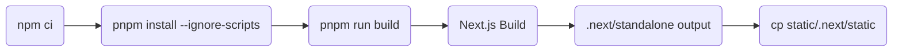
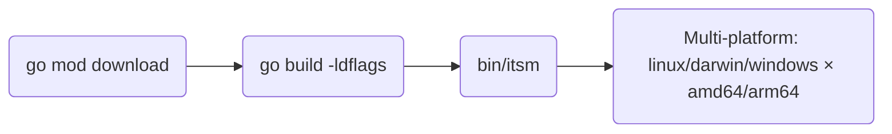
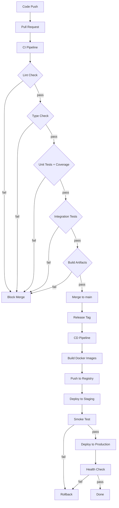

# ITSM 项目 CI/CD 与研发流程复盘报告

**项目**: IT Service Management System
**复盘日期**: 2026-05-10
**复盘范围**: 前后端分离架构、GitHub Actions CI/CD、Docker 部署、测试流程

---

## 一、项目结构分析

### 1.1 整体架构

```
itsm/
├── itsm-backend/          # Go/Gin 后端服务 (Port 8090)
├── itsm-frontend/         # Next.js/TypeScript 前端 (Port 3000)
├── itsm-ai-service/       # ITSM AI 推理服务（模型能力侧）
├── itsm-agent/            # ITSM 代码代理（工程侧）
├── monitoring/           # Prometheus + Grafana 监控
├── tests/                # Python 集成测试
├── scripts/              # 部署运维脚本
├── docs/                 # 文档
├── Makefile             # 统一构建入口
└── docker-compose*.yml  # 多环境配置
```

### 1.2 前后端分离模式

| 维度 | 后端 (itsm-backend) | 前端 (itsm-frontend) |
|------|---------------------|----------------------|
| 技术栈 | Go 1.25 + Gin + Ent ORM | Next.js 15 + TypeScript + Tailwind |
| 入口文件 | `cmd/main.go` | `src/app/` |
| 包管理 | Go modules | npm/pnpm |
| 构建产物 | 单一二进制 `itsm` | Next.js Standalone |
| 端口 | 8090 (API) / 9090 (Metrics) | 3000 |
| 健康检查 | `/health` | 内置 Node.js |

### 1.3 代码组织方式

**后端 (Go)**:
```
controller/    # HTTP Handler
service/       # 业务逻辑
ent/schema/    # ORM Schema
middleware/    # 中间件 (Auth, CORS, Tenant)
dto/           # Data Transfer Objects
cache/         # Redis 集成
router/        # 路由注册
cmd/           # CLI 入口 (migrate, seed)
```

**前端 (Next.js)**:
```
src/app/           # App Router 页面
src/components/    # 可复用组件
src/lib/api/       # API 客户端
src/lib/stores/    # Zustand 状态管理
src/hooks/         # 自定义 Hooks
```

---

## 二、CI/CD 配置分析

### 2.1 GitHub Actions Workflows

项目存在 **6 个 Workflow 文件**，分散在根目录和子项目:

| 文件位置 | Workflow 名称 | 触发条件 | 主要功能 |
|----------|---------------|----------|----------|
| `.github/workflows/automated-tests.yml` | Automated Tests | push develop/main, schedule (daily 2am), workflow_dispatch | API/Database/UI/Smoke Tests |
| `.github/workflows/backend-ci.yml` | backend-ci | push PR main/develop (itsm-backend/**) | Lint, Build, Test, Dependency Review |
| `.github/workflows/frontend-ci.yml` | frontend-ci | - (未找到实际内容) | - |
| `.github/workflows/release.yml` | Build & Release | tag v*, workflow_dispatch | 多平台构建 (linux/darwin/windows × amd64/arm64), Release |
| `.github/workflows/clear-cache.yml` | clear-cache | workflow_dispatch | 清理 Actions 缓存 |
| `.github/workflows/deploy-pages.yml` | deploy-pages | push main | GitHub Pages 部署 |
| `itsm-frontend/.github/workflows/ci.yml` | ITSM Frontend CI | push main/develop, PR main | Lint, Type Check, Unit Tests, Integration Tests, Build |

### 2.2 Docker Compose 配置

| 文件 | 用途 | 服务 |
|------|------|------|
| `docker-compose.yml` | 开箱即用 | postgres, redis, minio, backend, frontend, ollama, prometheus, grafana |
| `docker-compose.dev.yml` | 开发环境 | postgres, redis, minio, backend (port 8090), frontend (port 3000) |
| `docker-compose.prod.yml` | 生产环境 | postgres, redis, backend, frontend (均支持 replicas=2) |

### 2.3 Dockerfile 配置

**后端** (`Dockerfile.backend` / `itsm-backend/Dockerfile.backend`):
- 多阶段构建: `golang:1.25-alpine` (builder) → `alpine:3.19` (runtime)
- 包含构建参数: `GIT_COMMIT`, `BUILD_DATE`, `VERSION`
- 健康检查: `HEALTHCHECK --interval=30s --timeout=5s --start-period=5s --retries=3 CMD wget`
- 非 root 用户: `itsm:itsm` (UID 1001)

**前端** (`Dockerfile.frontend` / `itsm-frontend/Dockerfile`):
- 三阶段构建: `node:22-alpine` (deps) → `node:22-alpine` (builder) → `node:22-alpine` (runner)
- 使用 pnpm 安装依赖
- 独立输出模式 (standalone)
- 非 root 用户: `nextjs:nodejs` (UID 1001)

---

## 三、构建流程分析

### 3.1 前端构建流程



**关键 npm scripts**:
- `dev`: `next dev` - 开发模式
- `build`: `NEXT_DISABLE_TURBOPACK=1 npx next build` + 后处理复制 static/public
- `lint`: `next lint --fix`
- `lint:check`: `next lint` (仅检查)
- `type-check`: `tsc --noEmit`
- `test`: `jest`
- `test:ci`: `jest --ci --coverage --watchAll=false --passWithNoTests`

**CI 中的 Build Job** (frontend-ci.yml):
```yaml
build:
  needs: [lint, type-check, unit-tests, integration-tests]
  steps:
    - npm ci
    - npm run build
  env:
    NEXT_PUBLIC_API_URL: http://localhost:8080
    NODE_OPTIONS: --max-old-space-size=4096
```

### 3.2 后端构建流程



**Release Workflow** (release.yml):
- 矩阵构建: 6 个平台组合 (排除 windows+arm64)
- 编译参数: `go build -ldflags="-s -w"` (strip debug info)
- 输出: `itsm-$goos-$goarch`
- 产物: GitHub Release + zip 归档

### 3.3 镜像构建和推送

项目 **未配置** 镜像推送步骤:
- 没有 `docker/build-push-action`
- 没有 registry 登录步骤
- Makefile 中 `docker-push` 目标仅是占位符:
  ```makefile
  docker-push: ## 推送镜像到仓库（需先登录）
      @echo "$(BLUE)📤 推送镜像...$(NC)"
      docker tag itsm-backend:dev registry.example.com/itsm-backend:latest
      docker push registry.example.com/itsm-backend:latest
      ...
  ```

---

## 四、测试流程分析

### 4.1 前端测试

**测试类型与配置**:

| 类型 | 框架 | 命令 | 覆盖率 |
|------|------|------|--------|
| 单元测试 | Jest | `npm test` | 可配置 |
| 集成测试 | Jest | `npm run test:integration` | - |
| E2E 测试 | Playwright | `npm run test:e2e` | - |
| UX 测试 | Jest | `npm run test:ux` | - |
| 性能测试 | Jest | `npm run test:performance` | - |
| CI 测试 | Jest | `npm run test:ci` | `--coverage` |

**Frontend CI Workflow** (itsm-frontend/.github/workflows/ci.yml):
```yaml
jobs:
  lint:       # ESLint + 文件大小检查 + 函数长度检查
  type-check: # tsc --noEmit
  unit-tests: # npm run test:ci (with coverage)
  integration-tests: # npm run test:integration
  build:      # npm run build (needs all above)
```

**问题**: E2E 测试被注释禁用:
```yaml
# E2E tests skipped in CI - require running backend server
# To run E2E tests locally: npm run test:e2e
```

### 4.2 后端测试

**Backend CI Workflow** (backend-ci.yml):
```yaml
jobs:
  lint:   # gofumpt (disabled), staticcheck, 文件/函数长度检查
  build:  # go build
  test:   # go test ./... -coverprofile=coverage.out
```

**覆盖率上传**:
- 后端: `coverage.html` → artifact
- 前端: `coverage/` → artifact

### 4.3 Python 集成测试 (tests/)

**Automated Tests Workflow**:
```yaml
services:
  postgres: postgres:15-alpine
  redis: redis:7-alpine

jobs:
  api-tests:      # pytest api/ -v --tb=short -m "not slow"
  database-tests: # pytest database/ -v --tb=short
  ui-tests:       # if: false (disabled)
  smoke-tests:    # pytest -v -m "smoke"
  test-report:     # 汇总报告
```

**问题**:
- `continue-on-error: true` - 所有测试设为 continue-on-error，强制通过
- UI Tests 完全禁用 (`if: false`)
- 依赖后端服务启动但启动方式不可靠:
  ```yaml
  - name: Start backend service
    run: |
      cd itsm-backend
      timeout 30s ./itsm &
      sleep 10
  ```

### 4.4 测试覆盖率要求

项目中 **未设置统一的覆盖率门槛**:
- `.golangci-lint.yml` 配置了 46 个 linter，但没有覆盖率要求
- `package.json` 中 jest 配置无 coverage thresholds
- `Makefile ci` 目标仅执行 `lint test`，无覆盖率检查

---

## 五、部署流程分析

### 5.1 开发环境部署

```bash
# 方式1: Makefile
make dev-up          # docker compose -f docker-compose.dev.yml up -d --build

# 方式2: 开箱即用
make oob-up          # docker compose -p itsm_oob -f docker-compose.yml up -d --build

# 方式3: 部署脚本
./scripts/deploy-dev.sh up
```

**启动检查**:
- `make health` - 检查后端健康、数据库就绪、Redis ping
- `make oob-test` - 运行 smoke-test.sh

### 5.2 生产环境部署

```bash
# 前提: 创建 .env.prod 文件
make prod-up         # docker compose -f docker-compose.prod.yml up -d --build
```

**生产配置特点**:
- 资源限制: backend 4G memory/2 CPU, frontend 2G/1 CPU
- 副本数: `replicas: 2` (backend + frontend)
- Redis 密码: `${REDIS_PASSWORD:-redis_password_change_me}`
- JWT 过期: `JWT_EXPIRE_TIME=86400` (24h vs 开发 900s=15min)
- CORS 白名单: `${CORS_ALLOWED_ORIGINS:-https://yourdomain.com}`
- 健康检查: `start_period: 60s` (更长预热)

### 5.3 配置管理

| 类型 | 方式 | 位置 |
|------|------|------|
| 开发配置 | `.env` 或 docker-compose 内联 | 项目根目录 |
| 生产配置 | `.env.prod` (需手动创建) | 项目根目录 |
| 数据库迁移 | Go build tag: `go run -tags migrate main.go` | ent/schema |
| 运行时配置 | 环境变量 + config.yaml | 工作目录 |

**config.yaml 优先级** (从代码推断):
1. 环境变量覆盖
2. config.yaml 文件
3. 默认值

### 5.4 数据库迁移流程

```bash
# 方式1: Makefile
make db-migrate      # docker compose exec itsm-backend go run cmd/migrate/main.go

# 方式2: 直接执行
go run -tags migrate main.go

# 回滚
make db-migrate-down # -down flag
```

**问题**: 迁移回滚是手动操作，无版本化回滚记录

---

## 六、代码质量门禁

### 6.1 Lint 检查

**前端 (ESLint + Prettier)**:
```yaml
# itsm-frontend/.github/workflows/ci.yml
- name: Run lint
  run: npm run lint:check
```
```json
// package.json
"lint-staged": {
  "*.{ts,tsx}": ["eslint --fix", "prettier --write"],
  "*.{js,jsx}": ["eslint --fix", "prettier --write"],
  "*.{json,md}": ["prettier --write"]
}
```

**后端 (golangci-lint)**:
```yaml
# .golangci-lint.yml
enable:
  - errcheck, gosimple, govet, ineffassign, staticcheck, typecheck, unused
  - bodyclose, depguard, dogsled, dupl, exportloopref, funlen, gocognit
  - goconst, gocritic, godot, gofmt, gofumpt, goimports, gomnd, gosec
  - lll, nakedret, nilerr, nolintlint, prealloc, revive, rowserrcheck
  - sqlclosecheck, stylecheck, tenv, testpackage, tparallel, unconvert
  - unparam, wastedassign
```

**Backend CI 中的 Lint**:
```yaml
# backend-ci.yml
- name: Check formatting
  run: |
    echo "Skipping formatting check (gofumpt not available)"
    exit 0  # 格式化检查被跳过！

- name: Run staticcheck
  continue-on-error: true  # 失败不阻止流程
```

### 6.2 Type Check

**前端**: `tsc --noEmit` - 在 CI 中作为独立 job

**后端**: `typecheck` (golangci-lint 内置) - 但 continue-on-error: true

### 6.3 安全扫描

**gosec 配置** (golangci-lint):
```yaml
gosec:
  excludes:
    - G104  # 忽略 "error errors.Unwrap()" 审计
    - G204  # 忽略子命令执行检查
    - G301  # 忽略目录权限检查
    - G302  # 忽略 chmod 检查
  config:
    G301: false
    G302: false
    G306: false
```

**依赖审查** (backend-ci.yml):
```yaml
dependency-review:
  continue-on-error: true
```

### 6.4 覆盖率门槛

**问题**: 无统一覆盖率门槛配置

---

## 七、研发流程问题识别

### 7.1 流程断点

| 严重度 | 问题 | 位置 | 影响 |
|--------|------|------|------|
| CRITICAL | E2E 测试在 CI 中完全禁用 | frontend-ci.yml L243-244 | 无法自动化验证关键用户流程 |
| CRITICAL | 格式化检查被跳过 (`exit 0`) | backend-ci.yml L38-43 | 代码风格不一致 |
| CRITICAL | 所有测试 `continue-on-error: true` | automated-tests.yml | 测试失败不阻塞合并 |
| HIGH | golangci-lint gofumpt 检查跳过 | backend-ci.yml | 代码风格无法保证 |
| HIGH | 镜像推送流程未实现 | Makefile L330-336 | 无法自动化部署到集群 |
| HIGH | staticcheck `continue-on-error: true` | backend-ci.yml L51 | 静态分析问题不阻塞 |
| HIGH | UI Tests 完全禁用 (`if: false`) | automated-tests.yml L157 | 界面回归风险 |
| MEDIUM | 无统一覆盖率门槛 | 全局 | 无法量化质量 |
| MEDIUM | 生产部署无蓝绿/金丝雀 | docker-compose.prod.yml | 升级有停机风险 |
| MEDIUM | 数据库迁移无版本化管理 | cmd/migrate/main.go | 回滚风险 |
| MEDIUM | dependency-review `continue-on-error: true` | backend-ci.yml L161 | 依赖漏洞可能忽略 |
| LOW | 无 security scanning 工具 | - | 安全漏洞可能遗漏 |
| LOW | 无 bundle size 检查 | frontend-ci.yml | 性能回归无感知 |

### 7.2 自动化程度评估

| 阶段 | 自动化程度 | 说明 |
|------|-----------|------|
| 代码检查 (Lint) | 60% | 前端完整，后端部分跳过 |
| 类型检查 | 80% | 前端完整，后端 continue-on-error |
| 单元测试 | 70% | 后端完整，前端完整 (E2E 除外) |
| 集成测试 | 50% | Python 测试配置了但 continue-on-error |
| E2E 测试 | 0% | 完全禁用 |
| 构建 | 100% | GitHub Actions 自动构建 |
| 镜像推送 | 0% | 未实现 |
| 部署 | 30% | 仅本地 docker compose，无 k8s/云部署 |

### 7.3 人工介入点

| 阶段 | 人工介入 | 原因 |
|------|----------|------|
| Release | 手动打 tag (`git tag v*`) | 触发构建 |
| 环境配置 | 手动创建 `.env.prod` | 敏感信息不提交 |
| 生产部署 | 手动执行 `make prod-up` | 无 CD pipeline |
| 数据库迁移 | 手动 `make db-migrate` | 风险操作 |
| Smoke Test | 本地手动运行 | CI 中禁用 |

### 7.4 潜在风险

1. **部署风险**: 直接 `up -d --build` 无健康检查等待，可能出现旧版服务请求新版本数据库
2. **测试覆盖风险**: 35% 平均覆盖率 (< 80% 目标)
3. **安全风险**: 跳过安全扫描、Gosec 配置宽泛
4. **协作风险**: 前后端 workflow 分散在不同目录，职责不清
5. **回滚风险**: 无自动化回滚机制

---

## 八、改进建议 (按优先级排序)

### P0 - 必须立即修复

1. **恢复格式化检查**
   ```yaml
   # backend-ci.yml
   - name: Check formatting
     run: gofumpt -l .
   ```

2. **移除 continue-on-error**
   ```yaml
   # automated-tests.yml
   api-tests:
     continue-on-error: false  # 改为 false
   ```

3. **启用 E2E 测试** (或明确责任到人工验证)
   - 在 CI 中启动 backend + frontend 服务
   - 运行 Playwright E2E 测试

### P1 - 高优先级

4. **实现镜像推送 CI/CD**
   ```yaml
   # 添加到 release.yml
   - name: Push to Registry
     if: startsWith(github.ref, 'refs/tags/v')
     run: |
       docker login registry.example.com -u ${{ secrets.REGISTRY_USER }} -p ${{ secrets.REGISTRY_PASSWORD }}
       docker push registry.example.com/itsm-backend:${{ github.ref_name }}
       docker push registry.example.com/itsm-frontend:${{ github.ref_name }}
   ```

5. **设置覆盖率门槛**
   ```json
   // package.json jest config
   "coverageThreshold": {
     "global": { "branches": 80, "functions": 80, "lines": 80, "statements": 80 }
   }
   ```

6. **统一 Workflow 位置**
   - 移动 `itsm-frontend/.github/workflows/` 到 `.github/workflows/`
   - 合并重复的 frontend-ci.yml

### P2 - 中优先级

7. **实现蓝绿/金丝雀部署脚本**

8. **添加安全扫描步骤**
   ```yaml
   - name: Run Gosec
     run: gosec -fmt json -out gosec.json ./...
   ```

9. **数据库迁移版本化**
   - 使用 golang-migrate 或 similar
   - 记录 migration 版本历史

10. **添加 Bundle Size 检查**
    - 使用 `next/bundle-analyzer`
    - 设置 size budget

### P3 - 低优先级

11. **添加 Prettier CI 检查**

12. **实现依赖更新自动化** (dependabot)

13. **添加 Code Climate / SonarQube 集成**

---

## 九、优化后的目标流程图

### 9.1 理想 CI/CD 流程



### 9.2 当前流程 vs 目标流程

| 阶段 | 当前 | 目标 |
|------|------|------|
| PR 检查 | 部分自动 (lint/type/test) | 完整自动 |
| 测试失败阻断 | 否 (continue-on-error) | 是 |
| E2E 检查 | 禁用 | 自动执行 |
| 覆盖率门槛 | 无 | 80% |
| 格式化检查 | 跳过 | 必须通过 |
| 安全扫描 | 基础 (gosec) | 完整 (gosec + snyk + trivy) |
| 镜像构建 | 本地 docker build | CI 自动构建 + 推送 |
| 生产部署 | 手动 docker compose | 自动蓝绿/金丝雀 |
| 数据库迁移 | 手动 | 自动 + 版本化回滚 |

---

## 十、检查清单

### 代码质量门禁
- [ ] Lint 通过 (ESLint + golangci-lint)
- [ ] Type Check 通过 (tsc + go vet)
- [ ] 单元测试 80%+ 覆盖率
- [ ] 集成测试通过
- [ ] E2E 测试通过 (关键路径)
- [ ] 无安全漏洞 (gosec)

### CI/CD 配置
- [ ] 所有测试 `continue-on-error: false`
- [ ] 格式化检查启用
- [ ] 覆盖率门槛设置
- [ ] 镜像自动推送
- [ ] 部署流程自动化

### 文档
- [ ] README.md 包含 CI/CD 说明
- [ ] 环境变量文档完整
- [ ] 部署检查清单

---

**报告生成时间**: 2026-05-10
**下次复盘建议**: 实现 P0 改进后重新评估
