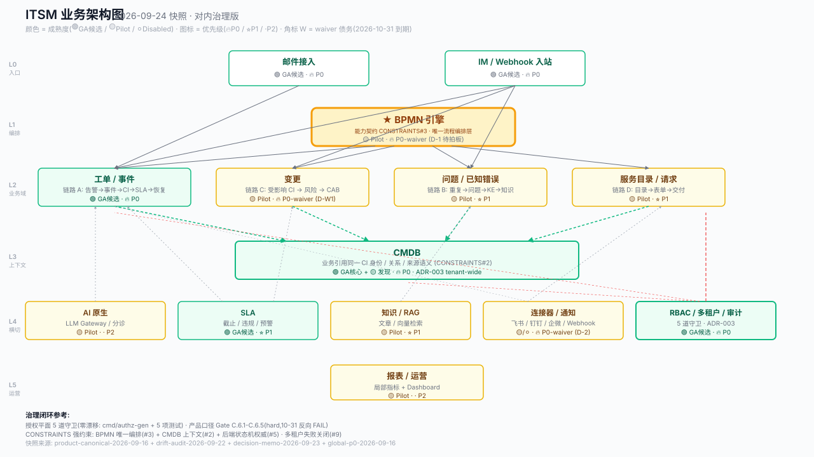

# ITSM 业务快照 — 对内治理版（2026-09-24）

> **受众**：开发团队、产品负责人、QA、运维
> **目的**：一张图 + 一个表，对齐业务现状、优先级、决策债
> **数据快照**：main @ 2026-09-22 漂移审计 + 2026-09-23 决策备忘 + 2026-09-16 全局 P0 看板
> **关联**：本文是 `output/product-canonical-2026-09-16.md` + `output/product-drift-overdesign-audit-2026-09-22.md` + `output/decision-memo-2026-09-23.md` 的对内合并版（非替代，三份原始报告保留）

---

## 1. 顶层摘要（3 分钟读完）

### 1.1 一句话现状

**架构骨架已就位、产品面在扩张、治理闭环刚启动**——12 个能力域里 **3 个 GA 候选 / 9 个 Pilot**；授权平面零漂移（有 5 道机器守卫）；产品口径 5 项全漂移（已用 Gate C.6 守卫拦截，存量 4 条 waiver 2026-10-31 到期反向 FAIL）。

### 1.2 数字快照

| 维度 | 数值 | 备注 |
|---|---|---|
| **业务域** | 12 个能力域，4 条主链路 | 事件→恢复 / 重复事件→问题→知识 / 受控变更 / 服务请求→交付 |
| **代码规模** | handlers/ 67 域 · service/ 337 文件 · app.go 1776 行 · ent schema 137 个 | service/ 8 月以来 +56（反向恶化 🔴） |
| **前端规模** | 168 页面 · 257 组件 · 78 菜单 | 页面/菜单 ≈ 2.15 : 1（无稳定入口的页面多） |
| **测试资产** | 后端 338 单测 / 5 集成 / 22+5 BPMN E2E；前端 209 单测 / 64 Playwright | 前端覆盖率只统计 src/lib（口径需披露 🟡） |
| **治理产物** | 能力契约 1 / 架构 ADR 16 / 漂移审计 1 / 决策备忘 1 / P0 看板 1 | 治理闭环已具备机器守卫 |

### 1.3 本周必做（5 项 waiver + 1 项拍板）

1. **审批三运行时去留拍板**（D-1）—— 1-2 周工程排期起点，违反能力契约 `CONSTRAINTS#3`
2. **3 个孤儿包 + 1 个 DI 容器删除**（D-W2 / O1）—— 10-31 waiver 到期反向 FAIL
3. **变更成熟度口径对齐**（D-W1）—— README "可用" vs 契约 "Pilot" 二选一
4. **NON-GOALS 多渠道对齐**（D-2）—— 改契约允许多渠道并行、飞书优先
5. **CI 全绿验证**（P0-1）—— 本批 4 commit 在 backend-ci / frontend-ci / docs-gate / security 4 流水线全绿

---

## 2. 业务架构图



**看图要点**：

- **6 层架构**：入口 → 编排 → 业务域（4 主链路）→ 上下文 → 横切 → 运营
- **加粗 BPMN 引擎** = **唯一流程编排层**（能力契约 `CONSTRAINTS#3`）
- **颜色 = 成熟度**：🟢 GA 候选 / 🟡 Pilot / ⚪ Disabled
- **图标 = 优先级**：🔥 P0 / ⭐ P1 / · P2；角标 `W` = waiver 债务（10-31 到期）
- **实线箭头** = 强依赖；**虚线箭头** = 横切/可选

---

## 3. 业务成熟度矩阵（12 域）

> 完整证据与商业化缺口见 [`itsm-commercial-capability-contract.md`](./itsm-commercial-capability-contract.md)。本表只列快照与优先级。

| # | 能力域 | 成熟度 | 主要业务证据（截选） | 关键缺口 | 优先级 |
|---|---|---|---|---|---|
| 1 | **工单/事件** | 🟢 GA 候选 | 事件状态机、CI 多选关联、优先级矩阵、BPMN 触发、租户过滤；持久化 command/outbox | 监控告警来源治理、积压恢复、容量验收 | 🔥 P0 |
| 2 | **变更** | 🟡 Pilot | 受影响 CI 校验、CMDB 影响摘要、风险回滚建议、审批能力 | BPMN 审批与业务状态原子化、影响摘要门禁化、回滚强化、窗口冲突 | 🔥 P0`W` |
| 3 | **CMDB** | 🟢 GA 核心 + 🟡 发现 | CI/拓扑/历史/影响分析可用；阿里云连通已验证 | 云发现 Job/Worker/Diff/对账/审计、数据治理、退役治理 | 🔥 P0 |
| 4 | **SLA** | 🟢 GA 候选 | 定义/截止/违规/预警/通知/指标/租户 watcher（tz 已闭环 R4-b） | 事件/请求统一绑定、日历/暂停计时、升级治理 | ⭐ P1 |
| 5 | **RBAC/多租户/审计** | 🟢 GA 候选 | 5 道守卫、6 域行级 scope（ADR-003）、AuditLog、跨租户测试 | 各域能力级权限矩阵、system actor、敏感字段脱敏 | 🔥 P0 |
| 6 | **问题/已知错误** | 🟡 Pilot | 问题状态、工作流、问题→KE、受影响 CI | CI 强引用、重复事件聚类、根因 CI、知识闭环 | ⭐ P1 |
| 7 | **服务目录/请求** | 🟡 Pilot | 目录、请求、审批、CI 引用与创建 | 目录→CI Type→BPMN→SLA 绑定、Provisioning 补偿 | ⭐ P1 |
| 8 | **BPMN/审批** | 🟡 Pilot | 定义/绑定/实例/任务/变量/历史、outbox command | 剩余业务域可靠触发、补偿、重放、实例 E2E | 🔥 P0`W` |
| 9 | **知识/RAG** | 🟡 Pilot（功能已落） | 文章、关键词/向量降级、LLM 问答、租户过滤 | 向量删除、发布版本、可见性 E2E、问题→知识闭环 | ⭐ P1 |
| 10 | **AI** | 🟡 Pilot | LLM Gateway、分诊、摘要、RAG、AI 审计 | 置信度、采纳/拒绝反馈、prompt/model 版本、统一 evaluator | · P2 |
| 11 | **连接器/通知** | 🟡/⚪ 混合 | 连接器注册/生命周期、飞书较强、其他骨架 | 真实健康检查、租户密钥、消息幂等、验签、市场闭环 | 🔥 P0`W` |
| 12 | **报表/运营** | 🟡 Pilot | SLA/事件局部指标 + Dashboard | 统一服务质量指标、数据口径版本、导出审计、MSP 边界 | · P2 |

**统计**：🟢 GA 候选 3（工单/事件、SLA、RBAC）+ CMDB 半绿 = **3.5**；🟡 Pilot 9；⚪ Disabled 0（混合计入 P0`W`）。

---

## 4. P0/P1/P2 优先级看板（精简版）

> 完整看板见 [`output/global-p0-2026-09-16.md`](../output/global-p0-2026-09-16.md)（35 条历史项）。本表只列 **当前未闭环** 的项，按 owner 维度合并去重。

### 4.1 🔥 P0 止血期（10-31 waiver 到期 + 本周必做）

| # | 项 | 来源 | owner | SLA | verification | 状态 |
|---|---|---|---|---|---|---|
| P0-1 | **审批三运行时去留拍板** | drift D1 / decision D-1 | backend-itsm + 产品 | 拍板后立即启动 | 决策记录 + 装配处只留一条运行时 + `grep -c "NewApprovalService\|NewApprovalChainService"` = 1 | ⏳ 待拍板 |
| P0-2 | **变更成熟度口径对齐** | drift D2 / decision D-W1 | docs-itsm + 产品 | 2026-10-31 | README "可用"→"Pilot"（倾向 A）或契约"可用" + 4 处引用 | ⏳ waiver |
| P0-3 | **3 个孤儿包删除**（department/root_cause/dashboard） | drift O3 / decision D-W2 | backend-itsm | 2026-10-31 | grep 验证无引用 → git rm → `go build ./...` 通过 | ⏳ waiver |
| P0-4 | **DI 容器删除**（internal/container 247 行 0 引用） | drift O1 | backend-itsm | 2026-10-31 | `go build ./...` 通过 + `grep -rn "internal/container"` 仅命中 .md | ⏳ waiver |
| P0-5 | **NON-GOALS 多渠道对齐**（飞书/钉钉/企微/email 四渠道） | drift D3 / decision D-2 | 产品 + im-itsm | T+1 周 | 改契约"允许多渠道并行、飞书优先、其余 Experimental" | ⏳ waiver |
| P0-6 | **CI 全绿验证**（本批 4 commit） | canonical §6.1 | devops-itsm | T+24h | 4 流水线全绿（GitHub Actions 面板截图） | ⏳ 已推送待跑 |
| P0-7 | **CMDB 阿里云云发现闭环** | capability-contract / production-readiness P1-4 | backend-itsm | v1.7 | Job/Worker/Diff/对账/审计 5 件套 + 质量指标 | 🔥 P0 长期 |
| P0-8 | **AI 资产所有权 ADR**（8 月评审 R8 / drift O6） | drift O6 | backend-itsm + ai-itsm | v1.7 启动前 | ADR 明确 LLM 走 gateway / RAG 二选一 / ai-service 归档或编排 | 🔥 P0 长期 |

### 4.2 ⭐ P1 本季度（v1.7 启动后必做）

| # | 项 | 来源 | owner | SLA | verification |
|---|---|---|---|---|---|
| P1-1 | **问题→KE→知识→RAG 闭环** | capability-contract | backend-itsm + docs-itsm | v1.7 | E2E 跑通 + 知识版本管理 + 向量删除 |
| P1-2 | **服务目录→请求→CI→交付闭环** | capability-contract | backend-itsm | v1.7 | Provisioning 幂等 + 失败补偿 + CI 保留请求来源 |
| P1-3 | **SLA 工作日历/暂停/升级** | production-readiness | backend-itsm | v1.7 | 日历 + 暂停 + 升级治理接入 |
| P1-4 | **Connector 三渠道真实联调** | production-readiness P1-3 | im-itsm | Q4 OKR | 钉钉/企微/飞书各 1 端到端 + 验签失败/重放攻击拒绝证据 |
| P1-5 | **`service/` 分治**（337 文件拆分） | drift O4 | backend-itsm | v1.7 首轮 | 按 bpmn/approval/ticket/cmdb/rag/reporting 分组 + 冻结新增 |
| P1-6 | **PRD §10 Timer Event 用户文档** | canonical §6.1 | docs-itsm | T+48h | 文档完成 + 链接入 README |

### 4.3 · P2 半年视角

| # | 项 | 来源 | owner | SLA |
|---|---|---|---|---|
| P2-1 | **缩编 prod 默认编排**（监控栈 → profile 可选） | drift O8 | devops-itsm | v1.7 |
| P2-2 | **统一指标 + 报表合并**（13 报表→1 套统一指标） | drift O5 | backend-itsm + fe-itsm | v1.7 |
| P2-3 | **前端覆盖率口径披露 + 收尾**（collectCoverageFrom 扩到 app/components） | drift D7 | fe-itsm | v1.7 |
| P2-4 | **前端巨型组件拆解 + 测试**（BPMNDesigner 1497 / TicketDetail 1382） | canonical §6.1 | fe-itsm | v1.7 |
| P2-5 | **依赖收尾**（swr 删除、图表/图标/日期各选其一、zustand vs react-query 边界） | drift O7 | fe-itsm | v1.7 |
| P2-6 | **V1 fire-and-forget `go func` 删除**（ticket_service.go 4 处） | production-readiness P2-2 | backend-itsm | v1.7 |
| P2-7 | **DataScope department tier 死代码清理**（ApplyTicketFilter 0 调用方） | production-readiness P2-3 | backend-itsm | v1.7 |
| P2-8 | **规划体系收敛到一条**（prd/plans/specs/.specify 四选一） | drift O9 | docs-itsm | v1.7 |

---

## 5. 决策清单（等待对齐 — 齐活林）

> 完整论证见 [`output/decision-memo-2026-09-23.md`](../output/decision-memo-2026-09-23.md)。本表只列快照。

| # | 决策项 | 选项 | 我的倾向 | 截止 | 触发条件 |
|---|---|---|---|---|---|
| **D-1** | 审批三运行时收敛 | A. 收敛到 BPMN / B. 收敛到 ApprovalChain / C. 仅改 CHANGELOG | **A** | 拍板后立即 | CONSTRAINTS#3 永久失效风险 |
| **D-W1** | 变更成熟度口径 | A. README→Pilot / B. 契约→可用 / C. 两边都改 GA 候选 | **A** | 2026-10-31 | C.6.1 反向 FAIL |
| **D-W2** | 三个孤儿包 | A. 全删 / B. 全接 / C. 混合 | **A** | 2026-10-31 | C.6.3 反向 FAIL |
| **D-2** | NON-GOALS 多渠道 | A. 改契约允许多渠道 / B. 下线 email_intake / C. 维持现状 | **A** | T+1 周 | 诚实优先 |

**最急迫**：D-1（决策一旦做，1-2 周工程排期开始；影响 8 个前端入口 + 6 张实体表）
**次急迫**：D-W1 + D-W2（10-31 waiver 截止，逾期反向 FAIL）
**最轻松**：D-2（1 段话修改）

---

## 6. 演进路径

```
2026-09 当前快照（v1.6.x 收官）
│
├─ P0 止血期 ──────────────────────────────
│   ├─ D-1 审批三运行时拍板 → 立项 1-2 周工程
│   ├─ D-W1/D-W2/D-2 + O1 waiver 销账（10-31 前）
│   └─ Gate C.6 默认 hard 守卫维持（已 15/15 用例）
│
├─ v1.7 启动（结构化改造期）─────────────
│   ├─ P1-1~P1-6：问题/知识闭环、SLA 治理、Connector 真实联调、service 分治
│   ├─ P2-1~P2-8：统一指标、前端覆盖、prod 编排精简、依赖收尾
│   └─ ADR-003 (CMDB tenant-wide) 已落地，AI 资产 ADR 待补
│
└─ 治理维持（每周节奏）──────────────────
    ├─ 授权平面 5 道守卫（已固化为 cmd/authz-gen + 5 项测试，零漂移）
    ├─ 产品口径 5 道守卫（Gate C.6.1-C.6.5，hard，10-31 反向 FAIL）
    └─ 每周一 P0 看板更新（meta-复盘 P0-A/B 已落地）
```

---

## 7. 看板使用纪律（整合自 global-p0）

1. **owner 列不可空**——无人认领的项必须升级到 P0（默认 24h SLA）
2. **verification 列必须可量化**——"修一下"/"看一下"不算 verification
3. **commit 列必填**——已闭环的项立即挪到"已闭环"段
4. **看板每周一更新**——新一周开始时重排优先级
5. **跨报告口径同步**——任何 `product-*` / `production-readiness` / `ux-audit` 文档变更必须同步本快照

---

## 8. 治理闭环参考（为什么 9-22 审计判断"零漂移")

| 平面 | 守卫数 | 形式 | 触发方式 |
|---|---|---|---|
| 授权平面（AuthZ） | 5 道 | `cmd/authz-gen` + `middleware/precheck_codegen.go` + `route_permission_guard_test.go` + `permission_code_catalog_guard_test.go` + `route_scan.go` | 改路由权限 → 跑生成器 → 提交生成物；`make docs-gate` |
| 产品口径（产品面） | 5 道（C.6.1-C.6.5） | `scripts/docs-gate/check-product-drift.sh` + 棘轮基线 + waiver 登记 | `make product-drift`；CI `gate-unit-tests` job；hard 默认 |

**关键洞察**（来自 9-22 审计 §4）：**有守卫的平面（授权）零漂移，只靠文档约定的平面（成熟度/审批/领域清单/NON-GOALS/覆盖率）全部漂移**。本快照的 §3 §4 §5 是把 §2 架构图对应的"业务面"翻译成"对内运营可视化"，不替代机器守卫。

---

## 附 A：可复现命令

```bash
cd /Users/heidsoft/Downloads/research/itsm

# === 业务域清单（实操版） ===
ls itsm-backend/handlers/ | wc -l                  # 69（含 common/shared）
ls itsm-backend/controller | wc -l                 # 0（已清空 ✅）
ls itsm-backend/service/*.go | wc -l               # 337（反向恶化 🔴）
ls itsm-backend/ent/schema/ | wc -l                # 137
wc -l itsm-backend/internal/bootstrap/app.go        # 1776（反向恶化 🔴）
find itsm-frontend/src/app -name 'page.tsx' | wc -l # 168

# === 治理闭环校验 ===
make docs-gate                                     # 默认 hard（C.1-C.6 全量）
make product-drift                                 # C.6 独立目标
node --test scripts/__tests__/docs-gate.test.js    # 15 用例
cat scripts/docs-gate/product-drift-waivers.txt    # 4 项 waiver（10-31 到期）

# === 漂移验证 ===
# D-1 审批三运行时
grep -n "NewApprovalService\|NewApprovalChainService" itsm-backend/internal/bootstrap/app.go
ls itsm-backend/ent/schema/ | grep -i approval      # 6 张表

# D-W2 三个孤儿包
grep -rln "handlers/department\|handlers/root_cause\|handlers/dashboard" itsm-backend --include='*.go' | head

# O1 DI 容器零引用
grep -rn "internal/container" itsm-backend --include='*.go'   # 仅命中 1 个 .md

# D-W1 成熟度口径冲突
grep -nE "变更" README.md docs/product/itsm-commercial-capability-contract.md
```

---

## 附 B：关联文档

| 文档 | 路径 | 用途 |
|---|---|---|
| 商业能力契约 | [`docs/product/itsm-commercial-capability-contract.md`](./itsm-commercial-capability-contract.md) | 12 域成熟度 + CONSTRAINTS + 主链路 + OPEN QUESTIONS |
| 领域所有权 | [`docs/architecture/domain-ownership.md`](../architecture/domain-ownership.md) | 各域迁移状态、跨领域不变量 |
| 产品权威清单 | [`output/product-canonical-2026-09-16.md`](../../output/product-canonical-2026-09-16.md) | 已落地功能全图 + 证据 |
| 漂移审计 | [`output/product-drift-overdesign-audit-2026-09-22.md`](../../output/product-drift-overdesign-audit-2026-09-22.md) | 9 漂移 + 10 过度设计 + 11 项 8 月评审对照 |
| 决策备忘 | [`output/decision-memo-2026-09-23.md`](../../output/decision-memo-2026-09-23.md) | 9 项待决 + 我的倾向 |
| 全局 P0 看板 | [`output/global-p0-2026-09-16.md`](../../output/global-p0-2026-09-16.md) | 35 条历史 P0/P1/P2 + 看板纪律 |

---

*快照日期：2026-09-24 · 下次更新：2026-09-30（周一，按 P0 看板节奏）*
*生成命令：本文为对内治理整合产物，非审计原始报告；任何字段冲突以三份原始报告为准*