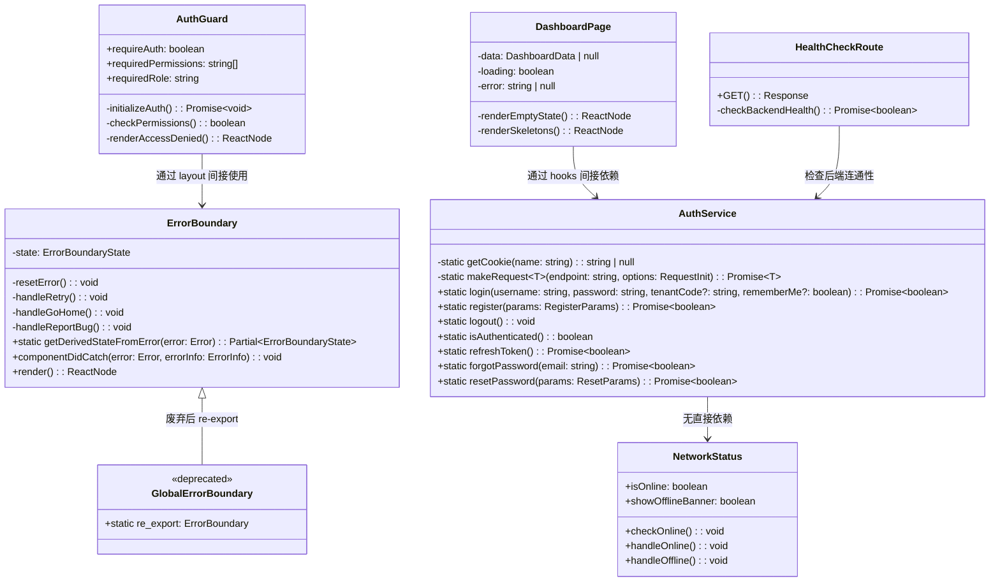
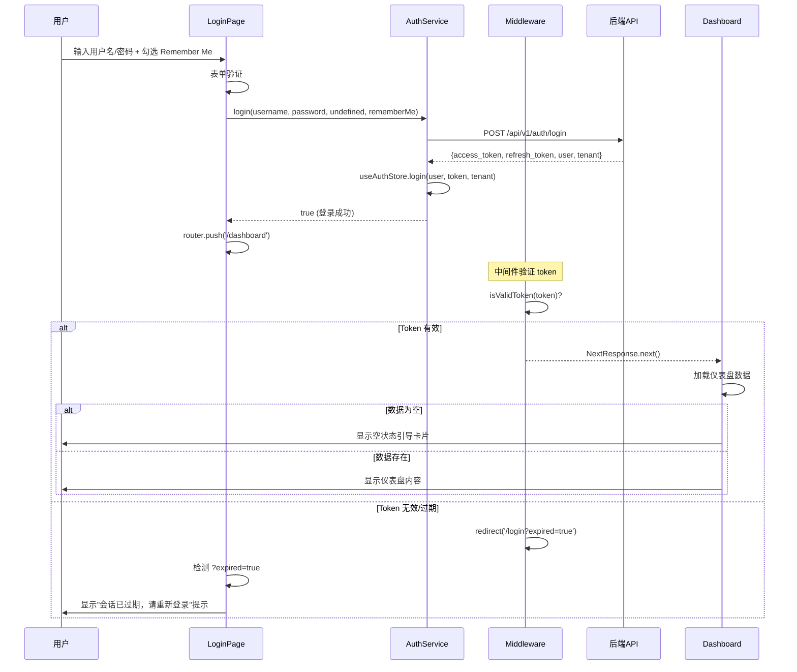
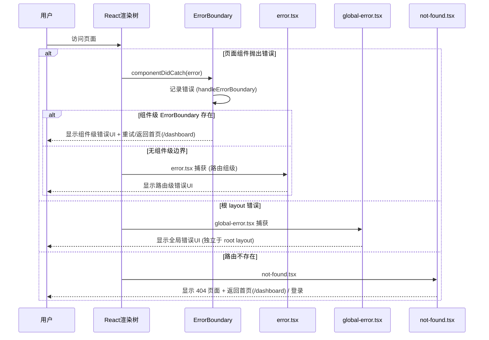
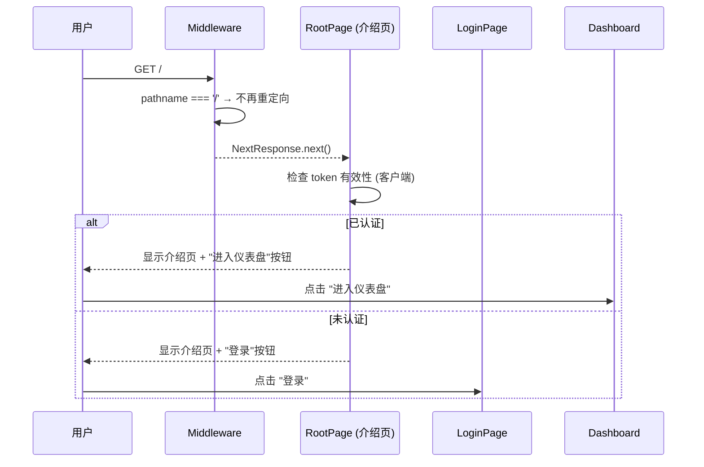
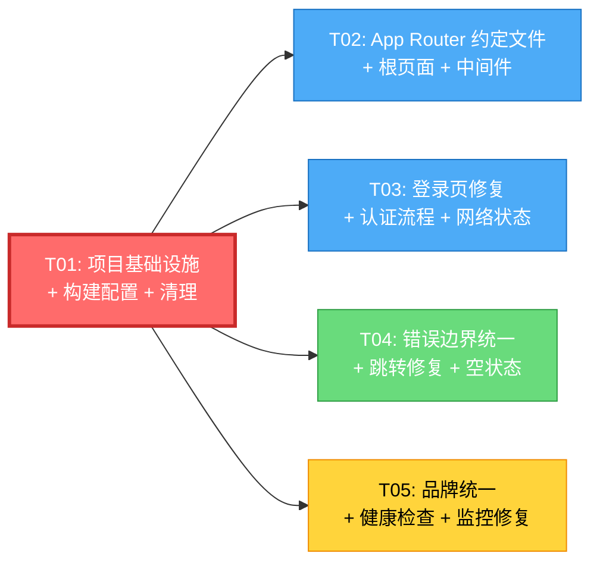

# AI-Native ITSM 前端架构改进方案

> 架构师：Bob（高见远）  
> 日期：2025-07  
> 基于：PM UX 审查报告（4项P0 + 8项P1 + 10项P2）+ 3个探索 Agent 补充发现

---

## 目录

1. [改进方案概述](#1-改进方案概述)
2. [文件列表](#2-文件列表)
3. [数据结构与接口](#3-数据结构与接口)
4. [程序调用流程](#4-程序调用流程)
5. [任务分解](#5-任务分解)
6. [共享知识](#6-共享知识)
7. [任务依赖图](#7-任务依赖图)
8. [风险和注意事项](#8-风险和注意事项)
9. [未明确事项](#9-未明确事项)

---

## 1. 改进方案概述

### 1.1 整体策略

本轮改进聚焦于**开源发布前的用户体验修复**，而非大规模架构重构。核心原则：

| 原则 | 说明 |
|------|------|
| **最小破坏性** | 不移除冗余依赖库（图标/图表/请求/拖拽双库并存），不做大规模 any 清理 |
| **品牌统一** | 全局将 CloudMesh / ITSM Pro / ITSM Platform / itsm-prototype 统一为 **AI-Native ITSM** |
| **Next.js 约定优先** | 利用 App Router 的 `not-found.tsx` / `error.tsx` / `loading.tsx` / `global-error.tsx` 约定文件，而非自建组件 |
| **功能边界收窄** | SSO 隐藏、保留自助注册、条件化 MSP 模块 |
| **分批可执行** | 5 个任务，T01 完成后 T02–T05 可并行 |

### 1.2 优先级矩阵

```
         高影响
            │
    P0-4 ───┼─── P0-1 (根页面)
    P0-2 ───┤    P0-3 (错误页)
    P1-1 ───┤    P1-5 (空状态)
    P1-7 ───┤    P1-6 (网络状态)
            │
         低影响
    P2-2 ───┼─── P2-1 (console)
    P2-6 ───┤    P2-8 (Onboarding - 暂缓)
            │
         低风险 ─── 高风险
```

### 1.3 改进技术选型

| 领域 | 方案 | 理由 |
|------|------|------|
| 错误边界 | Next.js `error.tsx` + `global-error.tsx` 约定文件 + 保留 `common/ErrorBoundary.tsx` 作为组件级边界 | App Router 原生支持，无需第三方库 |
| 加载状态 | Next.js `loading.tsx` 约定文件 | 原生 Suspense 级加载 |
| 网络状态 | 自建 `NetworkStatus` 组件（navigator.onLine + online/offline 事件） | 轻量级，无需依赖库 |
| 健康检查 | Next.js Route Handler `/api/health` | 原生 API 路由，无需后端 |
| 品牌统一 | 全局搜索替换 + env.ts 集中配置 | 避免硬编码 |

---

## 2. 文件列表

### 2.1 操作类型说明

- `[修改]` — 修改现有文件
- `[新建]` — 创建新文件
- `[重写]` — 完全替换文件内容
- `[删除]` — 删除文件

### 2.2 完整文件清单

| # | 文件路径 | 操作 | 所属任务 | 说明 |
|---|---------|------|---------|------|
| 1 | `next.config.ts` | [修改] | T01 | 移除 eslint/typescript 忽略配置 |
| 2 | `package.json` | [修改] | T01 | 名称改为 `ai-native-itsm` |
| 3 | `src/app/layout.tsx` | [修改] | T01 | 移除 Google Fonts preconnect；品牌统一 |
| 4 | `src/lib/env.ts` | [修改] | T01 | app.name 改为 AI-Native ITSM |
| 5 | `src/lib/__tests__/env.test.ts` | [修改] | T01 | 更新测试断言匹配新品牌名 |
| 6 | `pnpm-lock.yaml` | [删除] | T01 | 保留 package-lock.json 作为唯一 lockfile |
| 7 | `src/lib/api/__tests__/ticket-api.test.ts.bak` | [删除] | T01 | 清理备份文件 |
| 8 | `src/lib/api/__tests__/workflow-api.test.ts.bak` | [删除] | T01 | 清理备份文件 |
| 9 | `src/components/release/ReleaseList.tsx.bak` | [删除] | T01 | 清理备份文件 |
| 10 | `src/lib/__tests__/ticket-approval.test.ts.bak` | [删除] | T01 | 清理备份文件 |
| 11 | `src/lib/__tests__/api-integration.test.ts.bak` | [删除] | T01 | 清理备份文件 |
| 12 | `src/app/page.tsx` | [重写] | T02 | 替换为开源项目介绍页 |
| 13 | `src/app/not-found.tsx` | [新建] | T02 | 自定义 404 页面 |
| 14 | `src/app/error.tsx` | [新建] | T02 | 路由组级错误边界 |
| 15 | `src/app/global-error.tsx` | [新建] | T02 | 全局错误边界（覆盖 root layout） |
| 16 | `src/app/(main)/loading.tsx` | [新建] | T02 | 主布局路由级加载状态 |
| 17 | `src/middleware.ts` | [修改] | T02 | 移除 `/` 根路径重定向；添加 expired 参数 |
| 18 | `src/app/(auth)/login/page.tsx` | [修改] | T03 | 修复死按钮/隐藏SSO/默认凭据/移除MSP/品牌/会话过期 |
| 19 | `src/lib/services/auth-service.ts` | [修改] | T03 | login() 添加 rememberMe 参数 |
| 20 | `src/app/(auth)/layout.tsx` | [修改] | T03 | 品牌名称统一 |
| 21 | `src/components/common/NetworkStatus.tsx` | [新建] | T03 | 全局网络状态检测组件 |
| 22 | `src/components/common/ErrorBoundary.tsx` | [修改] | T04 | 修复跳转 `/dashboard`；增强为主力实现 |
| 23 | `src/components/common/GlobalErrorBoundary.tsx` | [修改] | T04 | 标记废弃，re-export common/ErrorBoundary |
| 24 | `src/lib/templates/wrappers.tsx` | [修改] | T04 | 移除重复 ErrorBoundary 类 |
| 25 | `src/components/auth/AuthGuard.tsx` | [修改] | T04 | 修复 AccessDenied L402 跳转 |
| 26 | `src/app/(main)/dashboard/page.tsx` | [修改] | T04 | 添加空数据引导卡片 + 品牌名称 |
| 27 | `src/components/layout/sidebar/Sidebar.tsx` | [修改] | T05 | 品牌统一 + 处理 FORCE_STATIC_MENU |
| 28 | `src/app/api/health/route.ts` | [新建] | T05 | 前端健康检查端点 |
| 29 | `public/scripts/monitoring.js` | [修改] | T05 | 生产环境 console.log 添加环境判断 |
| 30 | `src/app/(main)/layout.tsx` | [修改] | T05 | footer 品牌名称统一 |
| 31 | `src/components/ui/GlobalSearch.tsx` | [删除] | T05 | 死代码清理（未被任何文件导入） |
| 32 | `src/components/auth/AuthLayout.tsx` | [修改] | T05 | 品牌名称统一（3处） |
| 33 | `src/components/auth/AuthForm.tsx` | [修改] | T05 | 品牌名称统一 |
| 34 | `src/app/(main)/admin/components/SystemInfo.tsx` | [修改] | T05 | 品牌名称统一 |
| 35 | `src/lib/i18n/translations.ts` | [修改] | T05 | 品牌名称统一（3处） |
| 36 | `src/styles/theme-variables.css` | [修改] | T05 | 注释品牌名称统一 |

---

## 3. 数据结构与接口

### 3.1 类图



### 3.2 关键接口定义

```typescript
// src/components/common/NetworkStatus.tsx
interface NetworkStatusProps {
  /** 自定义离线提示渲染 */
  offlineFallback?: React.ReactNode;
  /** 自定义在线恢复提示渲染 */
  onlineRestoredFallback?: React.ReactNode;
}

// src/app/api/health/route.ts
interface HealthCheckResponse {
  status: 'ok' | 'degraded' | 'down';
  timestamp: string;
  version: string;
  services: {
    frontend: 'ok';
    backend?: 'ok' | 'down';
  };
}

// AuthService.login 签名变更
interface LoginParams {
  username: string;
  password: string;
  tenantCode?: string;
  rememberMe?: boolean;  // 新增
}
```

---

## 4. 程序调用流程

### 4.1 登录流程（修复后）



### 4.2 错误恢复流程



### 4.3 根页面访问流程（修复后）



---

## 5. 任务分解

### T01: 项目基础设施 + 构建配置 + 清理

| 字段 | 值 |
|------|---|
| **任务编号** | T01 |
| **优先级** | P0 |
| **复杂度** | 简单 |
| **依赖** | 无 |

**涉及文件（11个）：**

| 文件 | 操作 | 具体改动 |
|------|------|---------|
| `next.config.ts` | 修改 | 删除 L7-13 的 `eslint.ignoreDuringBuilds` 和 `typescript.ignoreBuildErrors` 配置块。保留 `reactStrictMode: true` 和 `output: 'standalone'`。 |
| `package.json` | 修改 | L2: `"name": "itsm-prototype"` → `"name": "ai-native-itsm"` |
| `src/app/layout.tsx` | 修改 | ① L79-80: 删除 Google Fonts preconnect 两行 `<link rel="preconnect" ...>` ② L93-94: 删除 dns-prefetch 两行 ③ L21: title `'ITSM Platform - IT服务管理平台'` → `'AI-Native ITSM - AI原生IT服务管理平台'` ④ L25-26: creator/publisher `'ITSM Platform'` → `'AI-Native ITSM'` ⑤ L44, L48, L52: openGraph/twitter 同步更新 ⑥ L90: apple-mobile-web-app-title `'ITSM Platform'` → `'AI-Native ITSM'` |
| `src/lib/env.ts` | 修改 | L43: `name: 'ITSM Platform'` → `name: 'AI-Native ITSM'` |
| `src/lib/__tests__/env.test.ts` | 修改 | L52: `expect(env.app.name).toBe('ITSM Platform')` → `expect(env.app.name).toBe('AI-Native ITSM')` |
| `pnpm-lock.yaml` | 删除 | 保留 `package-lock.json` 作为唯一 lockfile（项目 scripts 使用 npm 语法） |
| `src/lib/api/__tests__/ticket-api.test.ts.bak` | 删除 | 备份文件清理 |
| `src/lib/api/__tests__/workflow-api.test.ts.bak` | 删除 | 备份文件清理 |
| `src/components/release/ReleaseList.tsx.bak` | 删除 | 备份文件清理 |
| `src/lib/__tests__/ticket-approval.test.ts.bak` | 删除 | 备份文件清理 |
| `src/lib/__tests__/api-integration.test.ts.bak` | 删除 | 备份文件清理 |

**注意事项：**
- 移除 `next.config.ts` 中的忽略配置后，`npm run build` 会暴露现有的类型错误和 lint 警告。**不要在本任务中修复所有类型错误**——只需确保 build 能通过（现有代码应已基本可编译，若有少量错误可临时在对应文件修复）。建议在 build 脚本中保持 `NEXT_DISABLE_TURBOPACK=1` 前缀不变。
- 删除 `pnpm-lock.yaml` 前确认团队使用 npm（`package.json` 中 scripts 使用 `npx` 和 `npm run`，无 `pnpm` 特定脚本）。

---

### T02: App Router 约定文件 + 根页面 + 中间件

| 字段 | 值 |
|------|---|
| **任务编号** | T02 |
| **优先级** | P0 |
| **复杂度** | 中等 |
| **依赖** | T01 |

**涉及文件（6个）：**

| 文件 | 操作 | 具体改动 |
|------|------|---------|
| `src/app/page.tsx` | 重写 | 完全替换为开源项目介绍页。内容包含：① 项目 Hero 区（"AI-Native ITSM" 标题 + 一句话描述 + GitHub 按钮 + "快速开始"指引）② 功能亮点区（工单管理/事件管理/问题管理/变更管理/CMDB/服务目录/知识库/SLA监控/工作流引擎 — 使用 Lucide Icons 而非 FontAwesome）③ 快速开始区（git clone / npm install / npm run dev 命令展示）④ 底部链接（GitHub 仓库 / 登录入口 / 注册入口）。**不使用 FontAwesome**，改用 `lucide-react` 图标。移除所有 `/deploy` `/docs` `/blog` 死链接。页面需检查客户端 token 决定显示"登录"还是"进入仪表盘"按钮。 |
| `src/app/not-found.tsx` | 新建 | 自定义 404 页面。使用 Ant Design `Result` 组件，status="404"。提供"返回首页"按钮跳转 `/dashboard`（已认证）或 `/login`（未认证），"返回上一页"按钮调用 `router.back()`。品牌名称使用 "AI-Native ITSM"。 |
| `src/app/error.tsx` | 新建 | 路由组级错误边界（Next.js 约定文件，client component）。捕获 `(main)` 路由组内的 React 渲染错误。使用 Ant Design `Result` 组件，提供"重试"（调用 `reset()` 函数）和"返回仪表盘"（`router.push('/dashboard')`）按钮。开发环境显示错误堆栈。 |
| `src/app/global-error.tsx` | 新建 | 全局错误边界（Next.js 约定文件，必须包含 `<html>` 和 `<body>` 标签）。捕获 root layout 级别的错误。使用内联样式（不能依赖 Ant Design，因为可能 layout 都挂了）。提供"刷新页面"和"返回首页"按钮。 |
| `src/app/(main)/loading.tsx` | 新建 | 主布局路由级加载状态。使用 Ant Design `Spin` 组件居中显示，配合骨架屏效果。文案"加载中..." |
| `src/middleware.ts` | 修改 | ① **L141-147**: 移除根路径 `/` 的重定向逻辑（删除整个 `if (pathname === '/')` 块），让根页面介绍页可见。② **L129-133**: 修改受保护路由重定向逻辑，当 token 过期（`isValid` 为 false 但 token 存在）时，添加 `?expired=true` 查询参数：`loginUrl.searchParams.set('expired', 'true')` |

**注意事项：**
- `global-error.tsx` 不能使用 Ant Design 组件（因为 root layout 中的 Provider 可能已挂掉），必须使用原生 HTML + 内联样式。
- `error.tsx` 是 client component，可以使用 `'use client'` 和 Ant Design。
- `not-found.tsx` 可以是 server component，但为了使用 `useRouter` 需要标记 `'use client'`。
- 移除 middleware 中 `/` 重定向后，已认证用户访问 `/` 会看到介绍页（介绍页上有"进入仪表盘"按钮），这是预期行为。

---

### T03: 登录页修复 + 认证流程 + 网络状态

| 字段 | 值 |
|------|---|
| **任务编号** | T03 |
| **优先级** | P0/P1 |
| **复杂度** | 中等 |
| **依赖** | T01 |

**涉及文件（4个）：**

| 文件 | 操作 | 具体改动 |
|------|------|---------|
| `src/app/(auth)/login/page.tsx` | 修改 | ① **L28**: 删除 `import MSPService from '@/services/msp-service';` ② **L61**: 删除 `MSPService.refreshCache();` 调用 ③ **L87**: `'ITSM Pro'` → `'AI-Native ITSM'` ④ **L183-187**: "忘记密码" Button 添加 `onClick={() => router.push('/forgot-password')}` ⑤ **L209-216**: SSO 按钮——添加 `style={{ display: 'none' }}` 隐藏（不删除代码，方便后续恢复）或用条件渲染 `{false && <Button...>}` ⑥ **L218-224**: "立即注册" Button 添加 `onClick={() => router.push('/register')}` ⑦ **L56**: `AuthService.login(values.username, values.password)` → `AuthService.login(values.username, values.password, undefined, rememberMe)` ⑧ **新增**: 在登录表单下方添加默认凭据提示 Alert（`type="info"`），文案"默认管理员账号: admin / admin123，首次登录后请及时修改密码" ⑨ **新增**: 使用 `useSearchParams()` 检测 `?expired=true` 参数，存在时显示 Alert `type="warning"` 文案"会话已过期，请重新登录" |
| `src/lib/services/auth-service.ts` | 修改 | ① **L127**: `login(username, password, tenantCode?)` → `login(username, password, tenantCode?, rememberMe?)` ② **L136-140**: 在请求 body 中添加 `remember_me: rememberMe || false` ③ **L101**: `console.error('Token refresh failed:', error)` → `logger.error('Token refresh failed:', error)` ④ **L181**: `console.error('Login failed:', error)` → `logger.error('Login failed:', error)` ⑤ **L215**: `console.error('Registration failed:', error)` → `logger.error(...)` ⑥ **L233**: `console.error('Forgot password request failed:', error)` → `logger.error(...)` ⑦ **L258**: `console.error('Reset password failed:', error)` → `logger.error(...)` ⑧ **L279**: `console.error('Validate reset token failed:', error)` → `logger.error(...)`（需在文件顶部添加 `import { logger } from '@/lib/env';`） |
| `src/app/(auth)/layout.tsx` | 修改 | L4: `title: '登录 - ITSM Platform'` → `title: '登录 - AI-Native ITSM'` |
| `src/components/common/NetworkStatus.tsx` | 新建 | 全局网络状态检测组件。功能：① 使用 `navigator.onLine` 初始化状态 ② 监听 `online` / `offline` 事件 ③ 离线时在页面顶部显示 Ant Design `Alert` 固定提示条"网络连接已断开，部分功能可能不可用" ④ 恢复在线时短暂显示"网络已恢复"提示（3秒后自动消失）⑤ 组件不接收 props，作为全局组件在 `(main)/layout.tsx` 中渲染 |

**注意事项：**
- 登录页使用 `useSearchParams()` 需要包裹 `<Suspense>`，否则 Next.js 构建会警告。可以将整个 return 包裹在 `<Suspense fallback={null}>` 中。
- SSO 按钮隐藏而非删除，方便商业版本恢复。
- `AuthService` 中添加 `logger` import 后，确保不会形成循环依赖（`env.ts` 不依赖 `auth-service.ts`）。
- `NetworkStatus` 组件需要在 T05 中被添加到 `(main)/layout.tsx`，或在本任务中直接添加——建议在本任务中创建组件，在 T05 中集成到 layout。

---

### T04: 错误边界统一 + 跳转修复 + 仪表盘空状态

| 字段 | 值 |
|------|---|
| **任务编号** | T04 |
| **优先级** | P1/P2 |
| **复杂度** | 中等 |
| **依赖** | T01 |

**涉及文件（5个）：**

| 文件 | 操作 | 具体改动 |
|------|------|---------|
| `src/components/common/ErrorBoundary.tsx` | 修改 | ① **L94**: `window.location.href = '/'` → `window.location.href = '/dashboard'` ② **L118**: `console.error('Failed to copy error report:', err)` → `logger.error(...)`（添加 logger import）③ 此文件保留为**主力 ErrorBoundary 实现**，其他实现应 re-export 此组件 |
| `src/components/common/GlobalErrorBoundary.tsx` | 修改 | 将整个文件内容替换为废弃 re-export：`/** @deprecated 使用 common/ErrorBoundary 代替 */ export { ErrorBoundary as GlobalErrorBoundary, ErrorBoundary as default } from './ErrorBoundary';` + 保留 `withErrorBoundary` 的 re-export。注意：原文件使用 `@ant-design/icons`，废弃后不再需要该依赖。 |
| `src/lib/templates/wrappers.tsx` | 修改 | ① **L84-118**: 删除内联的 `ErrorBoundary` 类定义 ② 添加 `export { ErrorBoundary } from '@/components/common/ErrorBoundary';` re-export ③ 保留 `LoadingWrapper`、`AsyncDataWrapper`、`ShowWhen` 组件不变 |
| `src/components/auth/AuthGuard.tsx` | 修改 | **L402**: `window.location.href = '/'` → `window.location.href = '/dashboard'` |
| `src/app/(main)/dashboard/page.tsx` | 修改 | ① **L219**: `'ITSM 运营仪表盘'` → `'AI-Native ITSM 运营仪表盘'` ② 在 `loading ? renderSkeletons() : <>...</>` 的 else 分支中，添加空数据检测：当 `data?.kpiMetrics?.length === 0 && data?.quickActions?.length === 0` 时，渲染空状态引导卡片（Ant Design `Card` + `Empty` 组件），内容包含"欢迎使用 AI-Native ITSM"标题 + "点击左侧菜单创建您的第一个工单"引导文案 + "创建工单"快捷按钮（跳转 `/tickets`） |

**注意事项：**
- `GlobalErrorBoundary` 废弃后，如果有其他文件直接 import 它，re-export 确保向后兼容。需要搜索确认所有 import 位置仍能正常工作。
- `wrappers.tsx` 中的 `ErrorBoundary` 被移除后，需确认没有其他文件从 `wrappers.tsx` import `ErrorBoundary`。如有，它们会自动获得 re-export 的版本。
- 仪表盘空状态判断条件需要与 `useDashboardData` hook 的返回值结构匹配——当后端返回空数组时触发引导卡片。

---

### T05: 品牌统一 + 健康检查 + 监控修复 + 死代码清理

| 字段 | 值 |
|------|---|
| **任务编号** | T05 |
| **优先级** | P2 |
| **复杂度** | 简单 |
| **依赖** | T01 |

**涉及文件（10个）：**

| 文件 | 操作 | 具体改动 |
|------|------|---------|
| `src/components/layout/sidebar/Sidebar.tsx` | 修改 | ① **L138**: `<div className={styles.logoText}>ITSM</div>` → `<div className={styles.logoText}>AI-Native ITSM</div>` ② **L139**: `<div className={styles.logoSubtext}>系统</div>` → 删除此行或改为 `<div className={styles.logoSubtext}>ITSM</div>`（根据 CSS 布局调整）③ **L105-106**: 将 `FORCE_STATIC_MENU` TODO 注释更新为说明性注释：`// NOTE: 后端菜单 API 存在重复 key 问题，暂用静态菜单。后端修复后可设为 true 启用动态菜单` ④ **L82**: `console.error('Failed to load dynamic menus:', error)` → `logger.error(...)`（添加 logger import） |
| `src/app/api/health/route.ts` | 新建 | Next.js Route Handler。`GET` 方法返回 `HealthCheckResponse` JSON：`{ status: 'ok', timestamp: ISO字符串, version: process.env.NEXT_PUBLIC_APP_VERSION \|\| '1.0.0', services: { frontend: 'ok' } }`。可选：尝试 fetch 后端 `/api/v1/health`，成功则 `backend: 'ok'`，失败则 `backend: 'down'` 且整体 status 降级为 `'degraded'`。设置 `export const dynamic = 'force-dynamic'` 避免缓存。 |
| `public/scripts/monitoring.js` | 修改 | ① **L20**: `console.log('性能指标:', metrics)` → 包裹在 `if (process.env.NODE_ENV !== 'production')` 中。注意：这是 JS 文件不是 TS，且在浏览器环境运行，`process.env.NODE_ENV` 会被 Next.js 内联替换。 ② L37, L42 的 `console.error` 保留（错误日志应在生产环境也输出）。 |
| `src/app/(main)/layout.tsx` | 修改 | ① **L207**: `ITSM Platform ©{new Date().getFullYear()} - IT服务管理平台` → `AI-Native ITSM ©{new Date().getFullYear()} - AI原生IT服务管理平台` ② **L46-47**: `console.error('Failed to fetch user info:', e)` → `logger.error(...)`（2处）③ **新增**: 在 `<App>` 组件内添加 `<NetworkStatus />` 组件（从 T03 创建的组件 import） |
| `src/components/ui/GlobalSearch.tsx` | 删除 | 死代码清理。此文件未被任何文件导入（实际使用的是 `src/components/layout/header/GlobalSearch.tsx`）。同时删除关联的 `GlobalSearch.module.css`（如存在）。 |
| `src/components/auth/AuthLayout.tsx` | 修改 | ① **L20**: `title = 'ITSM Pro'` → `title = 'AI-Native ITSM'` ② **L102**: `© 2024 ITSM Pro` → `© {new Date().getFullYear()} AI-Native ITSM` ③ **L246**: `ITSM Pro` → `AI-Native ITSM` |
| `src/components/auth/AuthForm.tsx` | 修改 | **L222**: `ITSM Pro` → `AI-Native ITSM` |
| `src/app/(main)/admin/components/SystemInfo.tsx` | 修改 | **L33**: `ITSM Pro v2.5.0` → `AI-Native ITSM v1.0.0` |
| `src/lib/i18n/translations.ts` | 修改 | ① **L21**: `itsmSystem: 'ITSM 系统'` → `itsmSystem: 'AI-Native ITSM'` ② **L485**: `'欢迎使用ITSM Pro企业级系统管理中心'` → `'欢迎使用 AI-Native ITSM 企业级系统管理中心'` ③ **L1527**: `'Welcome to ITSM Pro Enterprise System Management Center'` → `'Welcome to AI-Native ITSM Enterprise System Management Center'` |
| `src/styles/theme-variables.css` | 修改 | **L1**: `/* ITSM 系统主题变量 - Theme Variables */` → `/* AI-Native ITSM 主题变量 - Theme Variables */` |

**注意事项：**
- `GlobalSearch.tsx` 删除前，使用 grep 确认确实没有 import：`grep -r "components/ui/GlobalSearch" src/`。如果有关联的 CSS Module 文件也需删除。
- `monitoring.js` 中的 `process.env.NODE_ENV` 在 Next.js 构建时会被内联替换为字符串字面量，所以 `if (process.env.NODE_ENV !== 'production')` 在生产构建中会被 dead code elimination 移除。
- 健康检查路由如果尝试 fetch 后端，需要设置合理的超时（如 3 秒），避免后端不可用时健康检查接口也超时。
- `Sidebar.tsx` 的 logo 区域 CSS 可能需要微调以适应更长的品牌名称"AI-Native ITSM"。

---

## 6. 共享知识

### 6.1 品牌名称统一规则

**统一品牌名称：`AI-Native ITSM`**

全项目中所有出现的旧品牌名称必须替换：

| 旧名称 | 出现位置 | 替换为 |
|--------|---------|--------|
| `CloudMesh` | page.tsx（已重写） | `AI-Native ITSM` |
| `ITSM Pro` | login/page.tsx, AuthLayout.tsx, AuthForm.tsx, SystemInfo.tsx, translations.ts | `AI-Native ITSM` |
| `ITSM Platform` | layout.tsx, env.ts, (auth)/layout.tsx, (main)/layout.tsx | `AI-Native ITSM` |
| `ITSM 系统` | translations.ts, Sidebar.tsx, theme-variables.css | `AI-Native ITSM` |
| `itsm-prototype` | package.json | `ai-native-itsm` |

**规则：**
- 面向用户展示的名称统一用 `AI-Native ITSM`
- package.json 名称用小写连字符 `ai-native-itsm`
- 代码注释中的项目名也统一用 `AI-Native ITSM`
- `src/app/(main)/applications/page.tsx` L268 的 `'ITSM 系统重构'` 是示例项目数据，**不替换**（它是一个工单/项目的名称，不是品牌名）

### 6.2 ErrorBoundary 分工规则

| 层级 | 组件 | 职责 | 使用位置 |
|------|------|------|---------|
| 全局 | `src/app/global-error.tsx` | 捕获 root layout 错误 | Next.js 自动渲染 |
| 路由组 | `src/app/error.tsx` | 捕获 `(main)` 路由组错误 | Next.js 自动渲染 |
| 路由组 | `src/app/(main)/error.tsx`（如有需要） | 捕获子路由错误 | Next.js 自动渲染 |
| 组件级 | `src/components/common/ErrorBoundary.tsx` | 包裹易出错组件 | 手动在组件中使用 |
| 废弃 | `src/components/common/GlobalErrorBoundary.tsx` | re-export common/ErrorBoundary | 保留向后兼容 |

**约定：**
- 新代码**只使用** `common/ErrorBoundary.tsx`
- `GlobalErrorBoundary.tsx` 仅为向后兼容保留 re-export，不再添加新功能
- `wrappers.tsx` 中的 `ErrorBoundary` 也 re-export 自 `common/ErrorBoundary.tsx`
- `withErrorBoundary` HOC 从 `common/ErrorBoundary.tsx` 导出

### 6.3 路由跳转规则

| 场景 | 目标路由 | 说明 |
|------|---------|------|
| ErrorBoundary "返回首页" | `/dashboard` | 不是 `/`（`/` 是介绍页） |
| AuthGuard AccessDenied | `/dashboard` | 不是 `/` |
| not-found.tsx "返回首页" | `/dashboard`（已认证）或 `/login`（未认证） | 需检查 token |
| 中间件根路径 `/` | 不重定向 | 显示介绍页 |
| 中间件受保护路由未认证 | `/login?redirect=原路径` | 保留 redirect 参数 |
| 中间件 token 过期 | `/login?expired=true` | 添加 expired 参数 |

### 6.4 Logger 使用规则

```typescript
// ✅ 正确：使用 logger
import { logger } from '@/lib/env';
logger.info('开始登录:', values);
logger.error('登录错误:', err);

// ❌ 错误：直接使用 console
console.log('开始登录:', values);
console.error('登录错误:', err);
```

- `logger.debug/info/warn` — 仅开发环境输出
- `logger.error` — 开发和生产环境都输出
- `console.error` 在 `monitoring.js` 中保留（该文件在 `<script>` 标签中加载，无法使用 TS logger）
- 本轮仅修复 `auth-service.ts`、`Sidebar.tsx`、`(main)/layout.tsx` 中的 console 语句（这些文件已在修改范围内）
- 386 处 console 的全量清理使用自动化 codemod 后续处理，不在本轮范围内

### 6.5 SSO / MSP 功能边界

| 功能 | 处理方式 | 说明 |
|------|---------|------|
| SSO 登录按钮 | 隐藏（`display: none` 或条件渲染） | 代码保留，方便商业版恢复 |
| MSP 多租户模块 | 保留代码，不在登录页引用 | MSPService import 从 login/page.tsx 移除 |
| 自助注册 | 保留 | `/register` 页面已存在且功能完整 |
| 忘记密码 | 保留 | `/forgot-password` 页面已存在 |

### 6.6 健康检查端点契约

```
GET /api/health

Response 200:
{
  "status": "ok" | "degraded" | "down",
  "timestamp": "2025-07-14T10:00:00.000Z",
  "version": "1.0.0",
  "services": {
    "frontend": "ok",
    "backend": "ok" | "down"
  }
}
```

### 6.7 默认凭据

开源版本默认管理员凭据：`admin / admin123`

登录页需显示此信息作为 `Alert type="info"` 提示，文案：
> 默认管理员账号：admin / admin123，首次登录后请及时修改密码

---

## 7. 任务依赖图



### 建议实现顺序

```
批次 1: T01（必须先完成，所有后续任务依赖品牌名和构建配置）
    ↓
批次 2: T02 + T03 + T04 + T05（可并行执行）
```

| 批次 | 任务 | 说明 |
|------|------|------|
| 1 | T01 | 基础设施，必须最先完成 |
| 2 | T02, T03 | P0 核心功能，优先于 T04/T05 |
| 3 | T04, T05 | P1/P2 打磨优化 |

如果工程师资源有限（单人），建议按 T01 → T02 → T03 → T04 → T05 顺序执行。

---

## 8. 风险和注意事项

### 8.1 高风险项

| 风险 | 影响 | 缓解措施 |
|------|------|---------|
| 移除 `next.config.ts` 中的 `ignoreBuildErrors` 后 build 失败 | 阻塞发布 | 先运行 `npm run type-check` 和 `npm run lint:check` 确认现有错误数量。如果有少量错误，在本任务中修复（仅修复导致 build 失败的错误，不做全量清理）。如果错误太多，可暂时只移除 `eslint.ignoreDuringBuilds`，保留 `typescript.ignoreBuildErrors` 但添加注释 `// TODO: 移除此配置并修复所有类型错误`。 |
| 移除 middleware `/` 重定向后，已登录用户直接访问 `/` 看到介绍页 | 用户体验 | 介绍页需检测 token 并显示"进入仪表盘"按钮，确保用户不会卡在介绍页。 |
| `GlobalErrorBoundary` 废弃后 re-export 可能不兼容 | 编译错误 | `GlobalErrorBoundary` 原有的 props 接口（`Props`）与 `ErrorBoundary` 的 `ErrorBoundaryProps` 略有不同。需检查所有 import `GlobalErrorBoundary` 的文件，确认 props 兼容。如有不兼容，在 re-export 文件中添加适配层。 |
| `Sidebar.tsx` logo CSS 布局可能因品牌名变长而错位 | UI 问题 | "AI-Native ITSM" 比 "ITSM" 长，需检查 `Sidebar.module.css` 中 `.logoText` 的宽度和溢出处理。建议添加 `white-space: nowrap` 和 `overflow: hidden` + `text-overflow: ellipsis`。 |

### 8.2 中等风险项

| 风险 | 影响 | 缓解措施 |
|------|------|---------|
| `wrappers.tsx` 移除 `ErrorBoundary` 类后，其他文件从 wrappers import ErrorBoundary 可能行为变化 | 运行时错误 | re-export 确保导出路径不变。搜索 `from '@/lib/templates/wrappers'` 确认所有 import 位置。 |
| 登录页 `useSearchParams()` 需要 Suspense 包裹 | 构建警告 | 将 LoginPage 的 return 包裹在 `<Suspense fallback={null}>` 中。 |
| `auth-service.ts` 添加 `logger` import 可能循环依赖 | 运行时错误 | `env.ts` 不依赖 `auth-service.ts`，不存在循环。但需确认 `env.ts` 的 import 链中不包含 `auth-service.ts`。 |
| 删除 `pnpm-lock.yaml` 后，使用 pnpm 的开发者 lockfile 不一致 | 开发环境问题 | 在 README 中说明项目使用 npm。如果团队实际使用 pnpm，则反过来删除 `package-lock.json`。 |

### 8.3 低风险项

| 风险 | 影响 | 缓解措施 |
|------|------|---------|
| 删除 `GlobalSearch.tsx` 死代码 | 无 | 已确认无 import 引用。同时检查是否有 `GlobalSearch.module.css` 需删除。 |
| `monitoring.js` 添加环境判断 | 无 | `process.env.NODE_ENV` 在构建时内联，生产环境 dead code 会被移除。 |
| 品牌名称替换遗漏 | 品牌不一致 | 完成后运行全局搜索确认无残留。搜索关键词：`CloudMesh`, `ITSM Pro`, `ITSM Platform`, `itsm-prototype`。 |

### 8.4 不在本轮范围的事项

以下事项明确排除在本轮改进之外，留给后续迭代：

- **冗余依赖库清理**：`@ant-design/icons` vs `lucide-react`、`recharts` vs `@ant-design/charts`、`@tanstack/react-query` vs `swr`、`@hello-pangea/dnd` vs `@dnd-kit/*` — 涉及大规模重构
- **200+ 处 `as any` 清理** — 集中在 workflow-api.ts、useTemplateQuery.ts、service-catalog-api.ts，需逐个确认类型
- **386 处 console → logger 全量替换** — 使用 codemod 脚本自动化处理
- **P2-8 首次登录 Onboarding** — 新功能开发，非修复
- **useResponsive 两个实现统一** — 断点值不同（480/640/768/1024/1280 vs 0/576/768/992/1200），需确认各组件依赖哪个实现后再统一
- **FormInput / FormTextarea / 骨架屏重复组件统一** — 需确认各组件的 props 差异
- **70+ 处 eslint-disable 清理** — 需逐个确认是否仍需要

---

## 9. 未明确事项

### 9.1 需要确认的假设

| # | 假设 | 影响 | 确认方式 |
|---|------|------|---------|
| 1 | 项目使用 npm 而非 pnpm（基于 package.json scripts 语法判断） | 删除哪个 lockfile | 确认团队实际使用的包管理器 |
| 2 | 后端 `/api/v1/health` 端点存在且可用 | 健康检查路由的后端探测 | 检查后端 API 文档或测试访问 |
| 3 | `useDashboardData` hook 在后端无数据时返回 `{ kpiMetrics: [], quickActions: [] }` 而非 `null` | 仪表盘空状态判断条件 | 查看 `hooks/useDashboardData.ts` 实现 |
| 4 | GitHub 仓库 URL 为何 | 根介绍页的 GitHub 链接 | 需用户提供 |
| 5 | 后端 `login` API 接受 `remember_me` 字段 | Remember Me 功能完整性 | 检查后端 API 文档 |
| 6 | `Sidebar.module.css` 中 `.logoText` 是否有固定宽度 | 品牌名变长后的布局 | 查看 CSS 文件 |

### 9.2 架构决策记录

| 决策 | 选择 | 理由 |
|------|------|------|
| 根页面 `/` 是否需要认证重定向 | 不重定向，显示介绍页 | 开源项目首页应公开可见，介绍页提供登录/进入仪表盘入口 |
| SSO 按钮处理方式 | 隐藏而非删除 | 商业版本可恢复，开源版本不暴露不可用功能 |
| ErrorBoundary 统一策略 | 保留 `common/ErrorBoundary.tsx` 为主力实现，其他 re-export | 避免大规模 import 路径迁移，渐进式统一 |
| `GlobalErrorBoundary` 废弃方式 | re-export 而非删除 | 确保向后兼容，避免破坏现有 import |
| 双 lockfile 处理 | 删除 pnpm-lock.yaml | package.json scripts 使用 npm 语法，package-lock.json 为准 |
