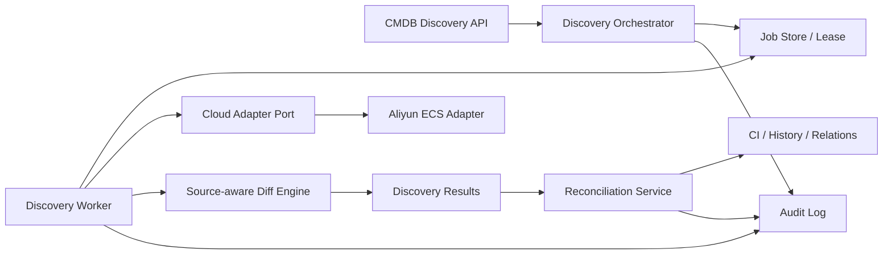
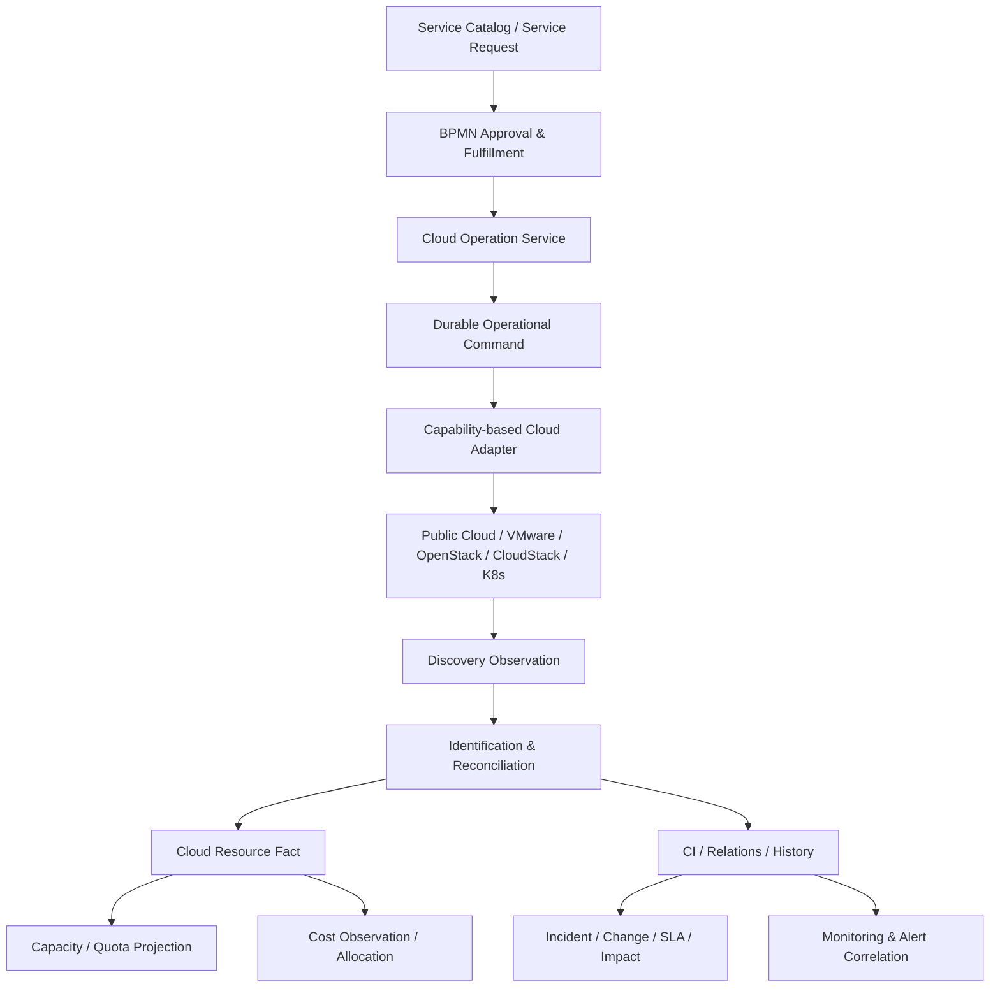

# CMDB 商业化收敛实施蓝图

## 1. 目标与发布结论

本蓝图将当前“页面很多、真实发现链路断裂、两套同步实现并存”的 CMDB，收敛为可在企业生产环境验收的 MVP。首个商业版本只承诺：CI 类型与实例、关系与拓扑、阿里云 ECS 发现、来源可追溯的幂等对账、作业治理、租户隔离和审计闭环。

本蓝图同时吸收仓库内 `easycloud/` 的企业云管理实践。EasyCloud 已验证的价值不在旧 Java/Struts 技术栈，而在其业务闭环：基础设施资源层级、云资源操作状态机、服务目录与订单、BPM 交付、异步任务、容量配额、监控告警和计费。当前项目只复用这些领域经验，不复制其静态工厂、内存任务队列、反射执行、明文凭据参数/日志、字符串拼接查询或厂商 SDK 侵入业务层等实现。

在以下门禁全部通过前，云发现保持 `pilot`，不得标记为 GA：

- 同一阿里云账号连续执行两次不会产生重复 CI；
- 跨租户账号、作业、结果和 CI 均不可读取或修改；
- 密钥不会通过 API、日志、作业错误或前端状态泄漏；
- 每次同步可查询请求人、来源、进度、结果、错误、重试和审计记录；
- 区域级失败可见、可重试，不能用“整体成功”掩盖部分失败；
- 云端资源消失先进入待退役/隔离期，不直接删除 CI；
- API 实例重启不会丢失正在执行的作业，也不会产生双重执行。

## 2. 当前架构问题

### 2.1 两条互不闭环的发现链路

| 链路 | 当前职责 | 问题 |
|---|---|---|
| `handlers/cmdb` | 暴露 discovery source/job/result API | Job 只入库不执行，source 不能关联 cloud account，结果无真实生产者 |
| `service/cloud.Runner` | Adapter → Discover → Reconcile | 绕过 discovery job/result 和审计；直接写 CI；分页、并发、失败语义和幂等身份不完整 |
| `service.CloudDiscoveryService` | 旧式 provider switch 与资源转换 | 与 Runner 重叠，包含未生产化 provider 实现，形成第三种扩展方式 |

根因不是缺少按钮，而是缺少唯一的领域编排者。继续在 Controller 中启动 goroutine，或让每个云厂商自行写 CI，只会扩大数据和治理分叉。

### 2.2 数据模型不能表达生产事实

- `DiscoverySource` 没有 `cloudAccountId`、服务范围、区域范围和调度策略；
- `DiscoveryJob` 没有幂等键、请求人、队列/租约/心跳、进度、重试、取消和结构化错误；
- `DiscoveryResult` 缺少来源指纹、前后哈希、区域、发现时间和退役候选语义；
- CI 查重仅依赖 `tenant + cloudResourceId`，不同账号、区域或资源类型可能冲突；
- Runner 获取了对账策略却未使用，且只处理单页；区域失败只写日志，最终可能仍返回成功；
- Adapter 注册依赖全局可变注册表，阿里云 ECS 没有稳定的启动期注册与能力自检。

### 2.3 产品边界失真

尚未闭环的云服务目录、云资源、发现、对账页面曾与 GA 功能并列，用户无法区分“可生产使用”和“代码占位”。商业版本必须由后端能力状态驱动导航和操作权限，而不是只隐藏菜单。

### 2.4 EasyCloud 经验与当前缺口映射

| EasyCloud 中真实出现并被业务使用的需求 | 当前项目现状 | 本蓝图吸收方式 |
|---|---|---|
| `Datacenter → Zone/Pod → Cluster → Host → VM` 基础设施层级 | CI 关系通用，但云 Adapter 只输出扁平资源 | 用标准资源类型与关系语义表达 provider/account/region/zone/vpc/subnet/cluster/host/vm/disk，不为每个厂商复制表 |
| VM、磁盘、快照、IP、网络的独立生命周期 | CloudResource 只有宽泛 status/lifecycleState | 引入 observed state、desired state、operation state、retirement state，禁止用一个字段混合表达 |
| 服务目录 → 订单 → BPM → 资源交付 | 已有 Service Catalog、Service Request、BPMN，但云资源未接入 | 以受控 CloudOperation command 连接服务请求和云 Adapter，CMDB 保存结果，不把供应逻辑塞进 CI Controller |
| 异步 `TJobTask` 与订单状态联动 | 已有可靠 command bus；发现仍未接线 | 沿用 durable command、lease/fencing/retry/dead-letter，禁止复刻 EasyCloud 的进程内静态队列 |
| 租户 → 应用系统 → 环境的资源归属 | CI 有 tenant/environment，缺业务服务归属闭环 | 增加 Business/Application Service 与云资源的 owned-by/serves/runs-on 关系，作为事件、变更、SLA 和成本归集主线 |
| 容量、配额、套餐和资源池 | 当前 CMDB 没有容量/配额领域 | 将 Capacity/Quota 作为 CMDB 只读聚合与独立策略领域，不塞入 CI attributes 作为不可治理 JSON |
| Zabbix 监控与告警联动资源 | 已有事件/告警入口，但资源身份关联较弱 | 监控事件先解析 canonical resource identity，再关联 CI；无法唯一识别时进入待匹配队列 |
| 日/月账单和租户/系统成本归集 | 当前不承诺 FinOps | 预留 CostObservation/Allocation 端口；首个 MVP 不实现计费，但资源身份和业务归属必须支持未来成本分摊 |
| CloudStack/OpenStack/VMware 等多平台适配 | 当前只有实验性阿里云 ECS Adapter | Adapter 按 capability 注册，不以 provider switch 或静态工厂分派；公有云、私有云和虚拟化共用端口 |

EasyCloud 还暴露了必须避免的反模式：资源操作请求携带并记录 AK/SK、Adapter 返回 `Object`、未支持操作返回 `null`、任务使用静态内存 List、反射执行任务类、状态使用魔法字符串、资源表直接混合订单/计费/基础设施细节。新架构必须使用类型化 capability、SecretProvider、稳定错误分类、持久化命令、显式状态机和领域边界。

## 3. 目标架构



### 3.1 唯一职责边界

- `handlers/cmdb` 是 CMDB 领域入口和事务边界，拥有 source、job、result、reconciliation 和 CI 变更规则；
- 云厂商代码只实现 `CloudDiscoveryAdapter` 端口，输出标准化资源，不直接写 Ent、CI 或审计表；
- Worker 只领取持久化作业并调用领域服务，不把业务状态放在进程内存；
- 对账服务是唯一可将发现结果应用到 CI 的组件；旧 `service.CloudDiscoveryService` 逐步降级为兼容入口，最终删除 provider switch；
- API、CLI 和定时调度都调用同一 `CreateDiscoveryJob` 用例，不复制同步规则。

### 3.2 核心不变量

1. 所有查询和唯一键都包含 `tenant_id`；后台 Worker 从 job 继承 tenant，不接受 Adapter 回传 tenant。
2. 云资源稳定身份包含 `(tenant, provider, partition, canonical_cloud_account_id, resource_scope, normalized_region, service_code, resource_type, provider_resource_id)`；regional/global/zonal 由 Adapter 声明。内部账号记录删除重建不能默默改变云资源身份。迁移前必须先生成冲突报告并人工处理，不能直接添加唯一约束。
3. 一个 source 同一时刻最多一个有效全量作业；客户端幂等键与规范化请求指纹共同判定重复，相同 key 不同请求必须返回冲突。
4. Job 状态只能按 `queued → discovering → discovered → reconciling → succeeded | partial_failed | failed | cancelled` 转移；状态更新使用数据库 CAS，取消请求只是控制信号。
5. Adapter 不持久化，不决定删除，不记录或返回明文凭据。
6. 每次应用变更必须同时保留 discovery result、CI 历史和 audit log；事务失败不得留下“已应用”结果。
7. 未发现资源按连续缺失次数和宽限期转为 `retirement_candidate`，需要策略或人工确认后退役。
8. 只有覆盖范围完整成功的全量快照才能增加缺失计数；失败、取消、分页不完整或区域级失败绝不能触发该范围的退役判断。
9. CI 属性需记录来源与 ownership；人工维护字段默认不被云发现覆盖，冲突进入结果供治理策略处理。
10. 资源事实、配置治理和执行意图分离：Observation 描述云端事实，CI 描述治理状态，CloudOperation 描述受控变更；任何 Adapter 不得直接把 desired state 写成 observed state。
11. 资源操作必须声明 capability、风险等级、前置状态、目标状态和 compensating action；创建、启停、扩缩容、挂载、快照和销毁不能复用一个无类型 command。
12. 基础设施层级和业务服务关系均使用规范化关系类型；provider-specific 字段可以保留在受控 metadata，但不能决定跨 Provider 的拓扑语义。
13. 监控、告警、成本和订单只能通过 canonical resource identity/CI ID 关联资源，不得分别维护另一套云资源主键。
14. 发现是只读能力，资源操作是单独授权的高风险能力；启用发现不得隐式获得启动、停止、扩容或销毁权限。
15. MSP 上下文必须显式区分 customer/owner tenant、operator tenant 和 delegation；作业保存不可变授权快照，执行前重新校验 delegation 未过期或撤销。
16. 关系发现必须先形成 `RelationshipObservation`；治理后的关系保留 source、generation、lastSeenAt、missingCount、confidence 和 active state，自动关系不得覆盖或删除人工关系。
17. 每个 scope 独立保存 coverage start/end、分页完成证明和 provider watermark；失败 scope 的补采可以属于同一 logical job，但不能伪装成同一时间快照或触发全局退役。

### 3.3 多云控制面与 CMDB 的边界



- Provider 是运行时 observed state 的权威来源；CMDB 是规范身份、关系、治理属性和历史的记录系统；BPMN/Service Request 是 desired intent 与审批权威；Operation Ledger 是执行状态权威；Monitoring 是遥测权威；Billing Source 是账单金额权威。
- Cloud Operation Service 是写操作唯一业务所有者，负责状态机、审批要求、幂等、审计和补偿；Adapter 只是执行端口。
- Service Catalog 定义用户可申请的产品，BPMN 决定审批和交付步骤，Capacity/Quota 决定能否分配，CMDB 接收最终资源事实。
- Monitoring 和 Cost 作为观察源接入同一资源身份，不反向覆盖 CMDB 人工治理字段。

## 4. 数据与接口契约

### 4.1 Discovery Source

新增 `cloud_account_id`、`service_codes`、`regions`、`schedule`、`reconcile_policy`、`stale_threshold`、`last_success_at`。创建或更新 source 时必须验证账号属于当前租户且处于 enabled/healthy 状态。

### 4.2 Discovery Job

新增 `idempotency_key`、`request_fingerprint`、`source_snapshot`、`scope_snapshot`、`completed_scopes`、`failed_scopes`、`snapshot_generation`、`requested_by`、`queued_at`、`heartbeat_at`、`lease_owner`、`lease_expires_at`、`fencing_token`、`attempt`、`parent_job_id`、`max_attempts`、`progress`、`error_code`、`error_message`、`cancel_requested_at`。唯一约束为 `(tenant_id, operation, source_id, idempotency_key)`；同 key 同 fingerprint 返回原 job，不同 fingerprint 返回冲突。领取作业必须使用条件更新和租约，Worker 的每次进度、结果和状态写入都校验 fencing token，避免旧执行者在租约过期后继续落库。

### 4.3 Discovery Result 与 CI 来源

Result 保存标准化资源快照或受控 diff、资源身份、before/after hash、动作、应用状态和错误；状态按 `pending → applying → applied | rejected | apply_failed` 转移，`job + resource_identity` 唯一。CI 增加或复用来源字段保存 `source_id`、canonical account、`last_seen_at`、`missing_count` 和来源指纹。索引与唯一约束必须与稳定身份一致。

### 4.4 API

- `POST /cmdb/discovery/jobs`：只创建持久化 job，支持 `Idempotency-Key`；
- `GET /cmdb/discovery/jobs/:id`：状态、进度、区域统计和可重试错误；
- `POST /cmdb/discovery/jobs/:id/retry|cancel`：显式状态机和权限审计；
- `GET /cmdb/discovery/jobs/:id/results`：分页结果和应用状态；
- `POST /cmdb/cloud-accounts/:id/health-check`：仅返回 masked metadata、权限检查结果和延迟；
- `GET /cmdb/capabilities`：分别返回 build capability、deployment readiness、tenant readiness 与 actor permission。前端取四层交集，但后端仍独立执行 ACL，capability 不能代替授权。

所有请求和响应继续遵循 `{code,message,data}` 与 camelCase DTO；Controller 不返回 Ent。

## 5. 分阶段实施（每阶段一个可回滚 PR）

### PR 1：产品边界与安全基线

- 保留 CI、类型、关系、拓扑为 GA；云账号与阿里云 ECS 为 pilot；其余 provider 和云服务页 disabled；
- 云凭据 API 只返回 `hasCredential`，空凭据更新保持原值；
- 未接通的发现 API fail closed，禁止创建永远 pending 的假作业；
- 发布 CMDB MVP 和生产验收清单。

状态：当前工作区已实现，待随本轮统一验证提交。

### PR 2：领域端口与能力自检

- 在 `handlers/cmdb` 定义 `DiscoveryExecutor`/Adapter 端口和标准资源 DTO；
- 以依赖注入替代业务代码直接读取全局 registry；启动时显式注册阿里云 ECS；
- 增加 capability/health 自检，缺 Adapter、凭据解析器或 Worker 时后端返回 disabled；
- 旧 `CloudDiscoveryService` 只委托新入口，并标记弃用。

回滚：移除注入并保持 PR 1 fail-closed；不改变 CI 数据。

### PR 3：作业治理 Schema 与迁移

- 扩展 source/job/result 与 CI 来源字段、索引和唯一约束；
- 对历史记录执行可重入 backfill，无法确定来源的记录标记 `legacy`，不自动绑定；
- 添加唯一约束前先输出冲突清单；默认停止迁移，不静默合并或删除历史 CI；
- 先上线非唯一索引和双读/双写，完成 dry-run、backfill、行数/hash 校验与恢复演练后再启用唯一约束；明确 contract 的最低等待版本和回滚截止点；
- 增加状态机、租约、心跳、重试和取消的服务层单元测试；
- 迁移采用 expand/backfill/contract，旧字段至少保留一个兼容发布周期。

状态：当前工作区已实现 expand/backfill/contract 脚本、规范资源身份双写、来源治理字段、作业状态机与租约/fencing 领域规则；contract 必须等待 expand 上线至少一个兼容版本并在目标环境完成 dry-run 后执行。

回滚：应用回滚仍能读取 expand 后字段；contract 迁移只在稳定版本执行。

### PR 4：阿里云 ECS 真实采集

- `env://ITSM_ALIYUN` 仅允许单租户开发/staging；商业部署必须使用 tenant-scoped SecretProvider reference，并校验 secret ownership；
- 动态区域、完整分页、请求超时、限流退避、有限并发和区域级错误；
- 权限仅要求只读 API，健康检查区分网络、认证、权限和配额错误；
- Job 只记录 credential version；Provider 错误分类、限长和脱敏后才能持久化；定义凭据轮换/撤销和账号禁用时在途作业行为；
- Adapter 输出标准资源，不写数据库。
- 每个分页/区域生成覆盖证明；只有完整覆盖范围才能参与缺失与退役计算。

回滚：能力状态切回 disabled，保留已完成作业与结果。

### PR 5：持久化 Worker 与结果落库

- 独立 Worker 领取 job，支持 lease、heartbeat、fencing、取消和 attempt 历史；
- 只完成采集与 discovery result 落库，不在 API 进程中临时执行，不直接应用 CI；
- Source 配置、区域和服务范围以不可变 snapshot 随 job 保存；
- 进程重启后过期租约可恢复，旧 fencing token 的迟到写入被拒绝。

回滚：停止 Worker，队列与结果保持可恢复，API 和已有 CI 不受影响。

### PR 6：幂等 Diff 与对账闭环

- 先落 discovery results，再由 ReconciliationService 按策略应用；
- create/update/no_change/retirement_candidate 均可计数和追踪；
- CI 更新、历史、result applied 和 audit 在同一事务；
- 字段级来源/ownership 决定云端、人工和其他来源的覆盖优先级，冲突可审阅；
- 重复资源、跨账号同名/同 ID、字段漂移和连续缺失均有测试。
- Audit 强制 tenant、actor、request/job/attempt/result/CI correlation、动作、原因和前后 hash；Worker 使用 system actor，禁止敏感快照。

回滚：关闭自动 apply，保留 results 供人工审阅；禁止删除 CI。

### PR 7：运维面与 Pilot 控制台

- 所有 Worker 写操作携带 fencing token；旧 lease owner 的迟到写入必须被数据库条件更新拒绝；
- 提供 Prometheus 指标、结构化日志和告警：队列深度、耗时、失败率、区域失败、变更量异常；
- Job 运行时凭据轮换或撤销必须安全失败。
- 云账号页提供 masked 凭据状态、健康检查、最后成功时间；
- 作业页展示进度、区域结果、错误、重试/取消；
- 对账页支持过滤高风险变更、批量确认与拒绝，操作写审计；
- loading/empty/error/permission-denied/success 状态完整。
- 提供最小数据治理指标：必填字段/负责人/业务服务完整率、stale CI、来源健康度、同步覆盖率和来源冲突。

回滚：隐藏 pilot capability，后端治理 API 保留。

### PR 8：生产验收与 GA 晋级

- 后端 integration test 覆盖租户隔离、幂等、租约、重试、退役策略和审计原子性；
- Playwright 覆盖账号配置 → 健康检查 → 创建作业 → 查看结果 → 重试/治理；
- 使用真实阿里云只读账号执行 staging 验收，并保存脱敏报告；
- 完成 1k/10k/100k 资源规模基准、故障注入和恢复演练后，才将 `aliyunEcsDiscovery` 升为 GA。
- 首版只承诺 ECS CI 发现，不承诺自动云拓扑；如要宣称云拓扑，必须另行纳入 VPC、VSwitch、安全组和磁盘关系的来源、幂等与退役规则。

### PR 8.5：多云控制面安全与权威来源 ADR

PR9–PR14 开始前必须批准 ADR，冻结以下跨领域契约：

- `identityVersion`、provider-native full ID/ARN、immutable external account ID、scope locator、incarnation/tombstone 和 identity alias/redirect 迁移协议；
- `CloudDiscoveryAdapter` 与 `CloudOperationAdapter` 分离，分别使用只读/写凭据和 capability grant；
- 市场 Connector 默认独立进程/容器，通过受限 RPC、secret broker 和短期凭据运行，并具备签名来源校验、网络出口 allowlist、资源/超时限额、版本握手和单 Connector 熔断；
- owner/customer tenant、operator tenant、delegationId、requestedBy、executedBy、system reason 的统一身份模型；
- Provider、CMDB、Workflow、Operation、Monitoring、Billing 的权威来源矩阵；
- capability version/rollout epoch、drain/cancel/quarantine/read-only 停机模式，以及在途命令、不可取消请求和 schema downgrade 的处置协议；
- Observation 大载荷只在关系库存索引、hash、状态和引用；内容寻址对象存储负责压缩、加密、脱敏、保留、归档、legal hold 和删除。

回滚：ADR 不引入运行时变更；未批准时 PR9–PR14 不得开始。

### PR 9：规范资源模型与基础设施拓扑（GA 后第二阶段）

- 定义稳定 core kind + 可版本化 discovery profile/schema + capability；account、region、zone、network、subnet、cluster、host、vm、disk、snapshot、ip、load-balancer、database 是首批 profile，不固化为不可扩展枚举；
- 定义 contains、located-in、runs-on、attached-to、connected-to、serves、owned-by 等规范关系和方向，不沿用厂商 API 名称作为关系类型；
- 阿里云补齐 VPC、VSwitch、ECS、磁盘、安全组关系；覆盖关系重复、关系消失、环路和部分 scope 失败；
- 建立业务服务/Application Service 到云资源的归属关系，为事件、变更、SLA 和成本归集提供稳定入口；
- 引入 RelationshipObservation；关系约束按类型定义允许的 source/target kind、方向、基数、对称性和 acyclic 规则，不能笼统禁止网络关系成环；
- 对拓扑规模增加 node budget、关系类型过滤和异步大图导出。

回滚：关闭 topology discovery capability，并按 source/generation 停用自动关系，使其退出拓扑和影响分析；保留 observation 和人工关系。

### PR 10：受控云资源操作端口

- 定义 capability manifest 和类型化操作：start/stop/reboot/resize/attach/detach/snapshot/retire；首批可以实现 start/stop/reboot，但 stop/reboot 默认仍按生产高风险变更评估；
- 每个操作具有 source state、target state、operation state、version、idempotency key、approval requirement、timeout 和补偿策略；
- Operation 状态机至少为 `accepted → approved → dispatching → providerAccepted → verifying → succeeded | failed | outcomeUnknown | manualReview`；远程调用前读取 Provider 实时状态并验证 precondition，不能信任可能过期的 CI 状态；
- Service Request/BPMN 在事务中 enqueue CloudOperation command，Worker 重新加载 tenant、actor delegated scope、CI、账号和 connector；
- Provider 支持 request token 时透传幂等键并持久化 provider request ID、请求/响应摘要与 postcondition；Provider 不支持幂等或结果不确定时禁止盲重试，进入 outcomeUnknown 并核验；
- 风险由操作类型、环境、CI 关键度、业务服务影响、变更窗口和 delegated scope 共同计算；compensation 是可选 capability，并区分 compensatable/non-compensatable/irreversible；
- 销毁、网络和权限类操作继续 disabled，直到单独安全评审。

回滚：提升 rollout epoch，阻止旧命令继续 claim/dispatch，按 drain/cancel/quarantine 协议处理在途任务和 outcomeUnknown；不影响只读发现。

### PR 11：容量、资源池与配额投影

- 借鉴 EasyCloud 的 pool/zone/cluster/host 层级，但明确拆分 CapacityObservation（CPU/内存/存储/IP）、ProviderQuotaObservation（厂商限额）、TenantEntitlement（租户申请上限）和 Budget/Credit（FinOps 金额预算）；不把瞬时指标写入 CI 主表；
- Capacity service 按 tenant/account/region/zone/pool/resourceType 聚合 total/allocated/used/reserved/available；
- 服务目录申请在 BPMN 交付前执行 quota/capacity reservation，失败必须释放预留；
- 配额变更、预留、消耗和释放全部记录 ledger 与审计，使用版本或条件更新防超卖；
- reservation 具有 TTL、幂等释放、超时回收和账实核对；硬预留依赖 PR10 operation saga 完成；
- 初期只做容量可视化与软门禁，硬门禁需完成并发和恢复演练后启用。

回滚：关闭配额门禁，保留只读容量投影和 ledger。

### PR 12：监控告警与资源关联闭环

- Zabbix、云监控和 Connector 告警统一映射 canonical resource identity；
- 唯一匹配时关联 CI 并执行影响分析，零匹配/多匹配进入待治理队列，不猜测 CI；
- 告警去重、恢复、抑制和事件创建分别保留 provider event ID、规则版本和资源快照摘要；
- 事件关闭不得修改云资源 observed state，状态恢复由监控 observation 更新；
- 建立账号、Region、服务和业务服务维度的可用性视图。

回滚：停止自动事件创建，保留告警观察和人工关联。

### PR 13：成本观察与业务归集基础

- 定义只读 CostObservation 和 AllocationRule，不实现 EasyCloud 式平台余额/扣费；
- 成本记录关联 canonical resource identity、billing account、period、currency、charge type 和 provider invoice line；
- 通过 CI owned-by/serves 关系归集到 tenant、部门、应用系统、环境和业务服务；
- 未分配成本、共享成本和规则变更必须可追踪，历史账期不可因当前关系变化而重写；
- 保存 effective period、billing timezone、invoice version/correction、currency precision、税费/折扣和分摊规则快照；关账后只允许更正记录，不原地改写；
- 对外定位为成本可见性/Showback，计费和 Chargeback 另立产品评审。

回滚：隐藏成本页面，保留原始成本观察用于重新归集。

### PR 14：多 Provider 与连接器市场化

- 依次接入腾讯云 CVM、华为云 ECS、AWS EC2、Azure VM，再扩展 VMware/OpenStack/CloudStack/Kubernetes；
- Adapter 包提供 manifest、capabilities、resource schemas、permission requirements、rate limits、health check、版本和兼容矩阵；只读 Discovery 与写 Operation 分别认证；
- 市场 Connector 通过 ADR 定义的隔离运行时执行，不加载进核心 API/Worker 进程；Connector 只能通过 secret broker 获取 tenant/capability scoped 短期凭据；
- Connector 安装、配置、启用、健康检查、升级、禁用和卸载均走市场生命周期与审计；
- 每个 Provider 必须通过同一 contract test suite：分页、限流、partial failure、identity、关系、退役、凭据轮换和敏感信息测试；
- 禁止 Adapter 自建表、直接访问其他领域 repository 或绕过 command/reconciliation。

回滚：按 connector capability 禁用单个 Provider，不影响核心 CMDB 和其他 Provider。

## 6. 依赖关系与执行顺序

```text
商业 MVP：PR1 → PR2 → PR3 → PR4 → PR5 → PR6 → PR7 → PR8

第二阶段：PR8 → PR8.5 → PR9 ─┬→ PR10 → PR11
                              ├→ PR12
                              └→ PR13

只读 Provider 扩展：PR3–PR9 + Discovery Contract Suite → PR14 Discovery
写操作 Provider 扩展：PR10 + Operation Security Suite → PR14 Operation
```

PR4 的 Adapter 可与 PR3 后半并行开发，但不得在 PR5 Worker 落地前接入 HTTP 入口。PR7 不得通过前端本地常量越过后端 capability。

PR10、PR12、PR13 可以在 PR9 的资源身份和关系契约稳定后并行开发；PR11 的硬预留依赖 PR10 operation saga。它们不得分别创建资源主数据。PR14 必须继承 PR3–PR9 的 Job/Result/Reconciliation/Audit，并建立统一 Adapter contract test suite，不能以复制阿里云实现的方式扩展厂商。

## 7. 生产验收门禁

1. 使用同一账号、同一资源集连续同步 3 次，第二、三次 `created=0` 且 CI 总数不变；
2. 两个账号出现相同 provider resource ID 时仍生成两个正确归属的 CI；
3. A 租户无法通过猜测 ID 查询 B 租户 source/job/result/account/CI；
4. 100 个区域/分页请求中的部分失败产生 `partial_failed`，重试只补失败范围；
5. Worker 在采集、落结果、应用 CI 三个阶段被终止后均可恢复且不重复应用；
6. 资源消失一次不退役，达到阈值后只进入候选，批准后才退役；
7. API、浏览器响应、应用日志和审计导出中不存在 AccessKey Secret；
8. 取消、重试、批量确认和拒绝均具备请求人、时间、原因和目标记录；
9. 10k 资源同步在约定时间预算内完成，API 查询仍满足分页和响应预算；
10. 无 Worker、无 Adapter、凭据缺失或阿里云不可达时能力明确降级，不出现假成功。
11. 部分区域或分页失败绝不增加对应 scope 的 `missingCount`，重试继承同一 snapshot generation；
12. 同一 idempotency key 不同 payload 返回冲突，旧 fencing token 的所有写入均被拒绝；
13. 账号禁用/删除、凭据轮换、Source 配置变更时，在途和排队作业行为符合版本化策略；
14. 查看、执行、取消、重试、确认和批量治理分别经过 RBAC/Endpoint ACL；
15. 超长 Provider 错误、恶意资源名和异常 JSON 不污染日志或 UI；结果和快照具备保留、归档与清理策略。

## 8. 明确不进入首个商业 MVP

- AWS、Azure、腾讯云、华为云真实同步；
- 自动发现任意云服务、Kubernetes、网络探针和 Agent；
- 无人工门禁的自动删除、跨源自动合并和 AI 自主变更 CI；
- 完整 ServiceNow CSDM 建模与计费/FinOps；
- 连接器市场安装云 Adapter（首版使用内置、可审计 Adapter）。

这些能力必须复用同一 Adapter、Job、Result、Reconciliation 和 Audit 扩展点，不再创建平行同步机制。

## 9. EasyCloud 经验验收清单

第二阶段能力只有满足以下条件才可宣称“多云管理”，否则仍应称为“云资源发现”：

1. 能从账号下钻到 Region/Zone/网络/集群/主机/实例/磁盘，并保留来源和关系历史；
2. 资源同时具备租户、业务系统/业务服务、环境和技术所有者归属，未知归属可治理；
3. 服务目录申请经过 BPMN、容量/配额判断、可靠命令执行和结果回写，不由页面直接调用云 API；
4. 启停、扩缩容、挂载、快照和退役具有显式状态机、幂等、超时、审计和失败恢复；
5. 云告警能够通过稳定身份关联 CI 和影响范围，不能唯一匹配时不会错误建单；
6. 容量数据与 CI 配置数据分离，瞬时指标不会制造海量 CI 历史；
7. 成本能够按历史归属规则汇总，规则变化不重写已结算账期；
8. 公有云、私有云、虚拟化和 Kubernetes Adapter 通过同一能力与安全契约；
9. 任一 Provider 下线、限流或凭据撤销不会阻断其他 Provider，也不会将缺失资源误退役；
10. 所有高风险写操作均可按 tenant、actor、request、workflow、operation、provider request ID 和 CI 追溯。

## 10. 第二阶段工程门禁

- PR9：连续三次关系同步不重复；部分 scope 失败不退役边；人工关系不受自动发现影响；10 万节点/50 万边满足查询和异步导出预算。
- PR10：重复 dispatch、无 provider idempotency token、授权撤销、实时 precondition、kill switch、进程终止和 outcomeUnknown 均有真实 Worker 测试；停止/重启生产 CI 必须经过变更策略。
- PR11：并发 reservation 零超卖；TTL 自动回收；重放不重复扣减；失败路径释放预留；ledger 与资源账实一致。
- PR12：告警风暴、乱序恢复、重复事件、零匹配、多匹配和跨租户拒绝均有真实入口测试。
- PR13：重复账单、更正账单、分配金额守恒、规则版本、关账不可变、币种精度和账期时区通过测试。
- PR14：Connector 越权访问、secret 外传、崩溃/超时、升级/降级和单 Provider 熔断通过隔离测试；卸载必须先 revoke capability/secret，再 drain 在途调用。
