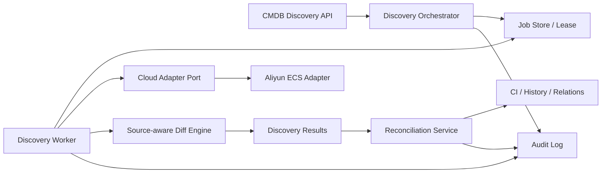

# CMDB 商业化收敛实施蓝图

## 1. 目标与发布结论

本蓝图将当前“页面很多、真实发现链路断裂、两套同步实现并存”的 CMDB，收敛为可在企业生产环境验收的 MVP。首个商业版本只承诺：CI 类型与实例、关系与拓扑、阿里云 ECS 发现、来源可追溯的幂等对账、作业治理、租户隔离和审计闭环。

在以下门禁全部通过前，云发现保持 `pilot`，不得标记为 GA：

- 同一阿里云账号连续执行两次不会产生重复 CI；
- 跨租户账号、作业、结果和 CI 均不可读取或修改；
- 密钥不会通过 API、日志、作业错误或前端状态泄漏；
- 每次同步可查询请求人、来源、进度、结果、错误、重试和审计记录；
- 区域级失败可见、可重试，不能用“整体成功”掩盖部分失败；
- 云端资源消失先进入待退役/隔离期，不直接删除 CI；
- API 实例重启不会丢失正在执行的作业，也不会产生双重执行。

## 2. 当前架构问题

### 2.1 两条互不闭环的发现链路

| 链路 | 当前职责 | 问题 |
|---|---|---|
| `handlers/cmdb` | 暴露 discovery source/job/result API | Job 只入库不执行，source 不能关联 cloud account，结果无真实生产者 |
| `service/cloud.Runner` | Adapter → Discover → Reconcile | 绕过 discovery job/result 和审计；直接写 CI；分页、并发、失败语义和幂等身份不完整 |
| `service.CloudDiscoveryService` | 旧式 provider switch 与资源转换 | 与 Runner 重叠，包含未生产化 provider 实现，形成第三种扩展方式 |

根因不是缺少按钮，而是缺少唯一的领域编排者。继续在 Controller 中启动 goroutine，或让每个云厂商自行写 CI，只会扩大数据和治理分叉。

### 2.2 数据模型不能表达生产事实

- `DiscoverySource` 没有 `cloudAccountId`、服务范围、区域范围和调度策略；
- `DiscoveryJob` 没有幂等键、请求人、队列/租约/心跳、进度、重试、取消和结构化错误；
- `DiscoveryResult` 缺少来源指纹、前后哈希、区域、发现时间和退役候选语义；
- CI 查重仅依赖 `tenant + cloudResourceId`，不同账号、区域或资源类型可能冲突；
- Runner 获取了对账策略却未使用，且只处理单页；区域失败只写日志，最终可能仍返回成功；
- Adapter 注册依赖全局可变注册表，阿里云 ECS 没有稳定的启动期注册与能力自检。

### 2.3 产品边界失真

尚未闭环的云服务目录、云资源、发现、对账页面曾与 GA 功能并列，用户无法区分“可生产使用”和“代码占位”。商业版本必须由后端能力状态驱动导航和操作权限，而不是只隐藏菜单。

## 3. 目标架构



### 3.1 唯一职责边界

- `handlers/cmdb` 是 CMDB 领域入口和事务边界，拥有 source、job、result、reconciliation 和 CI 变更规则；
- 云厂商代码只实现 `CloudDiscoveryAdapter` 端口，输出标准化资源，不直接写 Ent、CI 或审计表；
- Worker 只领取持久化作业并调用领域服务，不把业务状态放在进程内存；
- 对账服务是唯一可将发现结果应用到 CI 的组件；旧 `service.CloudDiscoveryService` 逐步降级为兼容入口，最终删除 provider switch；
- API、CLI 和定时调度都调用同一 `CreateDiscoveryJob` 用例，不复制同步规则。

### 3.2 核心不变量

1. 所有查询和唯一键都包含 `tenant_id`；后台 Worker 从 job 继承 tenant，不接受 Adapter 回传 tenant。
2. 云资源稳定身份包含 `(tenant, provider, partition, canonical_cloud_account_id, resource_scope, normalized_region, service_code, resource_type, provider_resource_id)`；regional/global/zonal 由 Adapter 声明。内部账号记录删除重建不能默默改变云资源身份。迁移前必须先生成冲突报告并人工处理，不能直接添加唯一约束。
3. 一个 source 同一时刻最多一个有效全量作业；客户端幂等键与规范化请求指纹共同判定重复，相同 key 不同请求必须返回冲突。
4. Job 状态只能按 `queued → discovering → discovered → reconciling → succeeded | partial_failed | failed | cancelled` 转移；状态更新使用数据库 CAS，取消请求只是控制信号。
5. Adapter 不持久化，不决定删除，不记录或返回明文凭据。
6. 每次应用变更必须同时保留 discovery result、CI 历史和 audit log；事务失败不得留下“已应用”结果。
7. 未发现资源按连续缺失次数和宽限期转为 `retirement_candidate`，需要策略或人工确认后退役。
8. 只有覆盖范围完整成功的全量快照才能增加缺失计数；失败、取消、分页不完整或区域级失败绝不能触发该范围的退役判断。
9. CI 属性需记录来源与 ownership；人工维护字段默认不被云发现覆盖，冲突进入结果供治理策略处理。

## 4. 数据与接口契约

### 4.1 Discovery Source

新增 `cloud_account_id`、`service_codes`、`regions`、`schedule`、`reconcile_policy`、`stale_threshold`、`last_success_at`。创建或更新 source 时必须验证账号属于当前租户且处于 enabled/healthy 状态。

### 4.2 Discovery Job

新增 `idempotency_key`、`request_fingerprint`、`source_snapshot`、`scope_snapshot`、`completed_scopes`、`failed_scopes`、`snapshot_generation`、`requested_by`、`queued_at`、`heartbeat_at`、`lease_owner`、`lease_expires_at`、`fencing_token`、`attempt`、`parent_job_id`、`max_attempts`、`progress`、`error_code`、`error_message`、`cancel_requested_at`。唯一约束为 `(tenant_id, operation, source_id, idempotency_key)`；同 key 同 fingerprint 返回原 job，不同 fingerprint 返回冲突。领取作业必须使用条件更新和租约，Worker 的每次进度、结果和状态写入都校验 fencing token，避免旧执行者在租约过期后继续落库。

### 4.3 Discovery Result 与 CI 来源

Result 保存标准化资源快照或受控 diff、资源身份、before/after hash、动作、应用状态和错误；状态按 `pending → applying → applied | rejected | apply_failed` 转移，`job + resource_identity` 唯一。CI 增加或复用来源字段保存 `source_id`、canonical account、`last_seen_at`、`missing_count` 和来源指纹。索引与唯一约束必须与稳定身份一致。

### 4.4 API

- `POST /cmdb/discovery/jobs`：只创建持久化 job，支持 `Idempotency-Key`；
- `GET /cmdb/discovery/jobs/:id`：状态、进度、区域统计和可重试错误；
- `POST /cmdb/discovery/jobs/:id/retry|cancel`：显式状态机和权限审计；
- `GET /cmdb/discovery/jobs/:id/results`：分页结果和应用状态；
- `POST /cmdb/cloud-accounts/:id/health-check`：仅返回 masked metadata、权限检查结果和延迟；
- `GET /cmdb/capabilities`：分别返回 build capability、deployment readiness、tenant readiness 与 actor permission。前端取四层交集，但后端仍独立执行 ACL，capability 不能代替授权。

所有请求和响应继续遵循 `{code,message,data}` 与 camelCase DTO；Controller 不返回 Ent。

## 5. 分阶段实施（每阶段一个可回滚 PR）

### PR 1：产品边界与安全基线

- 保留 CI、类型、关系、拓扑为 GA；云账号与阿里云 ECS 为 pilot；其余 provider 和云服务页 disabled；
- 云凭据 API 只返回 `hasCredential`，空凭据更新保持原值；
- 未接通的发现 API fail closed，禁止创建永远 pending 的假作业；
- 发布 CMDB MVP 和生产验收清单。

状态：当前工作区已实现，待随本轮统一验证提交。

### PR 2：领域端口与能力自检

- 在 `handlers/cmdb` 定义 `DiscoveryExecutor`/Adapter 端口和标准资源 DTO；
- 以依赖注入替代业务代码直接读取全局 registry；启动时显式注册阿里云 ECS；
- 增加 capability/health 自检，缺 Adapter、凭据解析器或 Worker 时后端返回 disabled；
- 旧 `CloudDiscoveryService` 只委托新入口，并标记弃用。

回滚：移除注入并保持 PR 1 fail-closed；不改变 CI 数据。

### PR 3：作业治理 Schema 与迁移

- 扩展 source/job/result 与 CI 来源字段、索引和唯一约束；
- 对历史记录执行可重入 backfill，无法确定来源的记录标记 `legacy`，不自动绑定；
- 添加唯一约束前先输出冲突清单；默认停止迁移，不静默合并或删除历史 CI；
- 先上线非唯一索引和双读/双写，完成 dry-run、backfill、行数/hash 校验与恢复演练后再启用唯一约束；明确 contract 的最低等待版本和回滚截止点；
- 增加状态机、租约、心跳、重试和取消的服务层单元测试；
- 迁移采用 expand/backfill/contract，旧字段至少保留一个兼容发布周期。

回滚：应用回滚仍能读取 expand 后字段；contract 迁移只在稳定版本执行。

### PR 4：阿里云 ECS 真实采集

- `env://ITSM_ALIYUN` 仅允许单租户开发/staging；商业部署必须使用 tenant-scoped SecretProvider reference，并校验 secret ownership；
- 动态区域、完整分页、请求超时、限流退避、有限并发和区域级错误；
- 权限仅要求只读 API，健康检查区分网络、认证、权限和配额错误；
- Job 只记录 credential version；Provider 错误分类、限长和脱敏后才能持久化；定义凭据轮换/撤销和账号禁用时在途作业行为；
- Adapter 输出标准资源，不写数据库。
- 每个分页/区域生成覆盖证明；只有完整覆盖范围才能参与缺失与退役计算。

回滚：能力状态切回 disabled，保留已完成作业与结果。

### PR 5：持久化 Worker 与结果落库

- 独立 Worker 领取 job，支持 lease、heartbeat、fencing、取消和 attempt 历史；
- 只完成采集与 discovery result 落库，不在 API 进程中临时执行，不直接应用 CI；
- Source 配置、区域和服务范围以不可变 snapshot 随 job 保存；
- 进程重启后过期租约可恢复，旧 fencing token 的迟到写入被拒绝。

回滚：停止 Worker，队列与结果保持可恢复，API 和已有 CI 不受影响。

### PR 6：幂等 Diff 与对账闭环

- 先落 discovery results，再由 ReconciliationService 按策略应用；
- create/update/no_change/retirement_candidate 均可计数和追踪；
- CI 更新、历史、result applied 和 audit 在同一事务；
- 字段级来源/ownership 决定云端、人工和其他来源的覆盖优先级，冲突可审阅；
- 重复资源、跨账号同名/同 ID、字段漂移和连续缺失均有测试。
- Audit 强制 tenant、actor、request/job/attempt/result/CI correlation、动作、原因和前后 hash；Worker 使用 system actor，禁止敏感快照。

回滚：关闭自动 apply，保留 results 供人工审阅；禁止删除 CI。

### PR 7：运维面与 Pilot 控制台

- 所有 Worker 写操作携带 fencing token；旧 lease owner 的迟到写入必须被数据库条件更新拒绝；
- 提供 Prometheus 指标、结构化日志和告警：队列深度、耗时、失败率、区域失败、变更量异常；
- Job 运行时凭据轮换或撤销必须安全失败。
- 云账号页提供 masked 凭据状态、健康检查、最后成功时间；
- 作业页展示进度、区域结果、错误、重试/取消；
- 对账页支持过滤高风险变更、批量确认与拒绝，操作写审计；
- loading/empty/error/permission-denied/success 状态完整。
- 提供最小数据治理指标：必填字段/负责人/业务服务完整率、stale CI、来源健康度、同步覆盖率和来源冲突。

回滚：隐藏 pilot capability，后端治理 API 保留。

### PR 8：生产验收与 GA 晋级

- 后端 integration test 覆盖租户隔离、幂等、租约、重试、退役策略和审计原子性；
- Playwright 覆盖账号配置 → 健康检查 → 创建作业 → 查看结果 → 重试/治理；
- 使用真实阿里云只读账号执行 staging 验收，并保存脱敏报告；
- 完成 1k/10k/100k 资源规模基准、故障注入和恢复演练后，才将 `aliyunEcsDiscovery` 升为 GA。
- 首版只承诺 ECS CI 发现，不承诺自动云拓扑；如要宣称云拓扑，必须另行纳入 VPC、VSwitch、安全组和磁盘关系的来源、幂等与退役规则。

## 6. 依赖关系与执行顺序

```text
PR1 → PR2 → PR3 → PR4 → PR5 → PR6 → PR7 → PR8
```

PR4 的 Adapter 可与 PR3 后半并行开发，但不得在 PR5 Worker 落地前接入 HTTP 入口。PR7 不得通过前端本地常量越过后端 capability。

## 7. 生产验收门禁

1. 使用同一账号、同一资源集连续同步 3 次，第二、三次 `created=0` 且 CI 总数不变；
2. 两个账号出现相同 provider resource ID 时仍生成两个正确归属的 CI；
3. A 租户无法通过猜测 ID 查询 B 租户 source/job/result/account/CI；
4. 100 个区域/分页请求中的部分失败产生 `partial_failed`，重试只补失败范围；
5. Worker 在采集、落结果、应用 CI 三个阶段被终止后均可恢复且不重复应用；
6. 资源消失一次不退役，达到阈值后只进入候选，批准后才退役；
7. API、浏览器响应、应用日志和审计导出中不存在 AccessKey Secret；
8. 取消、重试、批量确认和拒绝均具备请求人、时间、原因和目标记录；
9. 10k 资源同步在约定时间预算内完成，API 查询仍满足分页和响应预算；
10. 无 Worker、无 Adapter、凭据缺失或阿里云不可达时能力明确降级，不出现假成功。
11. 部分区域或分页失败绝不增加对应 scope 的 `missingCount`，重试继承同一 snapshot generation；
12. 同一 idempotency key 不同 payload 返回冲突，旧 fencing token 的所有写入均被拒绝；
13. 账号禁用/删除、凭据轮换、Source 配置变更时，在途和排队作业行为符合版本化策略；
14. 查看、执行、取消、重试、确认和批量治理分别经过 RBAC/Endpoint ACL；
15. 超长 Provider 错误、恶意资源名和异常 JSON 不污染日志或 UI；结果和快照具备保留、归档与清理策略。

## 8. 明确不进入首个商业 MVP

- AWS、Azure、腾讯云、华为云真实同步；
- 自动发现任意云服务、Kubernetes、网络探针和 Agent；
- 无人工门禁的自动删除、跨源自动合并和 AI 自主变更 CI；
- 完整 ServiceNow CSDM 建模与计费/FinOps；
- 连接器市场安装云 Adapter（首版使用内置、可审计 Adapter）。

这些能力必须复用同一 Adapter、Job、Result、Reconciliation 和 Audit 扩展点，不再创建平行同步机制。
