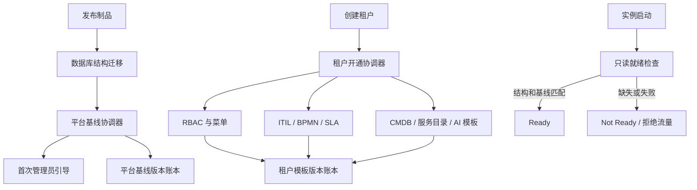

# ITSM 生产级数据初始化完善蓝图

## 1. 目标与发布结论

目标是将当前“应用启动时按开关执行 Ent Schema.Create + 裸 SQL + Seeder”的模式，改造为可审计、可版本化、可重入、可恢复、租户隔离且默认安全的生产初始化体系。

达到本蓝图的全部发布门禁后，系统应支持：

- 私有化、SaaS、SaaS+MSP 三种部署模式的一致初始化流程；
- 新库首次安装、旧库滚动升级、新租户开通、租户模板升级四种独立场景；
- 核心系统数据与演示/测试数据严格隔离；
- 系统模板升级不覆盖客户自定义配置；
- 数据库迁移和数据初始化失败时阻止实例接流量；
- 初始化执行结果可通过 CLI、API、日志和审计记录查询；
- 多实例并发部署时最多一个执行者，其他实例只等待或只读检查；
- 生产环境不存在默认密码、固定测试账号或硬编码权限兜底。

## 2. 当前系统功能与初始化数据边界

### 2.1 功能域盘点

| 功能域 | 关键模型/能力 | 初始化要求 |
|---|---|---|
| 平台与租户 | tenant、MSP、套餐、计费元数据 | 平台根租户只能首次创建；客户租户通过开通流程创建 |
| 身份与组织 | user、department、team、group | 只创建 bootstrap 管理员；部门/团队属于可选租户模板 |
| RBAC | role、permission、role_permission、endpoint_acl、menu | 权限目录为平台基线；角色与菜单按租户模板安装 |
| 工单 | ticket、category、tag、template、view、assignment/automation rule | 类型/分类/视图可作租户模板；工单本身绝不初始化 |
| ITIL 流程 | incident、problem、known error、change、CAB、PIR、release | 只初始化状态/分类/模板；不创建业务单据 |
| 服务请求 | service catalog、service request、approval、provisioning | 目录项、表单和交付模板可选；请求/交付任务不初始化 |
| BPMN | definition、deployment、binding、instance、task、variable、history | 只安装版本化流程定义和默认绑定；运行实例不初始化 |
| SLA | definition、policy、alert/escalation rule | 安装可版本化策略模板，允许租户覆盖 |
| CMDB | CI type/schema、relationship type、discovery source、saved view | 初始化元模型和关系类型；不创建虚假 CI、云账号或发现结果 |
| 知识/RAG | article、version、prompt template、vector data | 可安装产品帮助文档/提示词模板；不得初始化客户知识和向量 |
| AI | prompt、skill、tool invocation、audit | 初始化版本化 prompt/skill manifest；不初始化调用或审计记录 |
| 连接器/市场 | marketplace item、tenant installation、connector config | 初始化官方目录清单；密钥和租户安装必须由用户操作 |
| 通知/审计 | notification preference、audit log、process audit | 只初始化通知类型/默认偏好模板；不创建通知和审计业务记录 |

### 2.2 四类数据

1. **P0 平台基线数据**
   - 权限定义、Endpoint ACL、系统菜单定义、官方 Marketplace 条目、系统配置键定义。
   - 由产品版本管理，禁止租户删除，只允许启停或覆盖允许的属性。

2. **T0 租户模板数据**
   - 系统角色、角色权限、菜单实例、默认流程、SLA、CI 类型、关系类型、服务目录模板、工单类型。
   - 每个租户独立安装，有模板版本、来源和本地修改标识。

3. **D0 演示/测试数据**
   - 测试账号、示例租户、示例事件/问题/变更/CI/知识文章。
   - 不进入生产镜像默认流程；必须通过独立命令和显式 `--allow-demo-data` 创建。

4. **R0 运行数据**
   - 工单、事件、问题、变更、审批、流程实例、CI 实例、通知、审计、AI 调用。
   - 初始化器永远不得创建或修改。

## 3. 目标架构



### 3.1 初始化账本

不得复用面向 Marketplace 的 `tenant_installations`。初始化状态拆成三层：

- `initialization_installations`：记录每个 scope/component 当前安装版本和健康状态；
- `initialization_runs`：记录一次平台或批量租户初始化；
- `initialization_component_attempts`：追加写每次组件尝试，重试不得覆盖历史。

建议字段：

- `id`
- `scope_type`: `platform | tenant`
- `scope_id`: 平台为 `0`，租户为 tenant ID
- `component`: `rbac | menu | workflow | sla | cmdb | service_catalog | ai_template ...`
- `target_version`
- `source_checksum`
- `status`: `pending | running | succeeded | failed | rolling_back`
- `attempt`、`from_version`
- `started_at`、`completed_at`
- `requested_by`、`executor_id`、`fencing_token`
- `heartbeat_at`、`lease_expires_at`
- `release_version`
- `error_code`、`error_message`
- `result_summary` JSON
- `created_at`、`updated_at`

安装状态唯一约束为 `(scope_type, scope_id, component)`；每次 attempt 单独保留。

另设 `managed_records` 或在模板表中统一加入：

- `source_type`: `system | tenant`
- `source_key`
- `source_version`
- `managed_fields`
- `local_modified_at`

它用于区分系统可升级字段和客户自定义字段。还需保存 last-applied manifest 哈希、
字段 ownership、deprecated/tombstone 和 stable-key alias。升级采用三方合并：
旧系统值、租户当前值、新系统值；plan 必须输出
`create/update/revoke/conflict/orphan`，冲突默认停止。

### 3.2 执行规则

- 使用 lease、heartbeat 和 fencing token 实现分布式互斥，advisory lock 仅作辅助；
- 锁粒度为 platform/component 或 tenant/component，无关租户不得相互阻塞；
- 每个 component 独立事务，组件间按依赖 DAG 执行；
- 所有步骤返回结构化错误，关键失败立即停止；
- 使用稳定业务键 upsert，不使用“表内存在任意记录则整体跳过”；
- 系统模板权限采用精确集合 reconcile，能增加也能撤销；
- 客户自定义角色和菜单不得被系统模板删除或覆盖；
- 所有系统级 bypass 都必须携带 reason、release、component 并写审计；
- 初始化不得依赖 HTTP 服务、Redis、LLM 或第三方连接器可用。
- 初始化器采用 P0/T0 表级写入 allowlist，任何 R0 写入立即失败。

## 4. 发布执行模型

### 4.1 新库安装

1. 运行结构迁移 Job；
2. 运行平台基线 Job；
3. 使用一次性 bootstrap token 创建首位平台管理员；
4. 将 token 标记为已消费；
5. 创建首个业务租户并运行租户开通；
6. 执行初始化验证；
7. 应用实例通过 readiness 后接流量。

首管 token 必须由 CSPRNG 生成，数据库只存哈希，绑定平台 scope/audience，设置短 TTL，
仅允许 TLS 传输，禁止进入 URL、日志、CLI 参数或初始化结果。创建管理员与消费 token
必须在同一事务内完成，并通过唯一约束防止并发创建两个首管；同时具备限流、失败次数、
重放/CSRF 防护和审计。token 过期后只能通过离线、审计化 break-glass 命令恢复。
平台管理员默认不得绕过客户租户授权边界。

### 4.2 旧库升级

1. 备份与预检；
2. 执行 expand 类型结构迁移；
3. 执行可重入的数据 backfill；
4. 部署兼容新旧结构的应用；
5. 升级平台基线和租户模板；
6. 验证后执行 contract 迁移；
7. 保存升级报告。

平台 readiness 与 tenant readiness 必须分离。应用版本声明租户模板
`minCompatibleVersion/maxCompatibleVersion`。租户升级按页限流、断点续跑、单租户锁和
失败隔离执行；不兼容租户进入 maintenance，其他租户继续服务。

### 4.3 新租户开通

租户创建和模板安装应由一个 Saga/状态机管理：

`created → provisioning → active`，失败进入 `provision_failed`，不得直接变成 active。

模板组件顺序：

1. 权限目录引用；
2. 系统角色；
3. 角色权限；
4. 菜单；
5. 组织可选模板；
6. ITIL 类型与分类；
7. BPMN 流程定义与绑定；
8. SLA；
9. CMDB 元模型；
10. 服务目录；
11. AI/通知模板；
12. 完整性验证。

### 4.4 应用启动

生产应用启动只允许：

- 建立连接；
- 校验数据库结构版本；
- 校验平台基线最低版本；
- 校验默认凭据和安全配置；
- 输出 readiness。

禁止在普通 Web 进程启动过程中执行 DDL、Seed、密码重置或全库 backfill。

Readiness 分级：schema 或平台安全基线失败导致全局 Not Ready；单租户必需组件失败只隔离
该租户；可选组件失败标记 degraded；只有当前目标版本失败影响 readiness。

## 5. 分步实施计划

依赖图：

```text
Step 0 → Step 1 → Step 2 → Step 3 → Step 4
                                      ├→ Step 5
                                      └→ Step 6
Step 4 + Step 5 + Step 6 → Step 7 → Step 8
```

### Step 0：冻结模型分类、RBAC ADR 和升级兼容契约

**目标 PR**：`codex/init-00-contracts`

**任务**

- 为全部 Ent schema 建立数据分类附录：owner、scope、P0/T0/D0/R0、stable key、
  初始化/升级策略和禁止写入规则；
- 明确覆盖资产/许可证/供应商/合同、云资源与发现、application/project/microservice、
  group/engineer skill、incident rule/event/metric/escalation、survey、domain/system config、
  conversation/message、Feishu sync 等模型；
- 编写 RBAC ADR：canonical permission identity、平台定义与租户授权关系、Endpoint ACL
  覆盖策略、`users.role` 冲突优先级、super-admin/break-glass 范围和审计；
- 定义支持升级的起始版本、数据库类型、固定发布 fixture 和租户模板兼容区间；
- 定义规范化 fingerprint，排除 ID、时间戳、客户字段和 R0 数据；
- 冻结 manifest schema 和跨组件依赖 DAG。

**退出标准**

- 全部 schema 均已分类；
- RBAC 只有一个权威模型和明确迁移路线；
- 未知旧库 fingerprint 不得自动 baseline，只能进入人工 repair。

### Step 1：冻结初始化契约并清除生产 P0 风险

**目标 PR**：`codex/init-01-security-boundary`

**上下文**

当前 `SeedAll` 会创建固定密码测试账号、跨租户回填角色并重复覆盖 admin 密码；还会进入
asset/license/release/incident/problem/change/knowledge 等可能写 D0/R0 的路径；默认凭据 Guard 未接入。

**任务**

- 删除生产入口对全部 D0/R0 Seeder 的调用，不限于测试租户和测试账号；
- 将演示数据移至独立 `cmd/demo-seed`，要求显式确认；
- 生产镜像默认不包含或不可到达 demo seed，并建立 P0/T0 写入 allowlist；
- 已存在 admin 时禁止 Seeder 更新密码或角色；
- 所有 backfill 添加明确 tenant 条件并迁入版本迁移；
- 在 bootstrap/启动早期真正执行默认凭据 Guard；
- SaaS/SaaS+MSP 下弱默认凭据必须 fail fast；
- 为上述行为增加回归测试。

**验证**

```bash
cd itsm-backend
go test ./pkg/seeder ./internal/bootstrap -count=1
rg -n '"eng123"|"mgr123"|"ta123456"' --glob '*.go'
```

**退出标准**

- 生产初始化路径无法创建固定密码账号；
- 二次初始化不会改变任何现有用户密码；
- 默认凭据门禁在生产模式下可测试地拒绝启动。
- 新库生产初始化后逐表断言 ticket、incident、problem、change、release、asset/license、CI、
  knowledge article、process/workflow instance、notification、audit、AI invocation 等 R0 表为零。

**回滚**

仅回滚代码；不删除已存在账号。历史测试账号通过单独审计清理脚本处理。

### Step 2：统一数据库迁移体系

**目标 PR**：`codex/init-02-migration-unification`

**依赖**：Step 1

**上下文**

当前存在 Ent AutoMigrate、`cmd/migrate` 注册迁移、散落 SQL 文件和启动时裸 SQL，发布结果不一致。

**任务**

- 选定唯一迁移引擎并形成编号不可变的 migrations 目录；
- 把 `InitializeStorage` 内 change 表 DDL 和兼容 backfill 迁出；
- 为所有历史 SQL 建立 applied/baselined 映射；
- 迁移表增加 checksum、execution time、release version；
- 引入 `migrate status/verify`；
- 普通启动完全禁止 DDL；
- CI 校验重复版本、checksum 变化和未登记 schema diff。

**验证**

```bash
cd itsm-backend
go test ./migration/... ./cmd/migrate/... -count=1
go run -tags migrate cmd/migrate/main.go -status
rg -n 'CREATE TABLE|ALTER TABLE' internal/bootstrap --glob '*.go'
```

**退出标准**

- 新库和从最近两个发布版本升级后的 schema 一致；
- 应用启动代码不包含业务 DDL；
- 迁移失败不会写入成功记录。

**回滚**

数据库迁移遵循 expand/contract；破坏性 contract 必须延后一版执行。

### Step 3：建立版本化初始化框架

**目标 PR**：`codex/init-03-initialization-engine`

**依赖**：Step 2

**上下文**

Seeder 当前无错误返回、无事务、无状态记录，也不支持并发互斥或组件重试。

**任务**

- 新增 installation/run/component-attempt 三层账本 schema 和迁移；
- 定义 `Initializer` 接口：`Plan/Apply/Verify/RollbackMetadata`；
- 实现组件 DAG、lease/heartbeat/fencing、每组件事务和结构化结果；
- 提供 `itsm-cli init plan|apply|status|verify|retry`；
- 保留 `ITSM_BOOTSTRAP_ONLY` 作为兼容入口，但内部调用新引擎；
- Web readiness 查询迁移版本和最低平台基线版本；
- 写审计日志但不记录密钥。

**验证**

```bash
cd itsm-backend
go test ./internal/initialization/... ./cmd/... -count=1
go test -race ./internal/initialization/... -count=1
```

**退出标准**

- 两个进程并发初始化时只有一个执行；
- 中途失败可从失败组件安全重试；
- `status` 能准确区分未执行、执行中、成功和失败。

**回滚**

新引擎只允许适配通过 P0/T0 allowlist 审计的组件；旧 `SeedAll` 不得成为生产执行单元。

### Step 4：收敛身份、RBAC、ACL 与菜单

**目标 PR**：`codex/init-04-rbac-menu-template`

**依赖**：Step 3

**上下文**

当前存在用户枚举角色、多对多角色、硬编码角色权限、数据库权限、URL 推断和 ACL 多套来源。

**任务**

- 先按 Step 0 ADR 落地 canonical permission catalog；
- 明确身份模型：用户通过关联表持有 Role，`users.role` 进入兼容淘汰期；
- 权限定义和 Endpoint ACL 作为平台级版本化目录；
- 系统角色、角色权限和菜单作为租户模板；
- 增加复合唯一约束：
  - role `(tenant_id, code)`
  - permission `(scope/tenant_id, code)`
  - menu `(tenant_id, source_key)`，path 可变
  - role_permission `(tenant_id, role_id, permission_id)`
  - user 身份唯一约束按最终登录模型确定；
- 系统角色权限采用精确集合 reconcile；
- 删除生产环境硬编码 fallback，权限缺失 fail closed；
- 建立路由—Endpoint ACL—permission—menu 静态覆盖检查，缺少声明时 CI 失败；
- 菜单可见性和 API 授权共同依赖相同 permission code；
- 权限修改和模板升级后跨实例主动失效缓存；
- 精确撤权前输出 diff，并保护最后一个平台管理员。

**验证**

```bash
cd itsm-backend
go test ./middleware ./service ./controller -run 'RBAC|Permission|Role|Menu|Tenant' -count=1
go test -race ./middleware ./service -run 'RBAC|Permission|Role|Menu' -count=1
```

**退出标准**

- 新租户拥有完整可用的 RBAC 和菜单；
- 从系统角色模板删除权限后数据库关联同步删除；
- 自定义角色/菜单升级后保持不变；
- 无权限或未初始化角色默认拒绝访问。

**回滚**

在一个版本内保留 `users.role` 只读兼容；数据双读验证通过后再移除。

### Step 5：实现 ITIL、BPMN、SLA、CMDB 租户模板

**目标 PR**：`codex/init-05-domain-templates`

**依赖**：Step 4 的 canonical permission catalog；可与 Step 6 并行

**上下文**

系统具备完整 ITIL/BPMN/SLA/CMDB 功能，但种子数据以一个大 JSON 和大量函数维护，缺少组件版本与覆盖策略。

**任务**

- 按组件拆分内嵌 manifest：
  - `itil-core`
  - `workflow-core`
  - `sla-core`
  - `cmdb-core`
- manifest 包含 schemaVersion、componentVersion、dependencies、stable keys、checksum；
- 工单/事件/问题/变更只安装类型、状态规则、模板，不创建单据；
- BPMN 只安装定义、部署和默认绑定，不创建实例；
- CMDB 只安装 CI 类型/属性 schema/关系类型，不创建 CI；
- SLA 绑定稳定业务键，并支持租户 override；
- 校验流程绑定引用的 definition、SLA 和权限均存在；
- 为每种部署模式定义 profile。

**验证**

```bash
cd itsm-backend
go test ./service ./handlers/... -run 'Process|Workflow|SLA|CMDB|Ticket|Incident|Problem|Change' -count=1
```

**退出标准**

- 每个新租户都能创建工单并启动默认流程；
- 默认 SLA 可正确绑定；
- CMDB 元模型完整且 CI 数量为零；
- 模板升级不覆盖租户 override。

**回滚**

流程定义和模板只新增版本；已被运行实例引用的旧版本不得删除。

### Step 6：实现服务目录、AI、通知和市场基线

**目标 PR**：`codex/init-06-extension-templates`

**依赖**：Step 4 的 canonical permission catalog；可与 Step 5 并行

**任务**

- 服务目录拆分为产品模板与客户启用实例；
- Prompt/Skill manifest 版本化，记录 provider-independent 输入输出和权限；
- 初始化通知类型和偏好模板，不创建通知；
- Marketplace 只发布官方 item metadata，不自动安装连接器；
- `tenant_installations` 继续只承载市场项安装；
- 连接器密钥不得出现在 manifest、日志或初始化结果；
- AI 模板初始化不依赖模型服务可用。

**验证**

```bash
cd itsm-backend
go test ./connector/... ./service/marketplace/... ./handlers/ai/... ./service -run 'Catalog|Prompt|Notification|Marketplace|Connector' -count=1
```

**退出标准**

- 未配置外部服务时初始化仍成功；
- 官方目录可见但无连接器被静默启用；
- 所有模板有版本、checksum 和权限声明。

**回滚**

市场项只下架/禁用，不物理删除租户安装历史。

### Step 7：部署流程、可观测性和灾难恢复

**目标 PR**：`codex/init-07-release-operations`

**依赖**：Step 4、5、6

**任务**

- Docker/Kubernetes/Compose 使用独立 migration 和 bootstrap Job；
- readiness 在数据库版本或平台基线不足时失败；
- 增加初始化指标：duration、success、failure、pending tenants、version drift；
- 结构化日志包含 run ID、tenant ID、component、version；
- 初始化前自动检查备份、磁盘空间、数据库权限；
- 编写失败重试、人工介入、回滚、恢复演练 Runbook；
- 提供只读 `GET /admin/initialization/status`，限制平台管理员访问；
- 高风险重试/跳过操作写审计。

**验证**

```bash
docker compose -f docker-compose.prod.yml --env-file .env.prod config
docker compose -f docker-compose.prod.yml --env-file .env.prod up migration bootstrap
```

**退出标准**

- bootstrap 未完成时 Web 实例不接流量；
- Job 重跑幂等；
- 运维人员能从 run ID 定位具体失败组件；
- 完成一次数据库恢复后重新初始化的演练。

**回滚**

保留上一版本镜像和 expand-compatible schema；回滚应用不回滚运行数据。

### Step 8：生产发布认证

**目标 PR**：`codex/init-08-release-certification`

**依赖**：Step 7

**任务**

- 建立初始化测试矩阵：
  - PostgreSQL 新库；
  - 同版本重跑；
  - 多实例并发；
  - 每组件故障注入；
  - 最近两个正式版本升级；
  - private/saas/saas_msp；
  - 新租户/模板升级/租户自定义冲突；
  - RLS enforce 模式；
- 扫描默认凭据、测试账号、演示数据和密钥；
- 运行跨租户访问测试；
- 比较新库与升级库 schema/data manifest checksum；
- 生成发布认证报告。

**验证**

```bash
cd itsm-backend
go test ./... -count=1
go test -race ./internal/initialization/... ./middleware/... -count=1
cd ../itsm-frontend
npm run type-check
npm test -- --runInBand
```

**退出标准**

所有第 6 节门禁通过，并由发布负责人、安全负责人和数据库负责人签字。

## 6. 生产发布门禁

### 6.1 必须全部通过

- [ ] 普通应用启动无 DDL、Seed 或数据 backfill；
- [ ] 不存在固定密码测试账号和默认生产密码；
- [ ] 生产镜像中的 demo seed 不可达，全部 R0 表零写入断言通过；
- [ ] 首次管理员凭据一次性使用，后续初始化不覆盖；
- [ ] 首管 token 并发消费、过期、重放和 break-glass 测试通过；
- [ ] 所有初始化组件有版本、checksum、状态和审计；
- [ ] 初始化支持并发互斥、幂等重试和失败恢复；
- [ ] private、saas、saas_msp 三模式通过；
- [ ] 新租户获得完整角色、权限、菜单、流程、SLA 和 CMDB 元模型；
- [ ] 权限为空时 fail closed；
- [ ] 路由—ACL—permission—menu 一致性覆盖率 100%；
- [ ] 最后一个平台管理员不可被撤权；
- [ ] 系统角色权限可以安全撤销；
- [ ] 客户自定义角色、菜单、流程和 SLA 不被覆盖；
- [ ] 不创建业务单据、CI、通知、审计或 AI 调用样例；
- [ ] RLS enforce 下初始化和业务访问均通过；
- [ ] 新库与升级库最终 checksum 一致；
- [ ] fingerprint 只比较规范化 schema、manifest 和托管字段；
- [ ] 最近两个版本升级测试通过；
- [ ] 大规模租户滚动升级、单租户失败隔离和 executor 崩溃接管通过；
- [ ] manifest 降级、篡改和未知版本均被拒绝；
- [ ] 备份恢复演练通过；
- [ ] 全量后端测试、前端类型检查、关键 E2E 通过；
- [ ] 发布报告包含迁移版本、模板版本和已知风险。

### 6.2 建议 SLO

- 平台基线初始化：P95 小于 60 秒；
- 单租户模板开通：P95 小于 30 秒；
- 同版本幂等检查：P95 小于 5 秒；
- 初始化失败检测：60 秒内告警；
- 任何失败均不得让 readiness 返回成功。

## 7. 反模式清单

- 不再使用“表中有一条数据就跳过整个组件”；
- 不在 Web 启动中运行 AutoMigrate/AutoSeed；
- 不用 Seeder 修改现有用户密码；
- 不创建固定密码测试账号；
- 不以硬编码权限作为生产兜底；
- 不把平台初始化账本混入 Marketplace 安装表；
- 不用显示名称或数据库自增 ID 作为模板稳定键；
- 不物理删除被运行实例引用的流程/SLA/模板版本；
- 不用全库无 tenant 条件的 update/backfill；
- 不吞掉关键初始化错误后继续声明成功；
- 不把客户业务样例放入产品默认 seed；
- 不在初始化日志中打印密码、token、连接器密钥或 prompt secret。

## 8. 计划变更协议

- 新发现的 P0 安全问题必须插入当前步骤之前，不得延后；
- 若某一步超过一个可审查 PR，按数据模型、执行引擎、接入迁移拆分；
- 改变依赖关系时同步更新依赖图和每个步骤的前置条件；
- 任何“暂时保留双写/双读”必须指定删除版本和验证指标；
- 跳过步骤必须记录风险接受人、截止版本和补偿控制；
- 每个 PR 合并后更新本蓝图的状态、实际迁移版本和偏差说明。
