# ITSM产品模块架构 - 可视化图表

## 1. 系统整体架构图

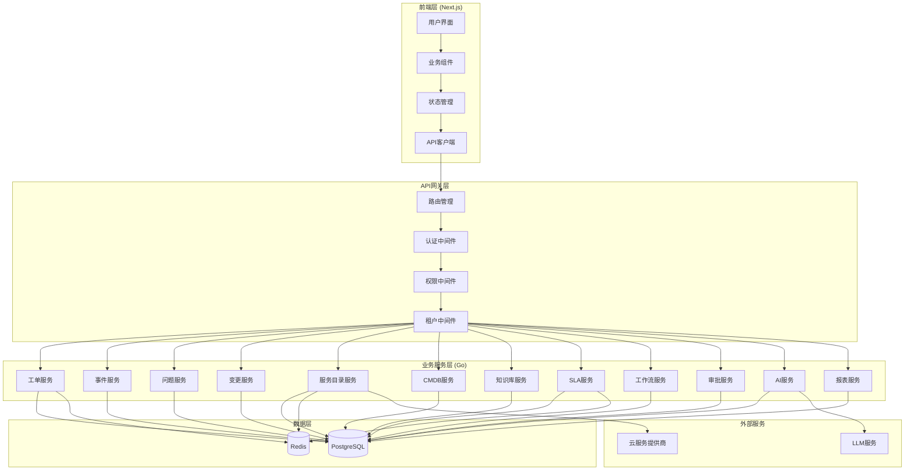

## 2. 核心业务模块关系图

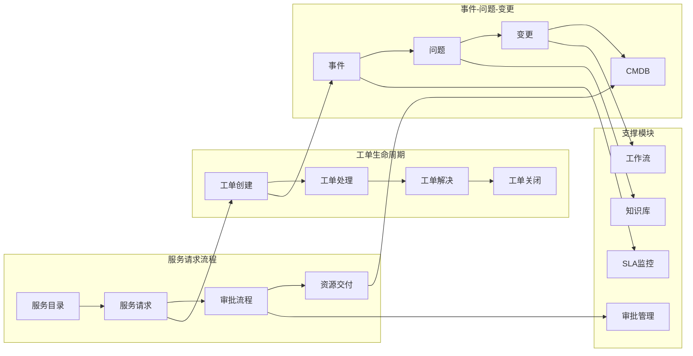

## 3. 模块依赖关系图

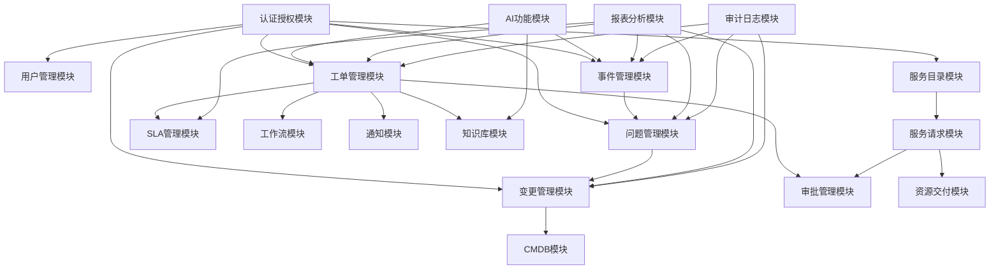

## 4. 数据流架构图

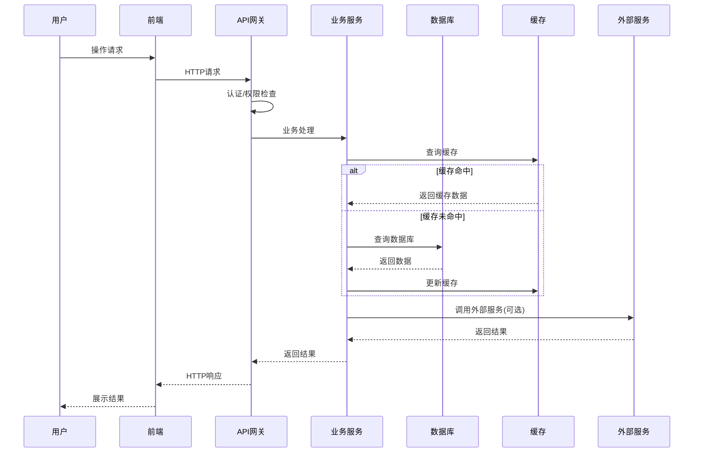

## 5. 工单管理模块详细架构

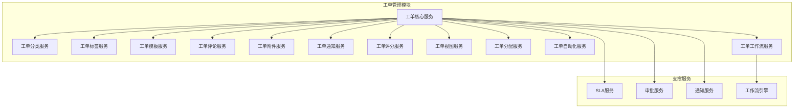

## 6. 服务请求审批流程架构

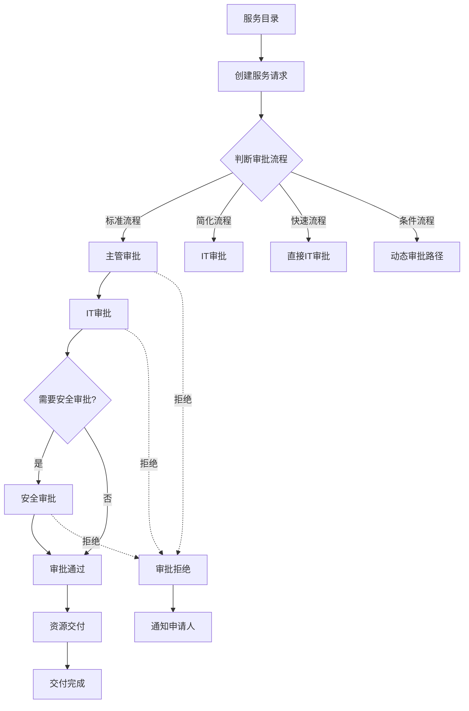

## 7. 多租户架构图

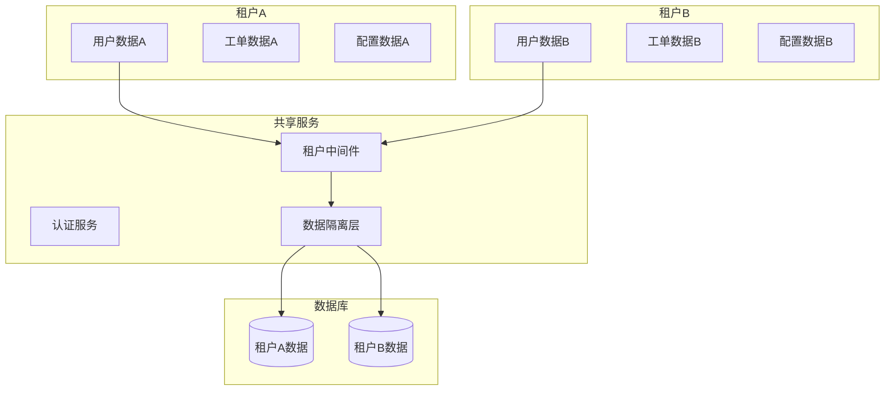

## 8. 权限控制架构图

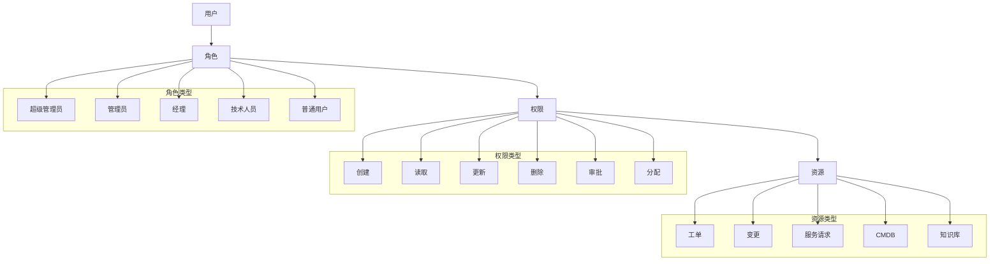

## 9. 工作流引擎架构图

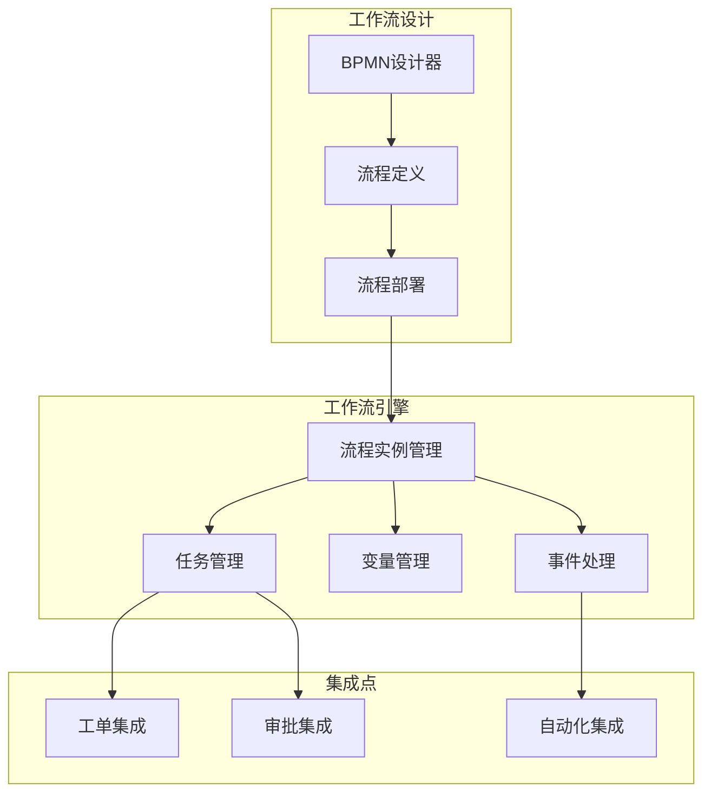

## 10. AI功能架构图

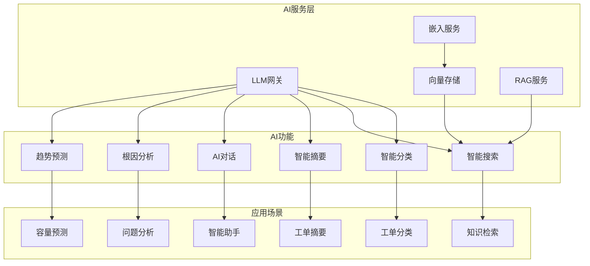

## 11. 前端模块架构图

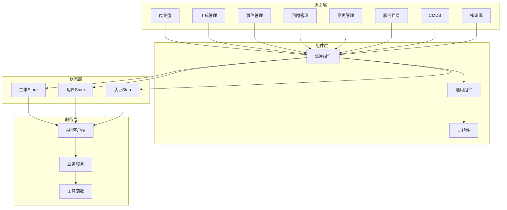

## 12. 后端分层架构图

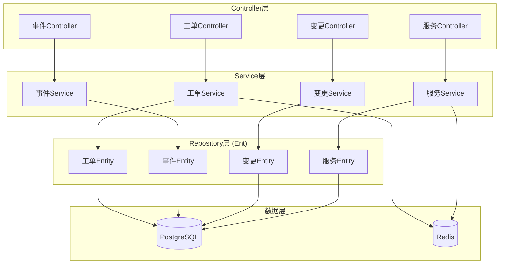

## 13. 数据模型关系图（核心实体）

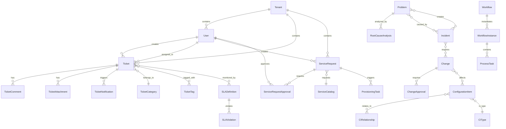

## 14. API端点组织图

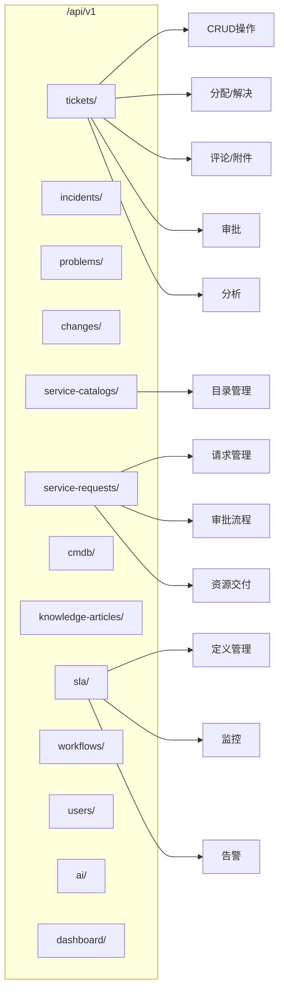

## 15. 部署架构图

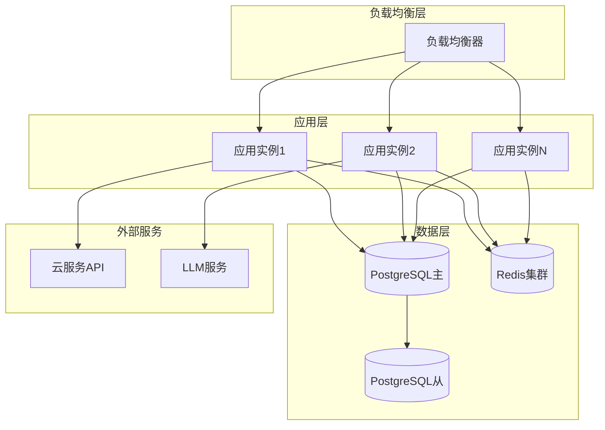

---

## 图表说明

### 符号说明

- **矩形**：模块/组件
- **圆角矩形**：服务/功能
- **菱形**：判断节点
- **圆形**：数据存储
- **箭头**：依赖/调用关系
- **虚线箭头**：可选/条件关系

### 颜色说明

- **蓝色**：核心业务模块
- **绿色**：支撑模块
- **橙色**：数据层
- **紫色**：外部服务

---

**文档版本**：V1.0  
**创建日期**：2025-12-17
