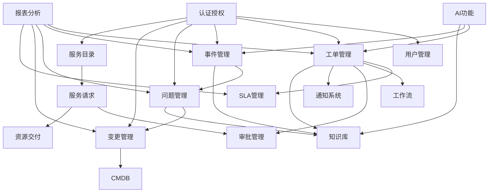

# ITSM产品模块架构设计文档

## 1. 架构概述

### 1.1 系统定位

ITSM（IT Service Management）是一个智能IT服务管理系统，遵循ITIL最佳实践，提供完整的IT服务管理解决方案。

### 1.2 技术架构

- **前端**：Next.js + TypeScript + React + Ant Design
- **后端**：Go + Gin + Ent ORM + PostgreSQL
- **缓存**：Redis
- **工作流引擎**：BPMN 2.0
- **AI能力**：LLM集成（OpenAI等）

### 1.3 架构原则

- **领域驱动设计（DDD）**：按业务领域划分模块
- **分层架构**：Controller → Service → Repository
- **多租户架构**：支持SaaS模式
- **微服务就绪**：模块化设计，便于拆分

## 2. 核心业务模块

### 2.1 工单管理模块 (Ticket Management)

#### 2.1.1 功能概述

ITSM的核心模块，负责处理所有IT服务请求和工单。

#### 2.1.2 核心功能

- **工单生命周期管理**
  - 创建、更新、关闭、取消工单
  - 状态流转（open → in_progress → resolved → closed）
  - 优先级管理（low/medium/high/critical）
  
- **工单分类体系**
  - 工单类型（Type）
  - 工单分类（Category）- 树形结构
  - 工单标签（Tag）
  - 工单模板（Template）

- **工单协作**
  - 评论系统（Comment）
  - 附件管理（Attachment）
  - 通知系统（Notification）
  - 评分反馈（Rating）

- **智能分配**
  - 自动分配规则（Assignment Rule）
  - 智能推荐分配人
  - 负载均衡分配

- **工单视图**
  - 自定义视图（View）
  - 视图共享
  - 筛选和排序

- **工单关联**
  - 工单依赖关系（Dependency）
  - 子任务管理（Subtask）
  - 关联工单

- **自动化规则**
  - 自动化规则引擎（Automation Rule）
  - 条件触发
  - 自动操作

- **工作流集成**
  - BPMN工作流支持
  - 自定义审批流程
  - 工作流实例管理

#### 2.1.3 数据模型

- `Ticket` - 工单主表
- `TicketCategory` - 工单分类
- `TicketTag` - 工单标签
- `TicketTemplate` - 工单模板
- `TicketComment` - 工单评论
- `TicketAttachment` - 工单附件
- `TicketNotification` - 工单通知
- `TicketRating` - 工单评分
- `TicketView` - 工单视图
- `TicketAssignmentRule` - 分配规则
- `TicketAutomationRule` - 自动化规则

#### 2.1.4 API端点

```
GET    /api/v1/tickets                    # 工单列表
POST   /api/v1/tickets                    # 创建工单
GET    /api/v1/tickets/:id                # 工单详情
PUT    /api/v1/tickets/:id                # 更新工单
DELETE /api/v1/tickets/:id                # 删除工单
POST   /api/v1/tickets/:id/assign        # 分配工单
POST   /api/v1/tickets/:id/resolve        # 解决工单
POST   /api/v1/tickets/:id/close          # 关闭工单
GET    /api/v1/tickets/:id/comments       # 评论列表
POST   /api/v1/tickets/:id/comments       # 添加评论
GET    /api/v1/tickets/:id/attachments    # 附件列表
POST   /api/v1/tickets/:id/attachments   # 上传附件
GET    /api/v1/tickets/stats              # 工单统计
GET    /api/v1/tickets/analytics          # 工单分析
```

### 2.2 事件管理模块 (Incident Management)

#### 2.2.1 功能概述

处理IT服务中断和故障，快速恢复服务。

#### 2.2.2 核心功能

- **事件创建和分类**
  - 自动/手动创建事件
  - 事件分类和优先级
  - 影响范围评估

- **事件处理**
  - 事件分配
  - 事件升级
  - 事件解决

- **事件监控**
  - 实时监控
  - 告警规则（Alert Rule）
  - 指标监控（Metric）

- **事件关联**
  - 关联问题（Problem）
  - 关联变更（Change）
  - 关联配置项（CI）

#### 2.2.3 数据模型

- `Incident` - 事件主表
- `IncidentRule` - 事件规则
- `IncidentAlert` - 事件告警
- `IncidentMetric` - 事件指标
- `IncidentEvent` - 事件事件

#### 2.2.4 API端点

```
GET    /api/v1/incidents                  # 事件列表
POST   /api/v1/incidents                  # 创建事件
GET    /api/v1/incidents/:id              # 事件详情
PUT    /api/v1/incidents/:id              # 更新事件
GET    /api/v1/incidents/stats            # 事件统计
```

### 2.3 问题管理模块 (Problem Management)

#### 2.3.1 功能概述

识别和解决IT服务的根本原因，防止问题再次发生。

#### 2.3.2 核心功能

- **问题识别**
  - 从事件创建问题
  - 手动创建问题
  - 问题分类

- **问题调查**
  - 问题调查记录（Investigation）
  - 根因分析（Root Cause Analysis）
  - 影响分析

- **问题解决**
  - 解决方案记录
  - 变更请求关联
  - 问题关闭

- **问题预防**
  - 已知错误库
  - 预防措施
  - 知识库关联

#### 2.3.3 数据模型

- `Problem` - 问题主表
- `ProblemInvestigation` - 问题调查
- `RootCauseAnalysis` - 根因分析

#### 2.3.4 API端点

```
GET    /api/v1/problems                   # 问题列表
POST   /api/v1/problems                   # 创建问题
GET    /api/v1/problems/:id               # 问题详情
PUT    /api/v1/problems/:id               # 更新问题
DELETE /api/v1/problems/:id               # 删除问题
GET    /api/v1/problems/stats             # 问题统计
```

### 2.4 变更管理模块 (Change Management)

#### 2.4.1 功能概述

管理IT基础设施和服务的变更，确保变更风险可控。

#### 2.4.2 核心功能

- **变更分类**
  - 标准变更（Standard）
  - 普通变更（Normal）
  - 紧急变更（Emergency）

- **变更流程**
  - 变更申请
  - 变更评估
  - 变更审批
  - 变更实施
  - 变更回顾

- **变更审批**
  - 审批工作流（Approval Workflow）
  - 风险评估（Risk Assessment）
  - 实施计划（Implementation Plan）
  - 回滚计划（Rollback Plan）

- **变更关联**
  - 关联配置项（CI）
  - 关联工单
  - 关联问题

#### 2.4.3 数据模型

- `Change` - 变更主表
- `ChangeApproval` - 变更审批
- `ChangeApprovalWorkflow` - 审批工作流

#### 2.4.4 API端点

```
GET    /api/v1/changes                    # 变更列表
POST   /api/v1/changes                    # 创建变更
GET    /api/v1/changes/:id                # 变更详情
PUT    /api/v1/changes/:id                # 更新变更
DELETE /api/v1/changes/:id                # 删除变更
PUT    /api/v1/changes/:id/status         # 更新变更状态
POST   /api/v1/changes/approvals          # 创建审批
POST   /api/v1/changes/approval-workflows # 创建审批工作流
GET    /api/v1/changes/:id/approval-summary # 审批摘要
POST   /api/v1/changes/risk-assessments   # 风险评估
POST   /api/v1/changes/implementation-plans # 实施计划
POST   /api/v1/changes/rollback-plans     # 回滚计划
```

### 2.5 服务目录与服务请求模块 (Service Catalog & Service Request)

#### 2.5.1 功能概述

提供IT服务目录，支持用户自助申请IT服务。

#### 2.5.2 核心功能

- **服务目录管理**
  - 服务分类
  - 服务定义
  - 服务状态管理
  - 交付时间设置

- **服务请求**
  - 服务申请
  - 审批流程（见《服务请求审批流程设计》）
  - 请求跟踪
  - 资源交付（Provisioning）

- **资源交付**
  - 交付任务（Provisioning Task）
  - 自动化交付
  - 交付状态跟踪

#### 2.5.3 数据模型

- `ServiceCatalog` - 服务目录
- `ServiceRequest` - 服务请求
- `ServiceRequestApproval` - 服务请求审批
- `ProvisioningTask` - 交付任务

#### 2.5.4 API端点

```
GET    /api/v1/service-catalogs           # 服务目录列表
POST   /api/v1/service-catalogs           # 创建服务目录
GET    /api/v1/service-catalogs/:id       # 服务目录详情
PUT    /api/v1/service-catalogs/:id       # 更新服务目录
DELETE /api/v1/service-catalogs/:id       # 删除服务目录

POST   /api/v1/service-requests           # 创建服务请求
GET    /api/v1/service-requests/me        # 我的服务请求
GET    /api/v1/service-requests/:id       # 服务请求详情
GET    /api/v1/service-requests/approvals/pending # 待审批列表
GET    /api/v1/service-requests/:id/approvals # 审批记录
POST   /api/v1/service-requests/:id/approvals # 审批操作
PUT    /api/v1/service-requests/:id/status # 更新状态

POST   /api/v1/service-requests/:id/provision # 开始交付
GET    /api/v1/service-requests/:id/provisioning-tasks # 交付任务列表
POST   /api/v1/provisioning-tasks/:id/execute # 执行交付任务
```

### 2.6 配置管理模块 (CMDB - Configuration Management Database)

#### 2.6.1 功能概述

管理IT基础设施和服务的配置项（CI），维护配置项之间的关系。

#### 2.6.2 核心功能

- **配置项管理**
  - 配置项类型（CI Type）
  - 配置项属性定义（Attribute Definition）
  - 配置项CRUD
  - 配置项搜索

- **关系管理**
  - CI关系类型
  - CI关系维护
  - 关系影响分析

- **高级功能**
  - 属性验证
  - 按属性搜索
  - CI变更历史

#### 2.6.3 数据模型

- `ConfigurationItem` - 配置项
- `CIType` - 配置项类型
- `CIAttributeDefinition` - 属性定义
- `CIRelationship` - CI关系

#### 2.6.4 API端点

```
GET    /api/v1/cmdb/cis                  # 配置项列表
POST   /api/v1/cmdb/cis                  # 创建配置项
GET    /api/v1/cmdb/cis/:id              # 配置项详情
PUT    /api/v1/cmdb/cis/:id              # 更新配置项
DELETE /api/v1/cmdb/cis/:id              # 删除配置项
POST   /api/v1/cmdb/cis/search-by-attributes # 按属性搜索
POST   /api/v1/cmdb/ci-types/attributes  # 创建属性定义
GET    /api/v1/cmdb/ci-types/:id/attributes # 获取类型属性
POST   /api/v1/cmdb/ci-attributes/validate # 验证属性
```

### 2.7 知识库模块 (Knowledge Base)

#### 2.7.1 功能概述

存储和管理IT知识，支持知识共享和复用。

#### 2.7.2 核心功能

- **知识文章管理**
  - 文章创建和编辑
  - 文章分类
  - 文章搜索
  - 文章版本控制

- **知识集成**
  - 与工单集成
  - 自动推荐
  - 知识评分

#### 2.7.3 数据模型

- `KnowledgeArticle` - 知识文章

#### 2.7.4 API端点

```
GET    /api/v1/knowledge-articles         # 文章列表
POST   /api/v1/knowledge-articles         # 创建文章
GET    /api/v1/knowledge-articles/:id     # 文章详情
PUT    /api/v1/knowledge-articles/:id     # 更新文章
DELETE /api/v1/knowledge-articles/:id     # 删除文章
GET    /api/v1/knowledge-articles/categories # 分类列表
```

### 2.8 SLA管理模块 (SLA Management)

#### 2.8.1 功能概述

定义和监控服务级别协议（SLA），确保服务质量。

#### 2.8.2 核心功能

- **SLA定义**
  - SLA规则定义
  - 响应时间目标
  - 解决时间目标
  - 优先级映射

- **SLA监控**
  - 实时监控
  - SLA合规检查
  - SLA违规记录
  - SLA指标统计

- **SLA告警**
  - 告警规则配置
  - 告警历史
  - 告警通知

#### 2.8.3 数据模型

- `SLADefinition` - SLA定义
- `SLAMetric` - SLA指标
- `SLAViolation` - SLA违规
- `SLAAlertRule` - 告警规则
- `SLAAlertHistory` - 告警历史

#### 2.8.4 API端点

```
POST   /api/v1/sla/definitions            # 创建SLA定义
GET    /api/v1/sla/definitions            # SLA定义列表
GET    /api/v1/sla/definitions/:id        # SLA定义详情
PUT    /api/v1/sla/definitions/:id        # 更新SLA定义
DELETE /api/v1/sla/definitions/:id        # 删除SLA定义
POST   /api/v1/sla/compliance/:ticketId   # 检查SLA合规
GET    /api/v1/sla/metrics                # SLA指标
GET    /api/v1/sla/violations             # SLA违规列表
PUT    /api/v1/sla/violations/:id         # 更新违规状态
POST   /api/v1/sla/monitoring             # SLA监控数据
POST   /api/v1/sla/alert-rules            # 创建告警规则
GET    /api/v1/sla/alert-rules            # 告警规则列表
POST   /api/v1/sla/alert-history          # 告警历史
```

### 2.9 工作流模块 (Workflow/BPMN)

#### 2.9.1 功能概述

提供工作流引擎，支持BPMN 2.0标准，实现业务流程自动化。

#### 2.9.2 核心功能

- **流程定义**
  - BPMN流程设计
  - 流程部署
  - 流程版本管理

- **流程执行**
  - 流程实例创建
  - 任务执行
  - 流程变量管理
  - 流程监控

- **流程集成**
  - 与工单集成
  - 与审批集成
  - 事件触发

#### 2.9.3 数据模型

- `Workflow` - 工作流定义
- `WorkflowInstance` - 工作流实例
- `ProcessDefinition` - 流程定义
- `ProcessInstance` - 流程实例
- `ProcessTask` - 流程任务
- `ProcessVariable` - 流程变量

#### 2.9.4 API端点

```
POST   /api/v1/workflows                  # 创建工作流
GET    /api/v1/workflows                  # 工作流列表
GET    /api/v1/workflows/:id              # 工作流详情
PUT    /api/v1/workflows/:id              # 更新工作流
DELETE /api/v1/workflows/:id              # 删除工作流
POST   /api/v1/workflows/:id/start        # 启动工作流
GET    /api/v1/workflows/:id/instances     # 工作流实例列表
```

### 2.10 审批管理模块 (Approval Management)

#### 2.10.1 功能概述

统一的审批管理，支持工单审批、变更审批、服务请求审批等。

#### 2.10.2 核心功能

- **审批工作流**
  - 审批流程定义
  - 多级审批
  - 并行/串行审批
  - 条件审批

- **审批记录**
  - 审批历史
  - 审批状态跟踪
  - 审批意见

#### 2.10.3 数据模型

- `ApprovalWorkflow` - 审批工作流
- `ApprovalRecord` - 审批记录

#### 2.10.4 API端点

```
POST   /api/v1/tickets/approval/workflows # 创建审批工作流
GET    /api/v1/tickets/approval/workflows # 审批工作流列表
POST   /api/v1/tickets/approval/submit     # 提交审批
GET    /api/v1/tickets/approval/records    # 审批记录
```

## 3. 支撑模块

### 3.1 用户与组织管理模块

#### 3.1.1 功能概述

管理系统用户、角色、权限和组织架构。

#### 3.1.2 核心功能

- **用户管理**
  - 用户CRUD
  - 用户认证
  - 用户角色分配

- **角色权限（RBAC）**
  - 角色定义
  - 权限分配
  - 权限检查

- **组织架构**
  - 部门管理（Department）
  - 团队管理（Team）
  - 项目管理（Project）
  - 应用管理（Application）

- **标签管理**
  - 通用标签（Tag）
  - 标签绑定

#### 3.1.3 数据模型

- `User` - 用户
- `Department` - 部门
- `Team` - 团队
- `Project` - 项目
- `Application` - 应用
- `Microservice` - 微服务
- `Tag` - 标签

#### 3.1.4 API端点

```
# 用户管理
GET    /api/v1/users                      # 用户列表
GET    /api/v1/users/:id                 # 用户详情
PUT    /api/v1/users/:id                  # 更新用户
DELETE /api/v1/users/:id                  # 删除用户

# 部门管理
POST   /api/v1/departments                # 创建部门
GET    /api/v1/departments/tree          # 部门树
PUT    /api/v1/departments/:id           # 更新部门
DELETE /api/v1/departments/:id           # 删除部门

# 团队管理
GET    /api/v1/teams                      # 团队列表
POST   /api/v1/teams                      # 创建团队
POST   /api/v1/teams/members              # 添加成员

# 项目管理
GET    /api/v1/projects                   # 项目列表
POST   /api/v1/projects                   # 创建项目

# 应用管理
GET    /api/v1/applications               # 应用列表
POST   /api/v1/applications               # 创建应用
GET    /api/v1/applications/microservices # 微服务列表

# 标签管理
GET    /api/v1/tags                       # 标签列表
POST   /api/v1/tags                       # 创建标签
POST   /api/v1/tags/bind                  # 绑定标签
```

### 3.2 认证授权模块 (Auth)

#### 3.2.1 功能概述

提供用户认证和授权功能。

#### 3.2.2 核心功能

- **用户认证**
  - 登录/登出
  - JWT Token管理
  - Token刷新
  - 密码管理

- **权限控制**
  - RBAC中间件
  - 权限检查
  - 租户隔离

#### 3.2.3 API端点

```
POST   /api/v1/login                      # 登录
POST   /api/v1/refresh-token              # 刷新Token
```

### 3.3 通知模块 (Notification)

#### 3.3.1 功能概述

统一的通知系统，支持站内信、邮件、短信等。

#### 3.3.2 核心功能

- **通知发送**
  - 站内通知
  - 邮件通知
  - 短信通知（可选）

- **通知管理**
  - 通知列表
  - 已读/未读标记
  - 通知偏好设置

#### 3.3.3 数据模型

- `Notification` - 通知
- `TicketNotification` - 工单通知

#### 3.3.4 API端点

```
GET    /api/v1/notifications              # 通知列表
PUT    /api/v1/notifications/:id/read     # 标记已读
PUT    /api/v1/notifications/read-all     # 全部标记已读
GET    /api/v1/users/:id/notification-preferences # 通知偏好
PUT    /api/v1/users/:id/notification-preferences # 更新偏好
```

### 3.4 多租户模块 (Tenant)

#### 3.4.1 功能概述

支持SaaS多租户架构，实现数据隔离。

#### 3.4.2 核心功能

- **租户管理**
  - 租户创建
  - 租户配置
  - 租户隔离

- **数据隔离**
  - 租户中间件
  - 数据过滤
  - 权限隔离

#### 3.4.3 数据模型

- `Tenant` - 租户

### 3.5 审计日志模块 (Audit Log)

#### 3.5.1 功能概述

记录系统操作日志，支持审计和追溯。

#### 3.5.2 核心功能

- **日志记录**
  - 操作日志
  - 访问日志
  - 变更日志

- **日志查询**
  - 日志搜索
  - 日志过滤
  - 日志导出

#### 3.5.3 数据模型

- `AuditLog` - 审计日志

#### 3.5.4 API端点

```
GET    /api/v1/audit-logs                 # 审计日志列表
```

### 3.6 AI功能模块

#### 3.6.1 功能概述

集成AI能力，提供智能化的IT服务管理。

#### 3.6.2 核心功能

- **智能分类（Triage）**
  - 自动工单分类
  - 优先级推荐
  - 分配建议

- **智能搜索**
  - 语义搜索
  - 知识库搜索
  - 相似工单推荐

- **智能摘要**
  - 工单摘要
  - 对话摘要

- **AI助手**
  - 对话式交互
  - 工具调用
  - 反馈学习

- **根因分析**
  - 自动根因分析
  - 根因报告

- **趋势预测**
  - 工单趋势预测
  - 容量预测

#### 3.6.3 数据模型

- `Conversation` - 对话
- `Message` - 消息
- `ToolInvocation` - 工具调用
- `PromptTemplate` - 提示模板

#### 3.6.4 API端点

```
POST   /api/v1/ai/search                  # AI搜索
POST   /api/v1/ai/triage                  # 智能分类
POST   /api/v1/ai/summarize               # 智能摘要
POST   /api/v1/ai/similar-incidents      # 相似事件
POST   /api/v1/ai/chat                   # AI对话
GET    /api/v1/ai/tools                   # 工具列表
POST   /api/v1/ai/tools/:tool_id/execute # 执行工具
POST   /api/v1/ai/embed                   # 向量嵌入
POST   /api/v1/ai/feedback               # 反馈
GET    /api/v1/ai/metrics                 # AI指标
```

### 3.7 报表分析模块 (Analytics)

#### 3.7.1 功能概述

提供数据分析和报表功能。

#### 3.7.2 核心功能

- **仪表盘（Dashboard）**
  - 概览数据
  - KPI指标
  - 趋势图表
  - 实时监控

- **数据分析**
  - 工单分析
  - 事件分析
  - SLA分析
  - 满意度分析

- **报表导出**
  - 自定义报表
  - 定时报表
  - 报表导出

#### 3.7.3 API端点

```
GET    /api/v1/dashboard/overview         # 概览数据
GET    /api/v1/dashboard/kpi-metrics      # KPI指标
GET    /api/v1/dashboard/ticket-trend     # 工单趋势
GET    /api/v1/dashboard/incident-distribution # 事件分布
GET    /api/v1/dashboard/sla-data          # SLA数据
GET    /api/v1/dashboard/satisfaction-data # 满意度数据
GET    /api/v1/dashboard/quick-actions     # 快捷操作
GET    /api/v1/dashboard/recent-activities # 最近活动

POST   /api/v1/tickets/analytics/deep     # 深度分析
POST   /api/v1/tickets/analytics/export    # 导出分析
POST   /api/v1/tickets/prediction/trend    # 趋势预测
POST   /api/v1/tickets/prediction/export   # 导出预测报告
```

## 4. 前端模块架构

### 4.1 页面路由结构

```
/app
├── (auth)/                    # 认证相关
│   └── login/                 # 登录页
│
└── (main)/                    # 主应用
    ├── dashboard/             # 仪表盘
    ├── tickets/               # 工单管理
    ├── incidents/             # 事件管理
    ├── problems/              # 问题管理
    ├── changes/               # 变更管理
    ├── service-catalog/       # 服务目录
    ├── my-requests/            # 我的请求
    ├── approvals/              # 审批中心
    ├── cmdb/                  # 配置管理
    ├── knowledge-base/        # 知识库
    ├── sla/                   # SLA管理
    ├── sla-monitor/           # SLA监控
    ├── workflow/               # 工作流
    ├── reports/                # 报表
    ├── admin/                  # 管理后台
    │   ├── tickets/           # 工单管理
    │   │   ├── assignment-rules/    # 分配规则
    │   │   ├── automation-rules/    # 自动化规则
    │   │   └── types/               # 工单类型
    │   └── ...
    └── profile/               # 个人中心
```

### 4.2 组件架构

#### 4.2.1 业务组件 (components/business/)

- `TicketManagement.tsx` - 工单管理
- `TicketApprovalWorkflow.tsx` - 审批工作流
- `IncidentManagement.tsx` - 事件管理
- `ChangeManagement.tsx` - 变更管理
- `ServiceCatalog.tsx` - 服务目录
- `CMDBManagement.tsx` - CMDB管理
- `KnowledgeBase.tsx` - 知识库
- `WorkflowDesigner.tsx` - 工作流设计器

#### 4.2.2 通用组件 (components/common/)

- `DataTable.tsx` - 数据表格
- `SearchBar.tsx` - 搜索栏
- `FilterPanel.tsx` - 筛选面板
- `StatusBadge.tsx` - 状态标签
- `PriorityBadge.tsx` - 优先级标签

#### 4.2.3 UI组件 (components/ui/)

- 基于Ant Design的组件封装
- 统一的样式和交互

### 4.3 状态管理

#### 4.3.1 模块化Store

- `ticket-store.ts` - 工单状态
- `auth-store.ts` - 认证状态
- `user-store.ts` - 用户状态

#### 4.3.2 全局Store

- `unified-auth-store.ts` - 统一认证

### 4.4 API客户端

#### 4.4.1 模块化API

- `ticket-api.ts` - 工单API
- `incident-api.ts` - 事件API
- `change-api.ts` - 变更API
- `service-catalog-api.ts` - 服务目录API
- `service-request-api.ts` - 服务请求API
- `cmdb-api.ts` - CMDB API
- `knowledge-api.ts` - 知识库API
- `auth-api.ts` - 认证API

## 5. 模块依赖关系

### 5.1 核心依赖图



### 5.2 模块间通信

- **直接调用**：Service层直接调用其他Service
- **事件驱动**：通过事件系统解耦（可选）
- **API调用**：前端通过REST API调用后端

## 6. 数据模型总览

### 6.1 核心实体

| 模块 | 主要实体 | 数量 |
|-----|---------|------|
| 工单管理 | Ticket, TicketCategory, TicketTag, TicketComment, TicketAttachment等 | 12+ |
| 事件管理 | Incident, IncidentRule, IncidentAlert等 | 5+ |
| 问题管理 | Problem, ProblemInvestigation, RootCauseAnalysis | 3+ |
| 变更管理 | Change, ChangeApproval, ChangeApprovalWorkflow | 3+ |
| 服务目录 | ServiceCatalog, ServiceRequest, ServiceRequestApproval, ProvisioningTask | 4+ |
| CMDB | ConfigurationItem, CIType, CIAttributeDefinition, CIRelationship | 4+ |
| 知识库 | KnowledgeArticle | 1 |
| SLA管理 | SLADefinition, SLAMetric, SLAViolation, SLAAlertRule | 5+ |
| 工作流 | Workflow, WorkflowInstance, ProcessDefinition等 | 8+ |
| 用户组织 | User, Department, Team, Project, Application, Tag | 7+ |
| 通知 | Notification, TicketNotification | 2 |
| 审计 | AuditLog | 1 |
| AI | Conversation, Message, ToolInvocation, PromptTemplate | 4+ |
| 多租户 | Tenant | 1 |

**总计**：约60+个核心实体

## 7. API架构

### 7.1 API设计原则

- RESTful风格
- 统一响应格式
- 版本控制（/api/v1/）
- 权限控制
- 租户隔离

### 7.2 API端点统计

| 模块 | API端点数量 | 主要操作 |
|-----|-----------|---------|
| 工单管理 | 30+ | CRUD, 分配, 解决, 评论, 附件等 |
| 事件管理 | 5+ | CRUD, 统计 |
| 问题管理 | 5+ | CRUD, 统计 |
| 变更管理 | 10+ | CRUD, 审批, 风险评估等 |
| 服务目录 | 10+ | CRUD, 审批, 交付 |
| CMDB | 8+ | CRUD, 搜索, 属性管理 |
| 知识库 | 5+ | CRUD, 分类 |
| SLA管理 | 10+ | 定义, 监控, 告警 |
| 工作流 | 8+ | 定义, 实例, 任务 |
| 用户组织 | 15+ | 用户, 部门, 团队, 项目等 |
| AI功能 | 10+ | 搜索, 分类, 对话, 工具等 |
| 报表分析 | 10+ | 仪表盘, 分析, 预测 |

**总计**：约130+个API端点

## 8. 技术栈总结

### 8.1 后端技术栈

- **语言**：Go 1.21+
- **Web框架**：Gin
- **ORM**：Ent (Facebook)
- **数据库**：PostgreSQL
- **缓存**：Redis
- **日志**：Zap
- **认证**：JWT
- **API文档**：Swagger/OpenAPI

### 8.2 前端技术栈

- **框架**：Next.js 14+
- **语言**：TypeScript
- **UI库**：Ant Design
- **状态管理**：Zustand
- **HTTP客户端**：Axios
- **路由**：Next.js App Router

### 8.3 基础设施

- **容器化**：Docker（可选）
- **CI/CD**：GitHub Actions（可选）
- **监控**：Prometheus + Grafana（可选）

## 9. 模块开发优先级

### 9.1 第一阶段（核心功能）

1. ✅ 认证授权
2. ✅ 用户管理
3. ✅ 工单管理
4. ✅ 服务目录与服务请求
5. ✅ 基础审批流程

### 9.2 第二阶段（扩展功能）

1. ✅ 事件管理
2. ✅ 问题管理
3. ✅ 变更管理
4. ✅ CMDB
5. ✅ 知识库
6. ✅ SLA管理

### 9.3 第三阶段（高级功能）

1. ✅ 工作流引擎
2. ✅ AI功能
3. ✅ 报表分析
4. ✅ 自动化规则
5. ✅ 智能分配

## 10. 模块扩展性设计

### 10.1 插件化架构

- 支持自定义工作流
- 支持自定义审批流程
- 支持自定义自动化规则

### 10.2 可配置性

- 工单字段可配置
- 审批流程可配置
- SLA规则可配置
- 通知模板可配置

### 10.3 集成能力

- REST API集成
- Webhook支持
- 第三方系统集成（可选）

---

**文档版本**：V1.0  
**创建日期**：2025-12-17  
**最后更新**：2025-12-17  
**维护人**：产品团队
