# 工作流模块 - 可视化图表

## 1. 工作流模块整体架构图

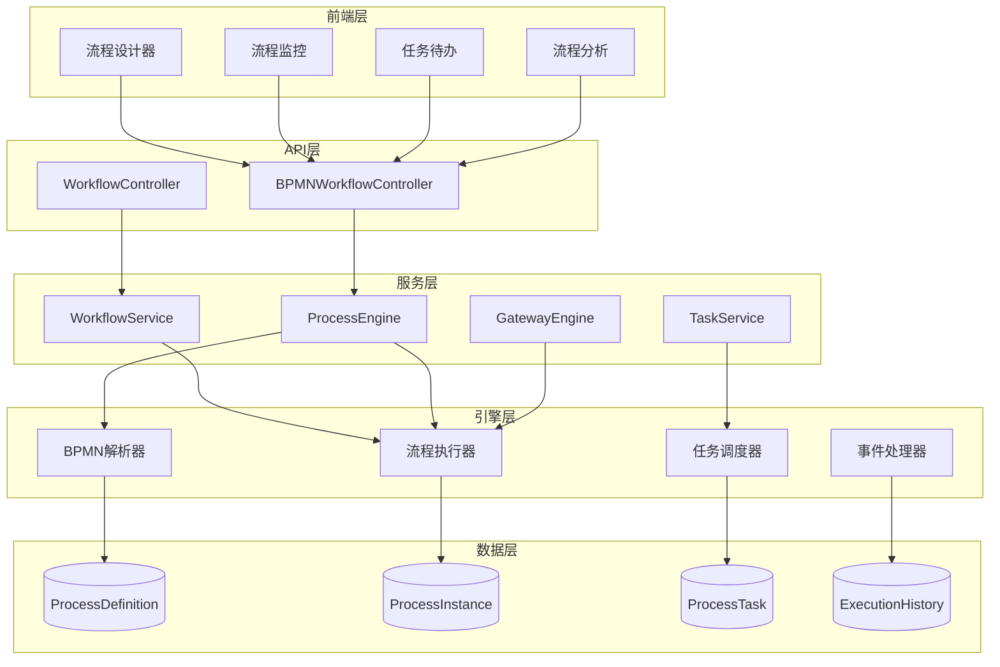

## 2. 双引擎架构对比

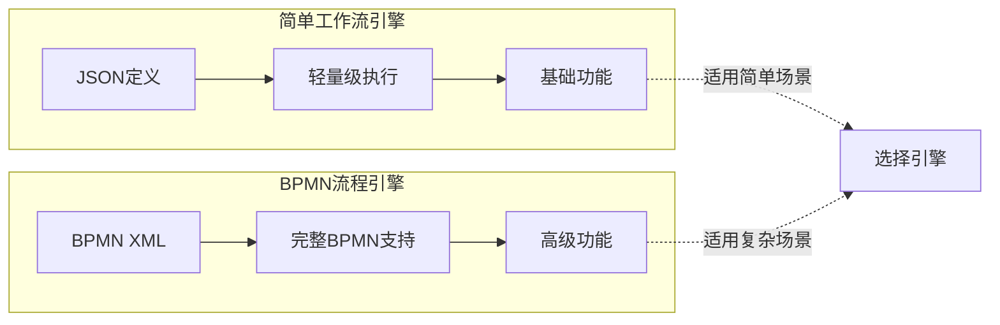

## 3. 流程定义生命周期

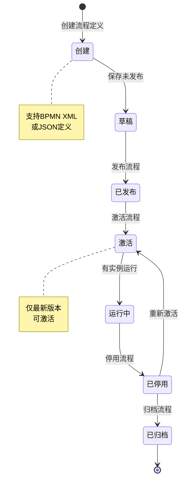

## 4. 流程实例执行流程

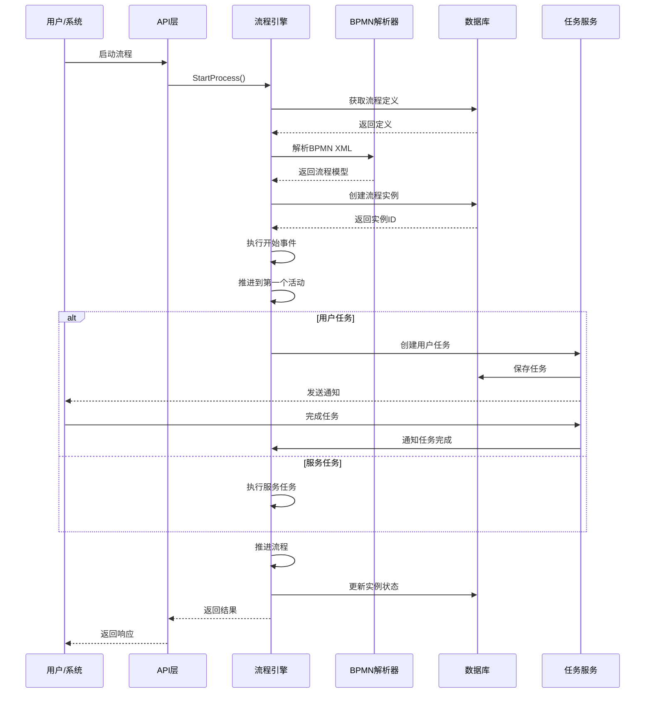

## 5. 任务处理流程

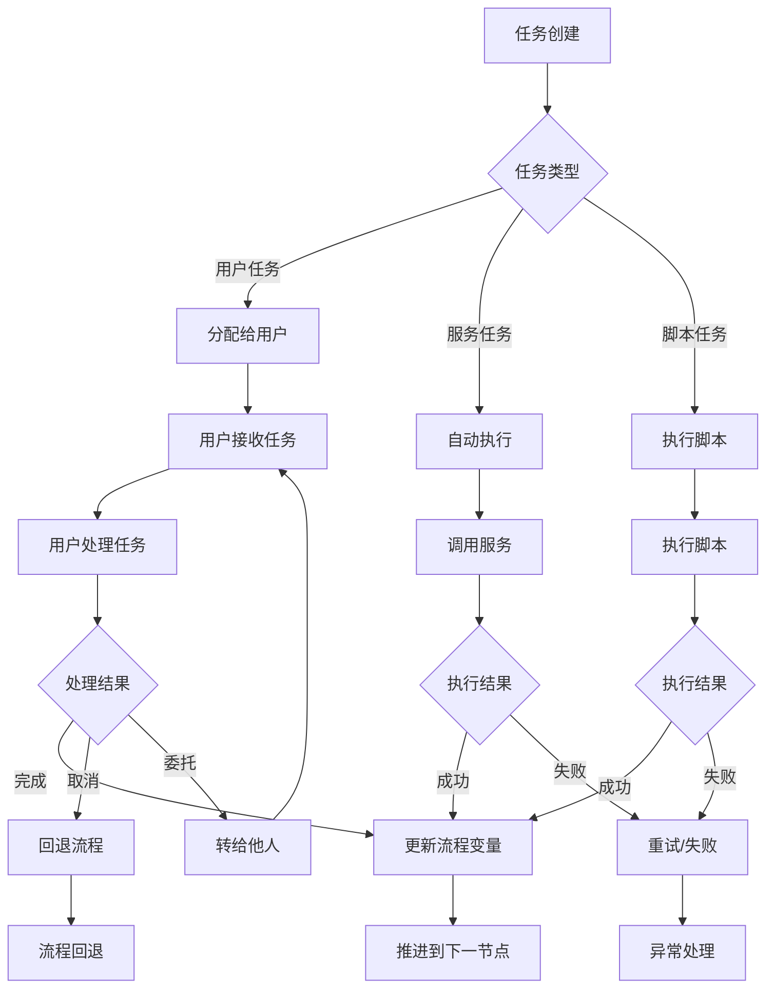

## 6. 网关执行流程

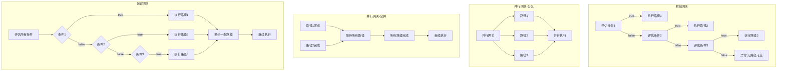

## 7. 流程实例状态流转

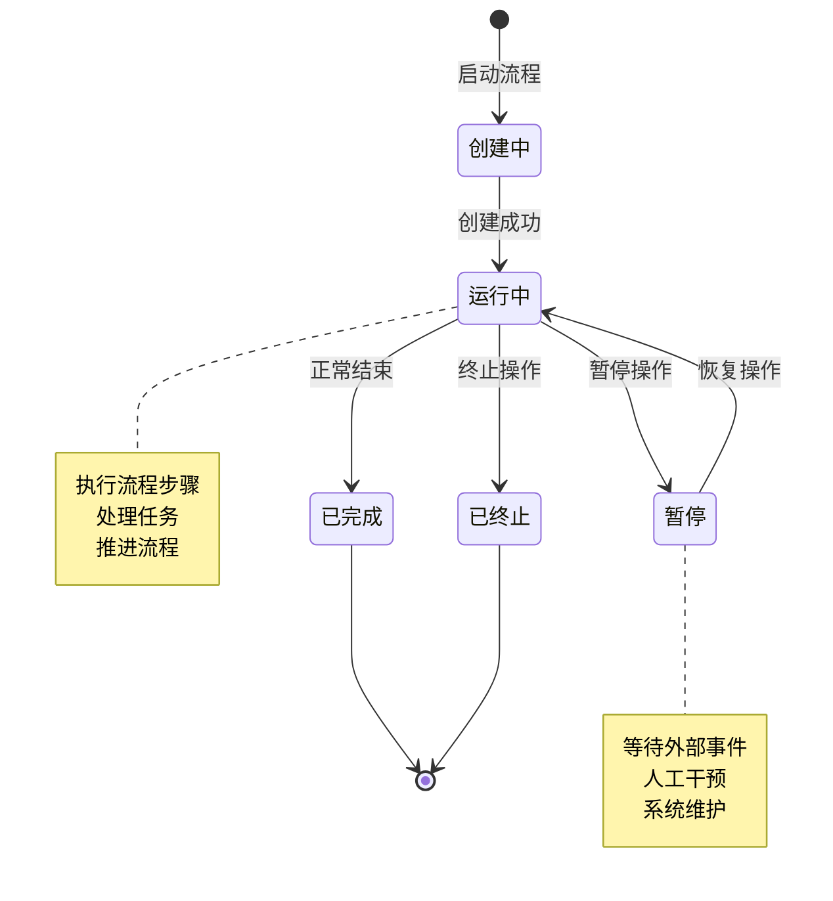

## 8. 任务状态流转

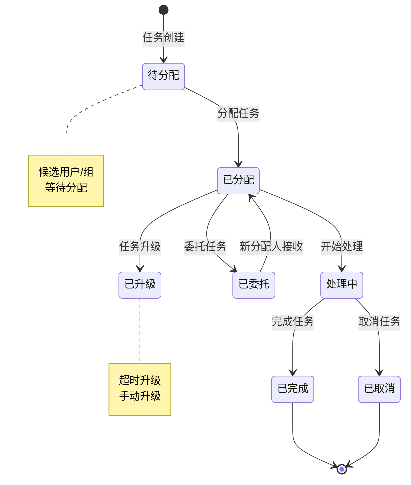

## 9. 流程与业务模块集成

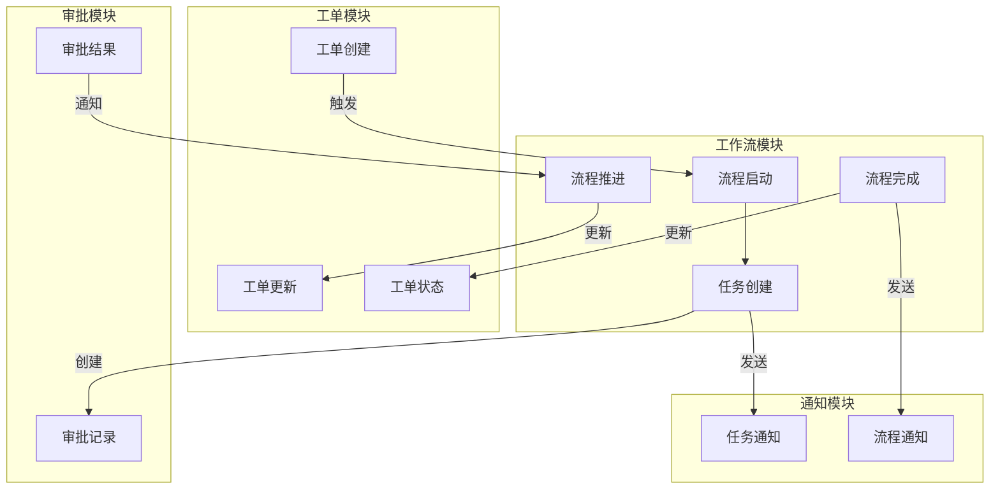

## 10. BPMN元素支持矩阵

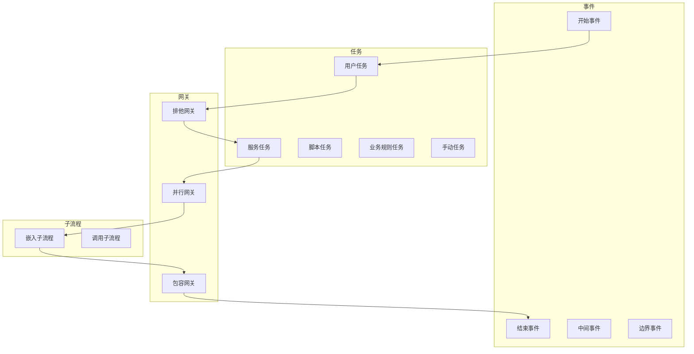

## 11. 流程执行路径示例

### 11.1 简单审批流程

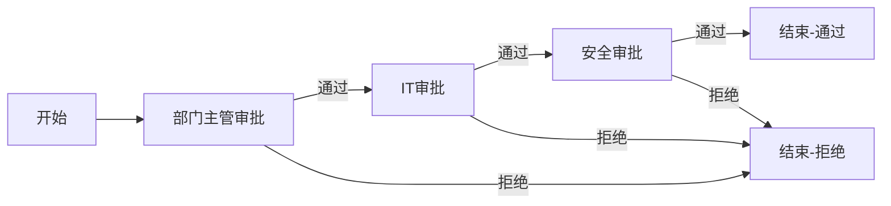

### 11.2 并行审批流程

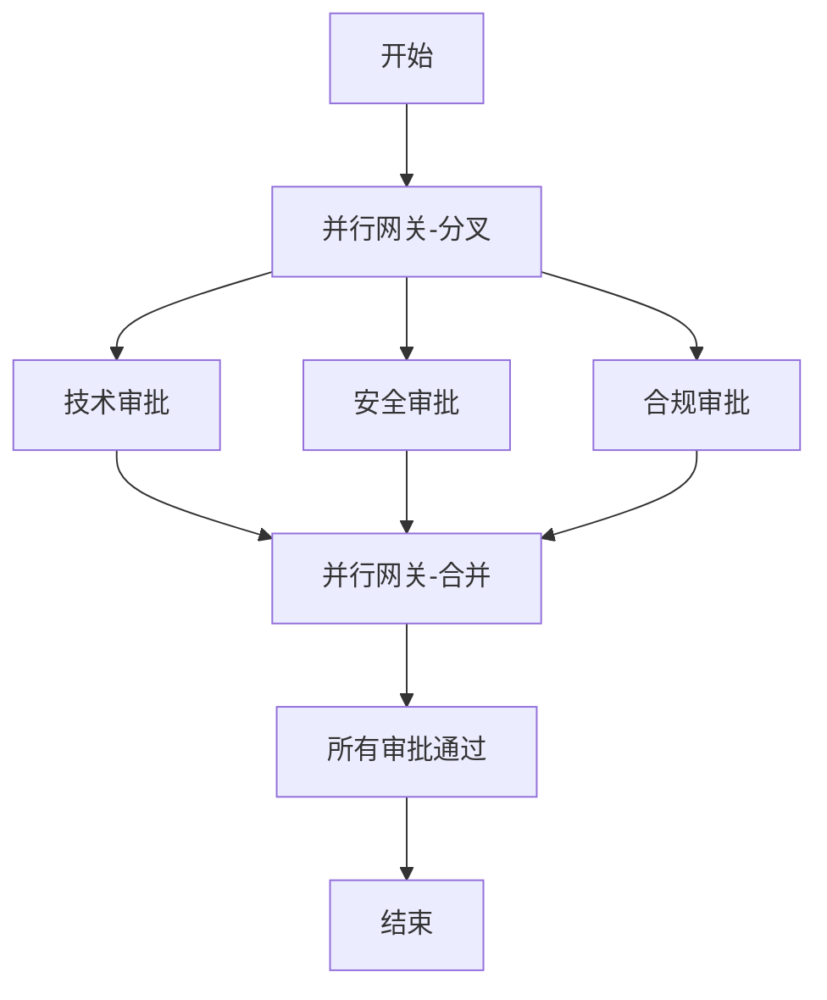

### 11.3 条件分支流程

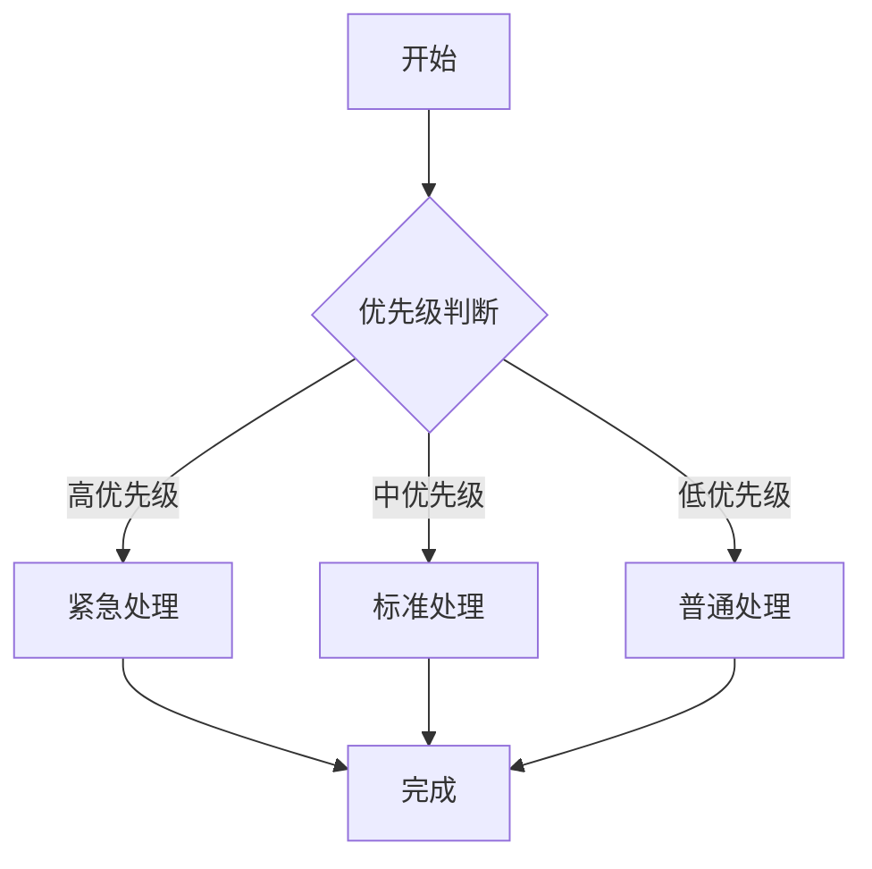

## 12. 流程监控仪表盘

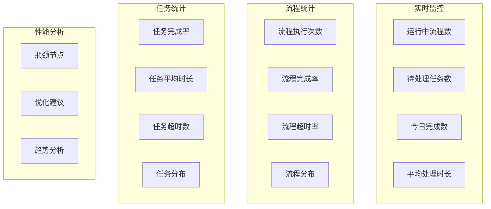

## 13. 异常处理流程

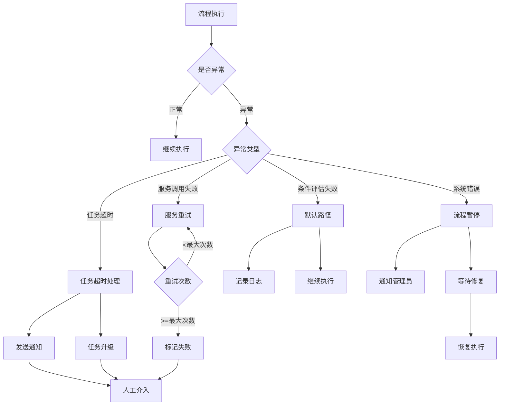

## 14. 流程设计器界面布局

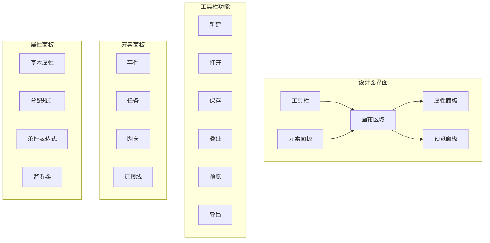

## 15. 数据流图

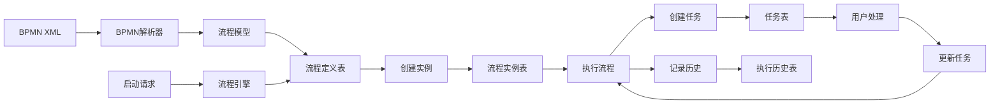

## 16. 性能优化架构

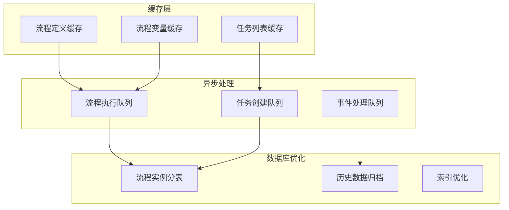

---

## 图表说明

### 符号说明

- **矩形**：组件/模块
- **圆角矩形**：状态
- **菱形**：判断节点
- **圆形**：开始/结束
- **箭头**：流程方向/依赖关系

### 颜色说明

- **蓝色**：核心组件
- **绿色**：支撑组件
- **橙色**：数据存储
- **紫色**：外部集成

---

**文档版本**：V1.0  
**创建日期**：2025-12-17
