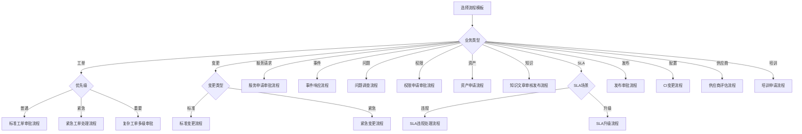

# 工作流模块 - 流程模板总览

## 1. 模板库总览

### 1.1 模板统计

| 分类 | 模板数量 | 文档位置 |
|-----|---------|---------|
| 工单管理类 | 3个 | 《工作流模块-流程模板设计.md》 |
| 变更管理类 | 2个 | 《工作流模块-流程模板设计.md》 |
| 服务请求类 | 2个 | 《工作流模块-流程模板设计.md》 |
| 事件管理类 | 1个 | 《工作流模块-流程模板设计.md》 |
| 问题管理类 | 1个 | 《工作流模块-流程模板设计.md》 |
| 权限管理类 | 2个 | 《工作流模块-扩展流程模板设计.md》 |
| 资产管理类 | 2个 | 《工作流模块-扩展流程模板设计.md》 |
| 知识管理类 | 1个 | 《工作流模块-扩展流程模板设计.md》 |
| SLA管理类 | 2个 | 《工作流模块-扩展流程模板设计.md》 |
| 发布管理类 | 2个 | 《工作流模块-扩展流程模板设计.md》 |
| 配置管理类 | 1个 | 《工作流模块-扩展流程模板设计.md》 |
| 供应商管理类 | 2个 | 《工作流模块-扩展流程模板设计.md》 |
| 培训管理类 | 2个 | 《工作流模块-扩展流程模板设计.md》 |

**总计**：25个流程模板

### 1.2 模板复杂度分布

- **简单模板**（3-4步）：5个（20%）
- **中等模板**（5-7步）：17个（68%）
- **复杂模板**（8+步）：3个（12%）

## 2. 模板快速索引

### 2.1 按业务模块索引

#### 工单管理（3个）

1. **标准工单审批流程** - `ticket_approval_standard_v1.0`
   - 复杂度：中等
   - 步骤数：4
   - 特点：两级审批，条件分支

2. **紧急工单处理流程** - `ticket_emergency_simple_v1.0`
   - 复杂度：简单
   - 步骤数：3
   - 特点：快速处理，无审批

3. **复杂工单多级审批** - `ticket_complex_approval_v1.0`
   - 复杂度：复杂
   - 步骤数：7
   - 特点：并行审批，多级审批

#### 变更管理（2个）

4. **标准变更流程** - `change_standard_v1.0`
   - 复杂度：中等
   - 步骤数：6
   - 特点：完整生命周期

5. **紧急变更流程** - `change_emergency_simple_v1.0`
   - 复杂度：简单
   - 步骤数：6
   - 特点：快速处理

#### 服务请求（2个）

6. **服务申请审批流程** - `service_request_approval_v1.0`
   - 复杂度：中等
   - 步骤数：5
   - 特点：条件审批，三级审批

7. **资源交付流程** - `service_request_provisioning_v1.0`
   - 复杂度：复杂
   - 步骤数：6
   - 特点：自动化任务

#### 事件管理（1个）

8. **事件响应流程** - `incident_response_v1.0`
   - 复杂度：中等
   - 步骤数：6
   - 特点：优先级分流

#### 问题管理（1个）

9. **问题调查流程** - `problem_investigation_v1.0`
   - 复杂度：复杂
   - 步骤数：8
   - 特点：完整问题管理

#### 权限管理（2个）

10. **权限申请审批流程** - `access_request_approval_v1.0`
    - 复杂度：中等
    - 步骤数：6
    - 特点：条件审批，自动授予

11. **权限回收流程** - `access_revoke_v1.0`
    - 复杂度：中等
    - 步骤数：6
    - 特点：自动化回收

#### 资产管理（2个）

12. **资产申请流程** - `asset_request_v1.0`
    - 复杂度：中等
    - 步骤数：8
    - 特点：包含采购环节

13. **资产领用流程** - `asset_assignment_v1.0`
    - 复杂度：中等
    - 步骤数：7
    - 特点：快速领用

#### 知识管理（1个）

14. **知识文章审核发布流程** - `knowledge_article_review_v1.0`
    - 复杂度：简单
    - 步骤数：6
    - 特点：质量保证

#### SLA管理（2个）

15. **SLA违规处理流程** - `sla_violation_handling_v1.0`
    - 复杂度：中等
    - 步骤数：8
    - 特点：完整处理流程

16. **SLA升级流程** - `sla_escalation_v1.0`
    - 复杂度：简单
    - 步骤数：5
    - 特点：快速升级

#### 发布管理（2个）

17. **发布审批流程** - `release_approval_v1.0`
    - 复杂度：中等
    - 步骤数：6
    - 特点：多级审批

18. **发布实施流程** - `release_implementation_v1.0`
    - 复杂度：复杂
    - 步骤数：8
    - 特点：自动化发布，支持回滚

#### 配置管理（1个）

19. **CI变更流程** - `ci_change_v1.0`
    - 复杂度：中等
    - 步骤数：6
    - 特点：确保数据准确

#### 供应商管理（2个）

20. **供应商评估流程** - `vendor_assessment_v1.0`
    - 复杂度：中等
    - 步骤数：6
    - 特点：完整评估

21. **合同审批流程** - `contract_approval_v1.0`
    - 复杂度：中等
    - 步骤数：6
    - 特点：多部门审批

#### 培训管理（2个）

22. **培训申请流程** - `training_request_v1.0`
    - 复杂度：简单
    - 步骤数：6
    - 特点：标准审批

23. **培训评估流程** - `training_evaluation_v1.0`
    - 复杂度：简单
    - 步骤数：5
    - 特点：双向评估

### 2.2 按复杂度索引

#### 简单模板（3-4步）

- 紧急工单处理流程
- 知识文章审核发布流程
- SLA升级流程
- 培训申请流程
- 培训评估流程

#### 中等模板（5-7步）

- 标准工单审批流程
- 标准变更流程
- 紧急变更流程
- 服务申请审批流程
- 事件响应流程
- 权限申请审批流程
- 权限回收流程
- 资产申请流程
- 资产领用流程
- SLA违规处理流程
- 发布审批流程
- CI变更流程
- 供应商评估流程
- 合同审批流程

#### 复杂模板（8+步）

- 复杂工单多级审批
- 资源交付流程
- 问题调查流程
- 发布实施流程

### 2.3 按使用频率索引

#### 高频使用模板（推荐）

1. 标准工单审批流程
2. 服务申请审批流程
3. 标准变更流程
4. 权限申请审批流程
5. 事件响应流程

#### 中频使用模板

1. 紧急工单处理流程
2. 资产申请流程
3. 知识文章审核发布流程
4. SLA违规处理流程
5. 培训申请流程

#### 低频使用模板

1. 复杂工单多级审批
2. 问题调查流程
3. 供应商评估流程
4. 发布实施流程
5. 培训评估流程

## 3. 模板选择决策树

## 4. 模板配置检查清单

### 4.1 通用检查项

- [ ] 流程变量定义完整
- [ ] 任务分配规则配置正确
- [ ] 超时时间设置合理
- [ ] 条件表达式语法正确
- [ ] 表单Key配置正确
- [ ] 通知规则配置完整
- [ ] 错误处理策略配置
- [ ] 流程测试通过

### 4.2 审批流程检查项

- [ ] 审批人分配规则正确
- [ ] 审批时限设置合理
- [ ] 审批意见必填（拒绝时）
- [ ] 审批通知配置完整
- [ ] 审批超时处理配置

### 4.3 自动化流程检查项

- [ ] 服务任务URL/方法正确
- [ ] 服务任务超时设置
- [ ] 错误重试策略配置
- [ ] 回滚策略配置（如需要）
- [ ] 服务任务认证配置

## 5. 模板维护计划

### 5.1 模板更新频率

- **高频模板**：每季度更新一次
- **中频模板**：每半年更新一次
- **低频模板**：每年更新一次

### 5.2 模板优化方向

1. **性能优化**：减少不必要的步骤
2. **体验优化**：简化配置流程
3. **功能增强**：添加新功能支持
4. **错误修复**：修复已知问题

### 5.3 模板版本管理

- 主版本号：重大变更
- 次版本号：功能增强
- 修订版本号：错误修复

## 6. 模板使用统计（示例）

### 6.1 使用量Top 10

1. 标准工单审批流程 - 150次/月
2. 服务申请审批流程 - 120次/月
3. 权限申请审批流程 - 100次/月
4. 标准变更流程 - 80次/月
5. 事件响应流程 - 70次/月
6. 资产申请流程 - 60次/月
7. 紧急工单处理流程 - 50次/月
8. 知识文章审核发布流程 - 40次/月
9. SLA违规处理流程 - 30次/月
10. 培训申请流程 - 25次/月

### 6.2 平均执行时长

- 简单模板：2-4小时
- 中等模板：1-3天
- 复杂模板：3-7天

### 6.3 完成率统计

- 简单模板：95%+
- 中等模板：90%+
- 复杂模板：85%+

---

**文档版本**：V1.0  
**创建日期**：2025-12-17  
**最后更新**：2025-12-17  
**维护人**：产品团队
