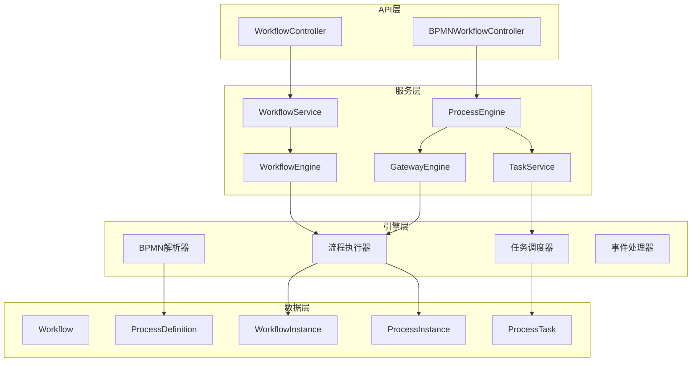
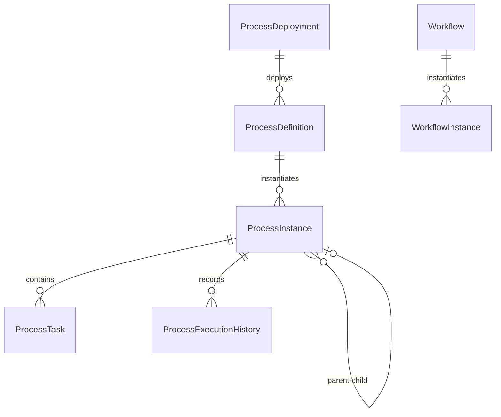

# 工作流模块详细设计文档

## 1. 模块概述

### 1.1 模块定位

工作流模块是ITSM系统的核心支撑模块，提供业务流程自动化能力，支持BPMN 2.0标准，实现复杂的业务流程编排和执行。

### 1.2 设计目标

- **标准化**：支持BPMN 2.0标准，兼容主流工作流引擎
- **灵活性**：支持简单流程和复杂流程，满足不同场景需求
- **可扩展性**：支持自定义任务类型、网关类型、事件类型
- **高性能**：支持高并发流程执行，异步任务处理
- **易用性**：提供可视化流程设计器，降低使用门槛

### 1.3 应用场景

- **工单审批流程**：多级审批、条件审批、并行审批
- **变更管理流程**：变更申请、评估、审批、实施、回顾
- **服务请求流程**：服务申请、审批、交付
- **事件处理流程**：事件响应、处理、升级
- **问题调查流程**：问题分析、根因调查、解决方案

## 2. 架构设计

### 2.1 双引擎架构

系统采用双引擎架构，支持两种工作流模式：

#### 2.1.1 简单工作流引擎（WorkflowEngine）

**适用场景**：

- 简单的线性流程
- 快速配置的审批流程
- 不需要复杂分支的场景

**特点**：

- 基于JSON定义，配置简单
- 轻量级，执行效率高
- 支持基本的步骤和转换

#### 2.1.2 BPMN流程引擎（CustomProcessEngine）

**适用场景**：

- 复杂的业务流程
- 需要并行、分支、循环的场景
- 需要与外部系统集成的场景

**特点**：

- 完全支持BPMN 2.0标准
- 支持所有BPMN元素（任务、网关、事件等）
- 功能强大，可扩展性强

### 2.2 架构分层



### 2.3 核心组件

#### 2.3.1 流程定义服务（ProcessDefinitionService）

- 流程定义的CRUD操作
- 流程版本管理
- 流程激活/停用
- BPMN XML解析和验证

#### 2.3.2 流程实例服务（ProcessInstanceService）

- 流程实例创建和启动
- 流程实例状态管理
- 流程变量管理
- 流程历史查询

#### 2.3.3 任务服务（TaskService）

- 任务查询和分配
- 任务完成和取消
- 任务委托和升级
- 任务超时处理

#### 2.3.4 网关引擎（GatewayEngine）

- 排他网关（Exclusive Gateway）
- 并行网关（Parallel Gateway）
- 包容网关（Inclusive Gateway）

## 3. 功能详细设计

### 3.1 流程定义管理

#### 3.1.1 流程定义创建

**功能描述**：创建新的流程定义，支持BPMN XML或JSON格式。

**输入参数**：

```json
{
  "key": "ticket_approval_workflow",
  "name": "工单审批流程",
  "description": "标准工单审批流程",
  "category": "ticket",
  "bpmn_xml": "<bpmn:definitions>...</bpmn:definitions>",
  "process_variables": {
    "ticket_id": "integer",
    "priority": "string"
  }
}
```

**处理流程**：

1. 验证BPMN XML格式
2. 解析BPMN元素
3. 生成流程定义记录
4. 设置版本号（自动递增）
5. 标记为最新版本

#### 3.1.2 流程定义版本管理

**版本规则**：

- 每次更新创建新版本
- 保留历史版本
- 仅最新版本可激活
- 运行中的实例使用启动时的版本

**版本查询**：

- 查询所有版本
- 查询指定版本
- 查询最新版本

#### 3.1.3 流程定义激活/停用

**激活规则**：

- 仅最新版本可激活
- 激活前验证BPMN完整性
- 激活后新实例使用新定义
- 已运行实例不受影响

### 3.2 流程实例管理

#### 3.2.1 流程启动

**启动方式**：

1. **手动启动**：用户通过API或界面启动
2. **自动启动**：满足条件时自动启动（如工单创建）
3. **定时启动**：定时任务触发启动

**启动参数**：

```json
{
  "process_definition_key": "ticket_approval_workflow",
  "business_key": "TICKET-12345",
  "variables": {
    "ticket_id": 12345,
    "priority": "high",
    "requester_id": 100
  }
}
```

**启动流程**：

1. 获取流程定义（最新激活版本）
2. 解析BPMN XML
3. 找到开始事件
4. 创建流程实例
5. 初始化流程变量
6. 执行开始事件
7. 推进到第一个活动节点

#### 3.2.2 流程状态管理

**状态类型**：

- `running`：运行中
- `suspended`：已暂停
- `completed`：已完成
- `terminated`：已终止

**状态转换**：

```
running → suspended（暂停）
suspended → running（恢复）
running → completed（完成）
running → terminated（终止）
```

#### 3.2.3 流程变量管理

**变量类型**：

- 字符串（string）
- 整数（integer）
- 浮点数（float）
- 布尔值（boolean）
- 对象（object）
- 数组（array）

**变量作用域**：

- 流程级变量：整个流程实例可见
- 任务级变量：仅在特定任务可见
- 局部变量：仅在特定活动可见

### 3.3 任务管理

#### 3.3.1 任务类型

##### 用户任务（User Task）

**特点**：

- 需要人工处理
- 分配给特定用户或组
- 支持任务表单
- 支持任务评论

**分配方式**：

- **直接分配**：指定具体用户
- **候选用户**：多个候选用户，任意一人可处理
- **候选组**：分配给组，组内成员可处理
- **表达式分配**：通过表达式动态计算分配人

##### 服务任务（Service Task）

**特点**：

- 自动执行
- 调用外部服务或内部服务
- 支持同步和异步执行

**实现方式**：

- HTTP调用
- 内部服务调用
- 脚本执行

##### 脚本任务（Script Task）

**特点**：

- 执行脚本逻辑
- 支持多种脚本语言（JavaScript、Python等）
- 可访问流程变量

##### 业务规则任务（Business Rule Task）

**特点**：

- 执行业务规则
- 调用规则引擎
- 返回规则执行结果

##### 手动任务（Manual Task）

**特点**：

- 标记需要手动完成的任务
- 不创建实际任务记录
- 用于流程文档化

#### 3.3.2 任务分配

**分配策略**：

1. **静态分配**：流程定义时指定
2. **动态分配**：运行时通过表达式计算
3. **规则分配**：基于业务规则分配
4. **负载均衡**：基于工作负载分配

**分配规则示例**：

```json
{
  "type": "expression",
  "expression": "${assigneeService.getAssigneeByPriority(priority)}"
}
```

#### 3.3.3 任务操作

**任务完成**：

- 提交任务结果
- 更新流程变量
- 推进流程到下一节点

**任务取消**：

- 取消任务
- 回退到上一节点
- 或终止流程

**任务委托**：

- 将任务委托给其他用户
- 保留原分配人信息
- 记录委托历史

**任务升级**：

- 任务超时自动升级
- 手动升级到上级
- 通知相关人员

### 3.4 网关处理

#### 3.4.1 排他网关（Exclusive Gateway）

**功能**：根据条件选择一条路径执行

**执行逻辑**：

1. 评估所有出边的条件表达式
2. 选择第一个为true的路径
3. 如果所有条件都不满足，抛出异常

**条件表达式示例**：

```xml
<bpmn:conditionExpression xsi:type="bpmn:tFormalExpression">
  ${priority == 'high'}
</bpmn:conditionExpression>
```

#### 3.4.2 并行网关（Parallel Gateway）

**功能**：同时执行多条路径

**执行逻辑**：

1. 并行网关（分叉）：创建多个执行分支
2. 并行网关（合并）：等待所有分支完成
3. 所有分支完成后继续执行

**使用场景**：

- 并行审批
- 并行处理
- 并行通知

#### 3.4.3 包容网关（Inclusive Gateway）

**功能**：根据条件执行一条或多条路径

**执行逻辑**：

1. 评估所有出边的条件表达式
2. 执行所有为true的路径
3. 至少选择一条路径

**使用场景**：

- 条件并行处理
- 多路径审批

### 3.5 事件处理

#### 3.5.1 开始事件（Start Event）

**类型**：

- **空开始事件**：流程启动时立即开始
- **消息开始事件**：收到消息时开始
- **定时开始事件**：定时触发开始
- **条件开始事件**：满足条件时开始

#### 3.5.2 结束事件（End Event）

**类型**：

- **空结束事件**：正常结束
- **终止结束事件**：立即终止所有活动
- **消息结束事件**：发送消息后结束
- **错误结束事件**：发生错误时结束

#### 3.5.3 中间事件（Intermediate Event）

**类型**：

- **消息捕获事件**：等待消息
- **定时事件**：等待定时触发
- **条件事件**：等待条件满足
- **边界事件**：捕获异常或超时

### 3.6 流程监控

#### 3.6.1 流程实例监控

- 实时状态查询
- 执行进度跟踪
- 性能指标统计
- 异常监控

#### 3.6.2 任务监控

- 待办任务统计
- 任务完成率
- 任务平均耗时
- 任务超时监控

#### 3.6.3 流程分析

- 流程执行路径分析
- 瓶颈识别
- 优化建议
- 流程效率报表

## 4. 数据模型设计

### 4.1 简单工作流模型

#### 4.1.1 Workflow（工作流定义）

```go
type Workflow struct {
    ID          int
    Name        string      // 工作流名称
    Description string      // 描述
    Type        string      // 类型：ticket/change/service
    Definition  []byte      // JSON定义
    Version     string      // 版本号
    IsActive    bool        // 是否激活
    TenantID    int         // 租户ID
    DepartmentID *int       // 部门ID（可选）
    CreatedAt   time.Time
    UpdatedAt   time.Time
}
```

#### 4.1.2 WorkflowInstance（工作流实例）

```go
type WorkflowInstance struct {
    ID          int
    Status      string      // running/completed/terminated
    CurrentStep string      // 当前步骤ID
    Context     []byte      // 执行上下文（JSON）
    WorkflowID  int         // 工作流定义ID
    EntityID    int         // 关联实体ID（如工单ID）
    EntityType  string      // 关联实体类型
    TenantID    int
    StartedAt   time.Time
    CompletedAt *time.Time
    CreatedAt   time.Time
    UpdatedAt   time.Time
}
```

### 4.2 BPMN流程模型

#### 4.2.1 ProcessDefinition（流程定义）

```go
type ProcessDefinition struct {
    ID               int
    Key              string      // 流程定义Key（唯一）
    Name             string      // 流程名称
    Description      string      // 描述
    Version          string      // 版本号
    Category         string      // 分类
    BpmnXML         []byte      // BPMN XML内容
    ProcessVariables map[string]interface{} // 流程变量定义
    IsActive        bool        // 是否激活
    IsLatest        bool        // 是否最新版本
    DeploymentID    int         // 部署ID
    DeploymentName  string      // 部署名称
    DeployedAt      time.Time   // 部署时间
    TenantID        int
    CreatedAt       time.Time
    UpdatedAt       time.Time
}
```

#### 4.2.2 ProcessInstance（流程实例）

```go
type ProcessInstance struct {
    ID                      int
    ProcessInstanceID       string      // 流程实例ID（唯一）
    BusinessKey            string      // 业务键
    ProcessDefinitionKey   string      // 流程定义Key
    ProcessDefinitionID    string      // 流程定义ID
    Status                 string      // running/suspended/completed/terminated
    CurrentActivityID      string      // 当前活动ID
    CurrentActivityName    string      // 当前活动名称
    Variables              map[string]interface{} // 流程变量
    StartTime              time.Time
    EndTime                *time.Time
    SuspendedTime          *time.Time
    SuspendedReason        string
    TenantID               int
    Initiator              string      // 发起人
    ParentProcessInstanceID *string    // 父流程实例ID
    RootProcessInstanceID  *string    // 根流程实例ID
    StateSnapshot          []byte      // 状态快照
    CreatedAt              time.Time
    UpdatedAt              time.Time
}
```

#### 4.2.3 ProcessTask（流程任务）

```go
type ProcessTask struct {
    ID                int
    TaskID            string      // 任务ID（唯一）
    ProcessInstanceID string      // 流程实例ID
    ProcessDefinitionKey string   // 流程定义Key
    ActivityID        string      // 活动ID
    ActivityName      string      // 活动名称
    TaskType          string      // userTask/serviceTask/scriptTask
    Assignee          string      // 分配人
    CandidateUsers    []string    // 候选用户
    CandidateGroups   []string    // 候选组
    Status            string      // pending/assigned/completed/cancelled
    Priority          string      // low/medium/high/critical
    DueDate           *time.Time  // 到期时间
    Variables         map[string]interface{} // 任务变量
    FormKey           string      // 表单Key
    CreatedAt         time.Time
    UpdatedAt         time.Time
    AssignedAt        *time.Time
    CompletedAt       *time.Time
    TenantID          int
}
```

#### 4.2.4 ProcessExecutionHistory（执行历史）

```go
type ProcessExecutionHistory struct {
    ID                int
    ProcessInstanceID string      // 流程实例ID
    ActivityID        string      // 活动ID
    ActivityName      string      // 活动名称
    ActivityType      string      // 活动类型
    Action            string      // 操作：start/complete/cancel
    Actor             string      // 操作人
    Variables         map[string]interface{} // 变量快照
    Comment           string      // 备注
    Duration          int         // 耗时（秒）
    CreatedAt         time.Time
}
```

#### 4.2.5 ProcessDeployment（流程部署）

```go
type ProcessDeployment struct {
    ID          int
    Name        string      // 部署名称
    Category    string      // 分类
    TenantID    int
    DeployedAt  time.Time
    CreatedAt   time.Time
}
```

### 4.3 数据关系



## 5. API设计

### 5.1 流程定义API

#### 5.1.1 创建流程定义

```
POST /api/v1/bpmn/process-definitions
Request Body:
{
  "key": "ticket_approval_workflow",
  "name": "工单审批流程",
  "description": "标准工单审批流程",
  "category": "ticket",
  "bpmn_xml": "<bpmn:definitions>...</bpmn:definitions>",
  "process_variables": {
    "ticket_id": "integer",
    "priority": "string"
  }
}
Response:
{
  "code": 200,
  "message": "success",
  "data": {
    "id": 1,
    "key": "ticket_approval_workflow",
    "name": "工单审批流程",
    "version": "1.0.0",
    ...
  }
}
```

#### 5.1.2 获取流程定义列表

```
GET /api/v1/bpmn/process-definitions?page=1&size=10&category=ticket
Response:
{
  "code": 200,
  "data": {
    "definitions": [...],
    "total": 100,
    "page": 1,
    "size": 10
  }
}
```

#### 5.1.3 获取流程定义详情

```
GET /api/v1/bpmn/process-definitions/:key?version=1.0.0
Response:
{
  "code": 200,
  "data": {
    "id": 1,
    "key": "ticket_approval_workflow",
    "name": "工单审批流程",
    "bpmn_xml": "...",
    ...
  }
}
```

#### 5.1.4 更新流程定义

```
PUT /api/v1/bpmn/process-definitions/:key
Request Body:
{
  "name": "更新后的名称",
  "bpmn_xml": "<bpmn:definitions>...</bpmn:definitions>"
}
```

#### 5.1.5 删除流程定义

```
DELETE /api/v1/bpmn/process-definitions/:key?version=1.0.0
```

#### 5.1.6 激活/停用流程定义

```
PUT /api/v1/bpmn/process-definitions/:key/active
Request Body:
{
  "active": true
}
```

### 5.2 流程实例API

#### 5.2.1 启动流程实例

```
POST /api/v1/bpmn/process-instances
Request Body:
{
  "process_definition_key": "ticket_approval_workflow",
  "business_key": "TICKET-12345",
  "variables": {
    "ticket_id": 12345,
    "priority": "high"
  }
}
Response:
{
  "code": 200,
  "data": {
    "process_instance_id": "PI-ticket_approval_workflow-1234567890",
    "status": "running",
    ...
  }
}
```

#### 5.2.2 获取流程实例列表

```
GET /api/v1/bpmn/process-instances?status=running&page=1&size=10
Response:
{
  "code": 200,
  "data": {
    "instances": [...],
    "total": 50,
    "page": 1,
    "size": 10
  }
}
```

#### 5.2.3 获取流程实例详情

```
GET /api/v1/bpmn/process-instances/:id
Response:
{
  "code": 200,
  "data": {
    "process_instance_id": "PI-xxx",
    "status": "running",
    "current_activity_name": "部门主管审批",
    "variables": {...},
    ...
  }
}
```

#### 5.2.4 设置流程变量

```
PUT /api/v1/bpmn/process-instances/:id/variables
Request Body:
{
  "variables": {
    "approval_result": "approved",
    "comment": "审批通过"
  }
}
```

#### 5.2.5 暂停流程

```
PUT /api/v1/bpmn/process-instances/:id/suspend
Request Body:
{
  "reason": "等待外部系统响应"
}
```

#### 5.2.6 恢复流程

```
PUT /api/v1/bpmn/process-instances/:id/resume
```

#### 5.2.7 终止流程

```
PUT /api/v1/bpmn/process-instances/:id/terminate
Request Body:
{
  "reason": "业务取消"
}
```

### 5.3 任务API

#### 5.3.1 获取用户任务列表

```
GET /api/v1/bpmn/tasks?assignee=user123&status=pending
Response:
{
  "code": 200,
  "data": {
    "tasks": [...],
    "total": 20
  }
}
```

#### 5.3.2 获取任务详情

```
GET /api/v1/bpmn/tasks/:id
Response:
{
  "code": 200,
  "data": {
    "task_id": "TASK-xxx",
    "activity_name": "部门主管审批",
    "status": "assigned",
    "variables": {...},
    ...
  }
}
```

#### 5.3.3 分配任务

```
PUT /api/v1/bpmn/tasks/:id/assign
Request Body:
{
  "assignee": "user456"
}
```

#### 5.3.4 完成任务

```
PUT /api/v1/bpmn/tasks/:id/complete
Request Body:
{
  "variables": {
    "approval_result": "approved",
    "comment": "审批通过"
  }
}
```

#### 5.3.5 取消任务

```
PUT /api/v1/bpmn/tasks/:id/cancel
Request Body:
{
  "reason": "任务取消"
}
```

#### 5.3.6 设置任务变量

```
PUT /api/v1/bpmn/tasks/:id/variables
Request Body:
{
  "variables": {
    "comment": "处理中"
  }
}
```

### 5.4 简单工作流API

#### 5.4.1 创建工作流定义

```
POST /api/v1/workflows
Request Body:
{
  "name": "简单审批流程",
  "type": "ticket",
  "definition": {
    "steps": [...],
    "transitions": [...]
  }
}
```

#### 5.4.2 启动工作流实例

```
POST /api/v1/workflows/:id/start
Request Body:
{
  "entity_id": 12345,
  "entity_type": "ticket",
  "variables": {...}
}
```

## 6. 前端设计

### 6.1 流程设计器

#### 6.1.1 可视化设计器

**功能**：

- 拖拽式流程设计
- BPMN元素面板
- 属性配置面板
- 流程验证
- 流程预览

**技术选型**：

- bpmn-js（BPMN 2.0可视化库）
- React + TypeScript

**核心组件**：

```tsx
<BPMNDesigner
  model={bpmnXML}
  onSave={handleSave}
  onValidate={handleValidate}
/>
```

#### 6.1.2 流程模板库

**功能**：

- 预置常用流程模板
- 模板分类管理
- 模板导入导出
- 模板分享

**模板类型**：

- 工单审批模板
- 变更管理模板
- 服务请求模板
- 事件处理模板

### 6.2 流程监控界面

#### 6.2.1 流程实例列表

- 流程实例列表
- 状态筛选
- 搜索功能
- 批量操作

#### 6.2.2 流程实例详情

- 流程执行图（高亮当前节点）
- 执行历史时间线
- 流程变量查看/编辑
- 任务列表

#### 6.2.3 任务待办

- 我的待办任务
- 任务详情
- 任务处理表单
- 任务历史

### 6.3 流程分析报表

#### 6.3.1 流程统计

- 流程执行次数
- 平均执行时长
- 完成率
- 超时率

#### 6.3.2 瓶颈分析

- 节点耗时分析
- 瓶颈节点识别
- 优化建议

## 7. 集成方案

### 7.1 与工单模块集成

#### 7.1.1 工单创建触发流程

```go
// 在工单创建后自动启动工作流
func (s *TicketService) CreateTicket(...) {
    ticket := // 创建工单
    
    // 根据工单类型启动对应工作流
    workflowEngine.StartProcess(ctx, "ticket_approval_workflow", 
        fmt.Sprintf("TICKET-%d", ticket.ID),
        map[string]interface{}{
            "ticket_id": ticket.ID,
            "priority": ticket.Priority,
        })
}
```

#### 7.1.2 流程任务与工单关联

- 任务完成时更新工单状态
- 工单状态变更触发流程事件
- 流程变量与工单字段同步

### 7.2 与审批模块集成

#### 7.2.1 审批任务创建

```go
// 流程中的用户任务自动创建审批记录
func (e *ProcessEngine) CreateUserTask(...) {
    task := // 创建流程任务
    
    // 创建审批记录
    approvalService.CreateApprovalRecord(ctx, &ApprovalRecord{
        WorkflowInstanceID: instance.ID,
        TaskID: task.ID,
        ApproverID: task.Assignee,
        Status: "pending",
    })
}
```

### 7.3 与通知模块集成

#### 7.3.1 任务通知

- 任务创建时发送通知
- 任务分配时发送通知
- 任务超时提醒
- 流程完成通知

### 7.4 外部系统集成

#### 7.4.1 Webhook集成

- 流程事件触发Webhook
- 外部系统回调更新流程变量

#### 7.4.2 REST API集成

- 服务任务调用外部API
- 支持认证和重试

## 8. 性能优化

### 8.1 异步处理

- 流程执行异步化
- 任务创建异步化
- 事件处理异步化

### 8.2 缓存策略

- 流程定义缓存
- 流程变量缓存
- 任务列表缓存

### 8.3 数据库优化

- 流程实例分表
- 执行历史归档
- 索引优化

## 9. 安全设计

### 9.1 权限控制

- 流程定义权限（创建/编辑/删除）
- 流程实例权限（查看/操作）
- 任务权限（分配/完成）

### 9.2 数据隔离

- 租户数据隔离
- 部门数据隔离

### 9.3 审计日志

- 流程操作审计
- 任务操作审计
- 变量变更审计

## 10. 实施计划

### 10.1 第一阶段：基础功能（2-3周）

- [x] BPMN解析器
- [x] 流程定义管理
- [x] 流程实例管理
- [x] 基础任务管理
- [ ] 流程设计器前端

### 10.2 第二阶段：高级功能（2-3周）

- [ ] 网关引擎完善
- [ ] 事件处理
- [ ] 子流程支持
- [ ] 流程监控

### 10.3 第三阶段：集成优化（1-2周）

- [ ] 与工单模块集成
- [ ] 与审批模块集成
- [ ] 性能优化
- [ ] 流程分析报表

## 11. 最佳实践

### 11.1 流程设计原则

1. **简单优先**：能用简单流程就不用复杂流程
2. **清晰明确**：流程步骤和条件要清晰
3. **异常处理**：考虑异常情况和超时处理
4. **性能考虑**：避免过于复杂的并行分支

### 11.2 命名规范

- 流程定义Key：`{module}_{purpose}_workflow`
- 流程实例ID：`PI-{key}-{timestamp}`
- 任务ID：`TASK-{instance_id}-{activity_id}`

### 11.3 变量管理

- 使用有意义的变量名
- 避免变量名冲突
- 及时清理不需要的变量

---

**文档版本**：V1.0  
**创建日期**：2025-12-17  
**最后更新**：2025-12-17  
**维护人**：产品团队
