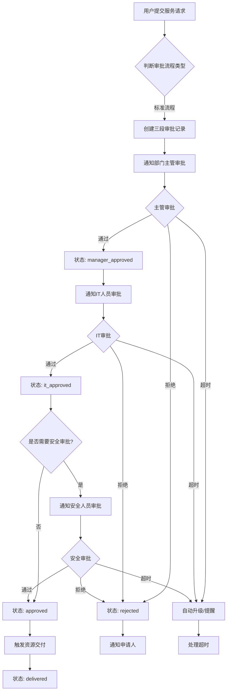
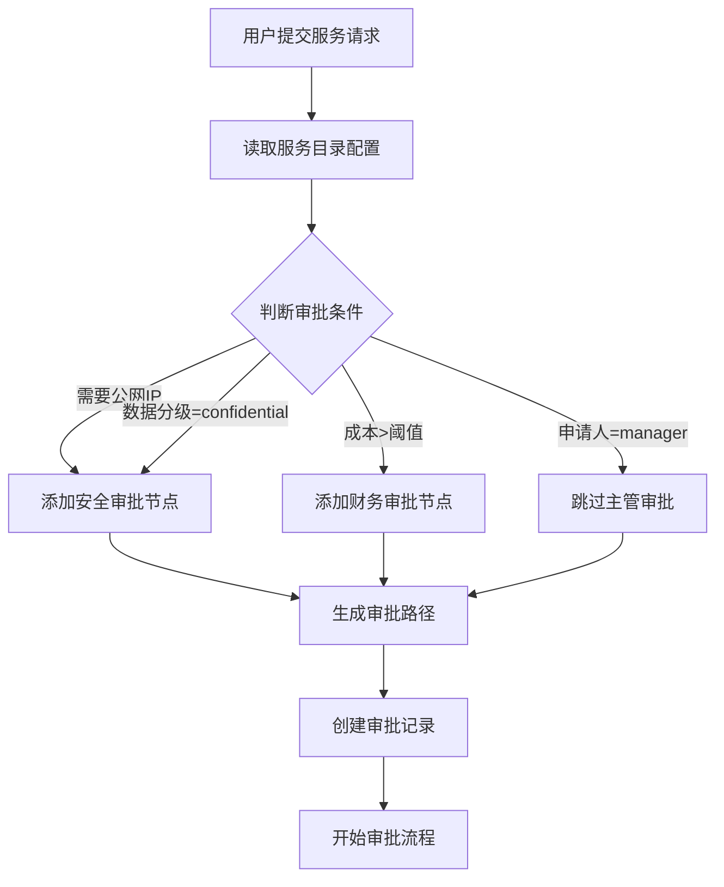
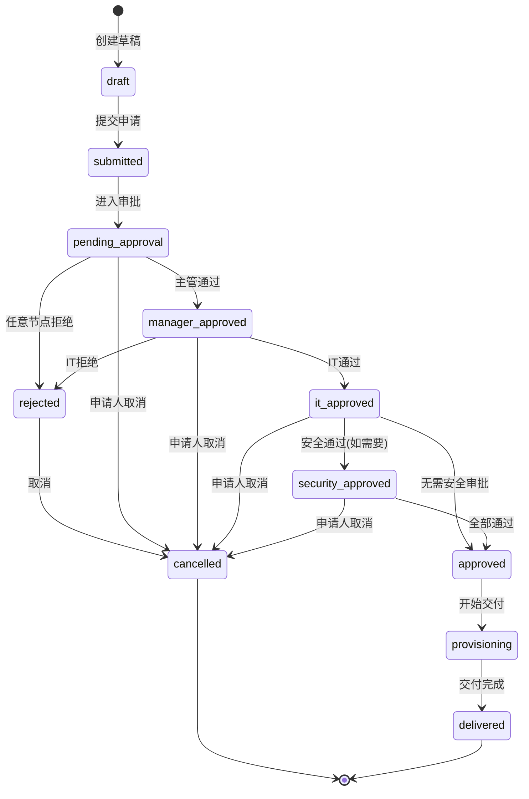
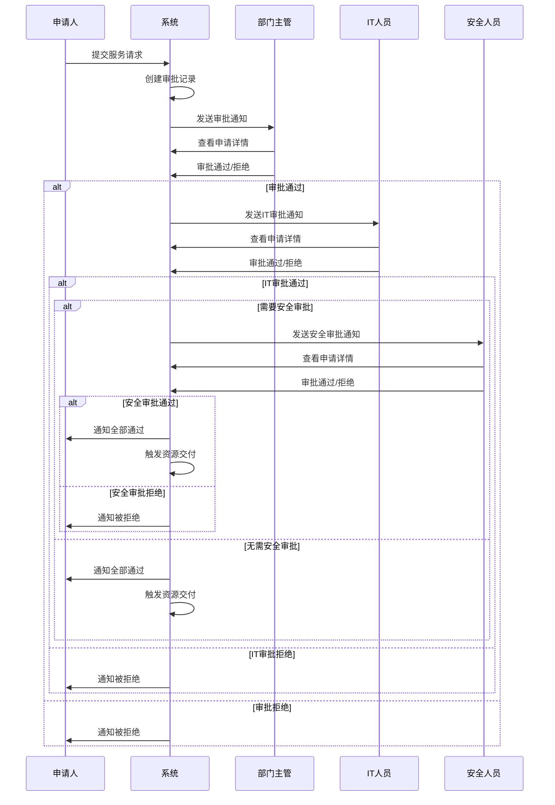
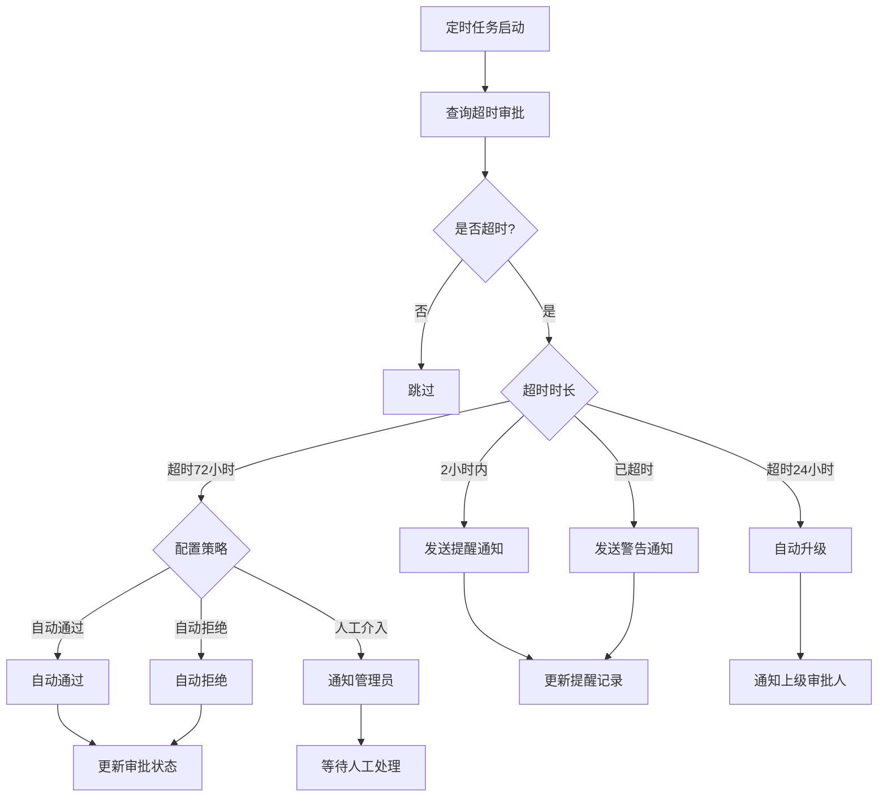
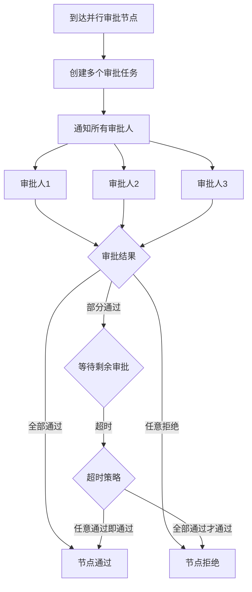
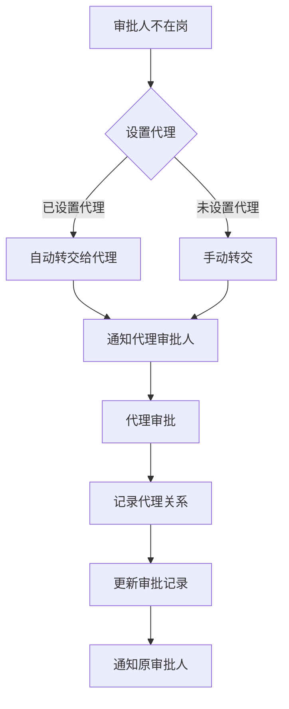
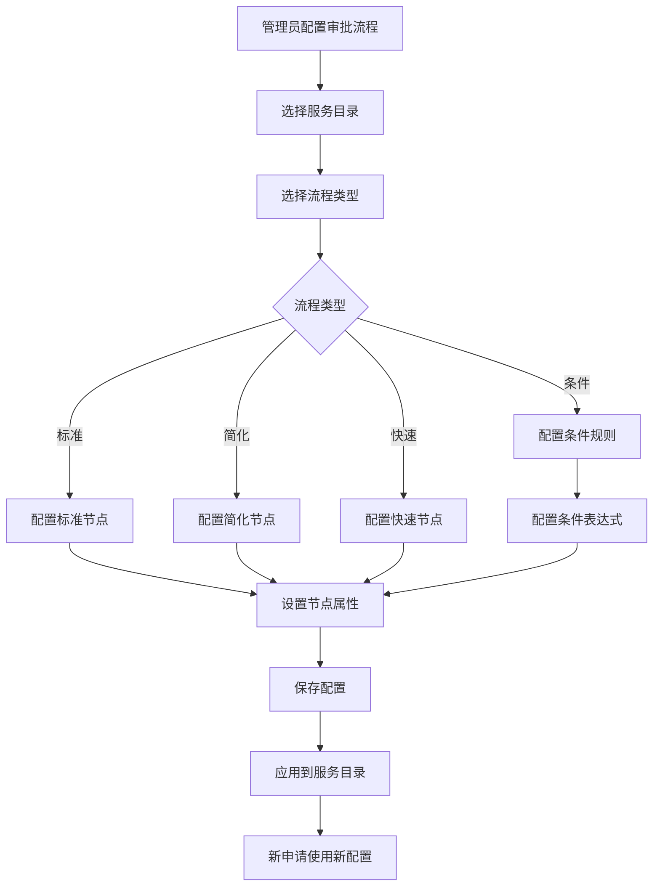
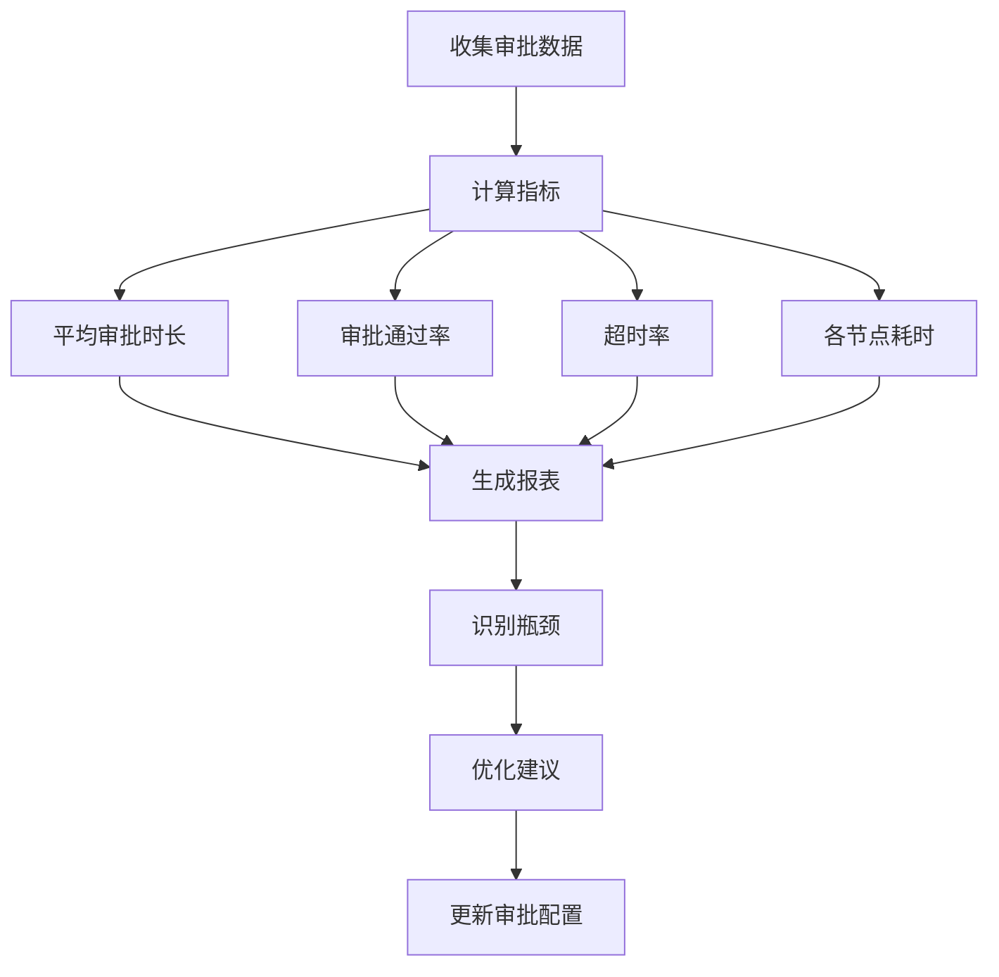
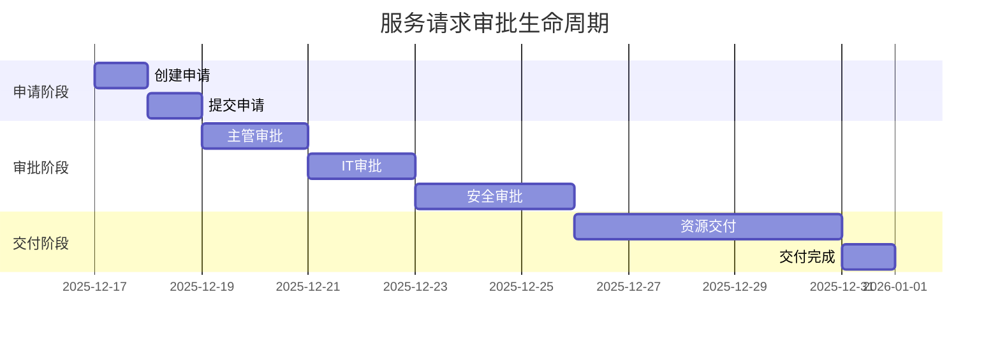

# 服务请求审批流程 - 流程图

## 1. 标准审批流程（三段式）

## 2. 条件审批流程（动态）

## 3. 审批状态流转图

## 4. 审批节点详细流程

## 5. 超时处理流程

## 6. 并行审批流程

## 7. 代理审批流程

## 8. 审批配置管理流程

## 9. 审批数据分析流程

## 10. 完整审批生命周期

---

## 流程图说明

### 符号说明

- **矩形**：处理步骤
- **菱形**：判断节点
- **圆角矩形**：开始/结束
- **箭头**：流程方向

### 关键决策点

1. **审批流程类型判断**：根据服务目录配置决定
2. **是否需要安全审批**：根据申请属性判断
3. **审批结果**：通过/拒绝/超时
4. **超时处理策略**：提醒/升级/自动处理

### 异常处理

- 所有审批节点都可能超时
- 任意节点拒绝都会终止流程
- 支持申请人主动取消
- 支持审批人转交

---

**文档版本**：V1.0  
**创建日期**：2025-12-17
